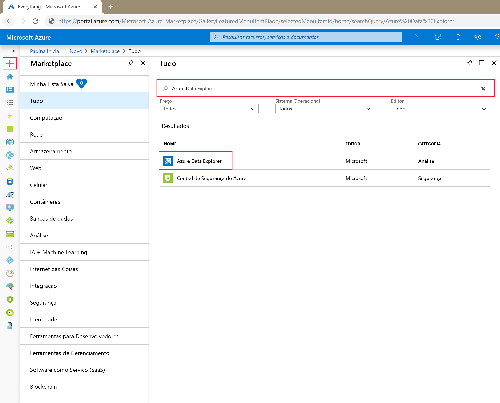
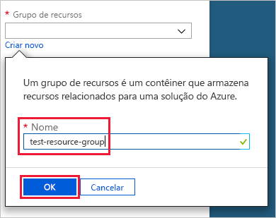
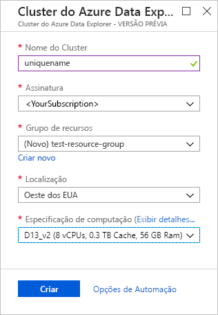
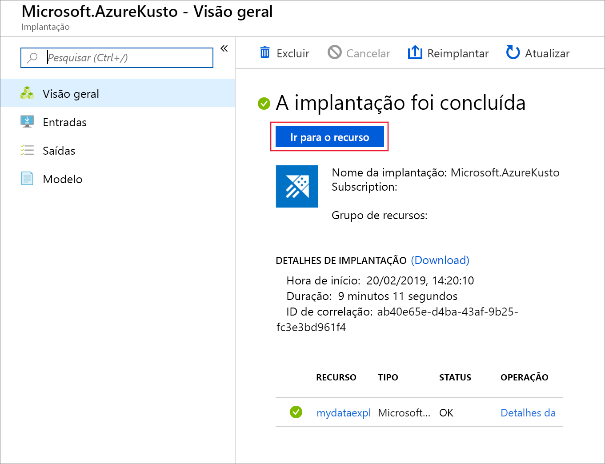
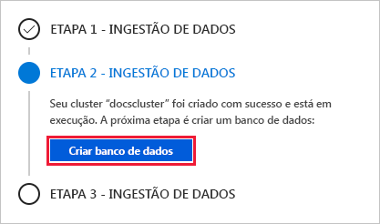
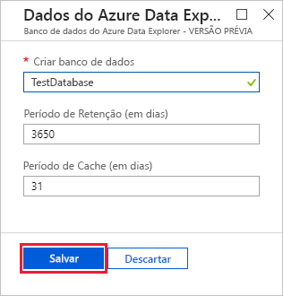
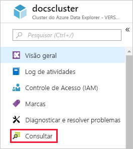
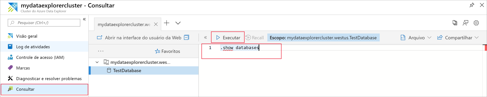

# Início rápido: Criar um cluster e banco de dados do Azure Data Explorer

O Azure Data Explorer é um serviço de exploração de dados rápido e altamente escalonável para dados de log e telemetria. Para usar o Azure Data Explorer, primeiro crie um *cluster* e um ou mais *bancos de dados* nesse cluster. Em seguida, você *ingere* (carrega) dados em um banco de dados para que possa executar consultas em relação a ele. Neste início rápido, você pode criar um cluster e um banco de dados. Nos artigos subsequentes, mostramos a você como realizar a ingestão de dados.

Caso você não tenha uma assinatura do Azure, crie uma [conta gratuita do Azure](https://azure.microsoft.com/free/) antes de começar.

## Entre no Portal do Azure

Entre no [portal do Azure](https://portal.azure.com/).

## Criar um cluster

Você pode criar um cluster do Azure Data Explorer em um grupo de recursos do Azure, com um conjunto definido de recursos de computação e armazenamento.

1. Selecione o botão **Criar um recurso** (+) no canto superior esquerdo do portal.

1. Pesquise *Azure Data Explorer* e, em seguida, selecione **Azure Data Explorer**.

   

1. No canto inferior direito, selecione **Criar**.

1. Insira um nome exclusivo para seu cluster, selecione sua assinatura e crie um grupo de recursos denominado *test-resource-group*.

    

1. Preencha o formulário com as informações a seguir.

   

    **Configuração** | **Valor sugerido** | **Descrição do campo**
    |---|---|---|
    | Nome do cluster | Um nome exclusivo do cluster | Escolha um nome exclusivo que identifique seu cluster. Por exemplo, *mytestcluster*. O nome de domínio *[region].kusto.windows.net* é acrescentado ao nome do cluster que você fornece. O nome só pode conter letras minúsculas e números. Deve conter de 3 a 22 caracteres.
    | Assinatura | Sua assinatura | Selecione a assinatura do Azure que você deseja usar para seu cluster.|
    | Grupo de recursos | *test-resource-group* | Crie um novo grupo de recursos. |
    | Local padrão | *Oeste dos EUA* | Selecione *Oeste dos EUA* para este início rápido. Para um sistema de produção, selecione a região que melhor atenda às suas necessidades.
    | Especificação de computação | *D13_v2* | Selecione a especificação de preço mais baixa para este início rápido. Para um sistema de produção, selecione a especificação que melhor atenda às suas necessidades.
    | | |

1. Selecione **Criar** para provisionar o cluster. O provisionamento costuma leva cerca de dez minutos. Selecione **Notificações** na barra de ferramentas (ícone de sino) para monitorar o processo de provisionamento.

1. Quando o processo for concluído, selecione **Notificações** e, em seguida, **Ir para o recurso**.

    

## Criar um banco de dados

Agora você está pronto para a segunda etapa no processo: criação de banco de dados.

1. Na guia **Visão geral**, selecione **Criar banco de dados**.

    

1. Preencha o formulário com as informações a seguir.

    

    **Configuração** | **Valor sugerido** | **Descrição do campo**
    |---|---|---|
    | Nome do banco de dados | *TestDatabase* | O nome do banco de dados deve ser exclusivo dentro do cluster.
    | Período de retenção | *3650* | O período de tempo para o qual é garantido que os dados sejam mantidos disponíveis para consulta. O período é medido a partir do momento em que os dados são incluídos.
    | Período de cache | *31* | O período pelo qual manter dados consultados frequentemente disponíveis no armazenamento SSD ou RAM, em vez de no armazenamento de longo prazo.
    | | | |

1. Selecione **Salvar** para criar o banco de dados. A criação geralmente leva menos de um minuto. Quando o processo for concluído, você estará novamente de volta na guia **Visão geral** do cluster.

## Executar comandos básicos no banco de dados

Agora que você tem um cluster e banco de dados, pode executar consultas e comandos. Você não tem nenhum dado no banco de dados por enquanto, mas ainda pode ver como as ferramentas funcionam.

1. Em seu cluster, selecione **Consulta**.

    

1. Cole o seguinte comando na janela de consulta: `.show databases`, em seguida, selecione **Executar**.

    

    O conjunto de resultados mostra **TestDatabase**, o único banco de dados no cluster.

1. Cole o seguinte comando na janela de consulta: `.show tables`, em seguida, selecione esse comando na janela. Selecione **Executar**.

    Esse comando retorna um conjunto de resultados vazio porque você ainda não tem nenhuma tabela. Você adicionará uma tabela no próximo artigo desta série.

## Parar e reiniciar o cluster

Você pode parar e reiniciar um cluster, dependendo das necessidades de negócios.

1. Para interromper o cluster, na parte superior da guia **Visão geral**, selecione **Parar**.

    Quando o cluster é interrompido, os dados não ficam disponíveis para consultas e você não pode ingerir dados novos.

1. Para reiniciar o cluster, na parte superior da guia **Visão geral**, selecione **Iniciar**.

    Quando o cluster é reiniciado, ele leva cerca de dez minutos para ficar disponível (como quando foi provisionado originalmente). Leva tempo adicional para os dados serem carregados no cache do ativo.  

## Limpar recursos

Caso você planeje seguir nossos outros guias de início rápido e tutoriais, mantenha os recursos que você criou. Caso contrário, limpe **test-resource-group** para evitar incorrer em custos.

1. No portal do Azure, selecione **Grupos de recursos** na extremidade esquerda, depois selecione o recurso de grupo que você criou.  

    Se o menu à esquerda estiver recolhido, selecione  para expandi-lo.

   

1. Em **test-resource-group**, selecione **Excluir grupo de recursos**.

1. Na nova janela, digite o nome do grupo de recursos para excluir (*test-resource-group*) e, em seguida, selecione **Excluir**.

## Próximas etapas

> [!div class="nextstepaction"]
> [Guia de início rápido: Ingestão de dados do Hub de eventos no Azure Data Explorer](ingest-data-event-hub.md)

