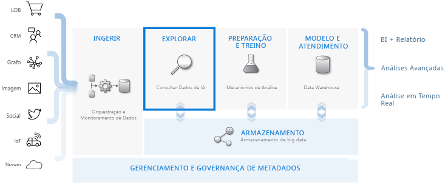
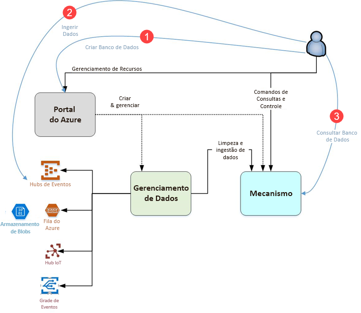

# O que é o Gerenciador de dados do Azure?

O Azure Data Explorer é um serviço de exploração de dados rápido e altamente escalonável para dados de log e telemetria. Ele ajuda você a lidar com os muitos fluxos de dados emitidos pelo software moderno, para que você possa coletar, armazenar e analisar dados. O Azure Data Explorer é ideal para analisar grandes volumes de dados diversos de qualquer fonte de dados, como sites, aplicativos, dispositivos IoT e muito mais. Esses dados são usados para diagnósticos, monitoramento, relatórios, aprendizado de máquina e recursos adicionais de análise. O Azure Data Explorer simplifica a ingestão desses dados e permite que você execute consultas ad-hoc complexas nos dados em segundos.

## O que torna o Azure Data Explorer único?

- Dimensiona rapidamente para terabytes de dados, em minutos, permitindo iterações rápidas de exploração de dados para descobrir insights relevantes.

- Oferece uma linguagem de consulta inovadora, otimizada para análise de dados de alto desempenho.

- Suporta análise de grandes volumes de dados heterogêneos (estruturados e não estruturados).

- Fornece a capacidade de criar e implantar exatamente o que você precisa, combinando com outros serviços para fornecer uma solução abrangente, poderosa e interativa de análise de dados.

## Data warehouse de fluxo de trabalho

O Azure Data Explorer integra-se a outros serviços principais para fornecer uma solução de ponta a ponta que inclui coleta, ingestão, armazenamento, indexação, consulta e visualização de dados. Ele tem uma função essencial no fluxo de data warehousing, executando a etapa **EXPLORE** do fluxo em terabytes de diversos dados brutos.

O Azure Data Explorer oferece suporte a vários métodos de processamento, incluindo conectores a serviços comuns, como Event Hub, processamento programático usando SDKs, como .NET e Python, e acesso direto ao mecanismo para fins de exploração. O Azure Data Explorer integra-se aos serviços de análise e modelagem para análise adicional e visualização de dados.

## Fluxo do Gerenciador de dados do Azure

O diagrama a seguir mostra os diferentes aspectos de como trabalhar com o Data Explorer do Azure.

O trabalho no Azure Data Explorer geralmente segue esse padrão:

1. **Criar banco de dados:** Crie um *cluster* e crie um ou mais *bancos de dados* nesse cluster. [Início rápido: Criar um cluster do Gerenciador de dados do Azure e o banco de dados](create-cluster-database-portal.md)

1. **Ingerir dados:** Carregue dados em tabelas de banco de dados para que você possa executar consultas sobre ele. [Início rápido: insira dados do Hub de eventos no Azure Data Explorer](ingest-data-event-hub.md)

1. **Banco de dados de consulta:** Use nosso aplicativo da Web para executar, revisar e compartilhar consultas e resultados. Está disponível no portal do Azure e como um aplicativo independente. Além disso, você pode enviar consultas programaticamente (usando um SDK) ou um ponto de extremidade da API REST. [Guia de início rápido: Consultar dados no Data Explorer do Azure](web-query-data.md)

## Experiência de consulta

Uma consulta no Azure Data Explorer é uma solicitação somente leitura para processar dados e retornar os resultados desse processamento, sem modificar os dados ou metadados. Você continua refinando suas consultas até concluir sua análise. O Azure Data Explorer facilita esse processo devido à sua experiência de consulta ad-hoc muito rápida.

O Azure Data Explorer manipula grandes quantidades de dados estruturados, semi-estruturados (tipos aninhados semelhantes a JSON) e dados não estruturados (texto livre) igualmente bem. Ele permite que você pesquise termos de texto específicos, localize eventos específicos e faça cálculos no estilo de métrica em dados estruturados. O Explorador de Dados do Azure conecta os mundos de logs de texto não estruturados e números e dimensões estruturados, extraindo valores em tempo de execução de campos de texto de formato livre. A exploração de dados é simplificada pela combinação de operações de indexação rápida de texto, armazenamento de colunas e séries temporais.

Recursos do Gerenciador de dados do Azure são estendidos por outros serviços criados na sua linguagem de consulta eficiente, incluindo [do Log Analytics](/azure/log-analytics/), [Application Insights](/azure/application-insights/), [doTimeSeriesInsights](/azure/time-series-insights/), e [proteção avançada contra ameaças do Windows Defender](/windows/security/threat-protection/windows-defender-atp/windows-defender-advanced-threat-protection/).

## Comentários

Gostaríamos de receber seus comentários sobre o Azure Data Explorer e sua linguagem de consulta em:

- [Faça perguntas no Fórum do MSDN](https://social.msdn.microsoft.com/Forums/en-US/home?forum=AzureKusto)

- [Faça sugestões de produto no User Voice](http://aka.ms/AzureDataExplorer.UserVoice)

## Próximas etapas

[Início rápido: Criar um cluster do Gerenciador de dados do Azure e o banco de dados](create-cluster-database-portal.md)

[Início rápido: insira dados do Hub de eventos no Azure Data Explorer](ingest-data-event-hub.md)

[Guia de início rápido: Consultar dados no Data Explorer do Azure](web-query-data.md)
