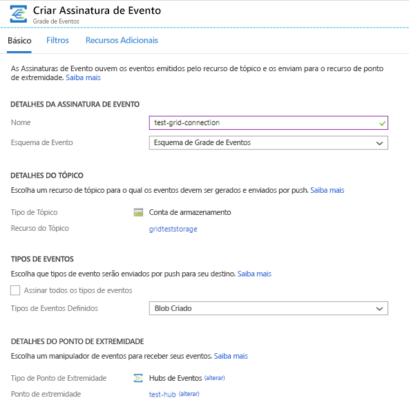
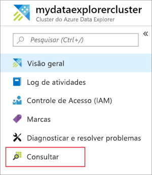
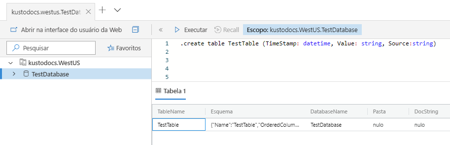
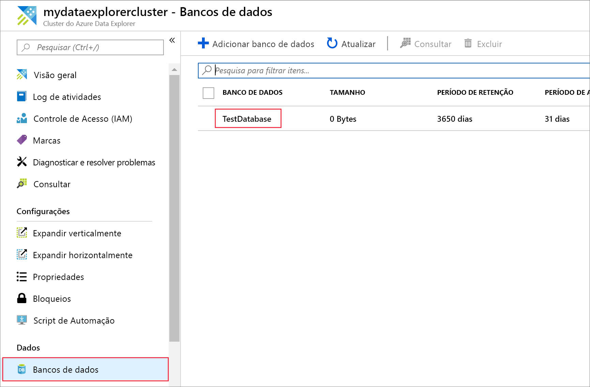
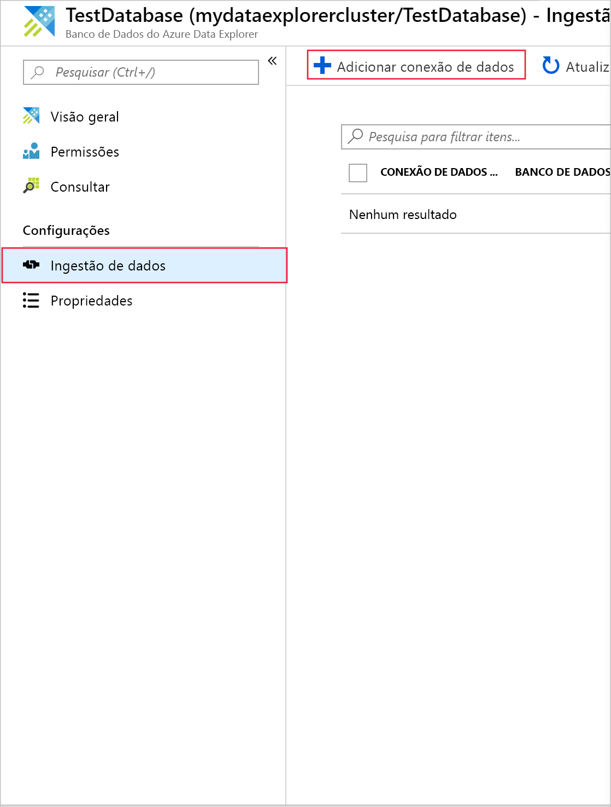
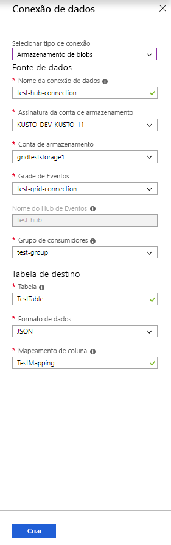
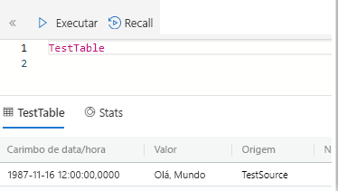
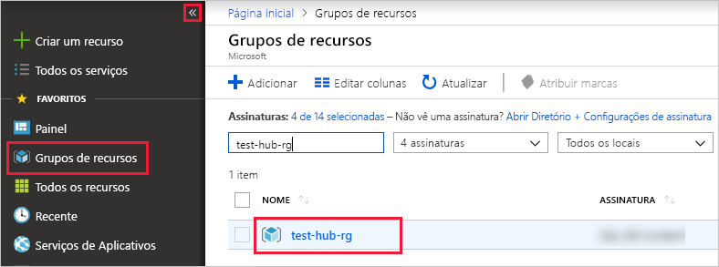

# <a name="quickstart-ingest-azure-blobs-into-azure-data-explorer-by-subscribing-to-event-grid-notifications"></a>Início rápido: Ingerir Blobs do Azure no Azure Data Explorer assinando notificações da Grade de Eventos

O Azure Data Explorer é um serviço de exploração de dados rápido e altamente escalonável para dados de log e telemetria. O Azure Data Explorer oferece ingestão contínua (carregamento de dados) de blobs gravados nos contêineres de blob. Isso é feito definindo uma assinatura da [Grade de Eventos do Azure](/azure/event-grid/overview) para eventos de criação do blob e encaminhando esses eventos para o Kusto por meio de um Hub de Eventos. Para este guia de início rápido, você precisa ter uma conta de armazenamento com uma assinatura da Grade de Eventos que envia notificações para o Hub de Eventos. Você poderá, então, criar uma conexão de dados da Grade de Eventos e ver o fluxo dos dados pelo sistema.

## <a name="prerequisites"></a>Pré-requisitos

1. Caso não tenha uma assinatura do Azure, crie uma [conta gratuita do Azure](https://azure.microsoft.com/free/)
1. [Um cluster e um banco de dados](create-cluster-database-portal.md)
1. [Uma conta de armazenamento](https://docs.microsoft.com/azure/storage/common/storage-quickstart-create-account?tabs=azure-portal)
1. [Um Hub de Eventos](https://docs.microsoft.com/azure/event-hubs/event-hubs-create)

## <a name="create-an-event-grid-subscription-in-your-storage-account"></a>Criar uma assinatura da Grade de Eventos em sua conta de armazenamento

1. No portal do Azure, navegue até sua conta de armazenamento
1. Clique na guia **Eventos** e, em seguida, em **Assinatura de evento**

    

1. Na janela **Criar assinatura de evento** na guia **Básico**, forneça os valores a seguir:

    **Configuração** | **Valor sugerido** | **Descrição do campo**
    |---|---|---|
    | NOME | *test-grid-connection* | O nome da grade de eventos que você deseja criar.|
    | Esquema do evento | *Esquema da Grade de Eventos* | O esquema que deve ser usado para a Grade de Eventos. |
    | Tipo de tópico | *Conta de armazenamento* | O tipo de tópico da grade de eventos. |
    | Recurso do Tópico | *gridteststorage* | O nome da sua conta de armazenamento. |
    | Assinar todos os tipos de evento | *Desmarcar* | Não ser notificado de todos os eventos. |
    | Tipos de Eventos Definidos | *Blob Criado* | De quais eventos específicos receber notificações. |
    | Tipo de Ponto de Extremidade | *Hubs de Evento* | O tipo do ponto de extremidade ao qual você envia os eventos. |
    | Ponto de extremidade | *test-hub* | O hub de eventos que você criou. |
    | | |

1. Selecione a guia **Recursos Adicionais** se você quiser rastrear arquivos de um contêiner específico. Defina os filtros das notificações da seguinte maneira:
    * O campo **Assunto começa com** é o prefixo *literal* do contêiner de blob (como o padrão aplicado é *startswith*, ele pode abranger vários contêineres). Não são permitidos curingas.
     Ele *precisa* ser definido da seguinte maneira: *`/blobServices/default/containers/`*[prefixo do contêiner]
    * O campo **Assunto termina com** é o sufixo *literal* do blob. Não são permitidos curingas.

## <a name="create-a-target-table-in-azure-data-explorer"></a>Criar uma tabela de destino no Gerenciador de dados do Azure

Crie uma tabela no Azure Data Explorer para a qual os Hubs de Eventos enviarão dados. Você cria a tabela no cluster e no banco de dados preparado em **Pré-requisitos**.

1. No portal do Azure, em seu cluster, selecione **consulta**.

    

1. Copie o seguinte comando na janela e selecione **Executar** para criar a tabela (TestTable) que receberá os dados ingeridos.

    ```Kusto
    .create table TestTable (TimeStamp: datetime, Value: string, Source:string)
    ```

    

1. Copie o seguinte comando na janela e selecione **Executar** para mapear os dados JSON de entrada para os tipos de dados e nomes de coluna da tabela (TestTable).

    ```Kusto
    .create table TestTable ingestion json mapping 'TestMapping' '[{"column":"TimeStamp","path":"$.TimeStamp"},{"column":"Value","path":"$.Value"},{"column":"Source","path":"$.Source"}]'
    ```

## <a name="create-an-event-grid-data-connection-in-azure-data-explorer"></a>Criar uma conexão de dados da Grade de Eventos no Azure Data Explorer

Agora você se conecta à Grade de Eventos do Azure Data Explorer, de modo que os dados que fluem para o contêiner de blob sejam transmitidos para a tabela de teste.

1. Selecione **Notificações** na barra de ferramentas para verificar se a implantação do hub de eventos foi bem-sucedida.

1. Em um cluster que você criou, selecione **bancos de dados** , em seguida, **TestDatabase**.

    

1. Selecione **ingestão de dados** , em seguida, **Adicionar conexão de dados**.

    

1. Selecionar tipo de conexão: **Armazenamento de Blobs**.

1. Preencha o formulário com as seguintes informações e clique em **Criar**.

    

     Fonte de dados:

    **Configuração** | **Valor sugerido** | **Descrição do campo**
    |---|---|---|
    | Nome da conexão de dados | *teste de hub de conexão* | O nome da conexão que você deseja criar no Azure Data Explorer.|
    | Assinatura da conta de armazenamento | Sua ID de assinatura | A ID da assinatura em que sua conta de armazenamento reside.|
    | Conta de armazenamento | *gridteststorage* | O nome da conta de armazenamento criada anteriormente.|
    | Grade de Eventos | *test-grid-connection* | O nome da Grade de Eventos que você criou. |
    | Nome do Hub de Eventos | *test-hub* | O hub de eventos que você criou. Isso é preenchido automaticamente quando você escolhe uma Grade de Eventos. |
    | Grupo de consumidores | *grupo de teste* | O grupo de consumidores definido no hub de eventos que você criou. |
    | | |

    Tabela de destino:

     **Configuração** | **Valor sugerido** | **Descrição do campo**
    |---|---|---|
    | Tabela | *TestTable* | A tabela criada na **TestDatabase**. |
    | Formato de dados | *JSON* | Os formatos com suporte são Avro, CSV, JSON, MULTILINE JSON, PSV, SOH, SCSV, TSV e TXT. |
    | Mapeamento de coluna | *TestMapping* | O mapeamento que você criou em **TestDatabase**, que mapeia os dados de entrada JSON para tipos de dados e nomes de coluna da **TestTable**.|
    | | |

## <a name="generate-sample-data"></a>Gerar dados de exemplo

Agora que o Azure Data Explorer e a conta de armazenamento estão conectados, você pode criar dados de exemplo e carregá-los no armazenamento de blobs.

Nós trabalharemos com um pequeno script shell que emite alguns comandos básicos da CLI do Azure para interagir com recursos do Armazenamento do Azure. Primeiro, o script cria um novo contêiner na sua conta de armazenamento e carrega um arquivo existente (como um blob) para esse contêiner. Em seguida, ele lista todos os blobs no contêiner. Você pode usar [Cloud Shell](https://docs.microsoft.com/azure/cloud-shell/overview) para executar o script diretamente no portal.

Salve os dados a seguir em um arquivo e use com o script a seguir:

```Json
{"TimeStamp": "1987-11-16 12:00","Value": "Hello World","Source": "TestSource"}
```

```bash
#!/bin/bash
### A simple Azure Storage example script

    export AZURE_STORAGE_ACCOUNT=<storage_account_name>
    export AZURE_STORAGE_KEY=<storage_account_key>

    export container_name=<container_name>
    export blob_name=<blob_name>
    export file_to_upload=<file_to_upload>
    export destination_file=<destination_file>

    echo "Creating the container..."
    az storage container create --name $container_name

    echo "Uploading the file..."
    az storage blob upload --container-name $container_name --file $file_to_upload --name $blob_name

    echo "Listing the blobs..."
    az storage blob list --container-name $container_name --output table

    echo "Done"
```

## <a name="review-the-data-flow"></a>Revise o fluxo de dados

> [!NOTE]
> O ADX tem uma política de agregação (envio em lote) para a ingestão de dados, criada para otimizar o processo de inclusão.
Por padrão, a política é configurada como 5 minutos.
Você poderá alterar a política em um momento posterior, conforme necessário. Neste início rápido, você pode esperar uma latência de alguns minutos.

1. No portal do Azure, em sua grade de eventos, você vê o pico de atividade enquanto o aplicativo está em execução.

    

1. Para verificar quantas mensagens chegaram ao banco de dados até o momento, execute a consulta a seguir em seu banco de dados de teste.

    ```Kusto
    TestTable
    | count
    ```

1. Para ver o conteúdo das mensagens, execute a consulta a seguir em seu banco de dados de teste.

    ```Kusto
    TestTable
    ```

    O conjunto de resultados deve se parecer com o seguinte.

    

## <a name="clean-up-resources"></a>Limpar recursos

Se você não planeja usar sua grade de eventos novamente, limpe **test-hub-rg** para evitar custos.

1. No portal do Azure, selecione **Grupos de recursos** na extremidade esquerda, depois selecione o recurso de grupo que você criou.  

    Se o menu à esquerda estiver recolhido, selecione  para expandi-lo.

   

1. Em **test-resource-group**, selecione **Excluir grupo de recursos**.

1. Na nova janela, digite o nome do grupo de recursos para excluir (*test-hub-rg*) e, em seguida, selecione **excluir**.

## <a name="next-steps"></a>Próximas etapas

> [!div class="nextstepaction"]
> [Início Rápido: consultar dados no Azure Data Explorer](web-query-data.md)
