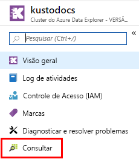
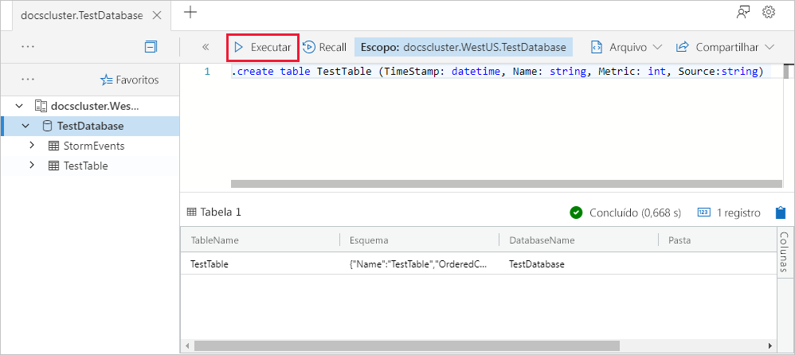
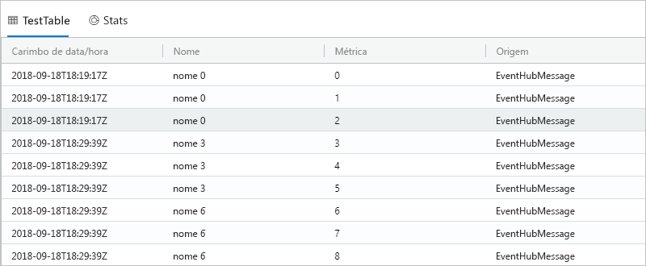

# <a name="quickstart-ingest-data-from-kafka-into-azure-data-explorer"></a>Início Rápido: ingerir dados do Kafka no Azure Data Explorer
 
O Azure Data Explorer é um serviço de exploração de dados rápido e altamente escalonável para dados de log e telemetria. O Azure Data Explorer oferece ingestão (carregamento de dados) do Kafka. Kafka é uma plataforma de streaming distribuída que permite a criação de pipelines de dados de fluxo em tempo real, os quais movem os dados entre sistemas ou aplicativos de modo confiável.
 
## <a name="prerequisites"></a>Pré-requisitos
 
* Caso você não tenha uma assinatura do Azure, crie uma [conta gratuita do Azure](https://azure.microsoft.com/free/) antes de começar. 
 
* [Um cluster de teste e um banco de dados](create-cluster-database-portal.md)
 
* [Um aplicativo de exemplo](https://github.com/Azure/azure-kusto-samples-dotnet/tree/master/kafka) que gera dados e os envia ao Kafka

* [Visual studio 2017 versão 15.3.2 ou superior](https://www.visualstudio.com/vs/) para executar o aplicativo de exemplo
 
## <a name="kafka-connector-setup"></a>Instalação do conector do Kafka

O Kafka Connect é uma ferramenta para streaming de dados escalonável e confiável entre o Apache Kafka e outros sistemas. Ele simplifica a definição rápida de conectores que movem grandes conjuntos de dados dentro e fora do Kafka. O coletor Kafka ADX atua como o conector do Kafka.
 
### <a name="bundle"></a>Pacote

O Kafka pode carregar um `.jar` como um plug-in que atuará como um conector personalizado. Para produzir um `.jar`, clonaremos o código localmente e compilaremos usando o Maven. 

#### <a name="clone"></a>Clone

```bash
git clone git://github.com:Azure/kafka-sink-azure-kusto.git
cd ./kafka-sink-azure-kusto/kafka/
```

#### <a name="build"></a>Compilação

Compilar localmente com o Maven para produzir um `.jar` com dependências.

* [Baixar](https://www.oracle.com/technetwork/java/javase/downloads/index.html) o JDK >= 1.8
* [Baixar](https://maven.apache.org/install.html) o Maven
 

Dentro do diretório raiz *kafka-coletor azure kusto*, execute:

```bash
mvn clean compile assembly:single
```

### <a name="deploy"></a>Implantar 

Carregar o plug-in no Kafka. Um exemplo de implantação usando o Docker pode ser encontrado em [kafka-sink-azure-kusto](https://github.com/Azure/kafka-sink-azure-kusto#deploy)
 

Mais documentos sobre conectores de Kafka e como implantá-los podem ser encontradas em [Kafka Connect](https://kafka.apache.org/documentation/#connect) 

### <a name="example-configuration"></a>Exemplo de configuração 
 
```config
name=KustoSinkConnector 
connector.class=com.microsoft.azure.kusto.kafka.connect.sink.KustoSinkConnector 
kusto.sink.flush_interval_ms=300000 
key.converter=org.apache.kafka.connect.storage.StringConverter 
value.converter=org.apache.kafka.connect.storage.StringConverter 
tasks.max=1 
topics=testing1 
kusto.tables.topics_mapping=[{'topic': 'testing1','db': 'daniel', 'table': 'TestTable','format': 'json', 'mapping':'TestMapping'}] 
kusto.auth.authority=XXX 
kusto.url=https://ingest-{mycluster}.kusto.windows.net/ 
kusto.auth.appid=XXX 
kusto.auth.appkey=XXX 
kusto.sink.tempdir=/var/tmp/ 
kusto.sink.flush_size=1000
```
 
## <a name="create-a-target-table-in-adx"></a>Criar uma tabela de destino no ADX
 
Crie uma tabela no ADX para a qual o Kafka pode enviar dados. Crie a tabela no cluster e no banco de dados provisionados nos **Pré-requisitos**.
 
1. No portal do Azure, navegue até seu cluster e selecione **Consulta**.
 
    
 
1. Copie o seguinte comando na janela e selecione **Run**.
 
    ```Kusto
    .create table TestTable (TimeStamp: datetime, Name: string, Metric: int, Source:string)
    ```
 
    
 
1. Copie o seguinte comando na janela e selecione **Run**.
 
    ```Kusto
    .create table TestTable ingestion json mapping 'TestMapping' '[{"column":"TimeStamp","path":"$.timeStamp","datatype":"datetime"},{"column":"Name","path":"$.name","datatype":"string"},{"column":"Metric","path":"$.metric","datatype":"int"},{"column":"Source","path":"$.source","datatype":"string"}]'
    ```

    Esse comando mapeia dados JSON de entrada para os nomes de colunas e tipos de dados da tabela (TestTable).


## <a name="generate-sample-data"></a>Gerar dados de exemplo

Agora que o cluster do Kafka está conectado ao ADX, use o [aplicativo de exemplo](https://github.com/Azure-Samples/event-hubs-dotnet-ingest) baixado para gerar dados.

### <a name="clone"></a>Clone

Clone o aplicativo de exemplo localmente:

```cmd
git clone git://github.com:Azure/azure-kusto-samples-dotnet.git
cd ./azure-kusto-samples-dotnet/kafka/
```

### <a name="run-the-app"></a>Execute o aplicativo

1. Abrir o aplicativo de exemplo no Visual Studio.

1. No arquivo `Program.cs`, atualize a constante `connectionString` para sua cadeia de conexão do Kafka.

    ```csharp    
    const string connectionString = @"<YourConnectionString>";
    ```

1. Compile e execute o aplicativo. O aplicativo envia mensagens para o cluster do Kafka e imprime o status a cada 10 segundos.

1. Depois de o aplicativo ter enviado algumas mensagens, siga para a próxima etapa.
 
## <a name="query-and-review-the-data"></a>Consultar e analisar os dados

1. Para garantir que nenhum erro ocorra durante a ingestão:

    ```Kusto
    .show ingestion failures
    ```

1. Para ver os dados ingeridos recentemente:

    ```Kusto
    TestTable 
    | count
    ```

1. Para ver o conteúdo das mensagens:
 
    ```Kusto
    TestTable
    ```
 
    O conjunto de resultados deve ser parecido com o seguinte:
 
    
 
## <a name="next-steps"></a>Próximas etapas
 
> [!div class="nextstepaction"]
> [Início Rápido: consultar dados no Azure Data Explorer](web-query-data.md)
