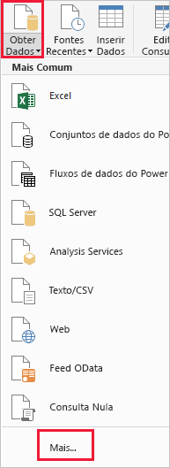
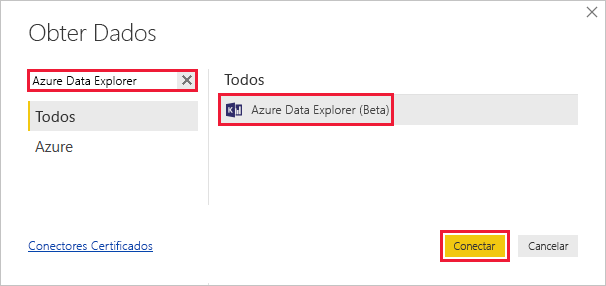
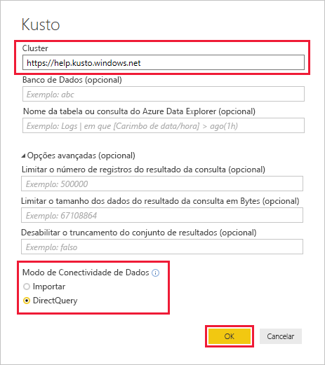
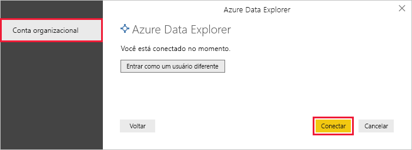
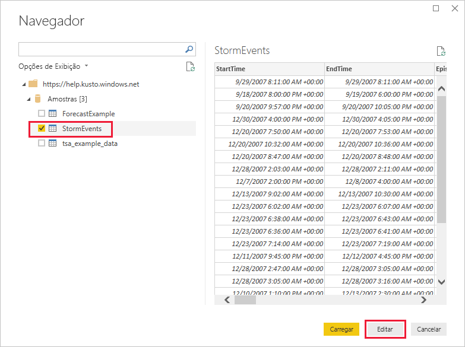
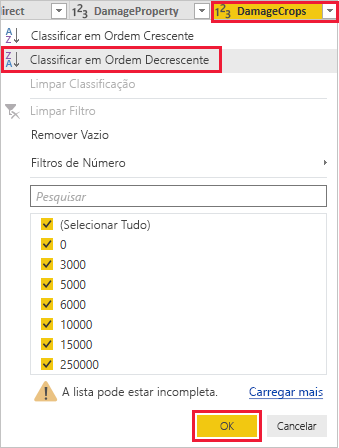
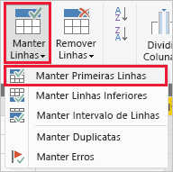

# Início Rápido: Visualizar dados usando o conector do Azure Data Explorer para o Power BI

O Azure Data Explorer é um serviço de exploração de dados rápido e altamente escalonável para dados de log e telemetria. Power BI é uma solução de análise de negócios que permite que você visualize os dados e compartilhar os resultados na sua organização.

O Azure Data Explorer fornece três opções para se conectar a dados no Power BI: usar o conector interno, importar uma consulta do Azure Data Explorer ou usar uma consulta SQL. Este início rápido mostra como usar o conector integrado para obter dados e visualizá-los em um relatório do Power BI.

Caso você não tenha uma assinatura do Azure, crie uma [conta gratuita do Azure](https://azure.microsoft.com/free/) antes de começar.

## Pré-requisitos

Você precisa dos itens a seguir para concluir este início rápido:

* Uma conta de email organizacional que seja membro do Azure Active Directory, de modo que você possa se conectar ao [Cluster de ajuda do Azure Data Explorer](https://dataexplorer.azure.com/clusters/help/databases/samples).

* [Power BI Desktop](https://powerbi.microsoft.com/get-started/) (selecione **DOWNLOAD GRATUITO**)

## Obter dados do Azure Data Explorer

Primeiro, conecte-se ao cluster de ajuda do Azure Data Explorer, depois use um subconjunto dos dados da tabela de *StormEvents*. [!INCLUDE [data-explorer-storm-events](../../includes/data-explorer-storm-events.md)]

1. No Power BI Desktop, na guia **Início**, selecione **Obter Dados** e depois **Mais**.

    

1. Pesquise por *Azure Data Explorer*, depois selecione **Azure Data Explorer (Beta)** e **Conectar**.

    

1. Em **Visualizar Conector**, selecione **Continuar**.

1. Na tela a seguir, preencha o formulário com as informações a seguir.

    

    **Configuração** | **Valor** | **Descrição do campo**
    |---|---|---|
    | HDInsight | *https://help.kusto.windows.net* | A URL do cluster de ajuda. Para outros clusters, a URL está no formato *https://\<NomeCluster\>.\<Região\>.kusto.windows.net*. |
    | Banco de dados | Deixar em branco | Um banco de dados que está hospedado no cluster ao qual você está se conectando. Vamos selecioná-lo em uma etapa posterior. |
    | Nome da tabela | Deixar em branco | Uma das tabelas no banco de dados ou uma consulta, como “StormEvents | take 1000”. Vamos selecioná-lo em uma etapa posterior. |
    | Opções Avançadas | Deixar em branco | Opções para suas consultas, como tamanho de conjunto de resultados. |
    | Modo de conectividade de dados | *DirectQuery* | Determina se o Power BI importa os dados ou se conecta diretamente à fonte de dados. Você pode usar uma das opções com esse conector. |
    | | | |

1. Caso ainda não tenha uma conexão para o cluster de ajuda, entre. Entre com uma conta organizacional, depois selecione **Conectar**.

    

1. Na tela **Navegador**, expanda o banco de dados de **Exemplos**, selecione **StormEvents** e **Editar**.

    

    A tabela é aberta no Editor do Power Query, onde é possível editar linhas e colunas antes de importar os dados.

1. No Editor do Power Query, selecione a seta ao lado da coluna **DamageCrops**, depois **Classificar em ordem decrescente**.

    

1. Na guia **Página inicial**, selecione **Manter Linhas**, depois **Manter Primeiras Linhas**. Insira um valor de *1000* para trazer as primeiras 1000 linhas da tabela classificada.

    

1. Na guia **Página inicial**, selecione **Fechar e Aplicar**.

    

## Visualizar dados em um relatório

[!INCLUDE [data-explorer-power-bi-visualize-basic](../../includes/data-explorer-power-bi-visualize-basic.md)]

## Limpar recursos

Caso não precise mais do relatório que você criou para este início rápido, exclua o arquivo (.pbix) do Power BI Desktop.

## Próximas etapas

> [!div class="nextstepaction"]
> [Início Rápido: Visualizar dados usando uma consulta importada no Power BI](power-bi-imported-query.md)