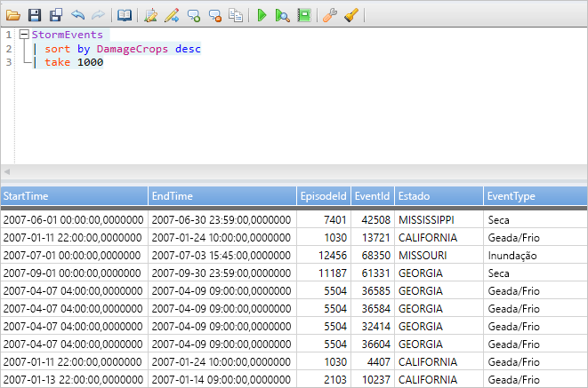
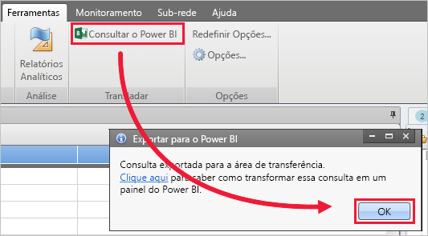
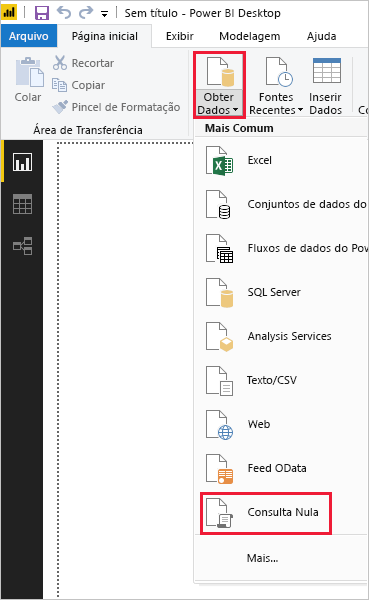
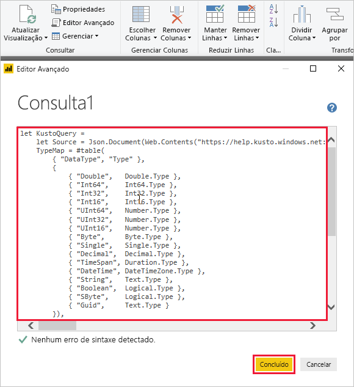
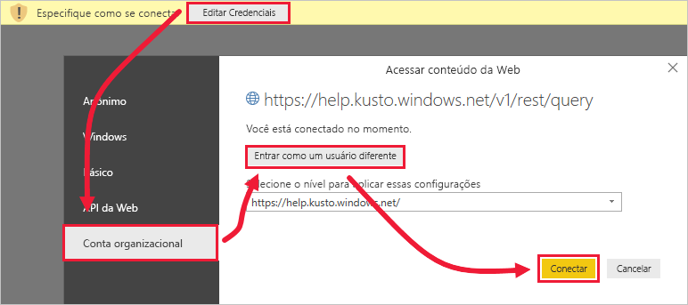

# <a name="quickstart-visualize-data-using-a-query-imported-into-power-bi"></a>Início Rápido: Visualizar dados usando uma consulta importada ao Power BI

O Azure Data Explorer é um serviço de exploração de dados rápido e altamente escalonável para dados de log e telemetria. Power BI é uma solução de análise de negócios que permite que você visualize os dados e compartilhar os resultados na sua organização.

O Azure Data Explorer fornece três opções para se conectar a dados no Power BI: usar o conector interno, importar uma consulta do Azure Data Explorer ou usar uma consulta SQL. Este início rápido mostra como importar uma consulta para que você possa obter dados e visualizá-los em um relatório do Power BI.

Caso você não tenha uma assinatura do Azure, crie uma [conta gratuita do Azure](https://azure.microsoft.com/free/) antes de começar.

## <a name="prerequisites"></a>Pré-requisitos

Você precisa dos itens a seguir para concluir este início rápido:

* Uma conta de email organizacional que seja membro do Azure Active Directory, de modo que você possa se conectar ao [Cluster de ajuda do Azure Data Explorer](https://dataexplorer.azure.com/clusters/help/databases/samples).

* [Power BI Desktop](https://powerbi.microsoft.com/get-started/) (selecione **DOWNLOAD GRATUITO**)

* [Aplicativo de área de trabalho do Azure Data Explorer](/azure/kusto/tools/kusto-explorer)

## <a name="get-data-from-azure-data-explorer"></a>Obter dados do Azure Data Explorer

Primeiro, crie uma consulta no aplicativo de área de trabalho do Azure Data Explorer e exporte-o para usar no Power BI. Em seguida, conecte-se ao cluster de ajuda do Azure Data Explorer e use um subconjunto dos dados da tabela de *StormEvents*. [!INCLUDE [data-explorer-storm-events](../../includes/data-explorer-storm-events.md)]

1. Em um navegador, vá até [https://help.kusto.windows.net/](https://help.kusto.windows.net/) para iniciar o aplicativo de área de trabalho do Azure Data Explorer.

1. No aplicativo da área de trabalho, copie a consulta a seguir na janela de consulta do canto superior direito, depois execute-a.

    ```Kusto
    StormEvents
    | sort by DamageCrops desc
    | take 1000
    ```

    As primeiras linhas do conjunto de resultados devem ser semelhantes à imagem a seguir.

    

1. Na guia **Ferramentas**, selecione **Consulta no Power BI**, depois **OK**.

    

1. No Power BI Desktop, na guia **Início**, selecione **Obter Dados** e depois em **Consulta em branco**.

    

1. No Editor do Power Query, na guia **Página inicial**, selecione **Editor avançado**.

1. Na janela **Editor avançado**, cole a consulta que você exportou e selecione **Concluído**.

    

1. Na janela do Editor do Power Query principal, selecione **Editar credenciais**. Selecione **Conta organizacional**, entre e selecione **Conectar**.

    

1. Na guia **Página inicial**, selecione **Fechar e Aplicar**.

    

## <a name="visualize-data-in-a-report"></a>Visualizar dados em um relatório

[!INCLUDE [data-explorer-power-bi-visualize-basic](../../includes/data-explorer-power-bi-visualize-basic.md)]

## <a name="clean-up-resources"></a>Limpar recursos

Caso não precise mais do relatório que você criou para este início rápido, exclua o arquivo (.pbix) do Power BI Desktop.

## <a name="next-steps"></a>Próximas etapas

> [!div class="nextstepaction"]
> [Início Rápido: Visualizar dados usando uma consulta importada no Power BI](power-bi-sql-query.md)