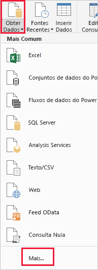
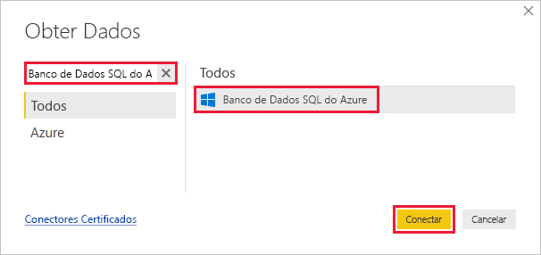
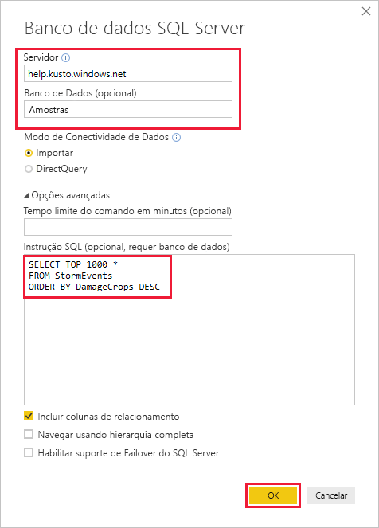
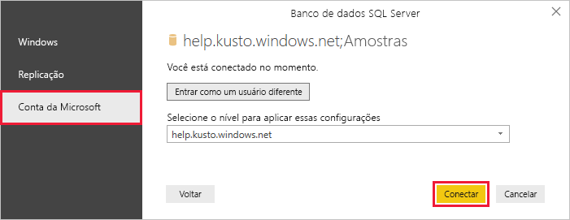

# <a name="quickstart-visualize-data-using-the-azure-data-explorer-connector-for-power-bi"></a>Início Rápido: Visualizar dados usando o conector do Azure Data Explorer para o Power BI

O Azure Data Explorer é um serviço de exploração de dados rápido e altamente escalonável para dados de log e telemetria. Power BI é uma solução de análise de negócios que permite que você visualize os dados e compartilhar os resultados na sua organização.

O Azure Data Explorer fornece três opções para se conectar a dados no Power BI: usar o conector interno, importar uma consulta do Azure Data Explorer ou usar uma consulta SQL. Este início rápido mostra como usar uma consulta SQL para obter dados e visualizá-los em um relatório do Power BI.

Caso você não tenha uma assinatura do Azure, crie uma [conta gratuita do Azure](https://azure.microsoft.com/free/) antes de começar.

## <a name="prerequisites"></a>Pré-requisitos

Você precisa dos itens a seguir para concluir este início rápido:

* Uma conta de email organizacional que seja membro do Azure Active Directory, de modo que você possa se conectar ao [Cluster de ajuda do Azure Data Explorer](https://dataexplorer.azure.com/clusters/help/databases/samples).

* [Power BI Desktop](https://powerbi.microsoft.com/get-started/) (selecione **DOWNLOAD GRATUITO**)

## <a name="get-data-from-azure-data-explorer"></a>Obter dados do Azure Data Explorer

Primeiro, conecte-se ao cluster de ajuda do Azure Data Explorer, depois use um subconjunto dos dados da tabela de *StormEvents*. [!INCLUDE [data-explorer-storm-events](../../includes/data-explorer-storm-events.md)]

Geralmente, você usa a linguagem de consulta nativa com o Azure Data Explorer, mas ele também dá suporte a consultas SQL, o que você vai usar aqui. O Azure Data Explorer traduz a consulta SQL em uma consulta nativa para você.

1. No Power BI Desktop, na guia **Início**, selecione **Obter Dados** e depois **Mais**.

    

1. Pesquise *Banco de dados SQL*, selecione **Banco de Dados SQL do Azure**, depois **Conectar**.

    

1. Na tela **Banco de dados do SQL Server**, preencha o formulário com as informações a seguir.

    

    **Configuração** | **Valor** | **Descrição do campo**
    |---|---|---|
    | Servidor | *help.kusto.windows.net* | A URL para o cluster de ajuda (sem *https://*). Para outros clusters, a URL está no formato *\<NomeCluster\>.\<Região\>.kusto.windows.net*. |
    | Banco de dados | *Exemplos* | O banco de dados de exemplo está hospedado no cluster ao qual você está se conectando. |
    | Modo de conectividade de dados | *Importaçãoação* | Determina se o Power BI importa os dados ou se conecta diretamente à fonte de dados. Você pode usar uma das opções com esse conector. |
    | Tempo limite do comando | Deixar em branco | Por quanto tempo a consulta é executada antes de gerar um erro de tempo limite. |
    | Instrução SQL | Copie a consulta abaixo desta tabela | A instrução SQL que o Azure Data Explorer se traduz em uma consulta nativa. |
    | Outras opções | Mantenha como valores padrão | As opções não se aplicam aos clusters do Azure Data Explorer. |
    | | | |

    ```SQL
    SELECT TOP 1000 *
    FROM StormEvents
    ORDER BY DamageCrops DESC
    ```

1. Caso ainda não tenha uma conexão para o cluster de ajuda, entre. Entre com uma conta Microsoft, depois selecione **Conectar**.

    

1. Na tela **help.kusto.windows.net: Exemplos**, selecione **Carregar**.

    

    A tabela é aberta na janela principal do Power BI, no modo de exibição de relatório, onde é possível criar relatórios com base nos dados de exemplo.

## <a name="visualize-data-in-a-report"></a>Visualizar dados em um relatório

[!INCLUDE [data-explorer-power-bi-visualize-basic](../../includes/data-explorer-power-bi-visualize-basic.md)]

## <a name="clean-up-resources"></a>Limpar recursos

Caso não precise mais do relatório que você criou para este início rápido, exclua o arquivo (.pbix) do Power BI Desktop.

## <a name="next-steps"></a>Próximas etapas

> [!div class="nextstepaction"]
> [Início Rápido: Visualizar dados usando uma consulta importada no Power BI](power-bi-connector.md)