# <a name="quickstart-query-data-in-azure-data-explorer"></a>Início Rápido: Consultar dados no Azure Data Explorer

O Azure Data Explorer é um serviço de exploração de dados rápido e altamente escalonável para dados de log e telemetria. O Azure Data Explorer fornece um aplicativo Web que permite executar e compartilhar consultas. O aplicativo está disponível no portal do Azure e como um aplicativo Web autônomo. Neste artigo, você trabalhará na versão autônoma que permite conectar vários clusters e compartilhar links diretos para suas consultas.

Caso você não tenha uma assinatura do Azure, crie uma [conta gratuita do Azure](https://azure.microsoft.com/free/) antes de começar.

## <a name="prerequisites"></a>Pré-requisitos

Além de uma assinatura do Azure, é necessário ter [um cluster de teste e um banco de dados](create-cluster-database-portal.md) para concluir este início rápido.

## <a name="sign-in-to-the-application"></a>Entrar no aplicativo

Entre no [aplicativo](https://dataexplorer.azure.com/).

## <a name="add-clusters"></a>Adicionar clusters

Ao abrir o aplicativo pela primeira vez, não haverá conexões.


É necessário adicionar uma conexão a pelo menos um cluster antes de começar a executar consultas. Nesta seção, você adicionará conexões ao *cluster de ajuda* do Azure Data Explorer, que configuramos para ajudar no aprendizado, e ao cluster de teste que você criou em um início rápido anterior.

1. No canto superior esquerdo do aplicativo, selecione **Adicionar cluster**.

1. Na caixa de diálogo **Adicionar cluster**, insira o URI e, em seguida, selecione **Adicionar**.

   Você pode usar o URI do cluster de ajuda, `https://help.kusto.windows.net`. Se você tiver seu próprio cluster, forneça o URI do cluster. Por exemplo, `https://mydataexplorercluster.westus.kusto.windows.net` como na imagem a seguir:

    

1. No painel esquerdo, você deverá ver o cluster de **ajuda**. Expanda o banco de dados de **Exemplos** para que seja possível visualizar as tabelas de exemplos às quais você tem acesso.

    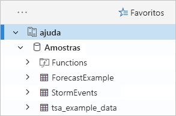

    Usamos a tabela **StormEvents** mais adiante neste início rápido e em outros artigos do Azure Data Explorer.

Agora, adicione o cluster de teste que você criou.

1. Selecione **Adicionar cluster**.

1. Na caixa de diálogo **Adicionar cluster** insira a URL do cluster de teste no formulário `https://<ClusterName>.<Region>.kusto.windows.net/` e, em seguida, selecione **Adicionar**.

    No exemplo abaixo, você visualiza o cluster de **ajuda** e um novo cluster, **docscluster.westus** (a URL completa é `https://docscluster.westus.kusto.windows.net/`).

    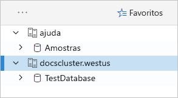

## <a name="run-queries"></a>Executar consultas

Agora, é possível executar consultas em qualquer cluster ao qual esteja conectado (supondo que você tenha dados no cluster de teste). Vamos nos concentrar no cluster de **ajuda**.

1. No painel esquerdo, no cluster de **ajuda**, selecione o banco de dados de **Exemplos**.

1. Copie e cole a consulta a seguir na janela de consulta. Na parte superior da janela, selecione **Executar**.

    ```Kusto
    StormEvents
    | sort by StartTime desc
    | take 10
    ```
    Essa consulta retorna os dez registros mais recentes na tabela **StormEvents**. O lado esquerdo do resultado deve ser semelhante à tabela a seguir.

    

    A imagem a seguir mostra o estado em que o aplicativo deve estar agora, com clusters adicionados e uma consulta com resultados.

    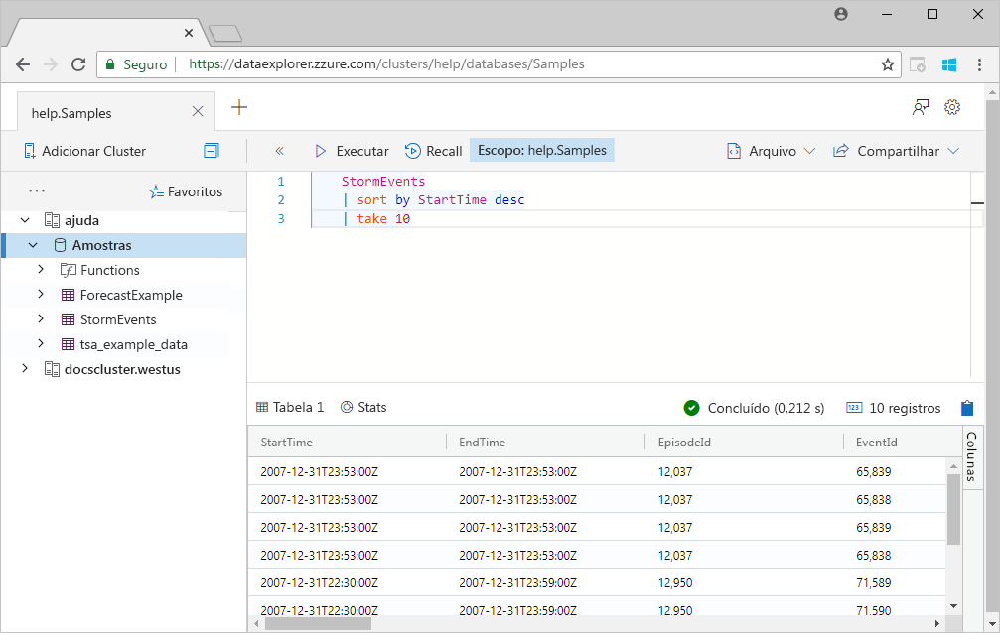

1. Copie e cole a consulta a seguir na janela de consulta, abaixo da primeira consulta. Observe como não está formatada em linhas separadas, como a primeira consulta.

    ```Kusto
    StormEvents | sort by StartTime desc | project StartTime, EndTime, State, EventType, DamageProperty, EpisodeNarrative | take 10
    ```

1. Clique na nova consulta na janela, que seleciona a consulta. Pressione Shift+Alt+F para formatar a consulta, de modo que seja semelhante ao seguinte.

    

1. Pressione Shift+Enter, que é um atalho para executar uma consulta.

   Essa consulta retorna os mesmos registros que a primeira, mas inclui apenas as colunas especificadas na instrução `project`. O resultado deve ser semelhante à tabela a seguir.

    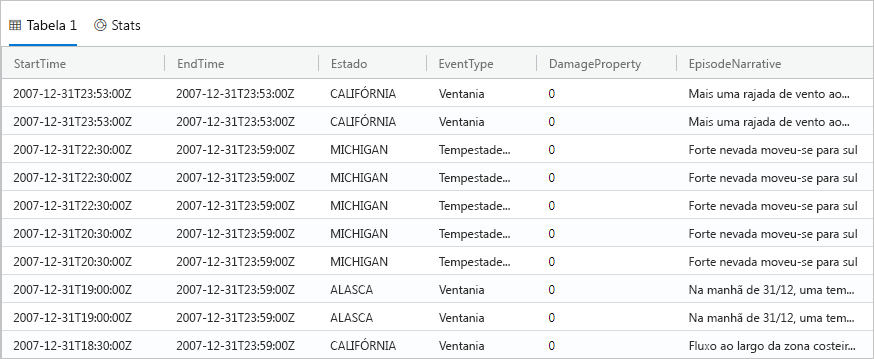

1. Na parte superior da janela de consulta, selecione **Recall**.

    A janela de consulta agora mostra o conjunto de resultados da primeira consulta, sem a necessidade de executar novamente a consulta. Muitas vezes, durante a análise, você executa várias consultas e o **Recall** permite rever os resultados das consultas anteriores.

1. Vamos executar mais uma consulta para ver um tipo diferente de saída.

    ```Kusto
    StormEvents
    | summarize event_count=count(), mid = avg(BeginLat) by State
    | sort by mid
    | where event_count > 1800
    | project State, event_count
    | render columnchart
    ```
    O resultado deve ser semelhante ao gráfico a seguir.

    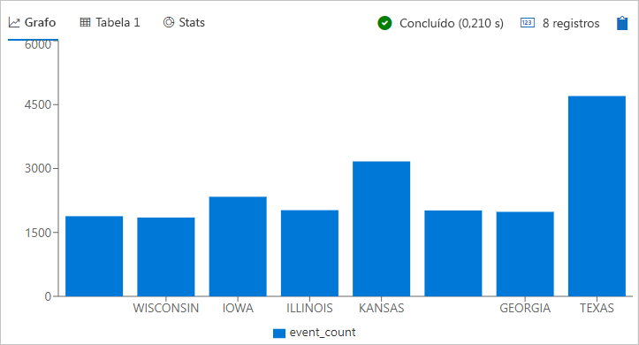

## <a name="work-with-the-table-grid"></a>Trabalhar com a grade de tabela

Você viu como as consultas básicas funcionam, agora vamos saber como é possível usar a grade de tabela para personalizar os resultados e fazer análises adicionais.

1. Execute novamente a primeira consulta. Passe o mouse sobre a coluna **Estado**, selecione o menu e, em seguida, selecione **Agrupar por Estado**.

    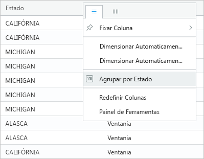

1. Na grade, expanda **Califórnia** para ver os registros desse estado.

    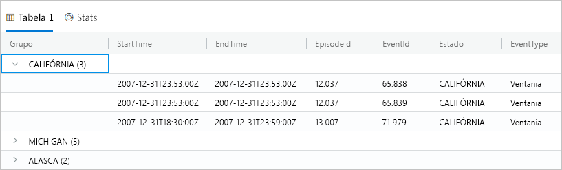

    Esse tipo de agrupamento pode ser útil ao fazer uma análise exploratória.

1. Passe o mouse sobre a coluna **Grupo** e, em seguida, selecione **Redefinir Colunas**.

    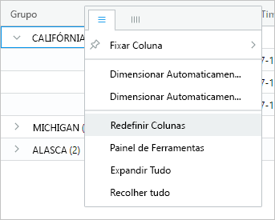

    Isso retorna a grade ao seu estado original.

1. Execute a consulta a seguir.

    ```Kusto
    StormEvents
    | sort by StartTime desc
    | where DamageProperty > 5000
    | project StartTime, State, EventType, DamageProperty, Source
    | take 10
    ```

1. No lado direito da grade, selecione **Colunas** para ver o painel de ferramentas.

    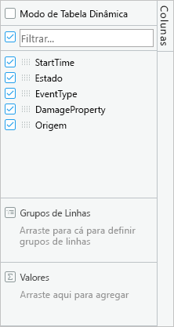

    Esse painel funciona de maneira semelhante à lista de campos da tabela dinâmica no Excel, permitindo que você faça mais análises na própria grade.

1. Selecione **Modo de Tabela Dinâmica**; em seguida, arraste colunas da seguinte maneira: **Estado** para **Grupos de Linhas**; **DamageProperty** para **Valores**; e **EventType** para **Rótulos de Coluna**.  

    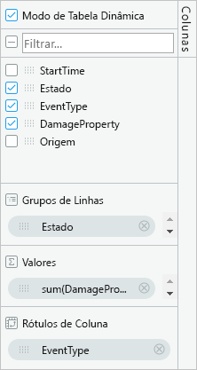

    O resultado deve ser semelhante à tabela dinâmica a seguir.

    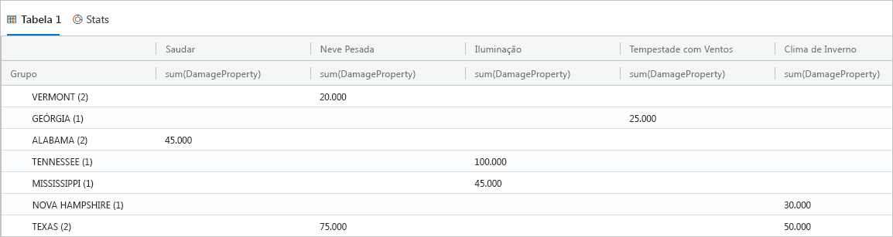

    Observe como Vermont e Alabama têm dois eventos na mesma categoria, enquanto o Texas tem dois eventos em diferentes categorias. Tabelas dinâmicas permitem que você identifique rapidamente informações como essas, já que são uma ótima ferramenta para análise rápida.

## <a name="share-queries"></a>Compartilhar consultas

Muitas vezes, você quer compartilhar as consultas que você cria. É possível fornecer um link direto para que outros usuários com acesso ao cluster possam executar as consultas.

1. Na janela de consulta, selecione a primeira consulta que você copiou.

1. Na parte superior da janela de consulta, selecione **Compartilhar**.

1. Selecione **Link, consulta para área de transferência**.

1. Copie o link e consulte um arquivo de texto.

1. Cole o link em uma nova janela do navegador. O resultado deve ser semelhante ao seguinte após a execução da consulta.

    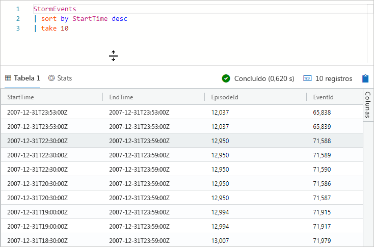

## <a name="provide-feedback"></a>Fornecer comentários

O Data Explorer atualmente está em versão prévia e nós agradecemos seus comentários sobre a sua experiência. Você pode fazer isso agora ou aguardar até utilizá-lo por mais tempo.

1. No canto superior direito do aplicativo, selecione o ícone de comentários: .

1. Insira seu comentário e selecione **Enviar**.

## <a name="clean-up-resources"></a>Limpar recursos

Você não criou nenhum recurso neste início rápido, mas se desejar remover um ou ambos os clusters do aplicativo, clique com o botão direito do mouse no cluster e selecione **Remover conexão**.

## <a name="next-steps"></a>Próximas etapas

> [!div class="nextstepaction"]
> [Gravar consultas para Azure Data Explorer](write-queries.md)
