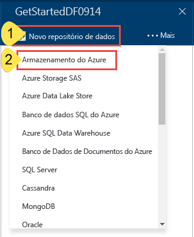
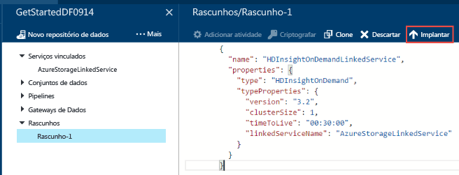
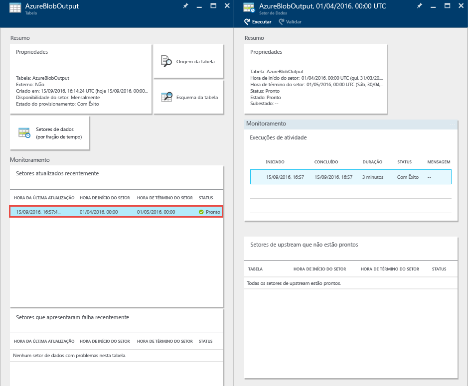
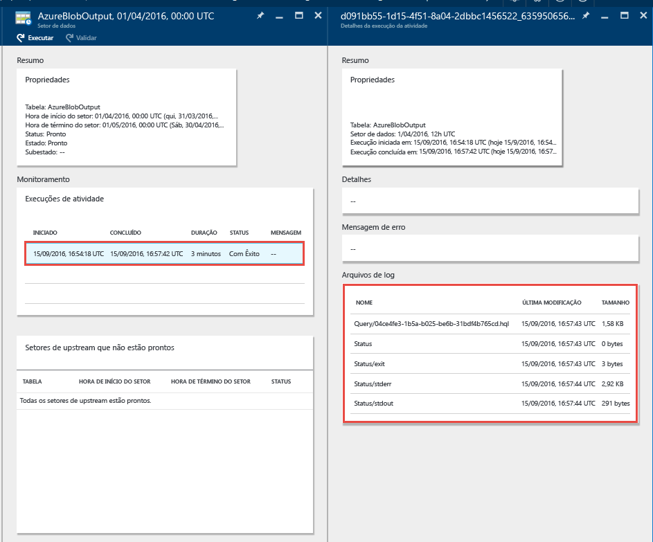

# Tutorial: Compilar sua primeira Azure Data Factory usando o portal do Azure
> [!div class="op_single_selector"]
> * [Visão geral e pré-requisitos](data-factory-build-your-first-pipeline.md)
> * [Portal do Azure](data-factory-build-your-first-pipeline-using-editor.md)
> * [Visual Studio](data-factory-build-your-first-pipeline-using-vs.md)
> * [PowerShell](data-factory-build-your-first-pipeline-using-powershell.md)
> * [Modelo do Resource Manager](data-factory-build-your-first-pipeline-using-arm.md)
> * [API REST](data-factory-build-your-first-pipeline-using-rest-api.md)
> 
> 

Neste artigo, você aprende a usar o [portal do Azure](https://portal.azure.com/) para criar seu primeiro data factory do Azure.

## Pré-requisitos
1. Leia o artigo [Visão geral do tutorial](data-factory-build-your-first-pipeline.md) e concluir as etapas de **pré-requisito**.
2. Este artigo não fornece uma visão geral conceitual do serviço Azure Data Factory. Nós recomendamos que você veja o artigo [Introdução ao Azure Data Factory](data-factory-introduction.md) para obter uma visão geral detalhada do serviço.

## Criar um data factory
Uma fábrica de dados pode ter um ou mais pipelines. Um pipeline em um data factory pode ter uma ou mais atividades. Por exemplo, uma Atividade de Cópia para copiar dados de um armazenamento de dados de origem para um de destino e uma atividade do Hive do HDInsight para executar o script do Hive para transformar os dados de entrada em dados de saída do produto. Vamos começar com a criação do data factory nesta etapa.

1. Faça logon no [Portal do Azure](https://portal.azure.com/).
2. Clique em **NOVO** no menu à esquerda, clique em **Dados + Análise** e clique em **Data Factory**.
   
   
3. Na folha **Novo data factory**, insira **GetStartedDF** como o Nome.
   
   
   
   > [!IMPORTANT]
   > O nome do Azure Data Factory deve ser **globalmente exclusivo**. Se você receber o erro: **O nome do data factory "GetStartedDF" não está disponível**. Altere o nome do data factory (por exemplo, seunomeGetStartedDF) e tente criar novamente. Veja o tópico [Data Factory - regras de nomenclatura](data-factory-naming-rules.md) para ver as regras de nomenclatura para artefatos do Data Factory.
   > 
   > O nome do data factory pode ser registrado futuramente como um nome **DNS** e tornar-se publicamente visível.
   > 
   > 
4. Escolha a **assinatura do Azure** onde você deseja que o data factory seja criado.
5. Selecione um **grupo de recursos** existente ou crie um grupo de recursos. Para o tutorial, crie um grupo de recursos chamado: **ADFGetStartedRG**.
6. Clique em **Criar** na folha **Novo data factory**.
   
   > [!IMPORTANT]
   > Para criar instâncias de Data Factory, você deve ser um membro da função [Colaborador de Data Factory](../active-directory/role-based-access-built-in-roles.md#data-factory-contributor) no nível de assinatura/grupo de recursos.
   > 
   > 
7. Você verá o data factory que está sendo criado no **Quadro inicial** do portal do Azure da seguinte maneira:
   
   
8. Parabéns! Você criou com êxito sua primeira data factory. Após o data factory ter sido criado com êxito, você verá a página do data factory, que exibe seu conteúdo.
   
    

Antes de criar um pipeline no data factory, primeiro você precisará criar algumas entidades do Data Factory. Primeiro você cria serviços vinculados para vincular serviços de armazenamento/computação de dados ao seu armazenamento de dados, define conjuntos de dados de entrada/saída para representar os dados em armazenamentos de dados vinculados e, em seguida, cria o pipeline com uma atividade que utilize esses conjuntos de dados.

## Criar serviços vinculados
Nesta etapa, você vinculará sua conta do Armazenamento do Azure e um cluster do HDInsight do Azure sob demanda ao data factory. A conta do Armazenamento do Azure manterá os dados de entrada e de saída para o pipeline neste exemplo. O serviço vinculado do HDInsight é usado para executar o script do Hive especificado na atividade do pipeline neste exemplo. Identifique quais [serviços de armazenamento](data-factory-data-movement-activities.md)/[serviços de computação](data-factory-compute-linked-services.md) serão usados em seu cenário e vincular esses serviços ao data factory criando serviços vinculados.

### Criar o serviço vinculado do armazenamento do Azure
Nesta etapa, você vincula a conta do Armazenamento do Azure ao data factory. Neste tutorial, use a mesma conta do Armazenamento do Azure para armazenar dados de entrada/saída e o arquivo do script do HQL.

1. Clique em **Criar e implantar** na folha **DATA FACTORY** para **GetStartedDF**. Você deverá ver o Data Factory Editor.
   
   
2. Clique em **Novo armazenamento de dados** e escolha **Armazenamento do Azure**.
   
   
3. Você deve ver o script JSON para criar um serviço de armazenamento vinculado do Azure no editor.
   
   
4. Substitua o **nome da conta** pelo nome da conta de armazenamento do Azure e a **chave de conta** pela chave de acesso da sua conta do armazenamento do Azure. Para saber como obter sua chave de acesso de armazenamento, confira [Exibir, copiar e regenerar chaves de acesso de armazenamento](../storage/storage-create-storage-account.md#view-copy-and-regenerate-storage-access-keys).
5. Clique em **Implantar** na barra de comandos para implantar o serviço vinculado.
   
    
   
   Depois que o serviço vinculado for implantado com êxito, a janela **Rascunho-1** desaparecerá e você verá **AzureStorageLinkedService** no modo de exibição de árvore à esquerda. 

### Criar o serviço vinculado do Azure HDInsight
Nesta etapa, você vincula um cluster do HDInsight sob demanda ao seu data factory. O cluster do HDInsight é automaticamente criado no tempo de execução e excluído após a conclusão do processamento, ficando ocioso durante o período especificado.

1. No **Editor de Data Factory**, clique em **... Mais**, clique em **Nova computação** e selecione **Cluster HDInsight sob demanda**.
   
    
2. Copie e cole o trecho a seguir na janela de **Rascunho-1**. O trecho JSON descreve as propriedades usadas para criar o cluster do HDInsight sob demanda.
   
        {
          "name": "HDInsightOnDemandLinkedService",
          "properties": {
            "type": "HDInsightOnDemand",
            "typeProperties": {
              "version": "3.2",
              "clusterSize": 1,
              "timeToLive": "00:30:00",
              "linkedServiceName": "AzureStorageLinkedService"
            }
          }
        }
   
    A tabela a seguir fornece descrições das propriedades de JSON usadas no trecho de código:
   
   | Propriedade | Descrição |
   |:--- |:--- |
   | Versão |Especifica a versão do HDInsight criada como a 3.2. |
   | ClusterSize |Especifica o tamanho do cluster HDInsight. |
   | TimeToLive |Especifica que o tempo ocioso do cluster HDInsight antes de ser excluído. |
   | linkedServiceName |Especifica a conta de armazenamento usada para armazenar os logs gerados pelo HDInsight. |
   
    Observe os seguintes pontos:
   
   * O Data Factory cria um cluster HDInsight **baseado no Windows** para você com o JSON. Você também pode fazer com que ele crie um cluster HDInsight **baseado em Linux**. Confira [Serviço vinculado do HDInsight sob demanda](data-factory-compute-linked-services.md#azure-hdinsight-on-demand-linked-service) para obter detalhes.
   * Você pode usar **seu próprio cluster do HDInsight** em vez de usar um cluster do HDInsight sob demanda. Confira [Serviço vinculado do HDInsight](data-factory-compute-linked-services.md#azure-hdinsight-linked-service) para obter detalhes.
   * O cluster HDInsight cria um **contêiner padrão** no armazenamento de blobs especificado em JSON (**linkedServiceName**). O HDInsight não exclui esse contêiner quando o cluster é excluído. Este comportamento ocorre por design. Com o serviço vinculado HDInsight sob demanda, um cluster HDInsight é criado sempre que uma fatia é processada, a menos que haja um cluster ativo existente (**timeToLive**). O cluster será excluído automaticamente quando o processamento for concluído.
     
       Quanto mais fatias forem processadas, você verá muitos contêineres no armazenamento de blobs do Azure. Se você não precisa deles para solução de problemas dos trabalhos, convém excluí-los para reduzir o custo de armazenamento. Os nomes desses contêineres seguem um padrão: "adf**nomedafábricadedados**-**nomedoserviçovinculado**-carimbodedatahora". Use ferramentas como o [Gerenciador de Armazenamento da Microsoft](http://storageexplorer.com/) para excluir contêineres do armazenamento de blobs do Azure.
     
     Confira [Serviço vinculado do HDInsight sob demanda](data-factory-compute-linked-services.md#azure-hdinsight-on-demand-linked-service) para obter detalhes.
3. Clique em **Implantar** na barra de comandos para implantar o serviço vinculado.
   
    
4. Confirme que você vê **AzureStorageLinkedService** e **HDInsightOnDemandLinkedService** no modo de exibição de árvore à esquerda.
   
    

## Criar conjuntos de dados
Nesta etapa, você cria conjuntos de dados para representar dados de entrada e de saída para o processamento do Hive. Esses conjuntos de dados fazem referência ao **AzureStorageLinkedService** que você criou anteriormente neste tutorial. O serviço vinculado aponta para uma conta do Armazenamento do Azure e os conjuntos de dados especificam o contêiner, a pasta e o nome do arquivo no armazenamento que contém os dados de entrada e de saída.

### Criar conjunto de dados de entrada
1. No **Editor de Data Factory**, clique em **... Mais** na barra de comandos, clique em **Novo conjunto de dados** e selecione **Armazenamento de Blobs do Azure**.
   
    
2. Copie e cole o trecho a seguir na janela de Rascunho-1. No trecho JSON, você está criando um conjunto de dados chamado **AzureBlobInput** que representa dados de entrada para uma atividade no pipeline. Além disso, você especifica que os dados de entrada estão localizados no contêiner de blob denominado **adfgetstarted** e na pasta chamada **inputdata**
   
        {
            "name": "AzureBlobInput",
            "properties": {
                "type": "AzureBlob",
                "linkedServiceName": "AzureStorageLinkedService",
                "typeProperties": {
                    "fileName": "input.log",
                    "folderPath": "adfgetstarted/inputdata",
                    "format": {
                        "type": "TextFormat",
                        "columnDelimiter": ","
                    }
                },
                "availability": {
                    "frequency": "Month",
                    "interval": 1
                },
                "external": true,
                "policy": {}
            }
        } 
   
    A tabela a seguir fornece descrições das propriedades de JSON usadas no trecho de código:
   
   | Propriedade | Descrição |
   |:--- |:--- |
   | type |A propriedade type é definida como AzureBlob porque os dados residem no armazenamento de blobs do Azure. |
   | linkedServiceName |refere-se ao AzureStorageLinkedService que você criou anteriormente. |
   | fileName |Essa propriedade é opcional. Se você omitir essa propriedade, todos os arquivos de folderPath serão selecionados. Nesse caso, somente o input.log será processado. |
   | type |Os arquivos de log estão em formato de texto, então utilizaremos TextFormat. |
   | columnDelimiter |as colunas nos arquivos de log são delimitadas pelo caractere de vírgula (,) |
   | frequência/intervalo |a frequência é definida como Mês e o intervalo como 1, o que significa que as fatias de entrada estão disponíveis mensalmente. |
   | externo |essa propriedade será definida como true se os dados de entrada não forem gerados pelo serviço Data Factory. |
3. Clique em **Implantar** na barra de comandos para implantar o conjunto de dados recém-criado. Você deverá ver o conjunto de dados no modo de exibição de árvore à esquerda.

### Criar conjunto de dados de saída
Agora, você cria o conjunto de dados de saída para representar os dados de saída armazenados no armazenamento de Blobs do Azure.

1. No **Editor de Data Factory**, clique em **... Mais** na barra de comandos, clique em **Novo conjunto de dados** e selecione **Armazenamento de Blobs do Azure**.
2. Copie e cole o trecho a seguir na janela de Rascunho-1. No trecho JSON, você está criando um conjunto de dados chamado **AzureBlobOutput** e especificando a estrutura dos dados produzidos pelo script do Hive. Além disso, você especifica que os resultados são armazenados no contêiner de blob denominado **adfgetstarted** e na pasta chamada **partitioneddata**. A seção **availability** especifica que o conjunto de dados de saída é produzido mensalmente.
   
        {
          "name": "AzureBlobOutput",
          "properties": {
            "type": "AzureBlob",
            "linkedServiceName": "AzureStorageLinkedService",
            "typeProperties": {
              "folderPath": "adfgetstarted/partitioneddata",
              "format": {
                "type": "TextFormat",
                "columnDelimiter": ","
              }
            },
            "availability": {
              "frequency": "Month",
              "interval": 1
            }
          }
        }
   
    Consulte a seção **Criar o conjunto de dados de entrada** para obter descrições dessas propriedades. Você não define a propriedade externa em um conjunto de dados de saída porque o conjunto de dados é produzido pelo serviço Data Factory.
3. Clique em **Implantar** na barra de comandos para implantar o conjunto de dados recém-criado.
4. Verifique se o conjunto de dados foi criado com êxito.
   
    

## Criar um pipeline
Nesta etapa, você cria seu primeiro pipeline com a atividade **HDInsightHive**. A fatia de entrada está disponível mensalmente (frequência: mês, intervalo: 1), a fatia de saída é produzida mensalmente e a propriedade do agendador para a atividade também é definida como mensal. As configurações para o conjunto de dados de saída e o agendador de atividades devem corresponder. Atualmente, o conjunto de dados de saída é o que aciona a agenda, então você deve criar um conjunto de dados de saída, mesmo que a atividade não produza qualquer saída. Se a atividade não receber entradas, ignore a criação de conjunto de dados de entrada. As propriedades usadas no JSON a seguir são explicadas no final desta seção.

1. No **Editor do Data Factory**, clique em **Reticências (...) Mais comandos** e em **Novo pipeline**.
   
    
2. Copie e cole o trecho a seguir na janela de Rascunho-1.
   
   > [!IMPORTANT]
   > Substitua **storageaccountname** pelo nome da sua conta de armazenamento no JSON.
   > 
   > 
   
        {
            "name": "MyFirstPipeline",
            "properties": {
                "description": "My first Azure Data Factory pipeline",
                "activities": [
                    {
                        "type": "HDInsightHive",
                        "typeProperties": {
                            "scriptPath": "adfgetstarted/script/partitionweblogs.hql",
                            "scriptLinkedService": "AzureStorageLinkedService",
                            "defines": {
                                "inputtable": "wasb://adfgetstarted@<storageaccountname>.blob.core.windows.net/inputdata",
                                "partitionedtable": "wasb://adfgetstarted@<storageaccountname>.blob.core.windows.net/partitioneddata"
                            }
                        },
                        "inputs": [
                            {
                                "name": "AzureBlobInput"
                            }
                        ],
                        "outputs": [
                            {
                                "name": "AzureBlobOutput"
                            }
                        ],
                        "policy": {
                            "concurrency": 1,
                            "retry": 3
                        },
                        "scheduler": {
                            "frequency": "Month",
                            "interval": 1
                        },
                        "name": "RunSampleHiveActivity",
                        "linkedServiceName": "HDInsightOnDemandLinkedService"
                    }
                ],
                "start": "2016-04-01T00:00:00Z",
                "end": "2016-04-02T00:00:00Z",
                "isPaused": false
            }
        }
   
    No trecho de JSON, você cria um pipeline que consiste de uma única atividade que usa o Hive para processar dados em um cluster HDInsight.
   
    O arquivo de script do Hive, **partitionweblogs.hql**, é armazenado na conta de armazenamento do Azure (especificada pelo scriptLinkedService chamado **AzureStorageLinkedService**) e na pasta **script** no contêiner **adfgetstarted**.
   
    A seção **defines** é usada para especificar as configurações de tempo de execução passadas para o script do hive como valores de configuração do Hive (por exemplo, ${hiveconf:inputtable}, ${hiveconf:partitionedtable}).
   
    As propriedades **start** e **end** do pipeline especificam o período ativo do pipeline.
   
    Na atividade de JSON, você especifica que o script do Hive deve ser executado na computação especificada pelo **linkedServiceName** – **HDInsightOnDemandLinkedService**.
   
   > [!NOTE]
   > Confira [Anatomia de um Pipeline](data-factory-create-pipelines.md#anatomy-of-a-pipeline) para obter detalhes sobre as propriedades JSON usadas no exemplo.
   > 
   > 
3. Confirme o seguinte:
   
   1. O arquivo **input.log** existe na pasta **inputdata** do contêiner **adfgetstarted** no armazenamento de blobs do Azure
   2. O arquivo **partitionweblogs.hql** existe na pasta **script** do contêiner **adfgetstarted** no armazenamento de blobs do Azure. Conclua as etapas de pré-requisito na [Visão geral do tutorial](data-factory-build-your-first-pipeline.md) se você não vir esses arquivos.
   3. Confirme se você substituiu **storageaccountname** pelo nome da sua conta de armazenamento no JSON.
4. Clique em **Implantar** na barra de comandos para implantar o pipeline. Como as horas de **início** e de **fim** são definidas no passado e **isPaused** está definido como false, o pipeline (a atividade no pipeline) é imediatamente executado após a implantação.
5. Confirme que você vê o pipeline no modo de exibição de árvore.
   
    
6. Parabéns, você criou com sucesso seu primeiro pipeline!

## Monitorar o pipeline
### Monitorar o pipeline usando a Exibição de Diagrama
1. Clique em **X** para fechar as folhas do Editor da Fábrica de Dados e para navegar de volta à folha Fábrica de Dados, e clique em **Diagrama**.
   
    
2. Na Exibição de Diagrama, você tem uma visão geral dos pipelines e dos conjuntos de dados usados neste tutorial.
   
    
3. Para exibir todas as atividades no pipeline, clique com o botão direito do mouse no pipeline no diagrama e clique em Abrir Pipeline.
   
    
4. Confirme que você vê a atividade HDInsightHive no pipeline.
   
    
   
    Para navegar de volta ao modo de exibição anterior, clique em **Data factory** no menu de atalho na parte superior.
5. Na **Exibição de Diagrama**, clique duas vezes no conjunto de dados **AzureBlobInput**. Confirme se a fatia está no estado **Pronto**. Pode levar alguns minutos para que a fatia apareça no estado Pronto. Se isso não acontecer depois de algum tempo, veja se o arquivo de entrada (input.log) está posicionado no contêiner à direita (adfgetstarted) e na pasta (inputdata).
   
   
6. Clique em **X** para fechar a folha **AzureBlobInput**.
7. Na **Exibição de Diagrama**, clique duas vezes no conjunto de dados **AzureBlobOutput**. Você verá a fatia que está sendo processada.
   
   
8. Quando o processamento for concluído, você verá a fatia no estado **Pronto**.
   
   > [!IMPORTANT]
   > A criação de um cluster do HDInsight sob demanda geralmente leva algum tempo (20 minutos, aproximadamente). Portanto, espere que o pipeline demore **cerca de 30 minutos** para processar a fatia.
   > 
   > 
   
    
9. Quando a fatia estiver no estado **Pronto**, verifique a pasta **partitioneddata** no contêiner **adfgetstarted** em seu armazenamento de blobs para os dados de saída.
   
   
10. Clique na fatia para ver detalhes sobre ela em uma folha **Fatia de dados**.
    
    
11. Clique em uma execução de atividade na **Lista de execuções de atividade** para ver detalhes sobre uma execução de atividade (a atividade do Hive em nosso cenário) em uma janela **Detalhes da execução da atividade**.
    
    
    
    Nos arquivos de log, você pode ver a consulta do Hive executada e as informações de status. Esses logs são úteis para solucionar problemas. Confira o artigo [Monitorar e gerenciar pipelines usando as folhas do portal do Azure](data-factory-monitor-manage-pipelines.md) para obter mais detalhes.

> [!IMPORTANT]
> O arquivo de entrada é excluído quando a fatia é processada com êxito. Portanto, se você quiser executar novamente a fatia ou fazer o tutorial novamente, carregue o arquivo de entrada (input.log) na pasta inputdata do contêiner adfgetstarted.
> 
> 

### Monitorar o pipeline usando o aplicativo Monitorar e Gerenciar
Você também pode usar o aplicativo Monitorar e Gerenciar para monitorar os pipelines. Para obter informações detalhadas sobre como usar esse aplicativo, confira [Monitorar e gerenciar pipelines do Azure Data Factory usando o aplicativo Monitorar e Gerenciar](data-factory-monitor-manage-app.md).

1. Clique no bloco **Monitorar e Gerenciar** na home page do seu data factory.
   
    
2. Você deve ver **aplicativo Monitorar e Gerenciar**. Altere a **Hora de início** e a **Hora de término** para corresponder às horas de início (01-04-2016 12:00) e de término (02-04-2016 12:00) do seu pipeline e clique em **Aplicar**.
   
    
3. Selecione uma janela de atividade na lista de **Janelas de Atividade** para ver detalhes sobre ela. 

## Resumo
Neste tutorial, você criou uma data factory do Azure para processar dados ao executar o script Hive em um cluster hadoop do HDInsight. Você usou o Data Factory Editor no portal do Azure para executar as seguintes etapas:

1. Foi criada uma **data factory** do Azure.
2. Foram criados dois **serviços vinculados**:
   1. O serviço vinculado **Armazenamento do Azure** para vincular seu armazenamento de blobs do Azure que contém os arquivos de entrada/saída para a data factory.
   2. O serviço vinculado **Azure HDInsight** sob demanda para vincular um cluster Hadoop do HDInsight sob demanda à data factory. O Azure Data Factory cria um cluster Hadoop do HDInsight just-in-time para processar dados de entrada e gerar dados de saída.
3. Foram criados dois **conjuntos de dados** que descrevem dados de entrada e de saída para a atividade Hive do HDInsight no pipeline.
4. Foi criado um **pipeline** com uma atividade **Hive do HDInsight**.

## Próximas etapas
Neste artigo, você criou um pipeline com uma atividade de transformação (atividade do HDInsight) que executa um script Hive em um cluster do HDInsight sob demanda. Para saber como usar uma Atividade de Cópia para copiar dados de um Blob do Azure para o SQL do Azure, confira [Tutorial: Copiar dados de um blob do Azure para o SQL do Azure](data-factory-copy-data-from-azure-blob-storage-to-sql-database.md).

## Consulte também
| Tópico | Descrição |
|:--- |:--- |
| [Atividades de transformação de dados](data-factory-data-transformation-activities.md) |Este artigo fornece uma lista de atividades de transformação de dados (como a transformação do Hive do HDInsight usado neste tutorial) com suporte do Azure Data Factory. |
| [Agendamento e execução](data-factory-scheduling-and-execution.md) |Este artigo explica os aspectos de agendamento e execução do modelo de aplicativo do Azure Data Factory. |
| [Pipelines](data-factory-create-pipelines.md) |Este artigo o ajuda a compreender pipelines e atividades no Azure Data Factory e como usá-los para construir fluxos de trabalho orientados a dados de ponta a ponta para seu cenário ou negócio. |
| [Conjunto de dados](data-factory-create-datasets.md) |Este artigo o ajuda a entender os conjuntos de dados no Azure Data Factory. |
| [Monitorar e gerenciar pipelines usando o Aplicativo de Monitoramento](data-factory-monitor-manage-app.md) |Este artigo descreve como monitorar, gerenciar e depurar seus pipelines usando o Aplicativo de Monitoramento e Gerenciamento. |

<!---HONumber=AcomDC_0921_2016-->