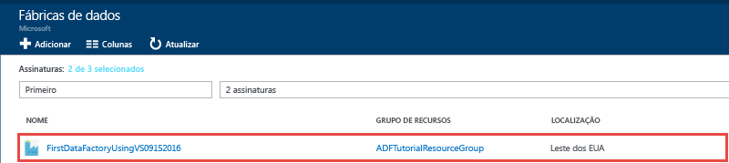
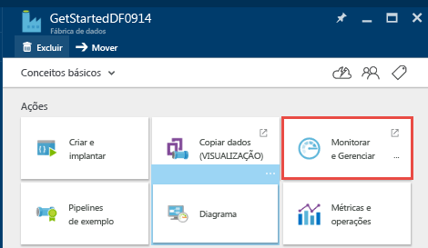
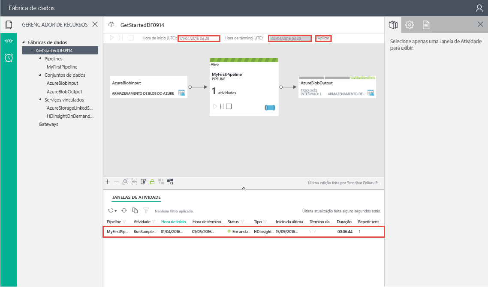
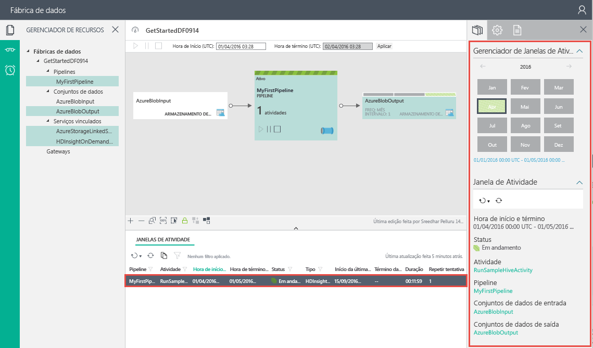

# <a name="tutorial-build-your-azure-first-data-factory-using-microsoft-visual-studio"></a>Tutorial: Compilar seu primeiro data factory do Azure usando o Microsoft Visual Studio
> [!div class="op_single_selector"]
> * [Visão geral e pré-requisitos](data-factory-build-your-first-pipeline.md)
> * [Portal do Azure](data-factory-build-your-first-pipeline-using-editor.md)
> * [Visual Studio](data-factory-build-your-first-pipeline-using-vs.md)
> * [PowerShell](data-factory-build-your-first-pipeline-using-powershell.md)
> * [Modelo do Resource Manager](data-factory-build-your-first-pipeline-using-arm.md)
> * [API REST](data-factory-build-your-first-pipeline-using-rest-api.md)
>
>

Neste artigo, você usa o Microsoft Visual Studio para criar seu primeiro data factory do Azure. Para fazer o tutorial usando outras ferramentas/SDKs, selecione uma das opções da lista suspensa.

> [!NOTE]
> O pipeline de dados neste tutorial transforma os dados de entrada para gerar dados de saída. Ele não copia dados de um armazenamento de dados de origem para um armazenamento de dados de destino. Para obter um tutorial sobre como copiar dados usando o Azure Data Factory, confira [Tutorial: copiar dados do armazenamento de blobs para um banco de dados SQL](data-factory-copy-data-from-azure-blob-storage-to-sql-database.md).
> 
> É possível encadear duas atividades (executar uma atividade após a outra) definindo o conjunto de dados de saída de uma atividade como o conjunto de dados de entrada da outra atividade. Veja [Agendamento e execução no Data Factory](data-factory-scheduling-and-execution.md) para obter informações detalhadas. 

## <a name="prerequisites"></a>Pré-requisitos
1. Leia o artigo [Visão geral do tutorial](data-factory-build-your-first-pipeline.md) e concluir as etapas de **pré-requisito** .
2. Você deve ser um **administrador da assinatura do Azure** para poder publicar entidades do Data Factory desde o Visual Studio no Azure Data Factory.
3. Você deve ter os seguintes itens instalados no seu computador:
   * Visual Studio 2013 ou Visual Studio 2015
   * Baixe o SDK do Azure para Visual Studio 2013 ou Visual Studio de 2015. Navegue até a [Página de Download do Azure](https://azure.microsoft.com/downloads/) e clique em **VS 2013** ou **VS 2015** na seção **.NET**.
   * Baixe o plug-in Azure Data Factory para o Visual Studio: [VS 2013](https://visualstudiogallery.msdn.microsoft.com/754d998c-8f92-4aa7-835b-e89c8c954aa5) ou [VS 2015](https://visualstudiogallery.msdn.microsoft.com/371a4cf9-0093-40fa-b7dd-be3c74f49005). Você também pode atualizar o plug-in, executando as seguintes etapas: no menu, clique em **Ferramentas** -> **Extensões e Atualizações** -> **Online** -> **Galeria do Visual Studio** -> **Ferramentas do Microsoft Azure Data Factory** -> **Atualizar**.

Agora, vamos usar o Visual Studio para criar um data factory do Azure.

## <a name="create-visual-studio-project"></a>Criar um projeto do Visual Studio
1. Inicie o **Visual Studio 2013** ou o **Visual Studio 2015**. Clique em **Arquivo**, aponte para **Novo** e clique em **Projeto**. Você deverá ver a caixa de diálogo **Novo Projeto** .  
2. Na caixa de diálogo **Novo Projeto**, selecione o modelo **DataFactory** e clique em **Projeto Vazio de Data Factory**.   

    
3. Insira um **nome** para o projeto, o **local**, um nome para a **solução** e clique em **OK**.

    

## <a name="create-linked-services"></a>Criar serviços vinculados
Uma fábrica de dados pode ter um ou mais pipelines. Um pipeline em um data factory pode ter uma ou mais atividades. Por exemplo, uma Atividade de Cópia para copiar dados de um armazenamento de dados de origem para um de destino e uma atividade do Hive do HDInsight para executar o script do Hive para transformar dados de entrada. Confira [repositórios de dados com suporte](data-factory-data-movement-activities.md#supported-data-stores-and-formats) para ver todas as fontes e coletores com suporte da Atividade de Cópia. Confira os [serviços vinculados de computação](data-factory-compute-linked-services.md) para ver uma lista dos serviços de computação com suporte do Data Factory.

Nesta etapa, você vinculará sua conta do Armazenamento do Azure e um cluster do HDInsight do Azure sob demanda ao data factory. A conta do Armazenamento do Azure manterá os dados de entrada e de saída para o pipeline neste exemplo. O serviço vinculado do HDInsight é usado para executar o script do Hive especificado na atividade do pipeline neste exemplo. Identifique quais serviços de armazenamento/computação de dados serão usados em seu cenário e vincular esses serviços ao data factory criando serviços vinculados.  

Você especifica o nome e as configurações do data factory posteriormente quando publicar sua solução do Data Factory.

#### <a name="create-azure-storage-linked-service"></a>Criar o serviço vinculado do armazenamento do Azure
Nesta etapa, você vincula a conta do Armazenamento do Azure ao data factory. Para este tutorial, use a mesma conta do Armazenamento do Azure para armazenar dados de entrada/saída e o arquivo do script do HQL.

1. Clique com o botão direito do mouse em **Serviços Vinculados** no Gerenciador de Soluções, aponte para **Adicionar** e clique em **Novo Item**.      
2. Na caixa de diálogo **Adicionar Novo Item**, selecione **Serviço Vinculado de Armazenamento do Azure** na lista e clique em **Adicionar**.
3. Substitua **accountname** e **accountkey** pelo nome da sua conta de armazenamento do Azure e sua chave. Para saber como conseguir sua chave de acesso de armazenamento, consulte as informações sobre como exibir, copiar e regenerar chaves de acesso de armazenamento em [Gerenciar sua conta de armazenamento](../storage/storage-create-storage-account.md#manage-your-storage-account).
    
4. Salve o arquivo **AzureStorageLinkedService1.json** .

#### <a name="create-azure-hdinsight-linked-service"></a>Criar o serviço vinculado do Azure HDInsight
Nesta etapa, você vincula um cluster do HDInsight sob demanda ao seu data factory. O cluster do HDInsight é automaticamente criado no tempo de execução e excluído após a conclusão do processamento, ficando ocioso durante o período especificado. Você pode usar seu próprio cluster do HDInsight em vez de usar um cluster do HDInsight sob demanda. Veja [Serviços vinculados de computação](data-factory-compute-linked-services.md) para obter detalhes.

1. No **Gerenciador de Soluções**, clique com botão direito em **Serviços Vinculados**, aponte para **Adicionar** e clique em **Novo Item**.
2. Selecione **erviço Vinculado Sob Demanda do HDInsight** e clique em **Adicionar**.
3. Substitua o **JSON** pelo seguinte JSON:

    ```JSON
    {
      "name": "HDInsightOnDemandLinkedService",
      "properties": {
        "type": "HDInsightOnDemand",
        "typeProperties": {
          "version": "3.2",
          "clusterSize": 1,
          "timeToLive": "00:30:00",
          "linkedServiceName": "AzureStorageLinkedService1"
        }
      }
    }
    ```

    A tabela a seguir fornece descrições das propriedades de JSON usadas no trecho de código:

   | Propriedade | Descrição |
   | -------- | ----------- |
   | Versão | Especifica a versão do HDInsight criada como a 3.2. |
   | ClusterSize |Especifica o tamanho do cluster HDInsight. |
   | TimeToLive |Especifica que o tempo ocioso do cluster HDInsight antes de ser excluído. |
   | linkedServiceName |Especifica a conta de armazenamento usada para armazenar os logs gerados pelo HDInsight |

    Observe os seguintes pontos:

   * O Data Factory cria um cluster HDInsight **baseado no Windows** para você com o JSON anteriores. Você também pode fazer com que ele crie um cluster HDInsight **baseado em Linux** . Confira [Serviço vinculado do HDInsight sob demanda](data-factory-compute-linked-services.md#azure-hdinsight-on-demand-linked-service) para obter detalhes.
   * Você pode usar **seu próprio cluster do HDInsight** em vez de usar um cluster do HDInsight sob demanda. Confira [Serviço vinculado do HDInsight](data-factory-compute-linked-services.md#azure-hdinsight-linked-service) para obter detalhes.
   * O cluster HDInsight cria um **contêiner padrão** no armazenamento de blobs especificado no JSON (**nomeServiçoVinculado**). O HDInsight não exclui esse contêiner quando o cluster é excluído. Este comportamento ocorre por design. Com o serviço vinculado HDInsight sob demanda, um cluster HDInsight é criado sempre que uma fatia é processada, a menos que haja um cluster ativo existente (**timeToLive**). O cluster será excluído automaticamente quando o processamento for concluído.

       Quanto mais fatias forem processadas, você verá muitos contêineres no armazenamento de blobs do Azure. Se você não precisa deles para solução de problemas dos trabalhos, convém excluí-los para reduzir o custo de armazenamento. Os nomes desses contêineres seguem um padrão: `adf**yourdatafactoryname**-**linkedservicename**-datetimestamp`. Use ferramentas como o [Gerenciador de Armazenamento da Microsoft](http://storageexplorer.com/) para excluir contêineres do armazenamento de blobs do Azure.

     Confira [Serviço vinculado do HDInsight sob demanda](data-factory-compute-linked-services.md#azure-hdinsight-on-demand-linked-service) para obter detalhes.
4. Salve o arquivo **HDInsightOnDemandLinkedService1.json** .

## <a name="create-datasets"></a>Criar conjuntos de dados
Nesta etapa, você cria conjuntos de dados para representar dados de entrada e de saída para o processamento do Hive. Esses conjuntos de dados fazem referência ao **StorageLinkedService1** que você criou anteriormente neste tutorial. O serviço vinculado aponta para uma conta do Armazenamento do Azure e os conjuntos de dados especificam o contêiner, a pasta e o nome do arquivo no armazenamento que contém os dados de entrada e de saída.   

#### <a name="create-input-dataset"></a>Criar conjunto de dados de entrada
1. No **Gerenciador de Soluções**, clique com botão direito em **Tabelas**, aponte para **Adicionar**e clique em **Novo Item**.
2. Selecione o **Blob do Azure** na lista, altere o nome do arquivo para **InputDataSet.json** e clique em **Adicionar**.
3. Substitua o **JSON** no editor pelo seguinte trecho de código JSON:

    No trecho JSON, você está criando um conjunto de dados chamado **AzureBlobInput** que representa dados de entrada para uma atividade no pipeline. Além disso, você especifica que os dados de entrada estão localizados no contêiner de blobs denominado `adfgetstarted` e a pasta denominada `inputdata`.

    ```JSON
    {
        "name": "AzureBlobInput",
        "properties": {
            "type": "AzureBlob",
            "linkedServiceName": "AzureStorageLinkedService1",
            "typeProperties": {
                "fileName": "input.log",
                "folderPath": "adfgetstarted/inputdata",
                "format": {
                    "type": "TextFormat",
                    "columnDelimiter": ","
                }
            },
            "availability": {
                "frequency": "Month",
                "interval": 1
            },
            "external": true,
            "policy": {}
        }
    }
    ```
    A tabela a seguir fornece descrições das propriedades de JSON usadas no trecho de código:

   | Propriedade | Descrição |
   | -------- | ----------- |
   | type |A propriedade type é definida como AzureBlob porque os dados residem no armazenamento de blobs do Azure. |
   | linkedServiceName |refere-se ao AzureStorageLinkedService1 que você criou anteriormente. |
   | fileName |Essa propriedade é opcional. Se você omitir essa propriedade, todos os arquivos de folderPath serão selecionados. Nesse caso, somente o input.log será processado. |
   | type |Os arquivos de log estão em formato de texto, então utilizaremos TextFormat. |
   | columnDelimiter |as colunas nos arquivos de log são delimitadas pelo caractere de vírgula (,) |
   | frequência/intervalo |a frequência é definida como Mês e o intervalo como 1, o que significa que as fatias de entrada estão disponíveis mensalmente. |
   | externo |essa propriedade será definida como true se os dados de entrada não forem gerados pelo serviço Data Factory. |
4. Salve o arquivo **InputDataset.json** .

#### <a name="create-output-dataset"></a>Criar conjunto de dados de saída
Agora, você cria o conjunto de dados de saída para representar os dados de saída armazenados no armazenamento de Blobs do Azure.

1. No **Gerenciador de Soluções**, clique com botão direito em **Tabelas**, aponte para **Adicionar**e clique em **Novo Item**.
2. Selecione **Blob do Azure** na lista, altere o nome do arquivo para **OutputDataset.json** e clique em **Adicionar**.
3. Substitua o **JSON** no editor pelo seguinte JSON:

    No trecho JSON, você está criando um conjunto de dados chamado **AzureBlobOutput**e especificando a estrutura dos dados produzidos pelo script do Hive. Além disso, você especifica que os resultados estão armazenados no contêiner de blobs denominado `adfgetstarted` e na pasta denominada `partitioneddata`. A seção **availability** especifica que o conjunto de dados de saída é produzido mensalmente.

    ```JSON
    {
      "name": "AzureBlobOutput",
      "properties": {
        "type": "AzureBlob",
        "linkedServiceName": "AzureStorageLinkedService1",
        "typeProperties": {
          "folderPath": "adfgetstarted/partitioneddata",
          "format": {
            "type": "TextFormat",
            "columnDelimiter": ","
          }
        },
        "availability": {
          "frequency": "Month",
          "interval": 1
        }
      }
    }
    ```

    Consulte a seção **Criar o conjunto de dados de entrada** para obter descrições dessas propriedades. Você não define a propriedade externa em um conjunto de dados de saída porque o conjunto de dados é produzido pelo serviço Data Factory.
4. Salve o arquivo **OutputDataset.json** .

### <a name="create-pipeline"></a>Criar um pipeline
Nesta etapa, você cria seu primeiro pipeline com a atividade **HDInsightHive** . A fatia de entrada está disponível mensalmente (frequência: mês, intervalo: 1), a fatia de saída é produzida mensalmente e a propriedade do agendador para a atividade também é definida como mensal. As configurações para o conjunto de dados de saída e o agendador de atividades devem corresponder. Atualmente, o conjunto de dados de saída é o que aciona a agenda, então você deve criar um conjunto de dados de saída, mesmo que a atividade não produza qualquer saída. Se a atividade não receber entradas, ignore a criação de conjunto de dados de entrada. As propriedades usadas no JSON a seguir são explicadas no final desta seção.

1. No **Gerenciador de Soluções**, clique com botão direito em **Pipelines**, aponte para **Adicionar** e clique em **Novo Item.**
2. Selecione **Pipeline de Transformação do Hive** na lista e clique em **Adicionar**.
3. Substitua o **JSON** pelo trecho a seguir.

   > [!IMPORTANT]
   > Substitua **storageaccountname** pelo nome da sua conta de armazenamento.
   >
   >

    ```JSON
    {
        "name": "MyFirstPipeline",
        "properties": {
            "description": "My first Azure Data Factory pipeline",
            "activities": [
                {
                    "type": "HDInsightHive",
                    "typeProperties": {
                        "scriptPath": "adfgetstarted/script/partitionweblogs.hql",
                        "scriptLinkedService": "AzureStorageLinkedService1",
                        "defines": {
                            "inputtable": "wasb://adfgetstarted@<storageaccountname>.blob.core.windows.net/inputdata",
                            "partitionedtable": "wasb://adfgetstarted@<storageaccountname>.blob.core.windows.net/partitioneddata"
                        }
                    },
                    "inputs": [
                        {
                            "name": "AzureBlobInput"
                        }
                    ],
                    "outputs": [
                        {
                            "name": "AzureBlobOutput"
                        }
                    ],
                    "policy": {
                        "concurrency": 1,
                        "retry": 3
                    },
                    "scheduler": {
                        "frequency": "Month",
                        "interval": 1
                    },
                    "name": "RunSampleHiveActivity",
                    "linkedServiceName": "HDInsightOnDemandLinkedService"
                }
            ],
            "start": "2016-04-01T00:00:00Z",
            "end": "2016-04-02T00:00:00Z",
            "isPaused": false
        }
    }
    ```
     No trecho de JSON, você cria um pipeline que consiste de uma única atividade que usa o Hive para processar dados em um cluster HDInsight.

    O arquivo de script do Hive, **partitionweblogs.hql**, é armazenado na conta de armazenamento do Azure (especificada pelo scriptLinkedService, denominado **AzureStorageLinkedService1**) e na pasta `script` no contêiner `adfgetstarted`.

    A seção **defines** é usada para especificar as configurações de tempo de execução passadas para o script do hive como valores de configuração do Hive (por exemplo, ${hiveconf:inputtable}, ${hiveconf:partitionedtable}).

    As propriedades **start** e **end** do pipeline especificam o período ativo do pipeline.

    Na atividade do JSON, você especifica que o script do Hive é executado na máquina especificada pelo **nomeServiçoVinculado** – **HDInsightOnDemandLinkedService**.

   > [!NOTE]
   > Consulte "Pipeline JSON" [Pipelines e atividades no Azure Data Factory](data-factory-create-pipelines.md) para obter detalhes sobre as propriedades JSON usadas no exemplo.

4. Salve o arquivo **HiveActivity1.json** .

### <a name="add-partitionweblogshql-and-inputlog-as-a-dependency"></a>Adicionar partitionweblogs.hql e input.log como uma dependência
1. Clique com botão direito em **Dependências** na janela do **Gerenciador de Soluções**, aponte para **Adicionar**e clique em **Item Existente**.  
2. Navegue até **C:\ADFGettingStarted** e selecione os arquivos **partitionweblogs.hql** e **input.log**, e clique em **Adicionar**. Você criou esses dois arquivos como parte dos pré-requisitos da [Visão Geral do Tutorial](data-factory-build-your-first-pipeline.md).

Quando você publicar a solução na próxima etapa, o arquivo **partitionweblogs.hql** será carregado para a pasta de scripts no contêiner de blobs `adfgetstarted`.   

### <a name="publishdeploy-data-factory-entities"></a>Publicar/implantar entidades de data factory
1. No Gerenciador de Soluções, clique com o botão direito do mouse no projeto e clique em **Publicar**.
2. Se a caixa de diálogo **Entrar na sua conta da Microsoft** for exibida, insira as credenciais da conta com a assinatura do Azure e clique em **entrar**.
3. Você deve ver a caixa de diálogo a seguir:

   
4. Na página **Configurar data factory**, execute as seguintes etapas:

   1. Selecione a opção **Criar Nova Data Factory** .
   2. Insira um **nome** exclusivo para o armazenamento de dados. Por exemplo: **FirstDataFactoryUsingVS09152016**. O nome deve ser globalmente exclusivo.
   3. Selecione a assinatura certa para o campo **Assinatura** . Se você não vir nenhuma assinatura, verifique se está conectado usando uma conta que seja administrador ou coadministrador da assinatura.
   4. Selecione o **grupo de recursos** para o data factory a ser criado.
   5. Selecione a **região** do data factory.
   6. Clique em **Avançar** para alternar para a página **Publicar Itens**. (Pressione **TAB** para sair do campo Nome se o botão **Avançar** estiver desabilitado).

        > [!IMPORTANT]
        > Se você receber o erro **O nome da fábrica de dados "FirstDataFactoryUsingVS" não está disponível** durante a publicação, altere o nome (por exemplo, seunomeFirstDataFactoryUsingVS). Consulte o tópico [Data Factory - regras de nomenclatura](data-factory-naming-rules.md) para ver as regras de nomenclatura para artefatos de Data Factory.   
1. Na página **Publicar Itens**, verifique se todas as entidades de Data Factories estão selecionadas e clique em **Avançar** para alternar para a página **Resumo**.     
2. Examine o resumo e clique em **Avançar** para iniciar o processo de implantação e exibir o **Status da Implantação**.
3. Na página **Status da Implantação** , você deve ver o status do processo de implantação. Clique em Concluir depois que a implantação tiver terminado.

Pontos importantes a serem considerados:

- Se você receber o erro: "**Esta assinatura não está registrada para usar o namespace Microsoft.DataFactory**", siga um destes procedimentos e tente publicar novamente:
    - No Azure PowerShell, execute o comando a seguir para registrar o provedor do Data Factory.
        ```PowerShell    
        Register-AzureRmResourceProvider -ProviderNamespace Microsoft.DataFactory
        ```
        Você pode executar o comando a seguir para confirmar se o provedor do Data Factory está registrado.

        ```PowerShell
        Get-AzureRmResourceProvider
        ```
    - Faça logon no [portal do Azure](https://portal.azure.com) usando a assinatura do Azure e navegue até uma folha do Data Factory (ou) crie um data factory no portal do Azure. Essa ação registra automaticamente o provedor para você.
- O nome do data factory pode ser registrado futuramente como um nome DNS e tornar-se publicamente visível.
- Para criar instâncias do Data Factory, você precisa ser administrador ou coadministrador da assinatura do Azure

## <a name="monitor-pipeline"></a>Monitorar o pipeline
### <a name="monitor-pipeline-using-diagram-view"></a>Monitorar o pipeline usando a Exibição de Diagrama
1. Faça logon no [portal do Azure](https://portal.azure.com/), siga as etapas abaixo:
   1. Clique em **Mais serviços** e **Data factories**.
       
        
   2. Selecione o nome do seu data factory (por exemplo: **FirstDataFactoryUsingVS09152016**) da lista de data factories.
   
       
2. Na home page do seu data factory, clique em **Diagrama**.

    
3. Na Exibição de Diagrama, você tem uma visão geral dos pipelines e dos conjuntos de dados usados neste tutorial.

    
4. Para exibir todas as atividades no pipeline, clique com o botão direito do mouse no pipeline no diagrama e clique em Abrir Pipeline.

    
5. Confirme que você vê a atividade HDInsightHive no pipeline.

    

    Para navegar de volta ao modo de exibição anterior, clique em **Data factory** no menu de atalho na parte superior.
6. Na **Exibição do Diagrama**, clique duas vezes no conjunto de dados **AzureBlobInput**. Confirme se a fatia está no estado **Pronto** . Pode levar alguns minutos para que a fatia apareça no estado Pronto. Se isso não acontecer depois de algum tempo, veja se o arquivo de entrada (input.log) está posicionado no contêiner à direita (`adfgetstarted`) e na pasta (`inputdata`).

   
7. Clique em **X** para fechar a folha **AzureBlobInput**.
8. Na **Exibição do Diagrama**, clique duas vezes no conjunto de dados **AzureBlobOutput**. Você verá a fatia que está sendo processada.

   
9. Quando o processamento for concluído, você verá a fatia no estado **Pronto** .

   > [!IMPORTANT]
   > A criação de um cluster do HDInsight sob demanda geralmente leva algum tempo (20 minutos, aproximadamente). Portanto, espere que o pipeline demore **cerca de 30 minutos** para processar a fatia.  
   >
   >

        
10. Quando a fatia estiver no estado **Pronto**, verifique a pasta `partitioneddata` no contêiner `adfgetstarted` em seu armazenamento de blobs para os dados de saída.  

    
11. Clique na fatia para ver detalhes sobre ela em uma folha **Fatia de dados** .

      
12. Clique em uma execução da atividade na **Lista de execuções da atividade** para ver detalhes sobre uma execução da atividade (atividade de Hive em nosso cenário) em uma janela **Detalhes de execução da atividade**. 
  
        

    Nos arquivos de log, você pode ver a consulta do Hive executada e as informações de status. Esses logs são úteis para solucionar problemas.  

Confira [Monitorar os conjuntos de dados e o pipeline](data-factory-monitor-manage-pipelines.md) para obter instruções sobre como usar o Portal do Azure para monitorar o pipeline e os conjuntos de dados que você criou neste tutorial.

### <a name="monitor-pipeline-using-monitor--manage-app"></a>Monitorar o pipeline usando o aplicativo Monitorar e Gerenciar
Você também pode usar o aplicativo Monitorar e Gerenciar para monitorar os pipelines. Para obter informações detalhadas sobre como usar esse aplicativo, veja [Monitorar e gerenciar confira do Azure Data Factory usando o aplicativo Monitorar e Gerenciar](data-factory-monitor-manage-app.md).

1. Clique no bloco Monitorar e Gerenciar.

    
2. Você deve ver o aplicativo Monitorar e Gerenciar. Altere a **Hora de início** e a **Hora de término** para coincidir com o início (04-01-2016 12:00 AM) e o término (04-02-2016 12:00 AM) do seu pipeline, e clique **Aplicar**.

    
3. Selecione uma janela de atividade na lista de Janelas de Atividade para ver detalhes sobre ela.
    

> [!IMPORTANT]
> O arquivo de entrada é excluído quando a fatia é processada com êxito. Portanto, se você quiser executar novamente a fatia ou fazer o tutorial novamente, carregue o arquivo de entrada (input.log) na pasta `inputdata` do contêiner `adfgetstarted`.
>
>

## <a name="use-server-explorer-to-view-data-factories"></a>Usar o Gerenciador de Servidores para exibir os data factories
1. No **Visual Studio**, clique em **Exibir** no menu e em **Gerenciador de Servidores**.
2. Na janela Gerenciador de Servidores, expanda **Azure** e expanda **Data Factory**. Se **Entrar no Visual Studio** for exibido, insira a **conta** associada à sua assinatura do Azure e clique em **Continuar**. Insira a **senha** e clique em **Entrar**. O Visual Studio tenta obter informações sobre todos os data factories do Azure em sua assinatura. Você verá o status da operação na janela **Lista de Tarefas de Data Factory** .

    
3. Clique com o botão direito em um data factory e selecione **Exportar Fábrica de Dados para Novo Projeto** para criar um projeto do Visual Studio com base em um data factory existente.

    

## <a name="update-data-factory-tools-for-visual-studio"></a>Atualizar ferramentas de data factory para o Visual Studio
Para atualizar as ferramentas da Azure Data Factory para o Visual Studio, execute as seguintes etapas:

1. Clique em **Ferramentas** no menu e selecione **Extensões e Atualizações**.
2. Selecione **Atualizações** no painel esquerdo e selecione **Galeria do Visual Studio**.
3. Selecione **Ferramentas do Azure Data Factory para Visual Studio** e clique em **Atualizar**. Se você não vir essa entrada, você já tem a versão mais recente das ferramentas.

## <a name="use-configuration-files"></a>Usar arquivos de configuração
Você pode usar arquivos de configuração no Visual Studio para configurar propriedades de serviços/tabelas/pipelines vinculados de forma diferente para cada ambiente.

Considere a definição de JSON a seguir para um serviço de Armazenamento do Azure vinculado. Para especificar a **connectionString** com valores diferentes para accountname e accountkey com base no ambiente (Desenvolvimento/Teste/Produção) no qual você está implantando entidades do Data Factory. Você pode obter esse comportamento usando um arquivo de configuração separado para cada ambiente.

```JSON
{
    "name": "StorageLinkedService",
    "properties": {
        "type": "AzureStorage",
        "description": "",
        "typeProperties": {
            "connectionString": "DefaultEndpointsProtocol=https;AccountName=<accountname>;AccountKey=<accountkey>"
        }
    }
}
```

### <a name="add-a-configuration-file"></a>Adicionar um arquivo de configuração
Adicione um arquivo de configuração para cada ambiente executando as seguintes etapas:   

1. Clique com botão direito no projeto do Data Factory em sua solução do Visual Studio, aponte para **Adicionar** e clique em **Novo Item**.
2. Selecione **Config** na lista de modelos instalados no lado esquerdo, selecione **Arquivo de Configuração**, insira um **nome** para o arquivo de configuração e clique em **Adicionar**.

    
3. Adicione parâmetros de configuração e seus valores no formato a seguir.

    ```JSON
    {
        "$schema": "http://datafactories.schema.management.azure.com/vsschemas/V1/Microsoft.DataFactory.Config.json",
        "AzureStorageLinkedService1": [
            {
                "name": "$.properties.typeProperties.connectionString",
                "value": "DefaultEndpointsProtocol=https;AccountName=<accountname>;AccountKey=<accountkey>"
            }
        ],
        "AzureSqlLinkedService1": [
            {
                "name": "$.properties.typeProperties.connectionString",
                "value":  "Server=tcp:spsqlserver.database.windows.net,1433;Database=spsqldb;User ID=spelluru;Password=Sowmya123;Trusted_Connection=False;Encrypt=True;Connection Timeout=30"
            }
        ]
    }
    ```

    Este exemplo configura a propriedade connectionString de um serviço de Armazenamento do Azure vinculado e um serviço vinculado do Azure SQL. Observe que a sintaxe para especificar o nome é [JsonPath](http://goessner.net/articles/JsonPath/).   

    Se o JSON tiver uma propriedade que tenha uma matriz de valores como mostrado no código a seguir:  

    ```JSON
    "structure": [
          {
              "name": "FirstName",
            "type": "String"
          },
          {
            "name": "LastName",
            "type": "String"
        }
    ],
    ```

    Configure as propriedades como mostrado no seguinte arquivo de configuração (use a indexação baseada zero):

    ```JSON
    {
        "name": "$.properties.structure[0].name",
        "value": "FirstName"
    }
    {
        "name": "$.properties.structure[0].type",
        "value": "String"
    }
    {
        "name": "$.properties.structure[1].name",
        "value": "LastName"
    }
    {
        "name": "$.properties.structure[1].type",
        "value": "String"
    }
    ```

### <a name="property-names-with-spaces"></a>Nomes de propriedade com espaços
Se um nome de propriedade tiver espaços, use os colchetes como mostrado no exemplo a seguir (nome do servidor de banco de dados):

```JSON
 {
     "name": "$.properties.activities[1].typeProperties.webServiceParameters.['Database server name']",
     "value": "MyAsqlServer.database.windows.net"
 }
```

### <a name="deploy-solution-using-a-configuration"></a>Implantar a solução usando uma configuração
Ao publicar entidades do Azure Data Factory no VS, você pode especificar a configuração que deseja usar para essa operação de publicação.

Para publicar as entidades em um projeto do Azure Data Factory usando o arquivo de configuração:   

1. Clique com o botão direito no projeto do Data Factory e clique em **Publicar** para ver a caixa de diálogo **Publicar Itens**.
2. Selecione um data factory existente ou especifique valores para a criação de um na página **Configurar data factory**, em seguida, clique em **Avançar**.   
3. Na página **Publicar Itens**: você vê uma lista suspensa com as configurações disponíveis para o campo **Selecionar Configuração de Implantação**.

    
4. Selecione o **arquivo de configuração** que você deseja usar e clique em **Avançar**.
5. Confirme se você vê o nome do arquivo JSON na página **Resumo** e clique em **Avançar**.
6. Clique em **Concluir** depois que a operação de implantação for concluída.

Quando você implantar, os valores do arquivo de configuração serão usados para definir valores de propriedades nos arquivos JSON para entidades de Data Factory antes que as entidades sejam implantadas no serviço Azure Data Factory.   

## <a name="use-azure-key-vault"></a>Usar o Cofre de Chaves do Azure
Não é aconselhável e costuma ser contra a política de segurança confirmar dados confidenciais, como cadeias de conexão, para o repositório de código. Confira o exemplo [Secure Publish de ADF](https://github.com/Azure/Azure-DataFactory/tree/master/Samples/ADFSecurePublish) no GitHub para saber mais sobre como armazenar informações confidenciais no Azure Key Vault e usá-lo durante a publicação de entidades do Data Factory. A extensão Secure Publish para Visual Studio permite que os segredos sejam armazenados no Key Vault e apenas referências a eles sejam especificadas em serviços vinculados/configurações de implantação. Essas referências são resolvidas quando você publica as entidades do Data Factory do Azure. Em seguida, esses arquivos podem ser confirmados para o repositório de origem sem expor nenhum segredo.

## <a name="summary"></a>Resumo
Neste tutorial, você criou uma data factory do Azure para processar dados ao executar o script Hive em um cluster hadoop do HDInsight. Você usou o Data Factory Editor no portal do Azure para executar as seguintes etapas:  

1. Foi criada uma **data factory**do Azure.
2. Foram criados dois **serviços vinculados**:
   1. **Armazenamento do Azure** para vincular seu armazenamento de blobs do Azure que contém os arquivos de entrada/saída para a data factory.
   2. **Azure HDInsight** sob demanda para vincular um cluster Hadoop do HDInsight sob demanda à data factory. O Azure Data Factory cria um cluster Hadoop do HDInsight just-in-time para processar dados de entrada e gerar dados de saída.
3. Foram criados dois **conjuntos de dados**que descrevem dados de entrada e de saída para a atividade Hive do HDInsight no pipeline.
4. Foi criado um **pipeline** com uma atividade **Hive do HDInsight**.  

## <a name="next-steps"></a>Próximas etapas
Neste artigo, você criou um pipeline com uma atividade de transformação (atividade do HDInsight) que executa um script Hive em um cluster do HDInsight sob demanda. Para saber como usar uma Atividade de Cópia para copiar dados de um Blob do Azure para o SQL do Azure, confira [Tutorial: Copiar dados de um blob do Azure para o SQL do Azure](data-factory-copy-data-from-azure-blob-storage-to-sql-database.md).

## <a name="see-also"></a>Consulte também
| Tópico | Descrição |
|:--- |:--- |
| [Pipelines](data-factory-create-pipelines.md) |Este artigo o ajuda a compreender pipelines e atividades no Azure Data Factory e como usá-los para construir fluxos de trabalho orientados a dados de ponta a ponta para seu cenário ou negócio. |
| [Conjunto de dados](data-factory-create-datasets.md) |Este artigo o ajuda a entender os conjuntos de dados no Azure Data Factory. |
| [Atividades de transformação de dados](data-factory-data-transformation-activities.md) |Este artigo fornece uma lista de atividades de transformação de dados (como a transformação do Hive do HDInsight usado neste tutorial) com suporte do Azure Data Factory. |
| [Agendamento e execução](data-factory-scheduling-and-execution.md) |Este artigo explica os aspectos de agendamento e execução do modelo de aplicativo do Azure Data Factory. |
| [Monitorar e gerenciar pipelines usando o Aplicativo de Monitoramento](data-factory-monitor-manage-app.md) |Este artigo descreve como monitorar, gerenciar e depurar seus pipelines usando o Aplicativo de Monitoramento e Gerenciamento. |

