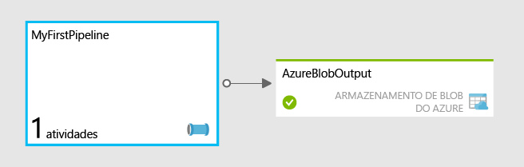

<properties
	pageTitle="Crie seu primeiro pipeline usando o Azure Data Factory"
	description="Este tutorial mostra como criar um pipeline de dados de exemplo que transforma os dados usando o Azure HDInsight."
	services="data-factory"
	documentationCenter=""
	authors="spelluru"
	manager="jhubbard"
	editor="monicar"/>

<tags
	ms.service="data-factory"
	ms.workload="data-services"
	ms.tgt_pltfrm="na"
	ms.devlang="na"
	ms.topic="get-started-article"
	ms.date="07/27/2015"
	ms.author="spelluru"/>

# Crie seu primeiro pipeline usando o Azure Data Factory
> [AZURE.SELECTOR]
- [Tutorial Overview](data-factory-build-your-first-pipeline.md)
- [Using Data Factory Editor](data-factory-build-your-first-pipeline-using-editor.md)
- [Using PowerShell](data-factory-build-your-first-pipeline-using-powershell.md)
- [Using Visual Studio](data-factory-build-your-first-pipeline-using-vs.md)

Este artigo o ajudará a começar a criar seu primeiro pipeline e implantá-lo no Azure Data Factory.

> [AZURE.NOTE]Este artigo não fornece uma visão geral conceitual do serviço Azure Data Factory. Para obter uma visão geral detalhada do serviço, consulte o artigo [Introdução ao Azure Data Factory](data-factory-introduction.md).

## Visão geral do tutorial
Este tutorial apresenta as etapas necessárias para fazer com que seu pipeline funcione. Você vai criar pipelines e especificar todos os recursos necessários do zero.

Se você quiser explorar os vários recursos da fábrica de dados rapidamente, sem criar uma nova, você pode usar os exemplos que fornecemos no Portal de visualização do Azure. Consulte [Atualização do Azure Data Factory: implantação simplificada de amostra](http://azure.microsoft.com/blog/2015/04/24/azure-data-factory-update-simplified-sample-deployment/) para ver como implantar um exemplo baseado em caso de uso usando o Portal de visualização do Azure.

## Pré-requisitos
Antes de começar este tutorial, você deve cumprir com os seguintes pré-requisitos:

1.	**Uma assinatura do Azure** - Se você não tiver uma, poderá criar uma conta de avaliação gratuita em apenas alguns minutos. Consulte o artigo [Avaliação gratuita](http://azure.microsoft.com/pricing/free-trial/) para ver como você pode obter uma conta de avaliação gratuita.

2.	**Armazenamento do Azure** – Você usará uma conta de armazenamento do Azure para armazenar os dados neste tutorial. Se você não tiver uma conta de armazenamento do Azure, consulte o artigo [Criar uma conta de armazenamento](../storage-create-storage-account/#create-a-storage-account). Depois de criar a conta de armazenamento, você precisará obter a chave de conta usada para acessar o armazenamento. Consulte [Exibir, copiar e regenerar chaves de acesso de armazenamento](../storage-create-storage-account/#view-copy-and-regenerate-storage-access-keys).

## O que é abordado neste tutorial?	
O Azure Data Factory permite compor tarefas de processamento de dados e movimentação de dados como um fluxo de trabalho de orientado a dados. Você aprenderá a criar seu primeiro pipeline que usa HDInsight para transformar e analisar logs da web mensalmente.

Neste tutorial, você executará as seguintes etapas:

1.	Criar uma fábrica de dados.
2.	Crie os seguintes serviços vinculados:
	1.	**Conta de armazenamento do azure**– Será usada para armazenar arquivos usados pelo cluster HDInsight sob demanda.
	2.	**Cluster HDInsight sob demanda**– Será iniciado sob demanda para transformar e analisar os dados.
3.	Criar o conjunto de dados de saída 
4.	Crie o pipeline executa um script do Hive e armazena o resultado no conjunto de dados de saída. O script do Hive primeiro cria uma tabela externa, fazendo referência aos dados de log brutos da web armazenados no armazenamento de blobs do Azure. A próxima etapa no script de Hive, em seguida, particiona os dados brutos por ano e mês.

Seu primeiro pipeline, chamado **MyFirstPipeline** usa uma atividade de Hive para transformar e analisar logs da web que são implantados como parte do cluster do HDInsight e armazenados em **/HdiSamples/WebsiteLogSampleData/SampleLog/**.

Depois que o script do Hive é executado, os resultados serão armazenados em um contêiner de armazenamento de blob: **data/partitioneddata**.

A disponibilidade definida no conjunto de dados **AzureBlobOutput** determina a frequência com que a atividade de Hive é executada. Neste tutorial, isso é definido como mensal.

## Preparar o armazenamento do Azure para o tutorial
Antes de iniciar o tutorial, você precisa preparar o armazenamento do Azure com arquivos necessários para o tutorial.

1. Inicie o bloco de notas, cole o texto a seguir e salve-o como **partitionweblogs.hql** na pasta C:\\adfgettingstarted no disco rígido. Esse script de Hive cria duas tabelas externas: **WebLogsRaw** e **WebLogsPartitioned**.

	> [AZURE.IMPORTANT]Substitua **storageaccountname** na última linha com o nome da sua conta de armazenamento.

		set hive.exec.dynamic.partition.mode=nonstrict;

		DROP TABLE IF EXISTS WebLogsRaw; 
		CREATE EXTERNAL TABLE WebLogsRaw (
		  date  date,
		  time  string,
		  ssitename string,
		  csmethod  string,
		  csuristem  string,
		  csuriquery string,
		  sport int,
		  susername string,
		  cipcsUserAgent string,
		  csCookie string,
		  csReferer string,
		  cshost  string,
		  scstatus  int,
		  scsubstatus  int,
		  scwin32status  int,
		  scbytes int,
		  csbytes int,
		  timetaken int
		)
		ROW FORMAT DELIMITED FIELDS TERMINATED BY ' '
		LINES TERMINATED BY '\n' 
		LOCATION '/HdiSamples/WebsiteLogSampleData/SampleLog/'
		tblproperties ("skip.header.line.count"="2");
		
		DROP TABLE IF EXISTS WebLogsPartitioned ; 
		create external table WebLogsPartitioned (  
		  date  date,
		  time  string,
		  ssitename string,
		  csmethod  string,
		  csuristem  string,
		  csuriquery string,
		  sport int,
		  susername string,
		  cipcsUserAgent string,
		  csCookie string,
		  csReferer string,
		  cshost  string,
		  scstatus  int,
		  scsubstatus  int,
		  scwin32status  int,
		  scbytes int,
		  csbytes int,
		  timetaken int
		)
		partitioned by ( year int, month int)
		ROW FORMAT DELIMITED FIELDS TERMINATED BY ',' 
		STORED AS TEXTFILE 
		LOCATION '${hiveconf:partitionedtable}';

		INSERT INTO TABLE WebLogsPartitioned  PARTITION( year , month) 
		SELECT
		  date,
		  time,
		  ssitename,
		  csmethod,
		  csuristem,
		  csuriquery,
		  sport,
		  susername,
		  cipcsUserAgent,
		  csCookie,
		  csReferer,
		  cshost,
		  scstatus,
		  scsubstatus,
		  scwin32status,
		  scbytes,
		  csbytes,
		  timetaken,
		  year(date),
		  month(date)
		FROM WebLogsRaw

	 
 
2. Como preparar o armazenamento do Azure para o tutorial:
	1. Baixe a [versão mais recente do **AzCopy**](http://aka.ms/downloadazcopy) ou a [última versão de visualização](http://aka.ms/downloadazcopypr). Consulte o artigo [Como usar o AzCopy](../storage/storage-use-azcopy.md) para obter instruções sobre o uso do utilitário.
	2. Após a instalação do AzCopy, você pode adicioná-lo ao caminho do sistema, executando o seguinte comando no prompt de comando. 
	
			set path=%path%;C:\Program Files (x86)\Microsoft SDKs\Azure\AzCopy
	

	3. Navegue até a pasta c:\\adfgettingstarted e execute o seguinte comando para carregar o arquivo .HQL do Hive na conta de armazenamento. Substitua **< StorageAccountName >** pelo nome da sua conta de armazenamento, e **<Storage Key>** pela chave de conta de armazenamento.

			AzCopy /Source:. /Dest:https://<StorageAccountName>.blob.core.windows.net/script /DestKey:<Storage Key>
	4. Depois que o arquivo for carregado com êxito, você verá a seguinte saída de AzCopy.
	
			Finished 1 of total 1 file(s).
			[2015/06/15 15:47:13] Transfer summary:
			-----------------
			Total files transferred: 1
			Transfer successfully:   1
			Transfer skipped:        0
			Transfer failed:         0
			Elapsed time:            00.00:00:01

Faça o seguinte:

- Clique no link [Usando o Editor Data Factory](data-factory-build-your-first-pipeline-using-editor.md) na parte superior para executar o tutorial usando o Editor Data Factory, que faz parte do Portal do Azure.
- Clique no link [Usando o PowerShell](data-factory-build-your-first-pipeline-using-powershell.md) na parte superior para executar o tutorial usando o PowerShell do Azure.
- Clique no link [Usando o Visual Studio](data-factory-build-your-first-pipeline-using-vs.md) na parte superior para executar o tutorial usando o Visual Studio. 

## Enviar comentários
Apreciamos muito seus comentários sobre este artigo. Reserve alguns minutos para enviar seus comentários por meio de [email](mailto:adfdocfeedback@microsoft.com?subject=data-factory-build-your-first-pipeline.md).

<!---HONumber=September15_HO1-->