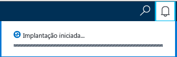
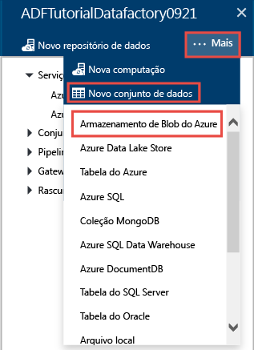
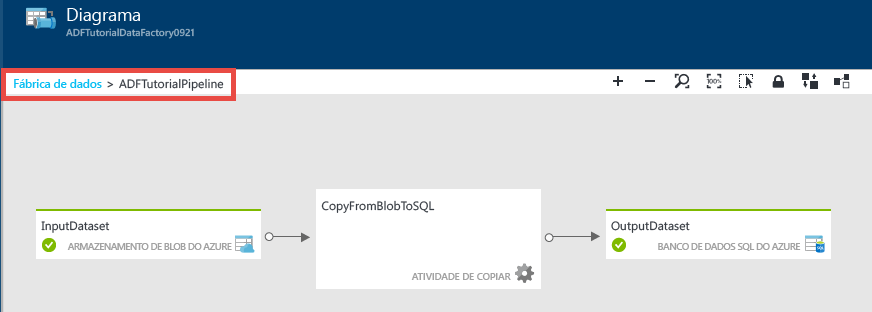
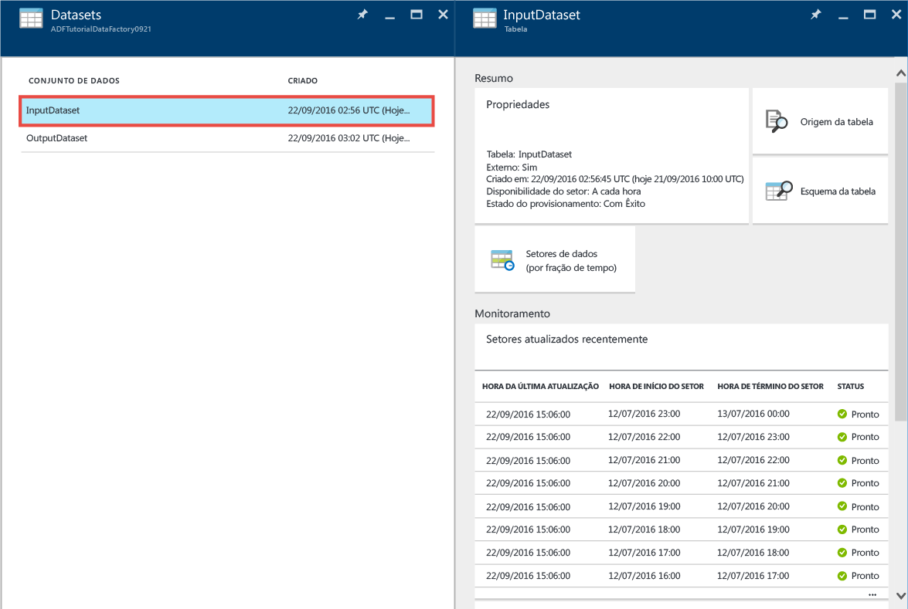
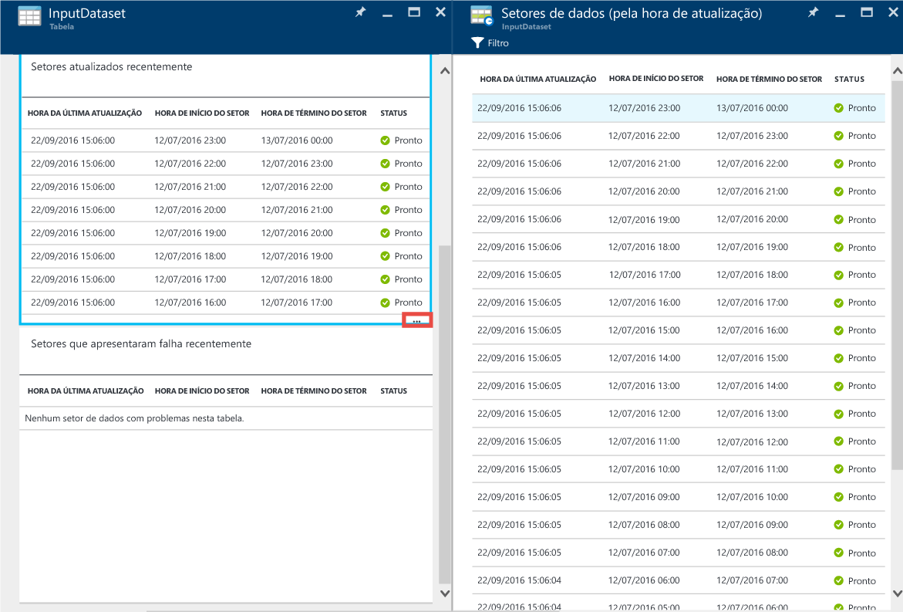
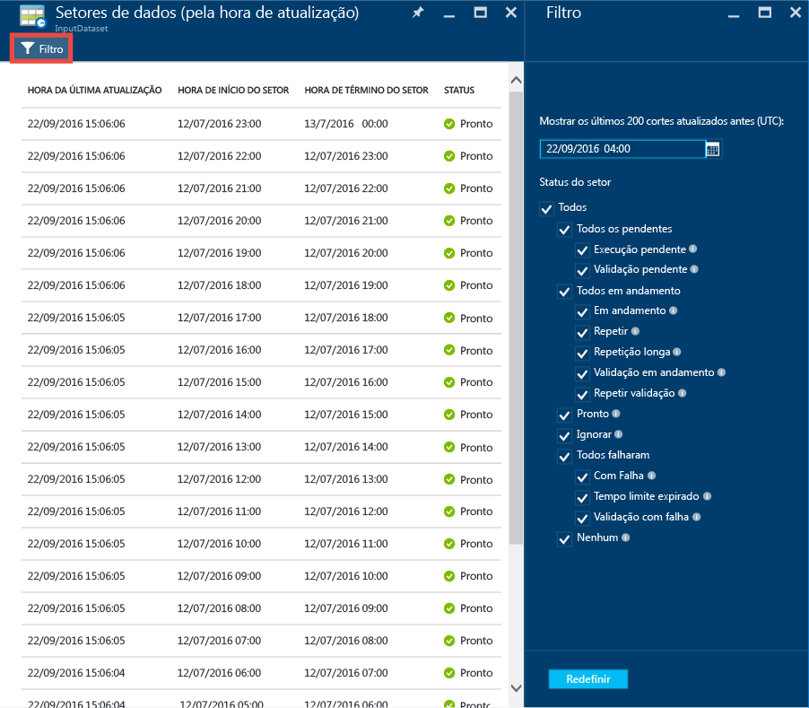
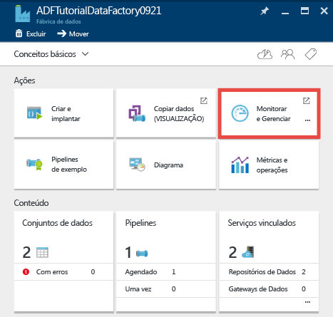
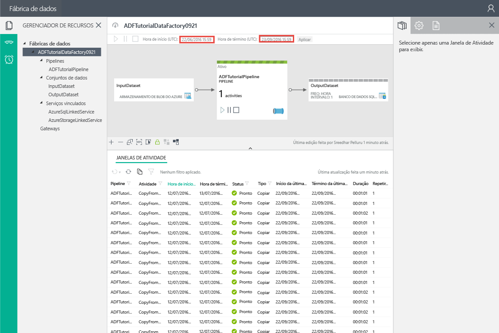

<properties 
	pageTitle="Tutorial: criar um pipeline com a Atividade de Cópia usando o portal do Azure | Microsoft Azure" 
	description="Neste tutorial, você cria um pipeline do Azure Data Factory com uma Atividade de Cópia usando o Data Factory Editor no portal do Azure." 
	services="data-factory" 
	documentationCenter="" 
	authors="spelluru" 
	manager="jhubbard" 
	editor="monicar"/>

<tags 
	ms.service="data-factory" 
	ms.workload="data-services" 
	ms.tgt_pltfrm="na" 
	ms.devlang="na" 
	ms.topic="get-started-article" 
	ms.date="09/16/2016" 
	ms.author="spelluru"/>

# Tutorial: criar um pipeline com a Atividade de Cópia usando o portal do Azure
> [AZURE.SELECTOR]
- [Visão geral e pré-requisitos](data-factory-copy-data-from-azure-blob-storage-to-sql-database.md)
- [Portal do Azure](data-factory-copy-activity-tutorial-using-azure-portal.md)
- [Visual Studio](data-factory-copy-activity-tutorial-using-visual-studio.md)
- [PowerShell](data-factory-copy-activity-tutorial-using-powershell.md)
- [API REST](data-factory-copy-activity-tutorial-using-rest-api.md)
- [API do .NET](data-factory-copy-activity-tutorial-using-dotnet-api.md)
- [Assistente de Cópia](data-factory-copy-data-wizard-tutorial.md)

Este tutorial mostra como criar e monitorar um data factory do Azure usando o portal do Azure. O pipeline no data factory usa uma Atividade de Cópia para copiar dados do Armazenamento de Blobs do Azure para o Banco de Dados SQL.

Eis as etapas executadas como parte deste tutorial:

Etapa | Descrição
-----| -----------
[Criar uma Data Factory do Azure](#create-data-factory) | Nesta etapa, você cria uma Azure Data Factory denominada **ADFTutorialDataFactory**.  
[Criar serviços vinculados](#create-linked-services) | Nesta etapa, você cria dois serviços vinculados: **AzureStorageLinkedService** e **AzureSqlLinkedService**.   O AzureStorageLinkedService vincula o armazenamento do Azure e o AzureSqlLinkedService vincula o banco de dados SQL do Azure ao ADFTutorialDataFactory. Os dados de entrada do pipeline residem em um contêiner de blob no armazenamento de blobs do Azure e os dados de saída são armazenados em uma tabela no banco de dados SQL do Azure. Portanto, adicione esses dois repositórios de dados como serviços vinculados à data factory.      
[Criar conjuntos de dados de entrada e saída](#create-datasets) | Na etapa anterior, você criou serviços vinculados que fazem referência a repositórios de dados que contêm dados de entrada/saída. Nesta etapa, defina dois conjuntos de dados: **InputDataset** e **OutputDataset**, que representam os dados de entrada/saída que são armazenados nos repositórios de dados.   No InputDataset, você especifica o contêiner de blobs que contém um blob com os dados de origem e, em OutputDataset, você especifica a tabela SQL que armazena os dados de saída. Você também pode especificar outras propriedades, como estrutura, disponibilidade e política. 
[Criar uma pipeline](#create-pipeline) | Nesta etapa, você cria um pipeline chamado **ADFTutorialPipeline** na ADFTutorialDataFactory.   Você adiciona uma **Atividade de Cópia** ao pipeline que coia dados de entrada do blob do Azure para a tabela de saída do SQL do Azure. A atividade de cópia realiza a movimentação de dados no Azure Data Factory. Ela é habilitada por um serviço disponível globalmente que pode copiar dados entre vários repositórios de dados de forma segura, confiável e escalonável. Veja o artigo [Atividades de movimentação de dados](data-factory-data-movement-activities.md) para obter detalhes sobre a Atividade de Cópia. 
[Monitorar o pipeline](#monitor-pipeline) | Nesta etapa, você monitora fatias de tabelas de entrada e de saída usando o portal do Azure.

## Pré-requisitos 
Conclua os pré-requisitos listados no artigo [Visão geral do tutorial](data-factory-copy-data-from-azure-blob-storage-to-sql-database.md) antes de executar este tutorial.

## Criar um data factory
Nesta etapa, você usa o Portal do Azure para criar um data factory do Azure denominado **ADFTutorialDataFactory**.

1.	Depois de fazer logon no [portal do Azure](https://portal.azure.com/), clique em **Novo**, selecione **Intelligence + Analytics** e clique em **Data Factory**.

	

6. Na folha **Nova data factory**:
	1. Digite **ADFTutorialDataFactory** para o **nome**.
	
  		

		O nome do Azure Data Factory deve ser **globalmente exclusivo**. Se você receber o seguinte erro, altere o nome de data factory (por exemplo, yournameADFTutorialDataFactory) e tente criar novamente. Consulte o tópico [Data Factory - regras de nomenclatura](data-factory-naming-rules.md) para ver as regras de nomenclatura para artefatos de Data Factory.
	
			Data factory name “ADFTutorialDataFactory” is not available  
	 
		
	2. Selecione sua **assinatura** do Azure.
	3. Para o Grupo de Recursos, execute uma das seguintes etapas:
		1. Selecione **Usar existente** e selecione um grupo de recursos existente na lista suspensa.
		2. Selecione **Criar novo** e insira o nome de um grupo de recursos.
	
			Algumas das etapas neste tutorial supõem que você usa o nome: **ADFTutorialResourceGroup** para o grupo de recursos. Para saber mais sobre grupos de recursos, consulte [Usando grupos de recursos para gerenciar recursos do Azure](../resource-group-overview.md).
	4. Selecione o **local** do data factory. Apenas as regiões com suporte pelo serviço Data Factory são mostradas na lista suspensa.
	5. Selecione **Fixar no quadro inicial**.
	6. Clique em **Criar**.

		> [AZURE.IMPORTANT] Para criar instâncias de Data Factory, você deve ser um membro da função [Colaborador de Data Factory](../active-directory/role-based-access-built-in-roles.md/#data-factory-contributor) no nível de assinatura/grupo de recursos.
		>  
		>  O nome do data factory pode ser registrado futuramente como um nome DNS e tornar-se publicamente visível.
9.  Para ver as mensagens de status e notificação, clique no ícone de sino na barra de ferramentas.

	
10. Depois que a criação estiver concluída, você verá a folha **DATA FACTORY**, conforme mostrado na imagem.

    

## Criar serviços vinculados
Serviços vinculados vinculam armazenamentos de dados ou serviços de computação para uma data factory do Azure. Confira [repositórios de dados com suporte](data-factory-data-movement-activities.md##supported-data-stores-and-formats) para ver todas as fontes e coletores com suporte da Atividade de Cópia. Confira os [serviços vinculados de computação](data-factory-compute-linked-services.md) para ver uma lista dos serviços de computação com suporte do Data Factory. Neste tutorial, você não usa nenhum serviço de computação.

Nesta etapa, você cria dois serviços vinculados: **AzureStorageLinkedService** e **AzureSqlLinkedService**. O serviço vinculado AzureStorageLinkedService vincula uma conta de armazenamento do Azure e o AzureSqlLinkedService vincula um banco de dados SQL do Azure à **ADFTutorialDataFactory**. Você criará, posteriormente neste tutorial, um pipeline que copia dados de um contêiner de blob no AzureStorageLinkedService em uma tabela SQL no AzureSqlLinkedService.

### Criar um serviço vinculado para a conta de armazenamento do Azure
1.	Na folha **Data Factory**, clique no bloco **Criar e implantar** para iniciar o **Editor** da data factory.

	
5. No **Editor**, clique no botão **Novo armazenamento de dados** na barra de ferramentas e selecione **Armazenamento do Azure** no menu suspenso. Você deve ver o modelo JSON para criar um serviço de armazenamento vinculado do Azure no painel à direita.

	
6. Substitua `<accountname>` e `<accountkey>` pelos valores de nome e de chave da sua conta de armazenamento do Azure.

	
6. Clique em **Implantar** na barra de ferramentas. Você deve ver o **AzureStorageLinkedService** implantado na árvore de exibição agora.

	

> [AZURE.NOTE]
Confira [Mover dados de/para Blobs do Azure](data-factory-azure-blob-connector.md#azure-storage-linked-service) para obter detalhes sobre as propriedades JSON.

### Criar um serviço vinculado para o banco de dados SQL do Azure
1. No **Editor Data Factory**, clique no botão **Novo armazenamento de dados** na barra de ferramentas e selecione **Banco de dados SQL do Azure** no menu suspenso. Você deve ver o modelo JSON para criar o serviço vinculado do SQL do Azure no painel à direita.
2. Substitua `<servername>`, `<databasename>`, `<username>@<servername>` e `<password>` pelos nomes de seu servidor, banco de dados, conta de usuário e senha SQL do Azure.
3. Clique em **Implantar** na barra de ferramentas para implantar o **AzureSqlLinkedService**.
4. Confirme que você vê **AzureSqlLinkedService** na exibição de árvore.

> [AZURE.NOTE]
Confira [Mover dados de/para Banco de Dados SQL](data-factory-azure-sql-connector.md#azure-sql-linked-service-properties) para obter detalhes sobre as propriedades JSON.

## Criar conjuntos de dados
Na etapa anterior, você criou os serviços vinculados **AzureStorageLinkedService** e **AzureSqlLinkedService** para vincular uma conta de armazenamento do Azure e o banco de dados SQL do Azure ao data factory: **ADFTutorialDataFactory**. Nesta etapa, você define dois conjuntos de dados, **InputDataset** e **OutputDataset**, que representam os dados de entrada/saída armazenados nos repositórios de dados referidos por AzureStorageLinkedService e AzureSqlLinkedService, respectivamente. Para InputDataset, você especifica o contêiner de blobs que contém um blob com os dados de origem e, para OutputDataset, você especifica a tabela SQL que armazena os dados de saída.

### Criar conjunto de dados de entrada 
Nesta etapa, você criará um conjunto de dados denominado **InputDataset** que aponta para um contêiner de blob no Armazenamento do Azure representado pelo serviço vinculado **AzureStorageLinkedService**.

1. No **Editor** do Data Factory, clique em **... Mais**, clique em **Novo conjunto de dados** e clique em **Armazenamento de Blobs do Azure** no menu suspenso.

	
2. Substitua JSON no painel direito pelo trecho JSON a seguir:

		{
		  "name": "InputDataset",
		  "properties": {
		    "structure": [
		      {
		        "name": "FirstName",
		        "type": "String"
		      },
		      {
		        "name": "LastName",
		        "type": "String"
		      }
		    ],
		    "type": "AzureBlob",
		    "linkedServiceName": "AzureStorageLinkedService",
		    "typeProperties": {
		      "folderPath": "adftutorial/",
			  "fileName": "emp.txt",
		      "format": {
		        "type": "TextFormat",
		        "columnDelimiter": ","
		      }
		    },
		    "external": true,
		    "availability": {
		      "frequency": "Hour",
		      "interval": 1
		    }
		  }
		}
		
     Observe os seguintes pontos:
	
	- O **tipo** do conjunto de dados foi definido como **AzureBlob**.
	- **linkedServiceName** é definido como **AzureStorageLinkedService**. Você criou esse serviço vinculado na Etapa 2.
	- **folderPath** é definido como o contêiner **adftutorial**. Você também pode especificar o nome de um blob dentro da pasta usando a propriedade **fileName**. Como você não está especificando o nome do blob, dados de todos os blobs no contêiner são considerados como um entrada de dados.
	- O **type** de formato é definido como **TextFormat**
	- Há dois campos no arquivo de texto, **FirstName** e **LastName**, separados por uma vírgula (**columnDelimiter**)
	- A **availability** é definida como **hourly** (**frequency** é definida como **hour** e **interval** é definido como **1**). Portanto, o Data Factory procurará dados de entrada a cada hora na pasta raiz do contêiner de blob (**adftutorial**) especificado.
	
	Se você não especificar um **fileName** para um conjunto de dados de **entrada**, todos os arquivos/blobs da pasta de entrada (**folderPath**) serão considerados como entradas. Se você especificar um nome de arquivo em JSON, apenas arquivo/blob especificado será considerado como entrada de asn.
 
	Se você não especificar um **fileName** para uma **tabela de saída**, os arquivos gerados no **folderPath** serão nomeados no seguinte formato: Data.&lt;Guid&gt;.txt (por exemplo: Data.0a405f8a-93ff-4c6f-b3be-f69616f1df7a.txt.).

	Para definir **folderPath** e **fileName** dinamicamente com base no horário **SliceStart**, use a propriedade **partitionedBy**. No exemplo a seguir, folderPath usa o ano, mês e dia de SliceStart (hora de início da fatia que está sendo processada) e fileName usa a hora de SliceStart. Por exemplo, se uma fatia é produzida para 2016-09-20T08:00:00, o folderName é definido como wikidatagateway/wikisampledataout/2016/09/20 e o fileName é definido como 08.csv.

			"folderPath": "wikidatagateway/wikisampledataout/{Year}/{Month}/{Day}",
	        "fileName": "{Hour}.csv",
	        "partitionedBy": 
	        [
	        	{ "name": "Year", "value": { "type": "DateTime", "date": "SliceStart", "format": "yyyy" } },
	            { "name": "Month", "value": { "type": "DateTime", "date": "SliceStart", "format": "MM" } }, 
	            { "name": "Day", "value": { "type": "DateTime", "date": "SliceStart", "format": "dd" } }, 
	            { "name": "Hour", "value": { "type": "DateTime", "date": "SliceStart", "format": "hh" } } 
	        ],
2. Clique em **Implantar** na barra de ferramentas para criar e implantar o conjunto de dados **InputDataset**. Confirme que você vê o **InputDataset** na exibição de árvore.

> [AZURE.NOTE]
Confira [Mover dados de/para Blobs do Azure](data-factory-azure-blob-connector.md#azure-blob-dataset-type-properties) para obter detalhes sobre as propriedades JSON.

### Criar conjunto de dados de saída
Nesta parte da etapa, você cria um conjunto de dados de saída denominado **OutputDataset**. Esse conjunto de dados aponta para uma tabela SQL no banco de dados SQL do Azure representada por **AzureSqlLinkedService**.

1. No **Editor** do Data Factory, clique em **... Mais**, clique em **Novo conjunto de dados** e clique em **SQL do Azure** no menu suspenso.
2. Substitua JSON no painel direito pelo trecho JSON a seguir:

		{
		  "name": "OutputDataset",
		  "properties": {
		    "structure": [
		      {
		        "name": "FirstName",
		        "type": "String"
		      },
		      {
		        "name": "LastName",
		        "type": "String"
		      }
		    ],
		    "type": "AzureSqlTable",
		    "linkedServiceName": "AzureSqlLinkedService",
		    "typeProperties": {
		      "tableName": "emp"
		    },
		    "availability": {
		      "frequency": "Hour",
		      "interval": 1
		    }
		  }
		}
		
     Observe os seguintes pontos:
	
	- O **tipo** do conjunto de dados foi definido como **AzureSQLTable**.
	- **linkedServiceName** é definido como **AzureSqlLinkedService** (você criou esse serviço vinculado na Etapa 2).
	- **tablename** está definido como **emp**.
	- Há três colunas (**ID**, **FirstName** e **LastName**) na tabela emp no banco de dados. ID é uma coluna de identidade. Portanto, você precisa especificar somente **FirstName** e **LastName** aqui.
	- A **availability** é definida como **hourly** (**frequency** definida como **hour** e **interval** definido como **1**). O serviço Data Factory gera uma fatia de dados de saída a cada hora na tabela **emp** no banco de dados SQL do Azure.

3. Clique em **Implantar** na barra de ferramentas para criar e implantar o conjunto de dados **OutputDataset**. Confirme que você vê o **OutputDataset** na exibição de árvore.

> [AZURE.NOTE]
Confira [Mover dados de/para Banco de Dados SQL](data-factory-azure-sql-connector.md#azure-sql-linked-service-properties) para obter detalhes sobre as propriedades JSON.

## Criar um pipeline
Nesta etapa, você cria um pipeline com uma **Atividade de Cópia** que usa **InputDataset** como entrada e **OutputDataset** como saída.

1. No **Editor** do Data Factory, clique em **... Mais** e clique em **Novo pipeline**. Como alternativa, você pode clicar com o botão direito em **Pipelines** no modo de exibição de árvore e clicar em **Novo pipeline**.
2. Substitua JSON no painel direito pelo trecho JSON a seguir:
		
		{
		  "name": "ADFTutorialPipeline",
		  "properties": {
		    "description": "Copy data from a blob to Azure SQL table",
		    "activities": [
		      {
		        "name": "CopyFromBlobToSQL",
		        "type": "Copy",
		        "inputs": [
		          {
		            "name": "InputDataset"
		          }
		        ],
		        "outputs": [
		          {
		            "name": "OutputDataset"
		          }
		        ],
		        "typeProperties": {
		          "source": {
		            "type": "BlobSource"
		          },
		          "sink": {
		            "type": "SqlSink",
		            "writeBatchSize": 10000,
		            "writeBatchTimeout": "60:00:00"
		          }
		        },
		        "Policy": {
		          "concurrency": 1,
		          "executionPriorityOrder": "NewestFirst",
		          "retry": 0,
		          "timeout": "01:00:00"
		        }
		      }
		    ],
		    "start": "2016-07-12T00:00:00Z",
		    "end": "2016-07-13T00:00:00Z"
		  }
		} 

	Observe os seguintes pontos:

	- Na seção de atividades, há apenas uma atividade cujo **tipo** é definido como **Cópia**.
	- A entrada da atividade é definida como **InputDataset** e a saída da atividade é definida como **OutputDataset**.
	- Na seção **typeProperties**, **BlobSource** é especificado como o tipo de origem e **SqlSink** é especificado como o tipo de coletor.

	Substitua o valor da propriedade **start** pelo dia atual e o valor de **end** pelo dia seguinte. Você pode especificar apenas a parte da data e ignorar a parte de hora do valor de data/hora. Por exemplo, "2016-02-03", que é equivalente a "2016-02-03T00:00:00Z"
	
	Ambos os valores de data/hora de início e de término devem estar no [formato ISO](http://en.wikipedia.org/wiki/ISO_8601). Por exemplo: 2016-10-14T16:32:41Z. A hora **final** é opcional, mas nós a usaremos neste tutorial.
	
	Se você não especificar o valor para a propriedade **end**, ele será calculado como "**início + 48 horas**". Para executar o pipeline indefinidamente, especifique **9999-09-09** como o valor para a propriedade **end**.
	
	No exemplo anterior, há 24 fatias de dados, pois cada fatia de dados é produzida a cada hora.
	
4. Clique em **Implantar** na barra de ferramentas para criar e implantar o **ADFTutorialPipeline**. Confirme que você vê o pipeline no modo de exibição de árvore.
5. Agora, feche a folha **Editor** clicando em **X**. Clique em **X** novamente para ver a home page **Data Factory** do **ADFTutorialDataFactory**.

**Parabéns!** Você criou um data factory do Azure, serviços vinculados, tabelas e uma pipeline e a pipeline agendada com êxito.
 
### Exibir a data factory em um Modo de Exibição de Diagrama 
1. Na folha **Data Factory**, clique em **Diagrama**.

	
2. Você deverá ver o diagrama semelhante à imagem abaixo:

	

	É possível ampliar, reduzir, aplicar zoom de 100%, ajustar nível de zoom, posicionar pipelines e tabelas automaticamente, bem como mostrar informações de linhagem (realça itens upstream e downstream dos itens selecionados). Você pode clicar duas vezes em um objeto (pipeline ou tabela de entrada/saída) para ver as propriedades dele.
3. Clique com o botão direito do mouse em **ADFTutorialPipeline** no Modo de Exibição de Diagrama e clique **Abrir pipeline**.

	
4. Você deve ver as atividades no pipeline juntamente com conjuntos de dados de entrada e saída das atividades. Neste tutorial, você tem apenas uma atividade no pipeline (Atividade de Cópia) com InputDataset como conjunto de dados de entrada e OutputDataset como conjunto de dados de saída.

	
5. Clique em **Data factory** na trilha do canto superior esquerdo para voltar para o modo de exibição de diagrama. O modo de exibição de diagrama exibe todos os pipelines. Neste exemplo, você criou somente um pipeline.
 

## Monitorar o pipeline
Nesta etapa, você utiliza o portal do Azure para monitorar o que está acontecendo em um data factory do Azure.

### Monitorar o pipeline usando a Exibição de Diagrama

1. Clique em **X** para fechar a exibição de **Diagrama** para ver a home page do Data Factory do data factory. Se você tiver fechado o navegador da Web, execute as etapas a seguir:
	2. Navegue até o [portal do Azure](https://portal.azure.com/).
	2. Clique duas vezes em **ADFTutorialDataFactory** no **Quadro inicial** (ou) clique em **Data factories** no menu à esquerda e procure ADFTutorialDataFactory.
3. Você verá a contagem e os nomes das tabelas e do pipeline criados nessa folha.

	
4. Agora, clique no bloco **Conjuntos de dados**.
5. Na folha **Conjuntos de dados**, clique em **InputDataset**. Esse conjunto de dados é o conjunto de dados de entrada para **ADFTutorialPipeline**.

	
5. Clique em **... (reticências)** para ver todas as fatias de dados.

	

	Observe que, até o momento, todas as fatias de dados estão **Prontas**, pois o arquivo **emp.txt** sempre existe no contêiner de blob: **adftutorial\\input**. Confirme que nenhuma fatia apareça na seção **Fatias com falha recente**, na parte inferior.

	Ambas as listas **Fatias atualizadas recentemente** e **Fatias com falha recente** são classificadas segundo o **HORÁRIO DA ÚLTIMA ATUALIZAÇÃO**.
    
	Clique em **Filtrar** na barra de ferramentas para filtrar as fatias.
	
	
6. Feche as folhas até que você veja a folha **Conjuntos de dados**. Clique o **OutputDataset**. Esse conjunto de dados é o conjunto de dados de saída para **ADFTutorialPipeline**.

	
6. Você deve ver a folha **OutputDataset**, conforme mostrado na seguinte imagem:

	
7. Observe que as fatias de dados até o momento atual já foram produzidas e estão **Prontas**. Nenhuma fatia aparece na seção **Fatias com problemas** na parte inferior.
8. Clique em **... (Reticências)** para ver todas as fatias.

	
9. Clique em qualquer fatia de dados na lista e você deverá ver a folha **FATIA DE DADOS**.

	
  
	Quando a fatia não está no estado **Pronto**, você pode ver as fatias upstream que não estão Prontas e estão impedindo a execução da fatia atual na lista **Fatias upstream que não estão prontas**.
11. Na folha **FATIA DE DADOS**, você deve ver que toda a atividade é executada na lista, na parte inferior. Clique em uma **execução de atividade** para ver a folha **DETALHES DE EXECUÇÃO DA ATIVIDADE**.

	
12. Clique em **X** para fechar todas as folhas até voltar à folha inicial de **ADFTutorialDataFactory**.
14. (opcional) Clique em **Pipelines** na página inicial de **ADFTutorialDataFactory**, clique em **ADFTutorialPipeline** na folha **Pipelines** e faça drill-through nas tabelas de entrada (**Consumed**) ou nas tabelas de saída (**Produced**).
15. Inicie o **SQL Server Management Studio**, conecte-se ao Banco de Dados SQL do Azure e verifique se as linhas estão inseridas na tabela **emp** do banco de dados.

	

### Monitorar o pipeline usando o aplicativo Monitorar e Gerenciar
Você também pode usar o aplicativo Monitorar e Gerenciar para monitorar os pipelines. Para obter informações detalhadas sobre como usar esse aplicativo, confira [Monitorar e gerenciar pipelines do Azure Data Factory usando o aplicativo Monitorar e Gerenciar](data-factory-monitor-manage-app.md).

1. Clique no bloco **Monitorar e Gerenciar** na home page do seu data factory.

	
2. Você deve ver **aplicativo Monitorar e Gerenciar**. Altere a **Hora de início** e a **Hora de término** para corresponder às horas de início (2016-07-12) e de término (2016-07-13) do seu pipeline e clique em **Aplicar**.

	
3. Selecione uma janela de atividade na lista de **Janelas de Atividade** para ver detalhes sobre ela. 

## Resumo 
Neste tutorial, você criou uma data factory do Azure para copiar dados de um blob do Azure para um banco de dados SQL do Azure. Você utilizou o Portal do Azure para criar o data factory, os serviços vinculados, os conjuntos de dados e um pipeline. Aqui estão as etapas de alto nível executadas nesse tutorial:

1.	Foi criado um **data factory** do Azure.
2.	Foram criados **serviços vinculados**:
	1. Um serviço vinculado do **Armazenamento do Azure** para vincular a conta do Armazenamento do Azure que contém os dados de entrada.
	2. Um serviço vinculado do **SQL Azure** para vincular o banco de dados SQL do Azure que contém os dados de saída.
3.	Foram criados **conjuntos de dados** que descrevem os dados de entrada e de saída para os pipelines.
4.	Foi criado um **pipeline** com uma **Atividade de Cópia** com **BlobSource** como origem e **SqlSink** como coletor.

## Consulte também
| Tópico | Descrição |
| :---- | :---- |
| [Atividades de movimentação de dados](data-factory-data-movement-activities.md) | Este artigo fornece informações detalhadas sobre a Atividade de Cópia utilizada neste tutorial. |
| [Agendamento e execução](data-factory-scheduling-and-execution.md) | Este artigo explica os aspectos de agendamento e execução do modelo de aplicativo do Azure Data Factory. |
| [Pipelines](data-factory-create-pipelines.md) | Este artigo o ajuda a compreender pipelines e atividades no Azure Data Factory. |
| [Conjunto de dados](data-factory-create-datasets.md) | Este artigo o ajuda a entender os conjuntos de dados no Azure Data Factory.
| [Monitorar e gerenciar pipelines usando o Aplicativo de Monitoramento](data-factory-monitor-manage-app.md) | Este artigo descreve como monitorar, gerenciar e depurar seus pipelines usando o Aplicativo de Monitoramento e Gerenciamento. 

<!---HONumber=AcomDC_0928_2016-->