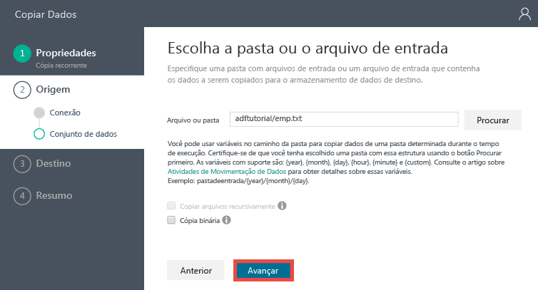
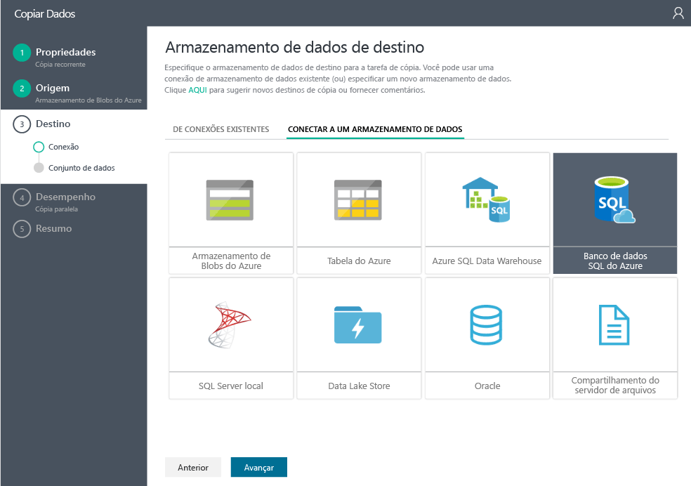
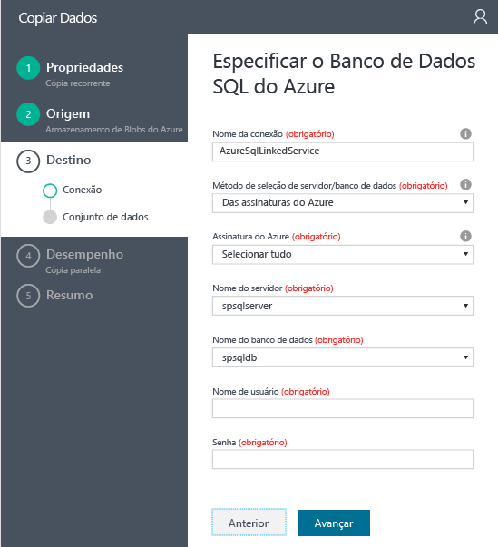
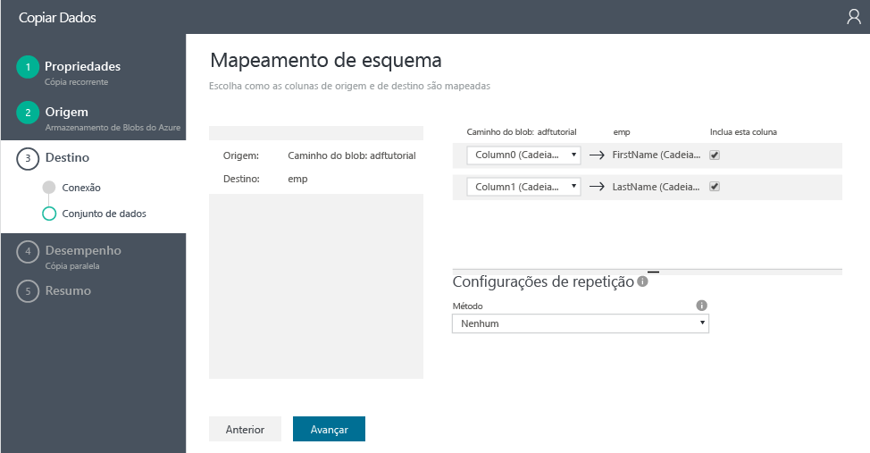
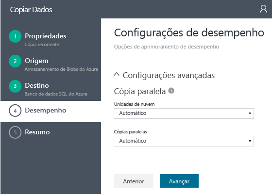
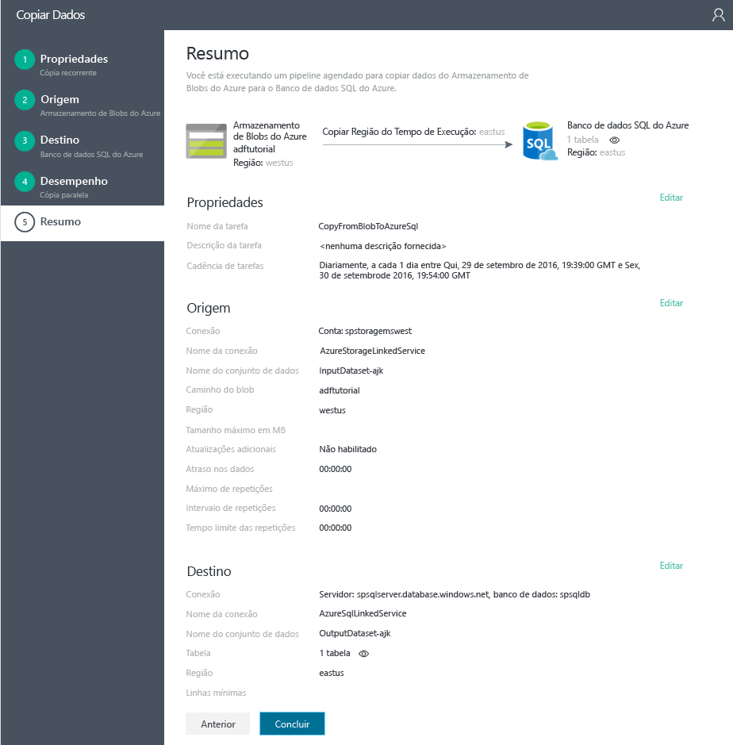

# Tutorial: Criar um pipeline com a Atividade de Cópia usando o Assistente de Cópia do Data Factory
> [!div class="op_single_selector"]
> * [Visão geral e pré-requisitos](data-factory-copy-data-from-azure-blob-storage-to-sql-database.md)
> * [Assistente de Cópia](data-factory-copy-data-wizard-tutorial.md)
> * [Portal do Azure](data-factory-copy-activity-tutorial-using-azure-portal.md)
> * [Visual Studio](data-factory-copy-activity-tutorial-using-visual-studio.md)
> * [PowerShell](data-factory-copy-activity-tutorial-using-powershell.md)
> * [Modelo do Azure Resource Manager](data-factory-copy-activity-tutorial-using-azure-resource-manager-template.md)
> * [API REST](data-factory-copy-activity-tutorial-using-rest-api.md)
> * [API do .NET](data-factory-copy-activity-tutorial-using-dotnet-api.md)

Este tutorial mostra como usar o **assistente de cópia** para copiar dados de um armazenamento de blobs do Azure para um Banco de Dados SQL do Azure. 

O **assistente de cópia** permite que você crie rapidamente um pipeline de dados que copia dados de um armazenamento de dados de origem com suporte para um armazenamento de dados de destino com suporte. Portanto, recomendamos que você use o assistente como uma primeira etapa para criar um pipeline de exemplo no cenário de movimentação de dados. Para obter uma lista de armazenamentos de dados com suporte como origens e destinos, consulte [Armazenamentos de dados com suporte](data-factory-data-movement-activities.md#supported-data-stores-and-formats).  

Este tutorial mostra como criar um Azure Data Factory, iniciar o Assistente de Cópia, seguir uma série de etapas para fornecer detalhes sobre seu cenário de ingestão/movimentação de dados. Quando você concluir as etapas no assistente, ele criará um pipeline com Atividade de Cópia a fim de copiar dados de um armazenamento de blobs do Azure para um banco de dados SQL do Azure automaticamente. Para saber mais sobre a atividade de cópia, confira [Atividades de movimentação de dados](data-factory-data-movement-activities.md).

## Pré-requisitos
Conclua os pré-requisitos listados no artigo [Visão geral do tutorial](data-factory-copy-data-from-azure-blob-storage-to-sql-database.md) antes de executar este tutorial.

## Criar um data factory
Nesta etapa, você usa o Portal do Azure para criar um data factory do Azure denominado **ADFTutorialDataFactory**.

1. Faça logon no [portal do Azure](https://portal.azure.com).
2. Clique em **+NOVO** no canto superior esquerdo, clique em **Dados + análise** e clique em **Data Factory**. 
   
   
2. Na folha **Nova data factory** :
   
   1. Digite **ADFTutorialDataFactory** como **nome**.
       O nome da data factory do Azure deve ser globalmente exclusivo. Se você receber o seguinte erro, `Data factory name “ADFTutorialDataFactory” is not available`, altere o nome do data factory (por exemplo, seunomeADFTutorialDataFactoryDDMMAAAA) e tente criá-lo novamente. Consulte o tópico [Data Factory - regras de nomenclatura](data-factory-naming-rules.md) para ver as regras de nomenclatura para artefatos de Data Factory.  
      
           
   2. Selecione sua **assinatura**do Azure.
   3. Em relação ao Grupo de Recursos, execute uma das seguintes etapas: 
      
      - Selecione **Usar existente** para selecionar um grupo de recursos existente.
      - Selecione **Criar novo** e insira um nome para um grupo de recursos.
          
        Algumas das etapas neste tutorial supõem que você usa o nome: **ADFTutorialResourceGroup** para o grupo de recursos. Para saber mais sobre grupos de recursos, consulte [Usando grupos de recursos para gerenciar recursos do Azure](../azure-resource-manager/resource-group-overview.md).
   4. Selecione um **local** para o data factory.
   5. Marque a caixa de seleção **Fixar no painel** na parte inferior da folha.  
   6. Clique em **Criar**.
      
                   
3. Depois que a criação for concluída, você verá a folha **Data Factory**, conforme mostrado na seguinte imagem:
   
   

## Iniciar o Assistente de cópia
1. Na folha Data Factory, clique em **Copiar dados [VERSÃO PRÉVIA]** para iniciar o **Assistente de cópia**. 
   
   > [!NOTE]
   > Se você vir que o navegador da Web está bloqueado em "Autorizando...", desmarque a configuração **Bloquear cookies de terceiros e dados de site** nas configurações do navegador (ou) mantenha-a habilitada, crie uma exceção para **login.microsoftonline.com** e tente iniciar o assistente novamente.
2. Na página **Propriedades** :
   
   1. Insira **CopyFromBlobToAzureSql** para o **Nome da tarefa**
   2. Insira uma **descrição** (opcional).
   3. Altere a **data/hora de início** e a **data/hora de término** para que a data de término seja definida como a data de hoje e a de início, cinco dias antes.  
   4. Clique em **Avançar**.  
      
       
3. Na página **Repositório de dados de origem**, clique no bloco **Armazenamento de Blobs do Azure**. Use essa página para especificar o repositório de dados de origem para a tarefa de cópia. 
   
    
4. Na página **Especificar a conta de armazenamento de Blobs do Azure** :
   
   1. Insira **AzureStorageLinkedService** para o **Nome do serviço vinculado**.
   2. Confirme se a opção **De assinaturas do Azure** foi selecionada em **Método de seleção de conta**.
   3. Selecione sua **assinatura**do Azure.  
   4. Selecione uma **Conta de armazenamento do Azure** na lista de contas de armazenamento do Azure disponíveis na assinatura selecionada. Você também pode inserir as configurações de conta de armazenamento manualmente selecionando a opção **Inserir manualmente** para o **Método de seleção de conta** e clicando em **Avançar**. 
      
      
5. Na página **Escolher o arquivo de entrada ou a pasta** :
   
   1. Clique duas vezes em **adftutorial** (pasta).
   2. Selecione **emp.txt** e clique em **Escolher**
      
      
6. Na página **Escolha o arquivo ou a pasta de entrada**, clique em **Avançar**. Não selecione **Cópia binária**. 
   
     
7. Na página **Configurações de formato de arquivo**, você vê os delimitadores e o esquema é detectado automaticamente pelo assistente na análise do arquivo. Você também pode inserir os delimitadores manualmente para que o assistente de cópia pare de detectar automaticamente ou substitua. Clique em **Avançar** depois de revisar os delimitadores e visualizar os dados. 
   
      
8. Na página Repositório de dados de destino, selecione **Banco de Dados SQL do Azure** e clique em **Avançar**.
   
    
9. Na página **Especificar o banco de dados SQL do Azure** :
   
   1. Digite **AzureSqlLinkedService** no campo **Nome da conexão**.
   2. Confirme se a opção **De assinaturas do Azure** foi selecionada em **Método de seleção de servidor/banco de dados**.
   3. Selecione sua **assinatura**do Azure.  
   4. Selecione **Nome do servidor** e **Banco de Dados**.
   5. Insira o **Nome de usuário** e a **Senha**.
   6. Clique em **Avançar**.  
      
      
10. Na página **Mapeamento de tabela**, selecione **emp** para o campo **Destino** na lista suspensa e clique em **seta para baixo** (opcional) para ver o esquema e visualizar os dados.
    
      
11. Na página **Mapeamento de esquema**, clique em **Avançar**.
    
    
12. Na página **Configurações de desempenho**, clique em **Avançar**. 
    
    
13. Examine as informações na página **Resumo** e clique em **Concluir**. Esse assistente cria dois serviços vinculados, dois conjuntos de dados (entrada e saída) e um pipeline no data factory (de onde você iniciou o Assistente de Cópia). 
    
    

## Iniciar o monitor e gerenciar aplicativo
1. Na página **Implantação**, clique no link: `Click here to monitor copy pipeline`.
   
     
2. O aplicativo de monitoramento é iniciado em uma guia separada no navegador da Web.   
   
      
3. Para ver o status mais recente das fatias de cada hora, clique no botão **Atualizar** da lista **JANELAS DE ATIVIDADE** na parte inferior. Você vê cinco janelas de atividade para cinco dias entre as horas de início e de término do pipeline. A lista não é atualizada automaticamente e, portanto, talvez seja necessário clicar em Atualizar algumas vezes para poder ver todas as janelas de atividade com status Pronto. 
4. Selecione uma janela de atividade na lista. Consulte os detalhes sobre ela no **Gerenciador da janela de atividade** à direita.

        

    Observe que as datas 11, 12, 13, 14 e 15 estão na cor verde, que significa que as fatias de saída diária para essas datas já foram produzidas. Você também verá essa codificação de cor no pipeline e o conjunto de dados de saída na exibição de diagrama. Na etapa anterior, observe que duas fatias já foram produzidas, uma está sendo processada e os outras duas estão aguardando processamento (com base na codificação de cores). 

    Para saber mais sobre como usar o aplicativo, confira [Monitorar e gerenciar o pipeline usando o aplicativo de monitoramento](data-factory-monitor-manage-app.md) artigo.

## Próximas etapas
Neste tutorial, você usou o armazenamento de blobs do Azure como um armazenamento de dados de origem e um banco de dados SQL do Azure como um armazenamento de dados de destino em uma operação de cópia. A tabela a seguir fornece uma lista de armazenamentos de dados com suporte como origens ou destinos na atividade de cópia: 

[!INCLUDE [data-factory-supported-data-stores](../../includes/data-factory-supported-data-stores.md)]

Para obter detalhes sobre campos/propriedades que você vê no assistente de cópia de um armazenamento de dados, clique no link para o armazenamento de dados na tabela. 
