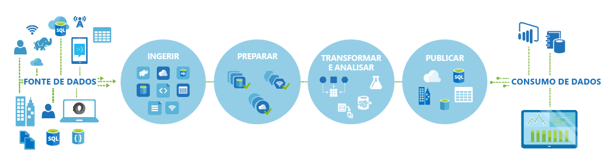
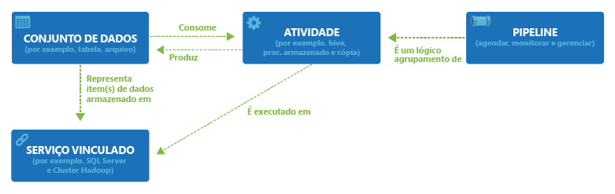

<properties 
	pageTitle="Introdução à Fábrica de Dados do Azure" 
	description="Saiba como você pode usar o serviço de Fábrica de Dados do Azure para compor o processamento de dados, armazenamento de dados e serviços de movimentação de dados para criar pipelines que produzem informações confiáveis." 
	services="data-factory" 
	documentationCenter="" 
	authors="spelluru" 
	manager="jhubbard" 
	editor="monicar"/>

<tags 
	ms.service="data-factory" 
	ms.workload="data-services" 
	ms.tgt_pltfrm="na" 
	ms.devlang="na" 
	ms.topic="article" 
	ms.date="07/16/2015" 
	ms.author="spelluru"/>

# Introdução ao serviço de Fábrica de Dados do Azure

## Visão geral
O Data Factory é um serviço de gerenciamento de informações baseado em nuvem que automatiza a movimentação e transformação de dados.

Assim como uma fábrica que usa equipamentos para pegar matérias-primas e transformá-las em produtos, o Data Factory orquestra serviços existentes que coletam dados brutos e os transformam em informações para uso imediato.

O Data Factory funciona com fontes de dados e SaaS locais e na nuvem para ingerir, preparar, transformar, analisar e publicar seus dados. Use o Data Factory para transformar serviços em pipelines de fluxo de dados gerenciados e para transformar seus dados, usando serviços como [Azure HDInsight (Hadoop)](http://azure.microsoft.com/documentation/services/hdinsight/) e [Lote do Azure](http://azure.microsoft.com/documentation/services/batch/) para suas necessidades de computação de big data, e com o [Aprendizado de Máquina do Azure](http://azure.microsoft.com/documentation/services/machine-learning/) para operacionalizar suas soluções de análise. Vá além de uma simples exibição de monitoramento tabular e use as visualizações de dados avançadas do Data Factory para exibir rapidamente a linhagem e as dependências entre os pipelines de dados. Monitore todos os seus pipelines de fluxo de dados, de uma única exibição unificada para identificar facilmente os problemas e configurar alertas de monitoramento.

**Figura 1.** Você pode coletar dados de várias fontes de dados de diferentes locais, ingerir e prepará-los, organizar e analisá-los com uma variedade de transformações e publicar dados prontos para uso para consumo.

Você pode usar o Data Factory sempre que precisar coletar dados de diferentes formas e tamanhos, transformá-los e publicá-los para extrair informações aprofundadas – tudo em um cronograma confiável. O Data Factory pode ser usado para criar pipelines de fluxo de dados altamente disponíveis para cenários como permitir que lojas online gerem recomendações de produtos personalizadas com base no comportamento de navegação de cliente.:

## Principais Conceitos

O Azure Data Factory tem algumas entidades principais que trabalham juntas para definir os dados de entrada e saída, eventos de processamento e o cronograma e os recursos necessários para executar o fluxo de dados desejado.

**Figura 2.** Relações entre o Conjunto de dados, Atividade, Pipeline e Serviço vinculado

### Atividades
As Atividades definem as ações a serem realizadas em seus dados. Cada atividade leva zero ou mais conjuntos de dados como entrada e produz um ou mais conjuntos de dados como saída. Uma atividade é uma unidade de orquestração no Azure Data Factory. Por exemplo, você pode usar uma atividade de Cópia para orquestrar a cópia de dados de um conjunto de dados para outro. Da mesma forma, você pode usar uma atividade do Hive que executará uma consulta de Hive em um cluster do Azure HDInsight para transformar ou analisar seus dados. O Azure Data Factory fornece uma ampla gama de atividades de movimentação, análise e transformação de dados.

### Pipelines
Pipelines são um agrupamento lógico de Atividades. Eles são usados para agrupar atividades em uma unidade que, em conjunto, executam uma tarefa. Por exemplo, uma sequência de várias Atividades de transformação poderá ser necessária para limpar dados do arquivo de log. Essa sequência pode ter um cronograma complexo e as dependências que precisam ser coordenadas e automatizadas. Todas essas atividades poderiam ser agrupadas em um único Pipeline chamado "CleanLogFiles". "CleanLogFiles", em seguida, poderia ser implantado, agendado ou excluído como uma única unidade em vez de gerenciar cada atividade individual de forma independente.

### Conjunto de dados
Conjuntos de dados são referências/ponteiros nomeados para os dados que você deseja usar como entrada ou uma saída de uma atividade. Conjuntos de dados identificam estruturas de dados em armazenamentos de dados diferentes, inclusive tabelas, arquivos, pastas e documentos.

### Serviço vinculado
Serviços vinculados definem as informações necessárias para o Data Factory se conectar a recursos externos. Serviços vinculados são usados para duas finalidades no Data Factory:

- Para representar um armazenamento de dados, incluindo, mas não se limitando a um SQL Server local, banco de dados Oracle, compartilhamento de arquivos ou uma conta de Armazenamento de Blobs do Azure. Conforme discutido anteriormente, conjuntos de dados representam as estruturas nos armazenamentos de dados conectados ao Data Factory por meio de um Serviço vinculado.
- Para representar um recurso de computação que pode hospedar a execução de uma Atividade. Por exemplo, a "Atividade HDInsightHive" é executada em um cluster Hadoop do HDInsight.

Com os quatro conceitos simples de conjuntos de dados, atividades, pipelines e serviços vinculados, você está pronto para começar! Você pode [criar seu primeiro pipeline](data-factory-build-your-first-pipeline.md) desde o início ou implantar uma amostra pronta seguindo as instruções em nossa [postagem de blog](https://azure.microsoft.com/blog/2015/04/24/azure-data-factory-update-simplified-sample-deployment/).

<!-----HONumber=July15_HO5-->