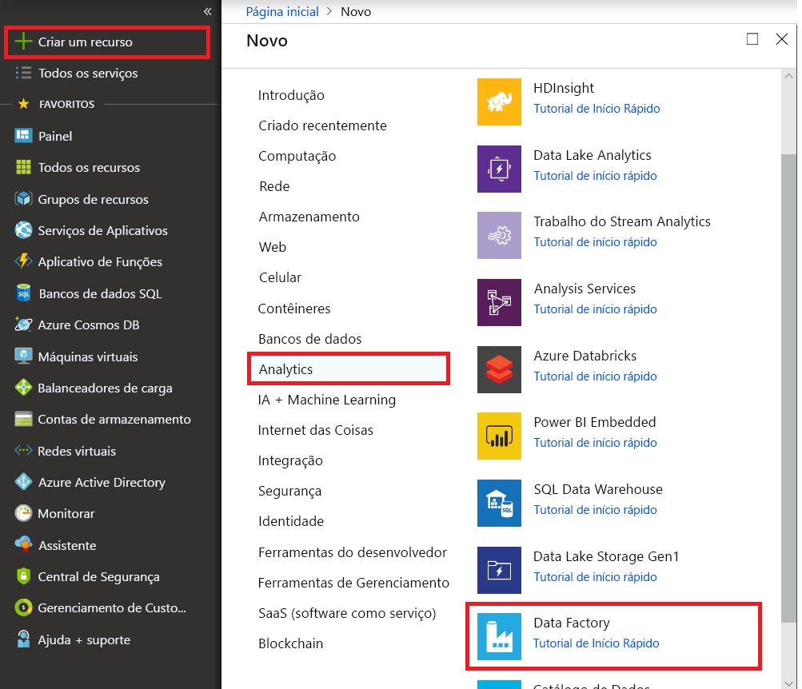

# Use a ferramenta Copy Data para copiar dados 
> [!div class="op_single_selector" title1="Select the version of Data Factory service you are using:"]
> * [Versão 1 – já disponível](v1/data-factory-copy-data-from-azure-blob-storage-to-sql-database.md)
> * [Versão 2 – Versão prévia](quickstart-create-data-factory-copy-data-tool.md)

Neste guia de início rápido, você usa o Portal do Azure para criar um data factory. Em seguida, você usa a ferramenta Copy Data para criar um pipeline que copia dados de uma pasta no armazenamento de Blobs do Azure para outra pasta. 

> [!NOTE]
> Se você for novo no Azure Data Factory, confira a [Introdução ao Azure Data Factory](data-factory-introduction.md) antes de fazer este guia de início rápido. 
>
> Este artigo aplica-se à versão 2 do Data Factory, que está atualmente em versão prévia. Se você estiver usando a versão 1 do serviço Data Factory, que já está disponível (GA), confira [introdução ao Data Factory versão 1](v1/data-factory-copy-data-from-azure-blob-storage-to-sql-database.md).

[!INCLUDE [data-factory-quickstart-prerequisites](../../includes/data-factory-quickstart-prerequisites.md)] 

## Criar uma data factory

1. Clique em **Novo** no menu à esquerda, clique em **Dados + Análise** e clique em **Data Factory**. 
   
   
2. Na página **Novo data factory**, insira **ADFTutorialDataFactory** no campo **nome**. 
      
     
 
   O nome do Azure Data Factory deve ser **globalmente exclusivo**. Se a seguinte mensagem de erro for exibida para o campo nome, altere o nome do data factory (por exemplo, yournameADFTutorialDataFactory) e tente criar novamente. Confira o artigo [Data Factory - regras de nomenclatura](naming-rules.md) para ver as regras de nomenclatura para artefatos do Data Factory.
  
     
3. Selecione a **assinatura** do Azure na qual você deseja criar o data factory. 
4. Para o **Grupo de Recursos**, execute uma das seguintes etapas:
     
      - Selecione **Usar existente**e selecione um grupo de recursos existente na lista suspensa. 
      - Selecione **Criar novo**e insira o nome de um grupo de recursos.   
         
      Para saber mais sobre grupos de recursos, consulte [Usando grupos de recursos para gerenciar recursos do Azure](../azure-resource-manager/resource-group-overview.md).  
4. Selecione **V2 (Versão Prévia)** para a **versão**.
5. Selecione o **local** do data factory. Somente os locais com suporte são exibidos na lista suspensa. Os armazenamentos de dados (Armazenamento do Azure, Banco de Dados SQL do Azure, etc.) e serviços de computação (HDInsight, etc.) usados pelo data factory podem estar em outros locais/regiões.
6. Selecione **Fixar no painel**.     
7. Clique em **Criar**.
8. No painel, você vê o seguinte bloco com status: **Implantando data factory**. 

    
9. Após a criação, a página do **Data Factory** será exibida conforme mostrado na imagem.
   
   
10. Clique no bloco **Autor & Monitor** para iniciar a interface de usuário (IU) do Azure Data Factory em uma guia separada. 

## Iniciar a ferramenta Copy Data

1. Na página de Introdução, clique no bloco **Copiar dados** para iniciar a ferramenta Copy Data. 

   
2. Na página **Propriedades** da ferramenta Copy Data, clique em **Avançar**. Você pode especificar um nome e sua descrição para o pipeline nesta página. 

    
3. Na página **Armazenamento de dados de origem**, selecione **Armazenamento de Blobs do Azure** e clique em **Avançar**.

    
4. Na página **Especificar a conta de armazenamento de Blobs do Azure**, escolha o **nome da conta de armazenamento** na lista suspensa e clique em Avançar. 

    
5. Na página **Escolha o arquivo de entrada ou a pasta**, execute as seguintes etapas:

    1. Navegue até a pasta **adftutorial/input**. 
    2. Escolha o arquivo **emp.txt**.
    3. Clique em **Escolher**. Clique duas vezes em **emp.txt** para ignorar esta etapa. 
    4. Clique em **Próximo**. 

    
6. Na página **Configurações de formato de arquivo**, observe que a ferramenta detecta automaticamente os delimitadores de linha e coluna e clique em **Avançar**. Você também pode visualizar os dados e exibir o esquema dos dados de entrada nesta página. 

    
7. Na página **Armazenamento de dados de destino**, selecione **Armazenamento de Blobs do Azure** e clique em **Avançar**. 

        
8. Na página **Especificar a conta de armazenamento de Blobs do Azure**, escolha a sua conta de armazenamento de Blobs do Azure e clique em **Avançar**. 

    
9. Na página **Escolha o arquivo de saída ou a pasta**, execute as seguintes etapas: 

    1. Digite **adftutorial/output** para o **caminho da pasta**.
    2. Digite **emp.txt** para o **nome do arquivo**. 
    3. Clique em **Próximo**. 

     
10. Na página **Configurações de formato de arquivo**, clique em **Avançar**. 

    
11. Clique em **próximo** na página **Configurações**. 

    
12. Revise todas as configurações na página **Resumo** e clique em Avançar. 

    
13. Na página **Implantação concluída**, clique em **Monitor** para monitorar o pipeline que você criou. 

    
14. O aplicativo alterna para a guia **Monitor**. Confira o status do pipeline nesta página. Clique em **Atualizar** para atualizar a lista. 
    
    
15. Clique no link **Exibir atividades em execução** na coluna de ações. O pipeline tem apenas uma atividade do tipo **Cópia**. 

    
16. Para exibir detalhes sobre a operação de cópia, clique em **Detalhes** (imagem de óculos) na coluna **Ações**. Para obter detalhes sobre as propriedades, confira [Visão geral da atividade de cópia](copy-activity-overview.md). 

    
17. Verifique que o arquivo **emp.txt** foi criado na pasta de **saída** do contêiner **adftutorial**. O serviço Data Factory cria a pasta de saída automaticamente caso não exista. 
18. Acesse a guia **Editar** para editar serviços vinculados, conjuntos de dados e pipelines. Para saber mais sobre editá-los na IU do Data Factory, confira em [Criar um Data Factory usando o portal do Azure](quickstart-create-data-factory-portal.md).

    

## Próximas etapas
O pipeline nessa amostra copia dados de uma localização para outra em um Armazenamento de Blobs do Azure. Percorra os [tutoriais](tutorial-copy-data-portal.md) para saber mais sobre o uso do Data Factory em mais cenários. 