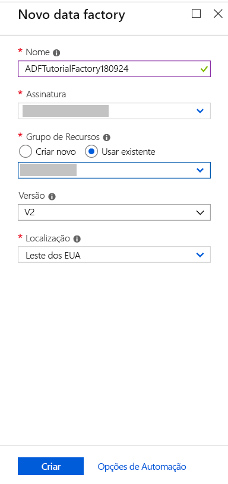
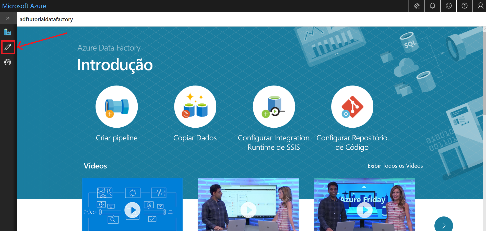
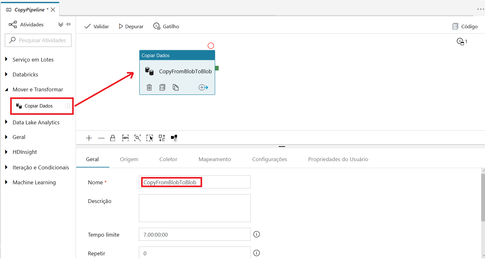
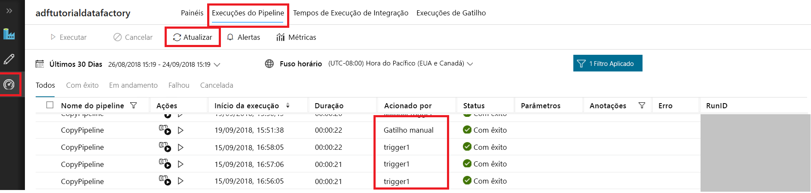
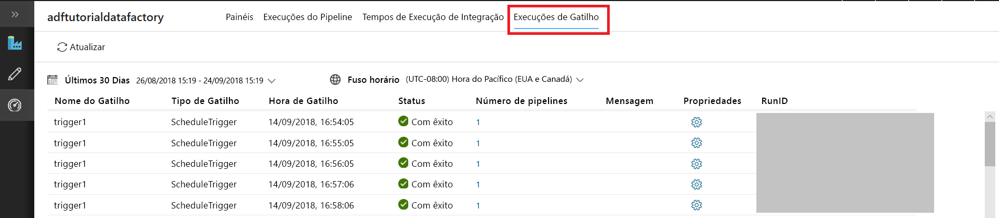

# Criar um data factory usando a interface do usuário do Azure Data Factory
> [!div class="op_single_selector" title1="Select the version of Data Factory service that you are using:"]
> * [Versão 1 – já disponível](v1/data-factory-copy-data-from-azure-blob-storage-to-sql-database.md)
> * [Versão 2 – Versão prévia](quickstart-create-data-factory-portal.md)

Este guia de início rápido descreve como usar a interface do usuário do Azure Data Factory para criar e monitorar um data factory. O pipeline que você criar nesse data factory *copia* dados de uma pasta para outra no Armazenamento de Blobs do Azure. Para obter um tutorial sobre como *transformar* dados usando o Azure Data Factory, consulte [Tutorial: transformar dados usando Spark](tutorial-transform-data-spark-portal.md). 

> [!NOTE]
> Se você for novo no Azure Data Factory, confira a [Introdução ao Azure Data Factory](data-factory-introduction.md) antes de fazer este guia de início rápido. 
>
> Este artigo aplica-se à versão 2 do Data Factory, que está atualmente em versão prévia. Se você estiver usando a versão 1 do serviço, que já está disponível (GA), consulte [Tutorial do Data Factory versão 1](v1/data-factory-copy-data-from-azure-blob-storage-to-sql-database.md).

[!INCLUDE [data-factory-quickstart-prerequisites](../../includes/data-factory-quickstart-prerequisites.md)] 

### Vídeo 
Assistir a este vídeo o ajuda a entender a interface do usuário do Data Factory: 
>[!VIDEO https://channel9.msdn.com/Shows/Azure-Friday/Visually-build-pipelines-for-Azure-Data-Factory-v2/Player]

## Criar uma data factory

1. Iniciar o navegador da Web **Microsoft Edge** ou **Google Chrome**. Atualmente, a interface de usuário do Data Factory tem suporte apenas nos navegadores da Web Microsoft Edge e Google Chrome.
2. Vá para o [Portal do Azure](https://portal.azure.com). 
3. Selecione **Novo** no menu à esquerda, selecione **Dados + Análise**e, em seguida, selecione **Data Factory**. 
   
   
2. Na página **Novo data factory**, insira **ADFTutorialDataFactory** no campo **Nome**. 
      
   
 
   O nome do Azure Data Factory deve ser *globalmente exclusivo*. Se você visualizar o seguinte erro, altere o nome de data factory (por exemplo, **&lt;yourname&gt;ADFTutorialDataFactory**) e tente criar novamente. Para ver as regras de nomenclatura para artefatos do Data Factory consulte o artigo [Data Factory - regras de nomenclatura](naming-rules.md).
  
   
3. Para **Assinatura**, selecione a assinatura do Azure na qual você deseja criar o data factory. 
4. Para o **Grupo de Recursos**, use uma das seguintes etapas:
     
   - Selecione **Usar existente** e selecione um grupo de recursos existente na lista. 
   - Selecione **Criar novo**e insira o nome de um grupo de recursos.   
         
   Para saber mais sobre grupos de recursos, consulte [Usando grupos de recursos para gerenciar recursos do Azure](../azure-resource-manager/resource-group-overview.md).  
4. Para **Versão**, selecione **V2 (Versão prévia)**.
5. Em **Local**, selecione uma localização para o data factory.

   A lista mostra somente os locais que oferecem suporte ao Data Factory. Os armazenamentos de dados (como o Armazenamento do Azure e Banco de Dados SQL do Azure) e serviços de computação (como o Azure HDInsight) usados pelo Data Factory podem estar em outros locais.
6. Selecione **Fixar no painel**.     
7. Selecione **Criar**.
8. No painel, o bloco com o seguinte status é exibido: **Implantando o Data Factory**: 

   
9. Após a criação, a página do **Data Factory** será exibida. Clique no bloco **Criar e Monitorar** para iniciar o aplicativo de interface do usuário (IU) do Azure Data Factory em uma guia separada.
   
   
10. Na página **Introdução**, acesse a guia **Editar** no painel esquerdo. 

    

## Criar um serviço vinculado
Nesta etapa, você criará um serviço vinculado para vincular sua Conta de Armazenamento do Azure ao Data Factory. O serviço vinculado tem as informações de conexão que o serviço do Data Factory usa no tempo de execução para se conectar a ele.

1. Clique em **Conexões** e, em seguida, selecione o botão **Novo** na barra de ferramentas. 

       
2. Na página **Novo Serviço Vinculado**, selecione **Armazenamento de Blobs do Azure** e selecione **Continuar**. 

   
3. Conclua as seguintes etapas: 

   a. Para o campo **Nome**, insira **AzureStorageLinkedService**.

   b. Insira o nome da sua Conta de Armazenamento do Azure em **Nome da conta de armazenamento**.

   c. Selecione **Testar conectividade** para confirmar se o serviço do Data Factory pode se conectar à conta de armazenamento. 

   d. Selecione **Salvar** para salvar o serviço vinculado. 

    
4. Confirme que você vê **AzureStorageLinkedService** na lista de serviços vinculados. 

   

## Criar conjuntos de dados
Neste procedimento, você criará dois conjuntos de dados: **InputDataset** e **OutputDataset**. Esses conjuntos de dados são do tipo **AzureBlob**. Eles se referem ao Serviço vinculado do Armazenamento do Azure que você criou na seção anterior. 

O conjunto de dados de entrada representa os dados de origem na pasta de entrada. Na definição de conjunto de dados de entrada, especifique o contêiner de blob (**adftutorial**), a pasta (**entrada**) e o arquivo (**emp.txt**) que contém os dados de origem. 

Esse conjunto de dados de saída representa os dados que são copiados para o destino. Na definição de conjunto de dados de saída, especifique o contêiner de blob (**adftutorial**), a pasta (**saída**) e o arquivo para o qual os dados são copiados. Cada execução de um pipeline tem uma ID exclusiva associada a ele. Você pode acessar essa ID, usando a variável do sistema **RunId**. O nome do arquivo de saída é avaliado dinamicamente com base na ID de execução do pipeline.   

Nas configurações de serviço vinculado, você especificou a conta de armazenamento do Azure que contém os dados de origem. Nas configurações do conjunto de dados de origem, especifique onde exatamente os dados de origem residem (contêiner de blob, pasta e arquivo). Nas configurações de conjunto de dados do coletor, especifique para onde os dados são copiados (contêiner de blob, pasta e arquivo). 
 
1. Selecione o botão **+** (mais) adição e, em seguida, selecione **Conjunto de Dados**.

   
2. Na página **Novo Conjunto de Dados**, selecione **Armazenamento de Blobs do Azure** e selecione **Concluir**. 

   
3. Na janela **Propriedades** para o conjunto de dados, insira **InputDataset** para o **Nome**. 

   
4. Alterne para a guia **Conexão** e siga estas etapas: 

   a. Selecione **AzureStorageLinkedService** para **Serviço vinculado**.

   b. Para **Caminho do arquivo**, selecione o botão **Procurar**.

       c. Na janela **Escolher um arquivo ou uma pasta**, navegue até a pasta **entrada** no contêiner **adftutorial**, selecione o arquivo **emp.txt** e clique em **Concluir**.

      
    
   d. (opcional) Selecione **Visualizar dados** para visualizar os dados no arquivo emp.txt.     
5. Repita as etapas para criar o conjunto de dados de saída:  

   a. Selecione o botão **+** (mais) adição e, em seguida, selecione **Conjunto de Dados**.

   b. Na página **Novo Conjunto de Dados**, selecione **Armazenamento de Blobs do Azure** e selecione **Concluir**.

   c. Especifique **OutputDataset** para o nome.

   d. Digite **adftutorial/saída** para a pasta. Se a pasta de **saída**não existir, a atividade de cópia a cria em tempo de execução.

   e. Insira `@CONCAT(pipeline().RunId, '.txt')` como o nome do arquivo. 
   
      Cada vez que você executa um pipeline, essa execução tem uma ID exclusiva associada a ela. A expressão concatena a ID de execução do pipeline com **.txt** para avaliar o nome do arquivo de saída. Para obter a lista de expressões e variáveis do sistema com suporte, consulte [Variáveis de sistema](control-flow-system-variables.md) e [Linguagem de expressão](control-flow-expression-language-functions.md).

   

## Criar uma pipeline 
Neste procedimento, você criará e validará um pipeline com uma atividade Copiar que usa o conjunto de dados de entrada e saída. A Atividade de cópia copia os dados do arquivo especificado por você nas configurações do conjunto de dados de entrada para o arquivo especificado por você nas configurações do conjunto de dados de saída. Se o conjunto de dados de entrada especifica apenas uma pasta (não o nome de arquivo), a Atividade de cópia copia todos os arquivos da pasta de origem para o destino. 

1. Selecione o botão **+** (mais) adição e, em seguida, selecione **Pipeline**. 

   
2. Especifique **CopyPipeline** para o **Nome** na janela **Propriedades**. 

   
3. Na caixa de ferramentas **Atividades**, expanda **Fluxo de dados**. Arraste e solte a atividade de **Cópia** da caixa de ferramentas **Atividades** para a superfície do designer do pipeline. Você também pode pesquisar atividades na caixa de ferramentas **Atividades**. Especifique **CopyFromBlobToBlob** para o **Nome**.

   
4. Alterne para a guia **Fonte** nas configurações da atividade de cópia e selecione **InputDataset** para o **Conjunto de dados de origem**.

       
5. Alterne para a guia **Coletor** nas configurações da atividade de cópia e selecione **OutputDataset** para o **Conjunto de dados do coletor**.

       
7. Clique em **Validar** para validar as configurações de pipeline. Confirme se esse pipeline foi validado com êxito. Para fechar a saída de validação, selecione o botão **>>** (seta para a direita). 

   

## Executar teste do pipeline
Nesta etapa, execute um teste do pipeline antes de implantar o Data Factory. 

1. Na barra de ferramentas do pipeline, selecione **Execução de teste**. 
    
   
2. Confirme se você vê o status da execução do pipeline na guia **Saída** das configurações do pipeline. 

       
3. Confirme que você vê um arquivo de saída na pasta **saída** do contêiner **adftutorial**. O serviço Data Factory cria a pasta de saída automaticamente caso não exista. 
    
   

## Disparar o pipeline manualmente
Nesta procedimento, você implanta entidades (serviços vinculados, conjuntos de dados, pipelines) ao Azure Data Factory. Depois, dispare manualmente a execução do pipeline. Você também pode publicar entidades em seu próprio repositório Git dos Visual Studio Team Services, que é abordado em [outro tutorial](tutorial-copy-data-portal.md?#configure-code-repository).

1. Antes de disparar um pipeline, você deve publicar as entidades no Data Factory. Para publicar, selecione **Publicar Tudo** no painel esquerdo. 

   
2. Para disparar o pipeline manualmente, selecione **Gatilho** na barra de ferramentas e selecione **Disparar Agora**. 
    
   

## Monitorar o Pipeline

1. Alterne para a guia **Monitorar** à esquerda. Use o botão **Atualizar** para atualizar a lista.

   
2. Selecione **Exibir Execuções de Atividade** em **Ações**. Você vê o status de execução da atividade de cópia nesta página. 

   
3. Para exibir detalhes sobre a operação de cópia, selecione **Detalhes** (imagem de óculos) na coluna **Ações**. Para obter detalhes sobre as propriedades, confira [Visão geral da atividade de cópia](copy-activity-overview.md). 

   
4. Confirme que você vê um arquivo novo na pasta de **saída**. 
5. Você pode alternar de volta para o modo de exibição **Execuções do pipeline** no modo de exibição **Execuções de Atividade** selecionando **Pipelines**. 

## Disparar o pipeline em um cronograma
Este procedimento é opcional neste tutorial. Você pode criar um *agendador de gatilho* para agendar a execução periódica do pipeline (por hora, diariamente, e assim por diante). Nesta procedimento, você cria um gatilho para ser executado a cada minuto até a data e hora de término especificadas. 

1. Alterne para a guia **Editar**. 

   
1. Selecione **Gatilho** no menu e, em seguida, selecione **Novo/Editar**. 

   
2. Na página **Adicionar gatilhos**, selecione **Escolher gatilho** e, em seguida, selecione **Novo**. 

   
3. Na página **Novo gatilho**, no campo **Final**, selecione **Na Data**, especifique como hora de término alguns minutos após a hora atual e selecione **Aplicar**. 

   Um custo associado a cada execução de pipeline, então, especifique o a hora de término como apenas alguns minutos após a hora de início. Verifique se está como o mesmo dia. No entanto, verifique se há tempo suficiente para a execução do pipeline entre a hora da publicação e a hora de término. O gatilho só entra em vigor depois de você publicar a solução no Data Factory, e não ao salvar o gatilho na interface do usuário. 

   
4. Na página **Novo gatilho**, selecione a caixa de seleção **Ativado** e, em seguida, selecione **Avançar**. 

   
5. Examine a mensagem de aviso e selecione **Concluir**.

   
6. Clique em **Publicar Tudo** para publicar as alterações no Data Factory. 

   
8. Alterne para a guia **Monitorar** à esquerda. Selecione **Atualizar** para atualizar a lista. Você verá que o pipeline é executado uma vez por minuto desde o momento da publicação até hora de término. 

   Observe os valores na coluna **Disparado Por**. A execução do gatilho manual foi feita em uma etapa anterior (**Disparar agora**). 

   
9. Selecione a seta para baixo ao lado de **Execuções de Pipeline** para alternar para o modo de exibição **Execuções de Gatilho**. 

       
10. Confirme que um arquivo de saída é criado para cada execução de pipeline até a data e hora de término especificadas na pasta **saída**. 

## Próximas etapas
O pipeline neste exemplo copia dados de uma localização para outra em um Armazenamento de Blobs do Azure. Percorra os [tutoriais](tutorial-copy-data-portal.md) para saber mais sobre o uso do Data Factory em mais cenários. 