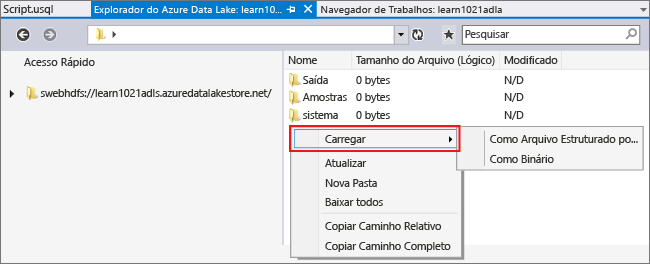
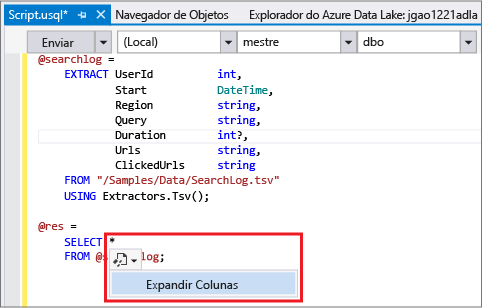
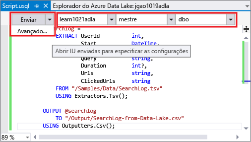
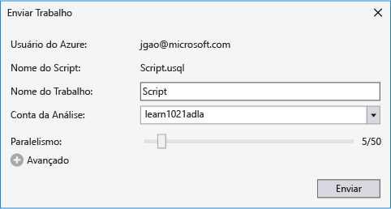
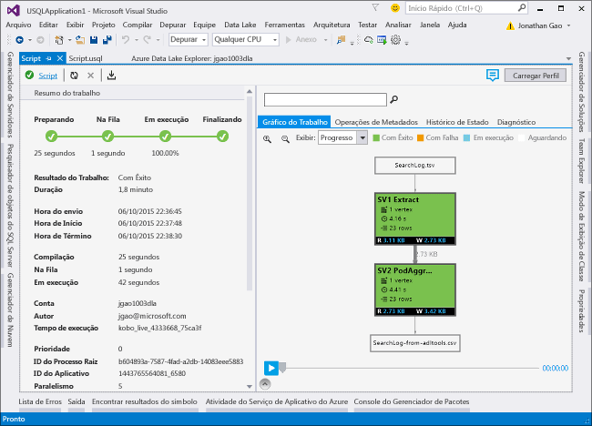
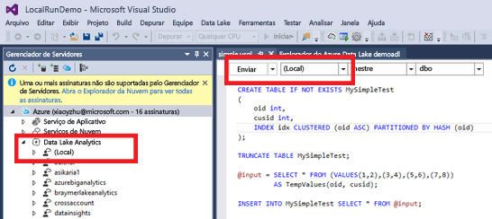
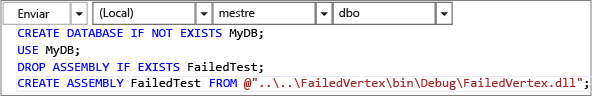

# Tutorial: desenvolver scripts U-SQL usando as Ferramentas do Data Lake para Visual Studio
[!INCLUDE [get-started-selector](../../includes/data-lake-analytics-selector-get-started.md)]

Saiba como instalar e usar as Ferramentas do Data Lake para Visual Studio para escrever e testar scripts U-SQL.

U-SQL é uma linguagem altamente extensível e hiperescalonável para preparação, transformação e análise de todos os dados no Data Lake e além dele. Para saber mais, consulte [Referência do U-SQL](http://go.microsoft.com/fwlink/p/?LinkId=691348).

## Pré-requisitos
* **Visual Studio 2015, Visual Studio 2013 atualização 4 ou Visual Studio 2012. As edições Enterprise (Ultimate/Premium), Professional, Community têm suporte; não há suporte para a edição Express. O Visual Studio "15" não é suportado atualmente e estamos trabalhando nisso.**
* **SDK do Microsoft Azure para .NET versão 2.7.1 ou posterior**.  Instale-o usando o [Web Platform Installer](http://www.microsoft.com/web/downloads/platform.aspx).
* **[Ferramentas do Data Lake para Visual Studio](http://aka.ms/adltoolsvs)**.

    Assim que as Ferramentas Data Lake para o Visual Studio estiverem instaladas, você verá um nó "Análise do Data Lake" no Gerenciador de Servidores sob o nó "Azure" (você pode abrir o Gerenciador de servidores pressionando Ctrl+Alt+S).
* **Explore as duas seções a seguir em [Introdução à Azure Data Lake Analytics usando o portal do Azure](data-lake-analytics-get-started-portal.md)**.

  * [Criar uma conta da Análise Data Lake do Azure](data-lake-analytics-get-started-portal.md#create-data-lake-analytics-account).
  * [Carregar SearchLog.tsv na conta de armazenamento padrão do Data Lake](data-lake-analytics-get-started-portal.md#prepare-source-data).

    Para sua comodidade, uma amostra de script do PowerShell para criar um serviço Análise Data Lake e carregar o arquivo de dados de origem pode ser encontrada em [Apêndice A- Amostra do PowerShell para preparar o tutorial](data-lake-analytics-data-lake-tools-get-started.md#appx-a-powershell-sample-for-preparing-the-tutorial).

    As Ferramentas do Data Lake não dão suporte à criação de contas da Análise Data Lake. Portanto, você precisa criá-la usando o portal do Azure, o Azure PowerShell, o SDK do .NET ou a CLI do Azure. Para executar o trabalho da Análise Data Lake, você precisará de alguns dados. Embora as Ferramentas do Data Lake deem suporte ao carregamento de dados, você poderá usar o portal para carregar os dados de exemplo para deixar o tutorial mais fácil de acompanhar.

## Conecte-se ao Azure
**Para conectar-se à Análise Data Lake**

1. Abra o Visual Studio.
2. No menu **Exibir**, clique em **Gerenciador de Servidores** para abri-lo. Ou pressione **[CTRL]+[ALT]+S**.
3. Clique com o botão direito do mouse em **Azure**, clique em "Conectar à Assinatura do Microsoft Azure" e siga as instruções.
4. No **Gerenciador de Servidores**, expanda **Azure** e **Data Lake Analytics**. Você deverá ver uma lista das suas contas da Análise Data Lake, caso haja alguma. Não é possível criar contas de Análise Data Lake no Visual Studio. Para criar uma conta, veja [Introdução ao Azure Data Lake Analytics usando o portal do Azure](data-lake-analytics-get-started-portal.md) ou [Introdução ao Azure Data Lake Analytics usando o Azure PowerShell](data-lake-analytics-get-started-powershell.md).

## Carregar arquivos de dados de origem
Anteriormente neste tutorial, você carregou alguns dados na seção **Pré-requisito** .  

Caso você queira usar seus próprios dados, estes são os procedimentos para carregar dados das Ferramentas do Data Lake.

**Para carregar arquivos na conta dependente do Azure Data Lake**

1. No **Gerenciador de Servidores**, expanda **Azure**, **Data Lake Analytics**, sua conta do Data Lake Analytics e **Contas de Armazenamento**. Você deverá ver a conta padrão do Repositório Data Lake, as contas vinculadas do Repositório Data Lake e as contas de Armazenamento do Azure vinculadas. A conta padrão do Data Lake tem um rótulo "Conta de Armazenamento Standard".
2. Clique com o botão direito do mouse na conta de armazenamento padrão do Data Lake e clique em **Gerenciador**.  Isso abrirá o painel Gerenciador das Ferramentas do Data Lake para Visual Studio.  À esquerda, há um modo de exibição de árvore e o modo de exibição de conteúdo está à direita.
3. Navegue até a pasta na qual você deseja carregar arquivos,
4. Clique com o botão direito do mouse em qualquer espaço em branco e clique em **Carregar**.

    

**Para carregar arquivos em uma conta de Armazenamento de Blobs vinculada do Azure**

1. No **Gerenciador de Servidores**, expanda **Azure**, **Data Lake Analytics**, sua conta do Data Lake Analytics e **Contas de Armazenamento**. Você deverá ver a conta padrão do Repositório Data Lake, as contas vinculadas do Repositório Data Lake e as contas de Armazenamento do Azure vinculadas.
2. Expanda a conta de Armazenamento do Azure.
3. Clique com o botão direito do mouse no contêiner onde você deseja carregar arquivos e clique em **Gerenciador**. Se você não tiver um contêiner, primeiro deverá criar um usando o portal do Azure, o Azure PowerShell ou outras ferramentas.
4. Navegue até a pasta na qual você deseja carregar arquivos,
5. Clique com o botão direito do mouse em qualquer espaço em branco e clique em **Carregar**.

## Desenvolver scripts U-SQL
Os trabalhos da Análise Data Lake são escritos na linguagem U-SQL. Para saber mais sobre o U-SQL, confira [Introdução à linguagem U-SQL](data-lake-analytics-u-sql-get-started.md) e [Referência da linguagem U-SQL](http://go.microsoft.com/fwlink/?LinkId=691348).

**Para criar e enviar um trabalho da Análise Data Lake**

1. No menu **Arquivo**, clique em **Novo** e em **Projeto**.
2. Escolha o tipo **Projeto U-SQL** .

    
3. Clique em **OK**. O Visual Studio cria uma solução com um arquivo **Script.usql** .
4. Insira o seguinte script em **Script.usql**:

        @searchlog =
            EXTRACT UserId          int,
                    Start           DateTime,
                    Region          string,
                    Query           string,
                    Duration        int?,
                    Urls            string,
                    ClickedUrls     string
            FROM "/Samples/Data/SearchLog.tsv"
            USING Extractors.Tsv();

        @res =
            SELECT *
            FROM @searchlog;        

        OUTPUT @res   
            TO "/Output/SearchLog-from-Data-Lake.csv"
        USING Outputters.Csv();

    Este script U-SQL lê o arquivo de dados de origem usando **Extractors.Tsv()**, em seguida, cria um arquivo csv usando **Outputters.Csv()**.

    Não modifique os dois caminhos, a menos que você tenha copiado o arquivo de origem em um local diferente.  A Análise Data Lake criará a pasta de saída se ela não existir.

    É mais simples usar caminhos relativos para arquivos armazenados em contas padrão do Data Lake. Você também pode usar caminhos absolutos.  Por exemplo,

        adl://<Data LakeStorageAccountName>.azuredatalakestore.net:443/Samples/Data/SearchLog.tsv

    Você deve usar caminhos absolutos para acessar os arquivos em contas do Armazenamento vinculadas.  A sintaxe para os arquivos armazenados na conta do Armazenamento do Azure vinculada é:

        wasb://<BlobContainerName>@<StorageAccountName>.blob.core.windows.net/Samples/Data/SearchLog.tsv

   > [!NOTE]
   > Atualmente, não há suporte para o contêiner de Blob do Azure com permissões de acesso de blobs públicos ou de contêineres públicos.  
   >
   >

    Perceba os seguintes recursos:

   * **IntelliSense**

       Preenchimento automático de nomes e membros exibidos para o Conjunto de linhas, Classes, Bancos de dados, Esquemas e Objetos definidos pelo usuário (UDOs).

       IntelliSense para entidades do catálogo (Bancos de dados, Esquemas, Tabelas, UDOs etc.) tem relação à sua conta de computação. Você pode verificar a conta de computação ativa atual, o banco de dados e o esquema na barra de ferramentas superior e alterne entre elas nas listas suspensas.
   * **Expandir * colunas**

       Clique à direita de *e você deverá ver um sublinhado azul abaixo de *. Passe o cursor do mouse sobre o sublinhado azul e clique na seta para baixo.
       

       Clique em **Expandir Colunas**, a ferramenta substituirá o * pelos nomes de coluna.
   * **Formatação Automática**

       Os usuários podem alterar o recuo do script U-SQL com base na estrutura de código em Editar -> Avançado:

     * Formatar Documento (Ctrl + E, D): Formata o documento inteiro   
     * Formatar Seleção (Ctrl + K, Ctrl + F): Formata a seleção. Se nenhuma seleção for feita, esse atalho formatará a linha na qual o cursor está posicionado.  

       Todas as regras de formatação podem ser configuradas em Ferramentas -> Opções -> Editor de Texto - > SIP -> Formatação.  
   * **Recuo Inteligente**

       As Ferramentas do Data Lake para Visual Studio recuam automaticamente as expressões enquanto você escreve os scripts. Esse recurso está desabilitado por padrão, e os usuários precisam habilitá-lo marcando a opção U-SQL -> Opções e Configurações -> Opções -> Habilitar o Recuo Inteligente.
   * **Ir para Definição e Localizar Todas as Referências**

       Clicar com o botão direito no nome de um Conjunto de linhas/parâmetro/coluna/UDO etc e clicar em Ir para Definição (F12) permite que você navegue até a definição. Ao clicar em Localizar Todas as Referências (Shift+F12), todas as referências serão exibidas.
   * **Inserir Caminho do Azure**

       Em vez de memorizar o caminho do arquivo do Azure e digitá-lo manualmente ao escrever o script, as Ferramentas do Data Lake para Visual Studio fornecem uma maneira mais fácil: clique com o botão direito no editor e clique em Inserir Caminho do Azure. Navegue até o arquivo na caixa de diálogo do Navegador de Blob do Azure. Clique em **OK**. o caminho do arquivo será inserido em seu código.
5. Especifique a conta da Análise do Data Lake, o Banco de Dados e o Esquema. Você pode escolher **(local)** para executar o script localmente para fins de teste. Para obter mais informações, confira [Executar o U-SQL localmente](#run-u-sql-locally).

    

    Para saber mais, consulte [Usar o Catálogo do U-SQL](data-lake-analytics-use-u-sql-catalog.md).
6. No **Gerenciador de Soluções**, clique com o botão direito do mouse em **Script.usql** e clique em **Criar Script**. Verifique o resultado no painel Saída.
7. No **Gerenciador de Soluções**, clique com o botão direito do mouse em **Script.usql** e clique em **Enviar Script**. Como opção, também é possível clicar em **Enviar** no painel Script.usql.  Consulte a captura de tela anterior.  Clique na seta para baixo ao lado do botão Enviar para enviar usando as opções avançadas:
8. Especifique **Nome do Trabalho**, verifique a **Conta de Análise** e clique em **Enviar**. Os resultados do envio e o link do trabalho ficarão disponíveis na janela de resultados das Ferramentas do Date Lake para Visual Studio quando o envio for concluído.

    
9. Clique no botão Atualizar para ver o status do trabalho mais recente e atualizar a tela. Após a conclusão bem-sucedida do trabalho, ele exibirá **Gráfico do Trabalho**, **Operações de Metadados**, **Histórico de Estado** e **Diagnóstico**:

    

   * Resumo do Trabalho. Mostra as informações resumidas do trabalho atual, por exemplo: Estado, Progresso, Tempo de Execução, Nome do Tempo de Execução, Emissor etc.   
   * Detalhes do Trabalho. Inclui informações detalhadas sobre esse trabalho, incluindo o script, recursos, Exibição de Execuções de Vértice.
   * Gráfico do Trabalho. Há quatro gráficos para visualização das informações do trabalho: Progresso, Leitura de Dados, Dados Gravados, Tempo de Execução, Tempo de Execução Médio por Nó, Taxa de Transferência de Entrada, Taxa de Transferência de Saída.
   * Operações de Metadados. Mostra todas as operações de metadados.
   * Histórico de Estado.
   * Diagnósticos. As Ferramentas do Data Lake para Visual Studio diagnosticarão automaticamente a execução do trabalho. Você receberá alertas quando houver algum erro ou problemas de desempenho em seus trabalhos. Consulte a parte Diagnósticos do Trabalho (link a ser definido) para saber mais.

**Para verificar o estado do trabalho**

1. No Gerenciador de Servidores, expanda **Azure**, **Data Lake Analytics** e o nome da conta do Data Lake Analytics
2. Clique duas vezes em **Trabalhos** para listar os trabalhos.
3. Clique em um trabalho para ver o status.

**Para ver a saída do trabalho**

1. No **Gerenciador de Servidores**, expanda **Azure**, expanda **Data Lake Analytics**, expanda sua conta do Data Lake Analytics, expanda **Contas de Armazenamento**, clique com o botão direito do mouse na conta de Armazenamento padrão do Data Lake e clique em **Gerenciador**.
2. Clique duas vezes em **saída** para abrir a pasta
3. Clique duas vezes em **SearchLog-From-adltools.csv**.

### Reprodução do Trabalho
A Reprodução do Trabalho permite que você assista ao progresso da execução do trabalho e detecte visualmente os gargalos e anomalias no desempenho. Esse recurso pode ser usado antes da conclusão da execução do trabalho (por exemplo, durante o tempo em que o trabalho está sendo executado ativamente), bem como após a execução. A reprodução durante a execução do trabalho permitirá que o usuário reproduza o andamento até o momento atual.

**Para exibir o progresso da execução de trabalho**  

1. Clique em **Carregar Perfil** no canto superior direito. Consulte a captura de tela anterior.
2. Clique no botão Reproduzir no canto inferior esquerdo para analisar o progresso de execução do trabalho.
3. Durante a reprodução, clique em **Pausar** para interrompê-la ou arraste diretamente a barra de progresso para posições específicas.

### Mapa de Calor
As Ferramentas do Data Lake para Visual Studio fornecem sobreposições de cores selecionáveis pelo usuário na exibição do trabalho a fim de indicar o progresso, a E/S de dados, o tempo de execução, a taxa de transferência de E/S de cada estágio. Com isso, os usuários podem descobrir possíveis problemas e distribuir as propriedades do trabalho de forma direta e intuitiva. Você pode escolher uma fonte de dados para exibir na lista suspensa.  

## Executar o U-SQL localmente
Usando a experiência de execução local do U-SQL no Visual Studio, você pode:

* Execute scripts U-SQL localmente, junto com Assemblies do C#.
* Depure os assemblies do C# localmente.
* Criar/excluir/exibir bancos de dados locais, assemblies, esquemas e tabelas no Gerenciador de Servidores assim como faz no serviço Análise Data Lake do Azure.

Você verá uma conta *Local* no Visual Studio e o instalador cria uma pasta *DataRoot* localizada em *C:\LocalRunRoot*. A pasta DataRoot será usada:

* Armazenar metadados, incluindo tabelas, bancos de dados, TVFs, etc.
* Para um determinado script: se um caminho relativo for referenciado nos caminhos de entrada/saída, pesquisaremos o DataRoot (bem como caminho do script se a entrada)
* A pasta DataRoot não será referenciada se você estiver tentando registrar um assembly e usar um caminho relativo (veja a parte “Usar assemblies ao fazer a execução local” para obter mais detalhes)

O vídeo a seguir demonstra o recurso de execução local do U-SQL:

> [!VÍDEO https://channel9.msdn.com/Series/AzureDataLake/USQL-LocalRun/player]
>
>

### Problemas e limitações conhecidos
* Não é possível criar a tabela/banco de dados, etc. no Gerenciador de Servidores para a conta local.
* Quando um caminho relativo é referenciado:

  * Na entrada de script (EXTRACT * FROM “/path/abc”) - o caminho do DataRoot e o caminho do script serão pesquisados.
  * Na saída do script (OUTPUT TO “path/abc”): o caminho do DataRoot será usado como a pasta de saída.
  * No registro do assembly (CREATE ASSEMBLY xyz FROM “/path/abc”): o caminho do script será pesquisado, mas não o DataRoot.
  * No Modo de Exibição/TVF registrado ou outras entidades de metadados: o caminho do DataRoot será pesquisado, mas não o caminho do script.

    Para scripts executados no serviço do Data Lake, a conta de armazenamento padrão será usada como a pasta raiz e será devidamente pesquisada.

### Testar scripts U-SQL localmente
Para obter instruções sobre como desenvolver scripts U-SQL, confira [Desenvolver scripts U-SQL](#develop-and-test-u-sql-scripts). Para criar e executar scripts U-SQL localmente, escolha **(Local)** na lista suspensa do cluster e clique em **Enviar**. Verifique se você tem os dados certos referenciados - veja o caminho absoluto ou coloque os dados na pasta DataRoot.

Você também pode clicar com o botão direito do mouse em um script e clicar em **Executar Plano Local** no menu de contexto ou pressionar **CTRL+F5** para disparar a execução local.

### Usar assemblies na execução local
Há duas maneiras de executar os arquivos personalizados do C#:

* Escreva assemblies no arquivo code-behind e os assemblies serão automaticamente registrados e descartados depois que o script for concluído.
* Crie um projeto de assembly do C# e registre a dll de saída da conta local por meio de um script como o mostrado abaixo. Observe que o caminho é relativo ao script, em vez de à pasta DataRoot.

### Depurar scripts e assemblies do C# localmente
Você pode depurar assemblies do C# sem enviar e registrá-los para o Serviço da Análise do Azure Data Lake. Você pode definir pontos de interrupção no arquivo code-behind e em um projeto do C# referenciado.

**Para depurar o código local no arquivo code-behind**

1. Definir pontos de interrupção no arquivo code-behind.
2. Pressione **F5** para depurar o script localmente.

O procedimento a seguir só funciona no Visual Studio 2015. No Visual Studio mais antigo, talvez seja necessário adicionar manualmente os arquivos pdb.

**Para depurar o código local em um projeto do C# referenciado**

1. Crie um projeto de Assembly do C# e compile-o para gerar o dll de saída.
2. Registre o dll usando uma instrução U-SQL:

     CREATE ASSEMBLY assemblyname FROM @"..\..\path\to\output\.dll";
3. Definir pontos de interrupção no código C#.
4. Pressione **F5** para depurar o script referenciando o dll do C# localmente.  

## Consulte também
Para começar a usar a Análise Data Lake com ferramentas diferentes, consulte:

* [Introdução à Análise do Data Lake usando o portal do Azure](data-lake-analytics-get-started-portal.md)
* [Introdução à Análise Data Lake usando o Azure PowerShell](data-lake-analytics-get-started-powershell.md)
* [Introdução à Análise Data Lake usando o SDK do .NET](data-lake-analytics-get-started-net-sdk.md)
* [Depurar o código C# em trabalhos U-SQL](data-lake-analytics-debug-u-sql-jobs.md)

Para ver mais tópicos de desenvolvimento:

* [Analisar os weblogs usando a Análise Data Lake](data-lake-analytics-analyze-weblogs.md)
* [Desenvolver scripts U-SQL usando as Ferramentas do Data Lake para Visual Studio](data-lake-analytics-data-lake-tools-get-started.md)
* [Introdução à linguagem U-SQL da Análise Data Lake do Azure](data-lake-analytics-u-sql-get-started.md)
* [Desenvolver operadores do U-SQL definidos pelo usuário para trabalhos da Análise Data Lake](data-lake-analytics-u-sql-develop-user-defined-operators.md)

## Apêndice A- Amostra do PowerShell para preparar o tutorial 
O script do PowerShell a seguir prepara uma conta do Azure Data Lake Analytics e os dados de origem para você, de modo que é possível pular para [Desenvolver scripts U-SQL](data-lake-analytics-data-lake-tools-get-started.md#develop-u-sql-scripts).

    #region - used for creating Azure service names
    $nameToken = "<Enter an alias>"
    $namePrefix = $nameToken.ToLower() + (Get-Date -Format "MMdd")
    #endregion

    #region - service names
    $resourceGroupName = $namePrefix + "rg"
    $dataLakeStoreName = $namePrefix + "adas"
    $dataLakeAnalyticsName = $namePrefix + "adla"
    $location = "East US 2"
    #endregion

    # Treat all errors as terminating
    $ErrorActionPreference = "Stop"

    #region - Connect to Azure subscription
    Write-Host "`nConnecting to your Azure subscription ..." -ForegroundColor Green
    try{Get-AzureRmContext}
    catch{Login-AzureRmAccount}
    #endregion

    #region - Create an Azure Data Lake Analytics service account
    Write-Host "Create a resource group ..." -ForegroundColor Green
    New-AzureRmResourceGroup `
        -Name  $resourceGroupName `
        -Location $location

    Write-Host "Create a Data Lake account ..."  -ForegroundColor Green
    New-AzureRmDataLakeStoreAccount `
        -ResourceGroupName $resourceGroupName `
        -Name $dataLakeStoreName `
        -Location $location

    Write-Host "Create a Data Lake Analytics account ..."  -ForegroundColor Green
    New-AzureRmDataLakeAnalyticsAccount `
        -Name $dataLakeAnalyticsName `
        -ResourceGroupName $resourceGroupName `
        -Location $location `
        -DefaultDataLake $dataLakeStoreName

    Write-Host "The newly created Data Lake Analytics account ..."  -ForegroundColor Green
    Get-AzureRmDataLakeAnalyticsAccount `
        -ResourceGroupName $resourceGroupName `
        -Name $dataLakeAnalyticsName  
    #endregion

    #region - prepare the source data
    Write-Host "Import the source data ..."  -ForegroundColor Green
    $localFolder = "C:\Tutorials\Downloads\" # A temp location for the file.
    $storageAccount = "adltutorials"  # Don't modify this value.
    $container = "adls-sample-data"  #Don't modify this value.

    # Create the temp location  
    New-Item -Path $localFolder -ItemType Directory -Force

    # Download the sample file from Azure Blob storage
    $context = New-AzureStorageContext -StorageAccountName $storageAccount -Anonymous
    $blobs = Azure\Get-AzureStorageBlob -Container $container -Context $context
    $blobs | Get-AzureStorageBlobContent -Context $context -Destination $localFolder

    # Upload the file to the default Data Lake Store account    
    Import-AzureRmDataLakeStoreItem -AccountName $dataLakeStoreName -Path $localFolder"SearchLog.tsv" -Destination "/Samples/Data/SearchLog.tsv"

    Write-Host "List the source data ..."  -ForegroundColor Green
    Get-AzureRmDataLakeStoreChildItem -Account $dataLakeStoreName -Path  "/Samples/Data/"
    #endregion

<!--HONumber=Nov16_HO2-->

