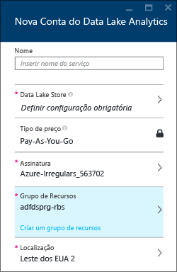
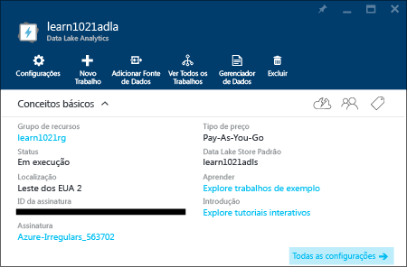
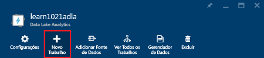
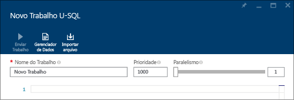
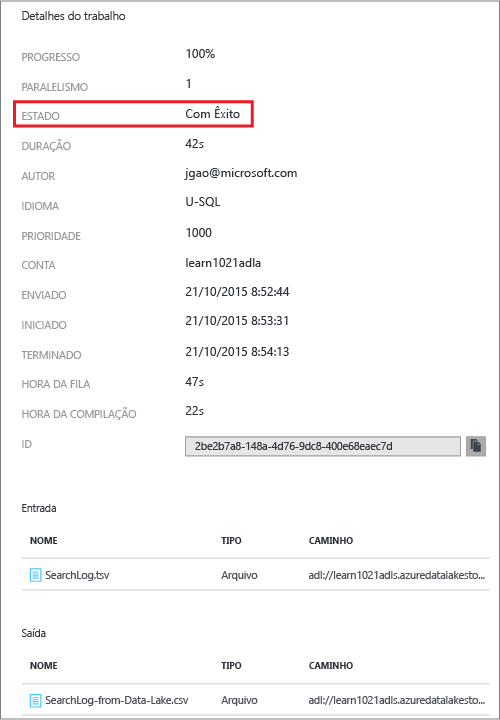
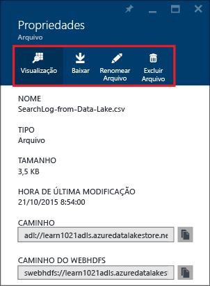

# Tutorial: introdução à Análise do Azure Data Lake usando o Portal do Azure
[!INCLUDE [get-started-selector](../../includes/data-lake-analytics-selector-get-started.md)]

Saiba como usar o Portal do Azure para criar contas da Análise do Azure Data Lake , definir trabalhos da Análise do Data Lake no [U-SQL](data-lake-analytics-u-sql-get-started.md) e enviar trabalhos para contas da Análise do Data Lake. Para saber mais sobre a Análise Data Lake, consulte a [Visão geral da Análise Data Lake do Azure](data-lake-analytics-overview.md).

Neste tutorial, você desenvolverá um trabalho que lê um arquivo TSV (valores separados por tabulação) e o converte em um arquivo CSV (valores separados por vírgulas). Para acompanhar o mesmo tutorial usando outras ferramentas compatíveis, clique nas guias na parte superior desta seção. Após a conclusão bem-sucedida de seu primeiro trabalho, você pode começar a escrever transformações de dados mais complexas com U-SQL.

## Pré-requisitos
Antes de começar este tutorial, você deve ter o seguinte:

* **Uma assinatura do Azure**. Consulte [Obter avaliação gratuita do Azure](https://azure.microsoft.com/pricing/free-trial/).

## Criar conta da Análise Data Lake
Você deve ter uma conta da Análise Data Lake antes de executar trabalhos.

Cada conta da Análise Data Lake tem uma dependência da conta do [Repositório Azure Data Lake](). Essa conta é conhecida como a conta padrão do Repositório Data Lake. Você pode criar a conta do Repositório Data Lake antecipadamente ou ao criar sua conta da Análise Data Lake. Neste tutorial, você criará a conta do Repositório Data Lake com a conta da Análise Data Lake.

**Para criar uma conta da Análise Data Lake**

1. Entre no novo [Portal Clássico do Azure](https://portal.azure.com).
2. Clique em **Novo**, em **Dados + Análise** e clique em **Análise Data Lake**.
3. Digite ou selecione o seguinte:
   
    
   
   * **Nome**: nomeie a conta da Análise.
   * **Repositório Data Lake**: cada conta da Análise Data Lake tem uma conta dependente do Repositório Data Lake. A conta da Análise Data Lake e a conta dependente do Repositório Data Lake devem ser colocadas no mesmo data center do Azure. Siga as instruções para criar uma nova conta do Repositório Data Lake ou selecione uma existente.
   * **Assinatura**: escolha a assinatura do Azure usada para a conta da Análise.
   * **Grupo de Recursos**. Selecione um Grupo de Recursos do Azure existente ou crie um novo. O Gerenciador de Recursos do Azure (ARM) permite que você trabalhe com os recursos em seu aplicativo como um grupo. Para saber mais, consulte [Visão geral do Gerenciador de Recursos do Azure](../resource-group-overview.md).
   * **Local**. Selecione um data center do Azure para a conta da Análise Data Lake.
4. Selecione **Fixar no Quadro Inicial**. Isso é necessário para acompanhar este tutorial.
5. Clique em **Criar**. Ele leva você para o quadro inicial do portal. Um novo bloco é adicionado ao Quadro inicial com o rótulo mostrando “Implantando a Análise Data Lake do Azure”. A criação de uma conta da Análise Data Lake demora alguns minutos. Após a criação da conta, o portal abrirá a conta em uma nova folha.
   
    

Após a criação de uma conta da Análise Data Lake, é possível adicionar outras contas do Repositório Data Lake e contas de Armazenamento do Azure. Para obter instruções, consulte [Gerenciar as fontes de dados da conta da Análise Data Lake](data-lake-analytics-manage-use-portal.md#manage-account-data-sources).

## Preparar dados de origem
Neste tutorial, você processará alguns logs de pesquisa. O log de pesquisa pode ser armazenado no Repositório Data Lake ou no Armazenamento de Blob do Azure.

O Portal do Azure fornece uma interface do usuário para copiar alguns arquivos de dados de exemplo na conta padrão do Data Lake, o que inclui um arquivo de log de pesquisa.

**Para copiar os arquivos de dados de exemplo**

1. No Portal do Azure, clique em **Microsoft Azure** no canto superior esquerdo.
2. Clique no bloco com o nome da conta da Análise Data Lake. Ele foi fixado aqui quando a conta foi criada. Se a conta não estiver fixada nesse local, consulte [Abrir uma conta da Análise Data Lake a partir do portal](data-lake-analytics-manage-use-portal.md#access-adla-account) para abrir a conta.
3. Expanda o painel **Essenciais** e clique em **Explorar exemplos de trabalhos**. Isso abre outra folha chamada **Exemplos de Trabalhos**.
4. Clique em **Copiar Dados de Exemplo** e clique em **OK** para confirmar.
5. Clique em **Notificação**, que é um ícone em forma de sino. Você deverá ver um log mostrando **Atualização de dados de exemplo concluída**. Clique em qualquer lugar fora do painel de notificação para fechá-lo.
6. Na folha da conta da Análise Data Lake, clique em **Gerenciador de Dados** na parte superior.
   
    
   
    Isso abre duas folhas. Uma é o **Gerenciador de Dados** e a outra é a conta padrão do Repositório Data Lake.
7. Na folha da conta padrão do Repositório Data Lake, clique em **Exemplos** para expandir a pasta e clique em **Dados** para expandir a pasta. Você deverá ver os seguintes arquivos e pastas:
   
   * AmbulanceData/
   * AdsLog.tsv
   * SearchLog.tsv
   * version.txt
   * WebLog.log
     
     Neste tutorial, você usará o SearchLog.tsv.

Na prática, você programará seus aplicativos para gravarem dados em uma conta de armazenamento vinculada ou carregar dados. Para carregar arquivos, consulte [Carregar dados no Repositório Data Lake](data-lake-analytics-manage-use-portal.md#upload-data-to-adls) ou [Carregar dados no armazenamento de Blob](data-lake-analytics-manage-use-portal.md#upload-data-to-wasb).

## Criar e enviar trabalhos de Análise Data Lake
Depois de preparar os dados de origem, você pode começar a desenvolver um script U-SQL.

**Para enviar o trabalho**

1. Na folha da conta da Análise Data Lake no portal, clique em **Novo Trabalho**.
   
    
   
    Se você não vir a folha, consulte [Abrir uma conta da Análise Data Lake no Portal](data-lake-analytics-manage-use-portal.md#access-adla-account).
2. Insira o **Nome do Trabalho** e o seguinte script U-SQL:
   
    
   
        @searchlog =
            EXTRACT UserId          int,
                    Start           DateTime,
                    Region          string,
                    Query           string,
                    Duration        int?,
                    Urls            string,
                    ClickedUrls     string
            FROM "/Samples/Data/SearchLog.tsv"
            USING Extractors.Tsv();
   
        OUTPUT @searchlog   
            TO "/Output/SearchLog-from-Data-Lake.csv"
        USING Outputters.Csv();
   
    Este script U-SQL lê o arquivo de dados de origem usando **Extractors.Tsv()** e cria um arquivo .csv usando **Outputters.Csv()**.
   
    Não modifique os dois caminhos, a menos que você copie o arquivo de origem para um local diferente. A Análise Data Lake criará a pasta de saída se ela não existir. Nesse caso, estamos usando caminhos relativos e simples.
   
    É mais simples usar caminhos relativos para arquivos armazenados em contas padrão do Data Lake. Você também pode usar caminhos absolutos. Por exemplo,
   
        adl://<Data LakeStorageAccountName>.azuredatalakestore.net:443/Samples/Data/SearchLog.tsv

    Para saber mais sobre o U-SQL, consulte [Introdução à linguagem U-SQL da Análise Data Lake do Azure](data-lake-analytics-u-sql-get-started.md) e [Referência à linguagem U-SQL](http://go.microsoft.com/fwlink/?LinkId=691348).

1. Clique em **Enviar Trabalho** na parte superior. Um novo painel Detalhes do Trabalho é aberto. Na barra de título, ele mostra o status do trabalho.
2. Aguarde até que o status do trabalho seja alterado para **Êxito**. Após a conclusão do trabalho, o portal abrirá os detalhes do trabalho em uma nova folha:
   
    
   
    Na captura de tela anterior, é possível ver que o trabalho demorou aproximadamente 1,5 minutos para ser concluído, de Enviado para Encerrado.
   
    No caso de falha do trabalho, consulte [Monitorar e solucionar problemas com trabalhos de Análise Data Lake](data-lake-analytics-monitor-and-troubleshoot-jobs-tutorials.md).
3. Na parte inferior da folha **Detalhes do Trabalho**, clique no nome do trabalho em **SearchLog-from-Data-Lake.csv**. Você pode visualizar, baixar, renomear e excluir o arquivo de saída.
   
    
4. Clique em **Visualização** para ver o arquivo de saída.
   
    

## Consulte também
* Para ver uma consulta mais complexa, consulte [Analisar logs de site usando a Análise Data Lake do Azure](data-lake-analytics-analyze-weblogs.md).
* Para começar a desenvolver aplicativos U-SQL, consulte [Desenvolver scripts U-SQL usando as Ferramentas do Data Lake para Visual Studio](data-lake-analytics-data-lake-tools-get-started.md).
* Para aprender a usar o U-SQL, veja [Introdução à linguagem U-SQL da Análise do Azure Data Lake](data-lake-analytics-u-sql-get-started.md).
* Para obter as tarefas de gerenciamento, veja [Gerenciar a Análise do Azure Data Lake usando o Portal do Azure](data-lake-analytics-manage-use-portal.md).
* Para obter uma visão geral da Análise Data Lake, consulte [Visão geral da Análise Data Lake do Azure](data-lake-analytics-overview.md).
* Para ver o mesmo tutorial usando outras ferramentas, clique nos seletores de guias na parte superior da página.
* Para registrar em log as informações de diagnóstico, veja [Acessando os logs de diagnóstico para o Azure Data Lake Analytics](data-lake-analytics-diagnostic-logs.md)

<!----HONumber=AcomDC_0921_2016-->