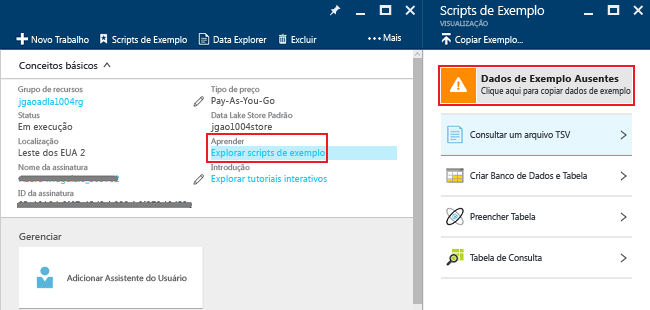

# Tutorial: introdução ao Azure Data Lake Analytics usando o portal do Azure
[!INCLUDE [get-started-selector](../../includes/data-lake-analytics-selector-get-started.md)]

Saiba como usar o portal do Azure para criar contas do Azure Data Lake Analytics, definir trabalhos no [U-SQL](data-lake-analytics-u-sql-get-started.md) e enviar trabalhos ao serviço do Data Lake Analytics. Para saber mais sobre a Análise Data Lake, consulte a [Visão geral da Análise Data Lake do Azure](data-lake-analytics-overview.md).

Neste tutorial, você desenvolverá um trabalho que lê um arquivo TSV (valores separados por tabulação) e o converte em um arquivo CSV (valores separados por vírgulas). Para acompanhar o mesmo tutorial usando outras ferramentas compatíveis, clique nas guias na parte superior desta seção. Após a conclusão bem-sucedida de seu primeiro trabalho, você pode começar a escrever transformações de dados mais complexas com U-SQL.

## Pré-requisitos
Antes de começar este tutorial, você deve ter os seguintes itens:

* **Uma assinatura do Azure**. Consulte [Obter avaliação gratuita do Azure](https://azure.microsoft.com/pricing/free-trial/).

## Criar conta da Análise Data Lake
Você deve ter uma conta da Análise Data Lake antes de executar trabalhos.

Cada conta do Data Lake Analytics tem uma dependência da conta do Azure Data Lake Store.  Essa conta é conhecida como a conta padrão do Repositório Data Lake.  Você pode criar a conta do Repositório Data Lake antecipadamente ou ao criar sua conta da Análise Data Lake. Neste tutorial, você criará a conta do Repositório Data Lake com a conta da Análise Data Lake.

**Criar uma conta do Data Lake Analytics**

1. Entre no [portal do Azure](https://portal.azure.com).
2. Clique em **Novo**, **Inteligência + Análises**, em seguida, clique em **Data Lake Analytics**.
3. Digite ou selecione os valores a seguir:

    

   * **Nome**: Nome de sua conta do Data Lake Analytics (são permitidos somente letras minúsculas e números).
   * **Assinatura**: escolha a assinatura do Azure usada para a conta da Análise.
   * **Grupo de Recursos**. Selecione um Grupo de Recursos do Azure existente ou crie um novo. O Gerenciador de Recursos do Azure permite trabalhar com os recursos do seu aplicativo como um grupo. Para saber mais, consulte [Visão geral do Gerenciador de Recursos do Azure](../azure-resource-manager/resource-group-overview.md).
   * **Local**. Selecione um datacenter do Azure para a conta da Análise Data Lake.
   * **Data Lake Store**: Clique em *Definir configurações necessárias*. Siga as instruções para criar uma nova conta do Repositório Data Lake ou selecione uma existente. Cada conta do Data Lake Analytics tem uma conta dependente da Data Lake Store. A conta da Análise Data Lake e a conta dependente do Repositório Data Lake devem ser colocadas no mesmo data center do Azure.
4. Selecione seu Tipo de Preço  
5. Clique em **Criar**. Você volta à tela inicial do portal, onde é exibido um novo bloco, mostrando "Implantando o Azure Data Lake Analytics". O processo de implantação levará alguns minutos para criar uma conta do Data Lake Analytics. Após a criação da conta, o portal abrirá a conta em uma nova folha.

Após a criação de uma conta da Análise Data Lake, é possível adicionar outras contas do Repositório Data Lake e contas de Armazenamento do Azure. Para obter instruções, consulte [Gerenciar as fontes de dados da conta da Análise Data Lake](data-lake-analytics-manage-use-portal.md#manage-account-data-sources).

## Preparar dados de origem
Neste tutorial, você processará logs de pesquisa.  O log de pesquisa pode ser armazenado no Repositório Data Lake ou no Armazenamento de Blob do Azure.

O portal do Azure fornece uma interface do usuário para copiar arquivos de dados de exemplo para a conta padrão do Data Lake Store, o que inclui um arquivo de log de pesquisa.

**Copiar arquivos de dados de exemplo**

1. No [Portal do Azure](https://portal.azure.com), abra sua conta do Data Lake Analytics.  Confira [Gerenciar contas do Data Lake Analytics](data-lake-analytics-get-started-portal.md#create-data-lake-analytics-account) para criar uma e abrir a conta no portal.
2. Expanda o painel **Essentials**, em seguida, clique em **Explorar scripts de exemplo**. Isso abre outra folha denominada **Scripts de Exemplo** .

    
3. Clique em **Dados de Exemplo Ausentes** para copiar os arquivos de dados de exemplo. Quando estiver pronto, o portal mostrará **Dados de exemplo atualizados com êxito**.
4. Na folha da conta da Análise Data Lake, clique em **Gerenciador de Dados** na parte superior.

    

    Isso abre duas folhas. Uma é o **Gerenciador de Dados**e a outra é a conta padrão do Repositório Data Lake.
5. Na folha da conta padrão do Data Lake Store, clique em **Exemplos** para expandir a pasta e clique em **Dados** para expandir a pasta. Você deverá ver os seguintes arquivos e pastas:

   * AmbulanceData/
   * AdsLog.tsv
   * SearchLog.tsv
   * version.txt
   * WebLog.log

     Neste tutorial, você usará o SearchLog.tsv.

Na prática, você programará seus aplicativos para gravar os dados em uma conta de armazenamento vinculada ou carregará os dados. Para carregar os arquivos, consulte [Carregar dados no Data Lake Store](data-lake-analytics-manage-use-portal.md#upload-data-to-adls) ou [Carregar dados no armazenamento de Blobs](data-lake-analytics-manage-use-portal.md#upload-data-to-wasb).

## Criar e enviar trabalhos de Análise Data Lake
Depois de preparar os dados de origem, você pode começar a desenvolver um script U-SQL.  

**Para enviar um trabalho**

1. Na folha da conta da Análise Data Lake no portal, clique em **Novo Trabalho**.

    

    Se você não vir a folha, consulte [Abrir uma conta da Análise Data Lake no Portal](data-lake-analytics-manage-use-portal.md#access-adla-account).
2. Insira o **Nome do Trabalho**e o seguinte script U-SQL:

        @searchlog =
            EXTRACT UserId          int,
                    Start           DateTime,
                    Region          string,
                    Query           string,
                    Duration        int?,
                    Urls            string,
                    ClickedUrls     string
            FROM "/Samples/Data/SearchLog.tsv"
            USING Extractors.Tsv();

        OUTPUT @searchlog   
            TO "/Output/SearchLog-from-Data-Lake.csv"
        USING Outputters.Csv();

    

    Este script U-SQL lê o arquivo de dados de origem usando **Extractors.Tsv()**, em seguida, cria um arquivo csv usando **Outputters.Csv()**.

    Não modifique os dois caminhos, a menos que você copie o arquivo de origem para um local diferente.  O Data Lake Analytics criará a pasta de saída se ela não existir.  Nesse caso, estamos usando caminhos relativos e simples.  

    É mais simples usar caminhos relativos para arquivos armazenados em contas padrão do Data Lake. Você também pode usar caminhos absolutos.  Por exemplo,

        adl://<Data LakeStorageAccountName>.azuredatalakestore.net:443/Samples/Data/SearchLog.tsv

    Para obter mais informações sobre o U-SQL, consulte [Introdução à linguagem U-SQL do Azure Data Lake Analytics ](data-lake-analytics-u-sql-get-started.md) e [Referência da linguagem SQL-U](http://go.microsoft.com/fwlink/?LinkId=691348).

1. Clique em **Enviar Trabalho** na parte superior.   
2. Aguarde até que o status do trabalho seja alterado para **Êxito**. Você pode ver que o trabalho levou cerca de um minuto para ser concluído.

    No caso de falha do trabalho, consulte [Monitorar e solucionar problemas dos trabalhos do Data Lake Analytics ](data-lake-analytics-monitor-and-troubleshoot-jobs-tutorial.md).
3. Na parte inferior da folha, clique na guia **Saída**, em seguida, clique em **SearchLog-from-Data-Lake.csv**. Você pode visualizar, baixar, renomear e excluir o arquivo de saída.

    

## Consulte também
* Para ver uma consulta mais complexa, consulte [Analisar logs de site usando a Análise Data Lake do Azure](data-lake-analytics-analyze-weblogs.md).
* Para começar a desenvolver aplicativos U-SQL, consulte [Desenvolver scripts U-SQL usando as Ferramentas do Data Lake para Visual Studio](data-lake-analytics-data-lake-tools-get-started.md).
* Para aprender a usar o U-SQL, veja [Introdução à linguagem U-SQL da Análise do Azure Data Lake](data-lake-analytics-u-sql-get-started.md).
* Para obter as tarefas de gerenciamento, confira [Gerenciar o Azure Data Lake Analytics usando o portal do Azure](data-lake-analytics-manage-use-portal.md).
* Para obter uma visão geral da Análise do Data Lake, veja [Visão geral da Análise do Azure Data Lake](data-lake-analytics-overview.md).
* Para ver o mesmo tutorial usando outras ferramentas, clique nos seletores de guias na parte superior da página.
* Para registrar em log as informações de diagnóstico, veja [Acessando os logs de diagnóstico para o Azure Data Lake Analytics](data-lake-analytics-diagnostic-logs.md)

