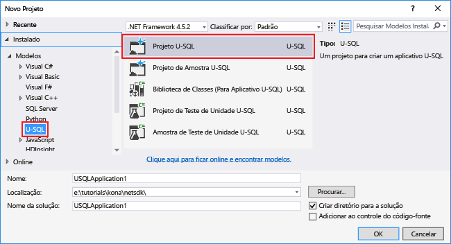

<properties 
   pageTitle="Desenvolver operadores do U-SQL definidos pelo usuário para trabalhos da Análise Azure Data Lake | Azure" 
   description="Saiba como desenvolver operadores definidos pelo usuário para serem usados e reutilizados em trabalhos da Análise Data Lake." 
   services="data-lake-analytics" 
   documentationCenter="" 
   authors="edmacauley" 
   manager="paulettm" 
   editor="cgronlun"/>
 
<tags
   ms.service="data-lake-analytics"
   ms.devlang="na"
   ms.topic="article"
   ms.tgt_pltfrm="na"
   ms.workload="big-data" 
   ms.date="05/16/2016"
   ms.author="edmaca"/>

# Desenvolver operadores do U-SQL definidos pelo usuário para trabalhos da Análise Azure Data Lake

Saiba como desenvolver operadores definidos pelo usuário para serem usados e reutilizados em trabalhos da Análise Data Lake. Você desenvolverá um operador personalizado para converter nomes de países.

##Pré-requisitos

- Visual Studio 2015, Visual Studio 2013 atualização 4 ou Visual Studio 2012 com Visual C++ instalado 
- SDK do Microsoft Azure para .NET versão 2.5 ou posterior. Instale-o usando o Web Platform Installer.
- Uma conta da Análise Data Lake. Veja [Introdução à Análise do Azure Data Lake usando o Portal do Azure](data-lake-analytics-get-started-portal.md).
- Acompanhe o tutorial [Introdução ao U-SQL Studio da Análise Azure Data Lake](data-lake-analytics-u-sql-get-started.md).
- Conectar-se ao Azure, veja [Introdução ao U-SQL Studio da Análise Azure Data Lake](data-lake-analytics-u-sql-get-started.md#connect-to-azure). 
- Carregar os dados de origem, veja [Introdução ao U-SQL Studio da Análise Azure Data Lake](data-lake-analytics-u-sql-get-started.md#upload-source-data-files). 

## Definir e usar o operador definido pelo usuário no U-SQL

**Para criar e enviar um trabalho do U-SQL**

1. No menu **Arquivo**, clique em **Novo** e em **Projeto**.
2. Escolha o tipo **Projeto U-SQL**.

	

3. Clique em **OK**. O Visual Studio cria uma solução com um arquivo Script.usql.
4. No **Gerenciador de Soluções**, expanda Script.usql e clique duas vezes em **Script.usql.cs**.
5. Cole o seguinte código no arquivo:

		using Microsoft.Analytics.Interfaces;
		using System.Collections.Generic;
		
		namespace USQL_UDO
		{
			public class CountryName : IProcessor
			{
				private static IDictionary<string, string> CountryTranslation = new Dictionary<string, string>
				{
					{
						"Deutschland", "Germany"
					},
					{
						"Schwiiz", "Switzerland"
					},
					{
						"UK", "United Kingdom"
					},
					{
						"USA", "United States of America"
					},
					{
						"中国", "PR China"
					}
				};
		
				public override IRow Process(IRow input, IUpdatableRow output)
				{
		
					string UserID = input.Get<string>("UserID");
					string Name = input.Get<string>("Name");
					string Address = input.Get<string>("Address");
					string City = input.Get<string>("City");
					string State = input.Get<string>("State");
					string PostalCode = input.Get<string>("PostalCode");
					string Country = input.Get<string>("Country");
					string Phone = input.Get<string>("Phone");
		
					if (CountryTranslation.Keys.Contains(Country))
					{
						Country = CountryTranslation[Country];
					}
					output.Set<string>(0, UserID);
					output.Set<string>(1, Name);
					output.Set<string>(2, Address);
					output.Set<string>(3, City);
					output.Set<string>(4, State);
					output.Set<string>(5, PostalCode);
					output.Set<string>(6, Country);
					output.Set<string>(7, Phone);
		
					return output.AsReadOnly();
				}
			}
		}

5. Abra o Script.usql e cole o seguinte script U-SQL:

		@drivers =
			EXTRACT UserID      string,
					Name        string,
					Address     string,
					City        string,
					State       string,
					PostalCode  string,
					Country     string,
					Phone       string
			FROM "/Samples/Data/AmbulanceData/Drivers.txt"
			USING Extractors.Tsv(Encoding.Unicode);
		
		@drivers_CountryName =
			PROCESS @drivers
			PRODUCE UserID string,
					Name string,
					Address string,
					City string,
					State string,
					PostalCode string,
					Country string,
					Phone string
			USING new USQL_UDO.CountryName();    
		
		OUTPUT @drivers_CountryName
			TO "/Samples/Outputs/Drivers.csv"
			USING Outputters.Csv(Encoding.Unicode);

6. No **Gerenciador de Soluções**, clique com o botão direito do mouse em **Script.usql** e clique em **Criar Script**.
6. No **Gerenciador de Soluções**, clique com o botão direito do mouse em **Script.usql** e clique em **Enviar Script**.
7. Se você ainda não se conectou à sua assinatura do Azure, você será solicitado a inserir suas credenciais de conta do Azure.
7. Clique em **Enviar**. Os resultados do envio e o link do trabalho estarão disponíveis na janela Resultados quando o envio for concluído.
8. Clique no botão Atualizar para ver o status do trabalho mais recente e atualizar a tela.

**Para ver a saída do trabalho**

1. No **Gerenciador de Servidores**, expanda **Azure**, expanda **Análise Data Lake**, expanda sua conta da Análise Data Lake, expanda **Contas de Armazenamento**, clique com o botão direito do mouse no Armazenamento Padrão e clique em **Gerenciador**. 
2. Expanda Exemplos, expanda Saídas e clique duas vezes em **Drivers.csv**.

##Consulte também

- [Introdução à Análise Data Lake usando o PowerShell](data-lake-analytics-get-started-powershell.md)
- [Introdução à Análise Data Lake usando o portal do Azure](data-lake-analytics-get-started-portal.md)
- [Usar as Ferramentas do Data Lake para Visual Studio para desenvolver aplicativos do U-SQL](data-lake-analytics-data-lake-tools-get-started.md)

<!---HONumber=AcomDC_0615_2016-->