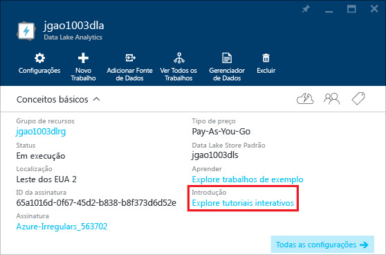

<properties 
   pageTitle="Saiba como usar a Análise do Data Lake e o U-SQL usando os tutoriais interativos do Portal do Azure | Azure" 
   description="Início rápido para aprender a usar a Análise Data Lake e o U-SQL." 
   services="data-lake-analytics" 
   documentationCenter="" 
   authors="edmacauley" 
   manager="paulettm" 
   editor="cgronlun"/>
 
<tags
   ms.service="data-lake-analytics"
   ms.devlang="na"
   ms.topic="get-started-article"
   ms.tgt_pltfrm="na"
   ms.workload="big-data" 
   ms.date="05/16/2016"
   ms.author="edmaca"/>

# Usar tutoriais interativos da Análise Azure Data Lake

O Portal do Azure fornece um tutorial interativo para você começar a usar a Análise do Data Lake. Este artigo mostra como acompanhar o tutorial para analisar logs de site.

>[AZURE.NOTE] Se desejar acompanhar o mesmo tutorial usando o Visual Studio, veja [Analisar logs de site usando a Análise Data Lake](data-lake-analytics-analyze-weblogs.md). Mais tutoriais interativos serão adicionados ao portal.

Para ver outros tutoriais, confira:

- [Introdução à Análise do Data Lake usando o Portal do Azure](data-lake-analytics-get-started-portal.md)
- [Introdução à Análise Data Lake usando o Azure PowerShell](data-lake-analytics-get-started-powershell.md)
- [Introdução à Análise Data Lake usando o SDK do .NET](data-lake-analytics-get-started-net-sdk.md)
- [Desenvolver scripts U-SQL usando as Ferramentas do Data Lake para Visual Studio](data-lake-analytics-data-lake-tools-get-started.md) 

**Pré-requisitos**

Antes de começar este tutorial, você deve ter o seguinte:

- **Uma conta da Análise Data Lake**. Veja [Introdução à Análise do Azure Data Lake usando o Portal do Azure](data-lake-analytics-get-started-portal.md).

##Criar conta da Análise Data Lake 

Você deve ter uma conta da Análise Data Lake antes de executar trabalhos.

Cada conta da Análise Data Lake tem uma dependência da conta do [Repositório Azure Data Lake](../data-lake-store/data-lake-store-overview.md). Essa conta é conhecida como a conta padrão do Repositório Data Lake. Você pode criar a conta do Repositório Data Lake antecipadamente ou ao criar sua conta da Análise Data Lake. Neste tutorial, você criará a conta do Repositório Data Lake com a conta da Análise

**Para criar uma conta da Análise Data Lake**

1. Entre no [Portal do Azure](https://portal.azure.com/signin/index/?Microsoft_Azure_Kona=true&Microsoft_Azure_DataLake=true&hubsExtension_ItemHideKey=AzureDataLake_BigStorage%2cAzureKona_BigCompute).
2. Clique em **Microsoft Azure** no canto superior esquerdo para abrir o quadro inicial.
3. Clique no bloco **Marketplace**.  
3. Digite **Análise Azure Data Lake** na caixa de pesquisa na folha **Tudo** e pressione a tecla **ENTER**. Você deverá ver **Análise Azure Data Lake** na lista.
4. Clique em **Análise Azure Data Lake** na lista.
5. Clique em **Criar** na parte inferior da folha.
6. Digite ou selecione o seguinte:

    

	- **Nome**: nomeie a conta da Análise.
	- **Repositório Data Lake**: cada conta da Análise Data Lake tem uma conta dependente do Repositório Data Lake. A conta da Análise Data Lake e a conta dependente do Repositório Data Lake devem ser colocadas no mesmo data center do Azure. Siga as instruções para criar uma nova conta do Repositório Data Lake ou selecione uma existente.
	- **Assinatura**: escolha a assinatura do Azure usada para a conta da Análise.
	- **Grupo de Recursos**. Selecione um Grupo de Recursos do Azure existente ou crie um novo. Aplicativos normalmente são compostos por vários componentes, como, por exemplo, um aplicativo Web, banco de dados, servidor de banco de dados, armazenamento e serviços de terceiros. O Gerenciador de Recursos do Azure (ARM) permite trabalhar com os recursos do seu aplicativo como um grupo, designado um Grupo de Recursos do Azure. Você pode implantar, atualizar, monitorar ou excluir todos os recursos do seu aplicativo com uma única operação coordenada. Usar um modelo para a implantação e esse modelo pode ser útil para ambientes diferentes, como teste, preparação e produção. Você pode esclarecer a cobrança para sua organização exibindo os custos acumulados para todo o grupo. Para obter mais informações, veja [Visão geral do Gerenciador de Recursos do Azure](resource-group-overview.md). 
	- **Local**. Selecione um datacenter do Azure para a conta da Análise Data Lake. 
7. Selecione **Fixar no quadro inicial**. Isso é necessário para acompanhar este tutorial.
8. Clique em **Criar**. Ele leva você para o quadro inicial do portal. Um novo bloco é adicionado à Home page com o rótulo mostrando “Implantando a Análise Azure Data Lake”. Leva alguns minutos para criar uma conta da Análise Data Lake. Após a criação da conta, o portal abrirá a conta em uma nova folha.

	

##Executar o tutorial interativo da Análise de log de site

**Para abrir o tutorial interativo da Análise de log de site**

1. No Portal, clique em **Microsoft Azure** no menu à esquerda para abrir o quadro inicial.
2. Clique no bloco que está vinculado à sua conta da Análise Data Lake.
3. Clique em **Explorar tutoriais interativos** na barra **Noções Básicas**.

	

4. Se você receber um aviso laranja informando “Exemplos não configurados, clique em...”, clique em **Copiar Dados de Exemplo** para copiar os dados de exemplo na conta padrão do Repositório Data Lake. O tutorial interativo precisa de dados para ser executado.
5. Na folha **Tutoriais Interativos**, clique em **Análise de Log do Site**. O portal abre o tutorial em uma nova folha do portal.
5. Clique em **1 Introdução** e siga as instruções

##Consulte também

- [Visão geral da Análise do Microsoft Azure Data Lake](data-lake-analytics-overview.md)
- [Introdução à Análise do Data Lake usando o Portal do Azure](data-lake-analytics-get-started-portal.md)
- [Introdução à Análise Data Lake usando o Azure PowerShell](data-lake-analytics-get-started-powershell.md)
- [Desenvolver scripts U-SQL usando as Ferramentas do Data Lake para Visual Studio](data-lake-analytics-data-lake-tools-get-started.md)
- [Analisar logs de site usando a Análise Azure Data Lake](data-lake-analytics-analyze-weblogs.md)

<!---HONumber=AcomDC_0615_2016-->