<properties
   pageTitle="Visão geral do controle de acesso no Data Lake Store | Microsoft Azure"
   description="Compreenda como controlar o acesso no Azure Data Lake Store"
   services="data-lake-store"
   documentationCenter=""
   authors="nitinme"
   manager="jhubbard"
   editor="cgronlun"/>

<tags
   ms.service="data-lake-store"
   ms.devlang="na"
   ms.topic="get-started-article"
   ms.tgt_pltfrm="na"
   ms.workload="big-data"
   ms.date="09/06/2016"
   ms.author="nitinme"/>

# Controle de acesso no Azure Data Lake Store

O Data Lake Store implementa um modelo de controle de acesso que deriva do HDFS e, por sua vez, do modelo de controle de acesso do POSIX. Este artigo resume as noções básicas do modelo de controle de acesso para o Data Lake Store. Para saber mais sobre o modelo de controle de acesso do HDFS, veja [Guia de permissões do HDFS](https://hadoop.apache.org/docs/current/hadoop-project-dist/hadoop-hdfs/HdfsPermissionsGuide.html).

## Listas de controle de acesso em arquivos e pastas

Há dois tipos de listas de controle de acesso (ACLs) - **ACLs de Acesso** e **ACLs Padrão**.

* **ACLs de Acesso** – controlam o acesso a um objeto. Os Arquivos e as Pastas têm ACLs de Acesso.

* **ACLs Padrão** – um "modelo" de ACLs associadas a uma pasta que determinam as ACLs de Acesso para todos os itens filhos criados nessa pasta. Os Arquivos não têm ACLs Padrão.

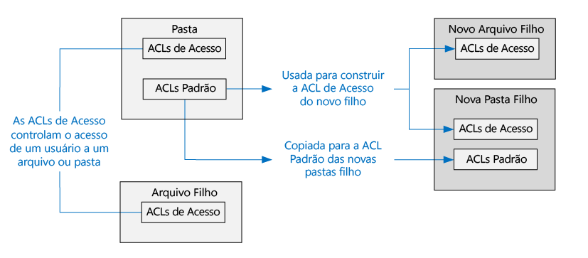

As ACLs de Acesso e as ACLs Padrão têm a mesma estrutura.

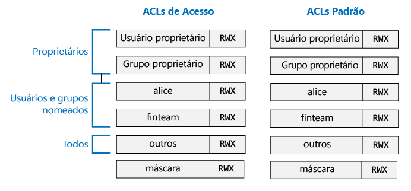

>[AZURE.NOTE] Alterar a ACL Padrão em um pai não afeta o a ACL de Acesso ou a ACL Padrão de itens filhos já existentes.

## Usuários e identidades

Todos os arquivos e pastas têm permissões diferentes para estas identidades:

* O usuário proprietário do arquivo
* O grupo proprietário
* Usuários nomeados
* Grupos nomeados
* Todos os outros usuários

As identidades dos usuários e dos grupos são as identidades do Azure Active Directory (AAD) e, a menos que indicado de outra forma como um "usuário", no contexto do Data Lake Store, isso poderia significar um usuário do AAD ou um grupo de segurança do AAD.

## Permissões

As permissões em um objeto do sistema de arquivos são **Ler**, **Gravar** e **Executar** e podem ser usadas em arquivos e em pastas como mostrado na tabela a seguir.

| | Arquivo | Pasta |
|------------|-------------|----------|
| **Ler (R)** | Pode ler o conteúdo de um arquivo | Requer **Ler** e **Executar** para listar o conteúdo da pasta.|
| **Gravar (W)** | Pode gravar ou anexar a um arquivo | Requer **Gravar e Executar** para criar itens filhos em uma pasta. |
| **Executar (X)** | Não significa nada no contexto do Data Lake Store | Necessário para percorrer os itens filhos de uma pasta. |

### Formatos abreviados para permissões

**RWX**é usado para indicar **Ler + Gravar + Executar**. Existe um formato numérico mais condensado na qual **Ler = 4**, **Gravar = 2** e **Executar = 1** e sua soma representa as permissões. Veja abaixo alguns exemplos.

| Formato numérico | Formato curto | O que significa |
|--------------|------------|------------------------|
| 7 | RWX | Ler + Gravar + Executar |
| 5 | R-X | Ler + Executar |
| 4 | R-- | Ler |
| 0 | --- | Nenhuma permissão |

### Não herdam permissões

No modelo de estilo POSIX usado pelo Data Lake Store, as permissões para um item são armazenadas no próprio item. Em outras palavras, as permissões para um item não podem ser herdadas dos itens pais.

## Cenários comuns relacionados a permissões

Aqui estão alguns cenários comuns para entender quais permissões são necessárias para executar determinadas operações em uma conta do Data Lake Store.

### Permissões necessárias para ler um arquivo

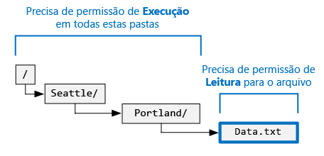

* Para o arquivo a ser lido - o chamador precisa de permissões **Ler**
* Para todas as pastas na estrutura de pastas que contêm o arquivo - o chamador precisa de permissões **Executar**

### Permissões necessárias para anexar a um arquivo

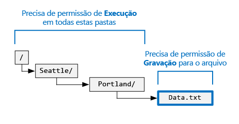

* Para o arquivo ao qual será anexado - o chamador precisa de permissões **Gravar**
* Para todas as pastas que contêm o arquivo - o chamador precisa de **Executar**

### Permissões necessárias para excluir um arquivo

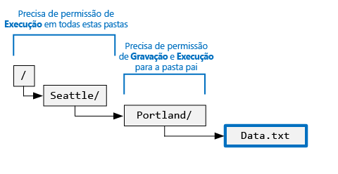

* Para a pasta pai - o chamador precisa de permissões **Gravar + Executar**
* Para todas as outras pastas no caminho do arquivo - o chamador precisa de permissões **Executar**

>[AZURE.NOTE] As permissões Gravar no arquivo não são necessárias para excluir o arquivo, desde que as duas condições acima sejam verdadeiras.

### Permissões necessárias para enumerar uma pasta

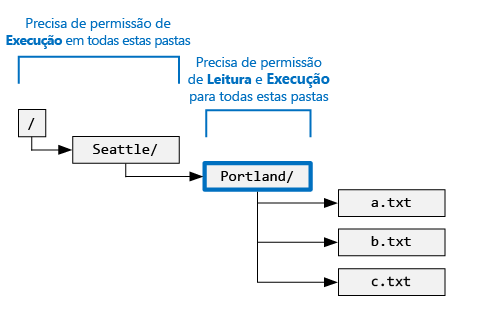

* Para a pasta a ser enumerada - o chamador precisa de permissões **Ler + Executar** permissões
* Para todas as pastas do ancestral - o chamador precisa de permissões **Executar**

## Exibição de permissões no portal do Azure

Da folha **Data Explorer** da conta do Data Lake Store, clique em **Acesso** para ver as ACLs de um arquivo ou de uma pasta. Na captura de tela abaixo, clique em Acesso para ver as ACLs para a pasta **catálogo** sob a conta **mydatastore**.

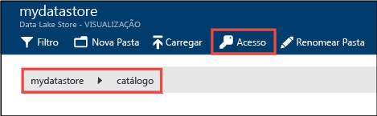

Depois disso, da folha **Acesso**, clique em **Exibição Simples** para ver a exibição mais simples.

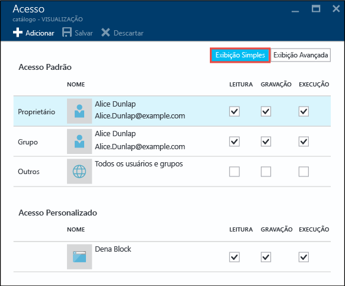

Clique em **Exibição Avançada** para ver a exibição mais avançada.

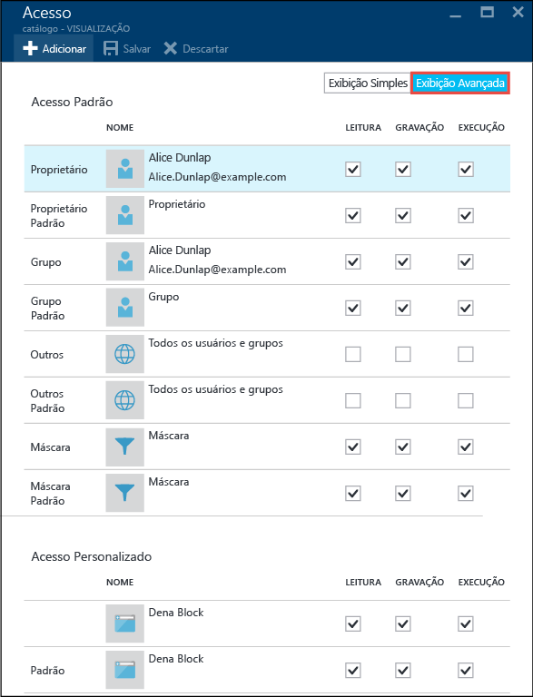

## O superusuário

Um superusuário é aquele que tem mais direitos no Data Lake Store. Um superusuário:

* tem Permissões RWX para **todos** os arquivos e pastas
* pode alterar as permissões em qualquer arquivo ou pasta.
* pode alterar o usuário proprietário ou o grupo proprietário de qualquer arquivo ou pasta.

No Azure, uma conta do Data Lake Store tem diversas funções do Azure:

* Proprietários
* Colaboradores
* Leitores
* Etc.

Todos na função **Proprietários** para uma conta do Data Lake Store se tornam automaticamente superusuários para essa conta. Para saber mais sobre o Controle de Acesso Baseado em Função (RBAC) do Azure, veja [Controle de acesso baseado em função](../active-directory/role-based-access-control-configure.md).

## O usuário proprietário

O usuário que criou o item é automaticamente o usuário proprietário do item. Um usuário proprietário pode:

* Alterar as permissões de um arquivo pertencente
* Alterar o grupo proprietário de um arquivo pertencente, contanto que o usuário proprietário também seja membro do grupo de destino.

>[AZURE.NOTE] O usuário proprietário **não pode** alterar o usuário proprietário de outro arquivo pertencente. Somente superusuários podem alterar o usuário proprietário de um arquivo ou pasta.

## O grupo proprietário

Nas ACLs do POSIX, cada usuário está associado a um "grupo primário". Por exemplo, o usuário "alice" pode pertencer ao grupo "finanças". Alice pode pertencer a vários grupos, mas um grupo será sempre designado como o grupo primário dela. No POSIX, quando Alice cria um arquivo, o grupo proprietário desse arquivo é definido como o grupo primário que, nesse caso, é "finanças".
 
Quando um novo item do sistema de arquivos é criado, o Data Lake Store atribui um valor para o grupo proprietário.

* **Caso 1** - a pasta raiz "/". Essa pasta é criada quando uma conta do Data Lake Store é criada. Nesse caso, o grupo proprietário é definido para o usuário que criou a conta.
* **Caso 2** (todos os outros casos) - quando um novo item é criado, o grupo proprietário é copiado da pasta pai.

O grupo proprietário pode ser alterado por:
* Todos os superusuários
* O usuário proprietário, se o usuário proprietário também for membro do grupo de destino.

## Algoritmo de verificação de acesso

A ilustração a seguir representa o algoritmo de verificação de acesso para contas do Data Lake Store.

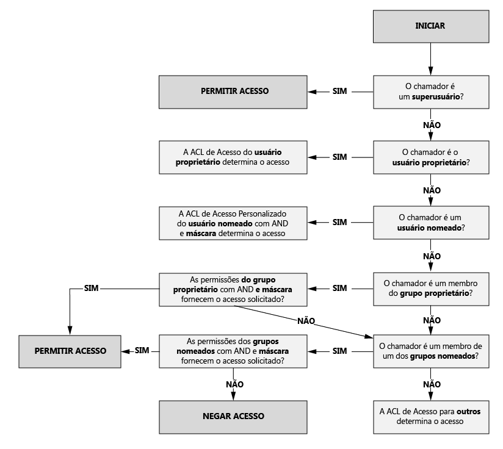

## A máscara e as "permissões efetivas"

A **mask** é um valor RWX usado para limitar o acesso para **usuários nomeados**, o **grupo proprietário** e os **grupos nomeados** durante a execução do algoritmo de Verificação de Acesso. Aqui estão os principais conceitos de mask.

* Mask cria "permissões efetivas", ou seja, modifica as permissões no momento da Verificação de Acesso.
* Mask pode ser editada diretamente pelo proprietário do arquivo e por todos os superusuários.
* A mask tem a capacidade de remover permissões para criar a permissão efetiva. A mask **não pode** adicionar permissões à permissão efetiva.

Vejamos alguns exemplos. A seguir, mask é definida como **RWX**, o que significa que ela não remove todas as permissões. Observe que as permissões efetivas para o usuário nomeado, o grupo proprietário e o grupo nomeado não são alteradas durante a verificação de acesso.

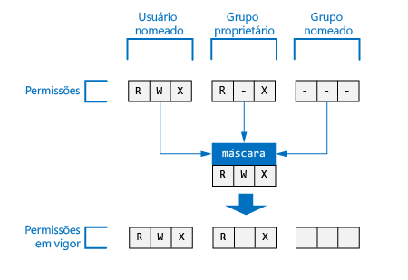

No exemplo a seguir, maks é definida como **R-X**. Assim, ela **desativa a permissão Gravar** para o **usuário nomeado**, o **grupo proprietário** e o **grupo nomeado** no momento da verificação de acesso.

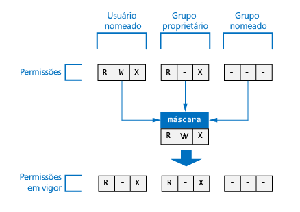

Para referência, é aqui onde mask para um arquivo ou pasta aparece no portal do Azure.

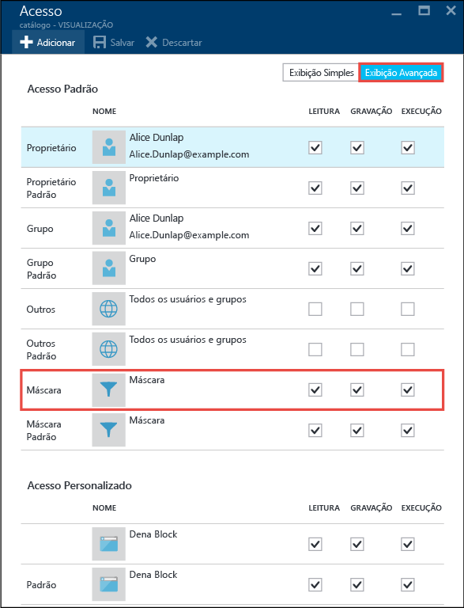

>[AZURE.NOTE] Para uma nova conta do Data Lake Store, a mask da ACL de Acesso e a ACL Padrão da pasta raiz ("/") têm RWX como padrão.

## Permissões em novos arquivos e pastas

Quando um novo arquivo ou pasta é criado em uma pasta existente, a ACL Padrão na pasta pai determina:

* ACL Padrão e ACL de Acesso de uma pasta filho
* ACL de Acesso de um arquivo filho (os arquivos não têm uma ACL Padrão)

### ACL de Acesso de um arquivo ou de uma pasta filho

Quando uma pasta ou um arquivo filho é criada, a ACL Padrão do pai é copiada como a ACL de Acesso do arquivo ou da pasta filho. Além disso, se **outro** usuário tiver permissões RWX na ACL Padrão do pai, elas serão completamente removidas da ACL de Acesso do item filho.

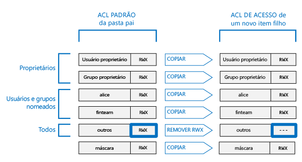

Na maioria dos cenários, as informações acima são tudo o que você precisa saber sobre como a ACL de Acesso de um item filho é determinada. No entanto, se você estiver familiarizado com sistemas POSIX e quiser entender com detalhes como essa transformação é obtida, veja a seção [A função umask na criação da ACL de Acesso para arquivos e pastas novos](#umasks-role-in-creating-the-access-acl-for-new-files-and-folders) posteriormente neste artigo.
 

### ACL Padrão de uma pasta filho

Quando uma pasta filho é criada em uma pasta pai, a ACL Padrão da pasta pai é copiado como está, para a ACL Padrão da pasta filho.

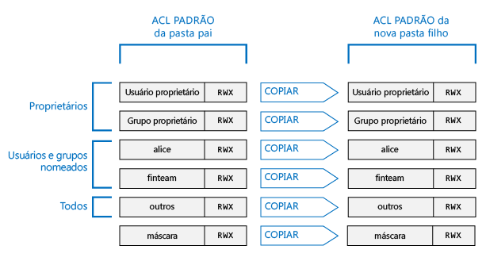

## Tópicos avançados para compreender as ACLs no Data Lake Store

A seguir, alguns tópicos avançados para ajudar você a entender como as ACLs são determinadas para arquivos ou pastas do Data Lake Store.

### Função umask na criação da ACL de Acesso para arquivos e pastas

Em um sistema compatível com POSIX, o conceito geral é que umask é um valor de 9 bits na pasta pai usado para transformar a permissão para **usuário proprietário**, **grupo proprietário** e **outros** na ACL de Acesso de um novo arquivo ou pasta filho. Os bits de uma umask identificam quais bits devem ser desativados na ACL de Acesso do item filho. Dessa forma, é usado para impedir a propagação de permissões para o usuário proprietário, o grupo proprietário e outros.
  
Em um sistema HDFS, umask normalmente é uma opção de configuração de todo o site que é controlada pelos administradores. O Data Lake Store usa uma **umask de toda a conta** que não pode ser alterada. A tabela a seguir mostra a umask do Data Lake Store.

| Grupo de usuários | Configuração | Efeito na ACL de Acesso de um novo item filho |
|------------ |---------|---------------------------------------|
| Usuário proprietário | --- | Sem efeito | | Grupo proprietário | --- | Sem efeito | | Outros | RWX | Remover Ler + Gravar + Executar |

A ilustração a seguir mostra esta umask em ação. O efeito líquido é remover **Ler + Gravar + Executar** para **outro** usuário. Uma vez que a umask não especificou bits para o **usuário proprietário** e o **grupo proprietário**, essas permissões não são transformadas.

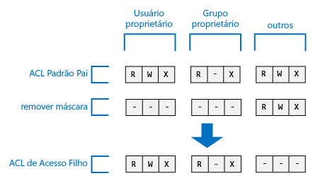

### O sticky bit

O sticky bit é um recurso mais avançado de um sistema de arquivos POSIX. No contexto do Data Lake Store, é improvável que o sticky bit seja necessário.

A tabela a seguir mostra como o sticky bit funciona no Data Lake Store.

| Grupo de usuários | Arquivo | Pasta |
|--------------------|---------|-------------------------|
| Sticky bit **DESATIVADO** | Sem efeito | Sem efeito |
| Sticky bit **ATIVADO** | Sem efeito | Impede que alguém, exceto os **superusuários** e o **usuário proprietário** de um item filho, exclua ou renomeie o item filho. |

O sticky bit não é mostrado no Portal do Azure.

## Perguntas comuns sobre as ACLs no Data Lake Store

Aqui estão algumas perguntas que surgem com frequência em relação às ACLs no Data Lake Store.

### É necessário habilitar o suporte para ACLs?

Não. O controle de acesso via ACLs está sempre ativado para uma conta do Data Lake Store.

### Quais são as permissões necessárias para excluir recursivamente uma pasta e seu conteúdo?

* A pasta pai deve ter **Gravar + Executar**.
* A pasta a ser excluída, e todas as pastas nela, exige **Ler + Gravar + Executar**.
>[AZURE.NOTE] A exclusão dos arquivos em pastas não exige Gravar nesses arquivos. Além disso, a pasta raiz "/" **nunca** poderá ser excluída.

### Quem é definido como o proprietário de um arquivo ou pasta?

O criador de um arquivo ou pasta se torna o proprietário.

### Quem é definido como o grupo proprietário de um arquivo ou pasta na criação?

Ele é copiado do grupo proprietário da pasta pai na qual o novo arquivo ou pasta é criado.

### Eu sou o usuário proprietário de um arquivo, mas não tenho as permissões RWX de que necessito. O que devo fazer?

O usuário proprietário pode simplesmente alterar as permissões do arquivo para atribuir a sim mesmo quaisquer permissões RWX necessárias.

### O Data Lake Store dá suporte à herança de ACLs?

Nº

### Qual é a diferença entre mask e umask?

| mask | umask|
|------|------|
| A propriedade **mask** está disponível em todos os arquivos e pastas. | **umask** é uma propriedade da conta do Data Lake Store. Portanto, há apenas uma única umask no Data Lake Store. |
| A propriedade mask em um arquivo ou pasta pode ser alterada pelo usuário proprietário ou pelo grupo proprietário de um arquivo ou por um superusuário. | A propriedade umask não pode ser modificada por qualquer usuário, até mesmo por um superusuário. É um valor constante, inalterável.|
| A propriedade mask é usada durante o algoritmo Verificar acesso em tempo de execução para determinar se um usuário tem o direito de executar a operação em um arquivo ou pasta. A função de mask é criar "permissões efetivas" no momento da verificação de acesso. | A umask nunca é usada durante a Verificação de Acesso. A umask é usada para determinar o a ACL de Acesso de novos itens filho de uma pasta. |
| Mask é um valor RWX de 3 bits que se aplica ao usuário nomeado, ao grupo nomeado e ao usuário proprietário no momento da verificação de acesso.| Umask é um valor de 9 bits que se aplica ao usuário proprietário, ao grupo proprietário e outros de um novo filho.| 

### Onde posso saber mais sobre o modelo de controle de acesso do POSIX?

* [http://www.vanemery.com/Linux/ACL/POSIX\_ACL\_on\_Linux.html](http://www.vanemery.com/Linux/ACL/POSIX_ACL_on_Linux.html)

* [Guia de permissão do HDFS](http://hadoop.apache.org/docs/current/hadoop-project-dist/hadoop-hdfs/HdfsPermissionsGuide.html)

* [PERGUNTAS FREQUENTES SOBRE O POSIX](http://www.opengroup.org/austin/papers/posix_faq.html)

* [POSIX 1003.1 2008](http://standards.ieee.org/findstds/standard/1003.1-2008.html)

* [POSIX 1003.1e 1997](http://users.suse.com/~agruen/acl/posix/Posix_1003.1e-990310.pdf)

* [ACL POSIX no Linux](http://users.suse.com/~agruen/acl/linux-acls/online/)

* [ACL usando listas de controle de acesso no Linux](http://bencane.com/2012/05/27/acl-using-access-control-lists-on-linux/)

## Confira também

* [Visão geral do Repositório Azure Data Lake](data-lake-store-overview.md)

* [Introdução à Análise Data Lake do Azure](../data-lake-analytics/data-lake-analytics-get-started-portal.md)

<!---HONumber=AcomDC_0914_2016-->