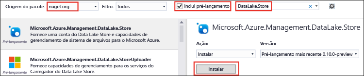
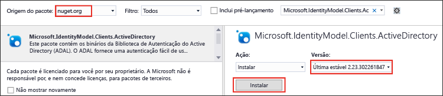

<properties
   pageTitle="Usar o SDK do .NET do Repositório Data Lake para desenvolver aplicativos | Azure"
   description="Usar o SDK do .NET do Repositório Azure Data Lake para desenvolver aplicativos"
   services="data-lake-store"
   documentationCenter=""
   authors="nitinme"
   manager="jhubbard"
   editor="cgronlun"/>

<tags
   ms.service="data-lake-store"
   ms.devlang="na"
   ms.topic="get-started-article"
   ms.tgt_pltfrm="na"
   ms.workload="big-data"
   ms.date="09/13/2016"
   ms.author="nitinme"/>

# Introdução ao Repositório Azure Data Lake usando o SDK do .NET

> [AZURE.SELECTOR]
- [Portal](data-lake-store-get-started-portal.md)
- [PowerShell](data-lake-store-get-started-powershell.md)
- [SDK .NET](data-lake-store-get-started-net-sdk.md)
- [Java SDK](data-lake-store-get-started-java-sdk.md)
- [API REST](data-lake-store-get-started-rest-api.md)
- [CLI do Azure](data-lake-store-get-started-cli.md)
- [Node.js](data-lake-store-manage-use-nodejs.md)

Saiba como usar o [SDK do .NET do Azure Data Lake Store](https://msdn.microsoft.com/library/mt581387.aspx) para criar uma conta do Azure Data Lake e executar operações básicas, como criar pastas, carregar e baixar arquivos de dados, excluir sua conta etc. Para obter mais informações sobre o Data Lake, veja [Repositório Azure Data Lake](data-lake-store-overview.md).

## Pré-requisitos

* Visual Studio 2013 ou 2015. As instruções abaixo usam o Visual Studio 2015.
* **Uma assinatura do Azure**. Consulte [Obter avaliação gratuita do Azure](https://azure.microsoft.com/pricing/free-trial/).
* **Criar um aplicativo do Azure Active Directory**. Há duas maneiras de autenticar usando o Azure Active Directory: **interativa** e **não interativa**. Existem pré-requisitos diferentes com base na forma como você deseja autenticar.
	* **Para a autenticação interativa** (usada neste artigo) - no Azure Active Directory, é necessário criar um **aplicativo Cliente Nativo**. Depois de criar o aplicativo, recupere os seguintes valores relacionados ao aplicativo.
		- Obter a **ID do cliente** e o **URI de redirecionamento** do aplicativo
		- Definir permissões delegadas

	* **Para a autenticação não interativa** - no Azure Active Directory, é necessário criar um **aplicativo Web**. Depois de criar o aplicativo, recupere os seguintes valores relacionados ao aplicativo.
		- Obter a **ID do cliente**, o **segredo do cliente** e o **URI de redirecionamento** do aplicativo
		- Definir permissões delegadas
		- Atribua o aplicativo do Azure Active Directory a uma função. A função pode estar no nível do escopo no qual você deseja conceder permissão ao aplicativo do Azure Active Directory. Por exemplo, você pode atribuir o aplicativo no nível da assinatura ou no nível de um grupo de recursos.

	Veja [Criar aplicativo do Active Directory e a entidade de serviço usando o portal](../resource-group-create-service-principal-portal.md) para obter instruções sobre como recuperar esses valores, definir as permissões e atribuir funções.

## Criar um aplicativo .NET

1. Abra o Visual Studio e crie um aplicativo de console.

2. No menu **Arquivo**, clique em **Novo** e em **Projeto**.

3. Em **Novo Projeto**, digite ou selecione os seguintes valores:

	| Propriedade | Valor |
	|----------|-----------------------------|
	| Categoria | Modelos/Visual C#/Windows |
	| Modelo | Aplicativo de console |
	| Nome | CreateADLApplication |

4. Clique em **OK** para criar o projeto.

5. Adicione os pacotes NuGet ao seu projeto.

	1. Clique com o botão direito do mouse no nome do projeto no Gerenciador de Soluções e clique em **Gerenciar Pacotes NuGet**.
	2. Na guia **Gerenciador de Pacotes NuGet**, verifique se a **Origem do pacote** está definida para **nuget.org** e se a caixa de seleção **Incluir pré-lançamento** está marcada.
	3. Pesquise e instale os seguintes pacotes do Repositório Data Lake:

		* `Microsoft.Azure.Management.DataLake.Store`
		* `Microsoft.Azure.Management.DataLake.StoreUploader`

		

	4. Instale também o pacote `Microsoft.IdentityModel.Clients.ActiveDirectory` para a autenticação do Azure Active Directory. Verifique se você *limpou* a caixa de seleção **Incluir pré-lançamento** para instalar uma versão estável desse pacote.

		

	5. Feche o **Gerenciador de Pacotes NuGet**.

7. Abra **Program.cs**, exclua o código existente e inclua as instruções a seguir para adicionar referências aos namespaces.

		using System;
        using System.IO;
        using System.Security;
        using System.Text;
        using System.Collections.Generic;
        using System.Linq;

        using Microsoft.Azure.Management.DataLake.Store;
        using Microsoft.Azure.Management.DataLake.Store.Models;
        using Microsoft.Azure.Management.DataLake.StoreUploader;
        using Microsoft.IdentityModel.Clients.ActiveDirectory;
        using Microsoft.Rest;

8. Declare as variáveis conforme mostrado abaixo e forneça os valores de nome do Repositório Data Lake e do grupo de recursos. O nome do Repositório Data Lake que você fornecer será criado pelo aplicativo. O grupo de recursos que você fornecer já deve existir. Além disso, o caminho local e o nome de arquivo fornecido aqui têm que existir no computador. Adicione o trecho de código a seguir após as declarações de namespace.

		namespace SdkSample
        {
            class Program
            {
                private static DataLakeStoreAccountManagementClient _adlsClient;
                private static DataLakeStoreFileSystemManagementClient _adlsFileSystemClient;

                private static string _adlsAccountName;
                private static string _resourceGroupName;
                private static string _location;

                private static void Main(string[] args)
                {
                    _adlsAccountName = "<DATA-LAKE-STORE-NAME>"; // TODO: Replace this value with the name for a NEW Store account.
                    _resourceGroupName = "<RESOURCE-GROUP-NAME>"; // TODO: Replace this value. This resource group should already exist.
                    _location = "East US 2";

                    string localFolderPath = @"C:\local_path"; // TODO: Make sure this exists and can be overwritten.
                    string localFilePath = localFolderPath + "file.txt"; // TODO: Make sure this exists and can be overwritten.
                    string remoteFolderPath = "/data_lake_path/";
                    string remoteFilePath = remoteFolderPath + "file.txt";
				}
			}
		}

Nas seções restantes do artigo, você pode ver como usar o métodos do .NET disponíveis para executar operações como autenticar usuários, criar conta de Repositório Data Lake, carregar arquivos, etc. Se você estiver procurando um exemplo completo sobre como trabalhar com o Data Lake Store, consulte o [Apêndice](#appendix-sample-code) no final deste artigo.

## Autenticar o usuário

Há duas maneiras de se autenticar usando o Azure Active Directory:

* **Interativa**, quando um usuário entra usando o aplicativo. Isso é implementado no método `AuthenticateUser` no trecho de código abaixo.

* **Não interativa**, quando o aplicativo fornece suas próprias credenciais. Isso é implementado no método `AuthenticateAppliaction` no trecho de código abaixo.

### Autenticação interativa

O trecho a seguir mostra um método `AuthenticateUser` que você pode usar para um logon interativo.

 	// Authenticate the user with AAD through an interactive popup.
    // You need to have an application registered with AAD in order to authenticate.
    //   For more information and instructions on how to register your application with AAD, see:
    //   https://azure.microsoft.com/pt-BR/documentation/articles/resource-group-create-service-principal-portal/
	public static TokenCredentials AuthenticateUser(string tenantId, string resource, string appClientId, Uri appRedirectUri, string userId = "")
	{
	    var authContext = new AuthenticationContext("https://login.microsoftonline.com/" + tenantId);
	
	    var tokenAuthResult = authContext.AcquireToken(resource, appClientId, appRedirectUri,
	        PromptBehavior.Auto, UserIdentifier.AnyUser);
	
	    return new TokenCredentials(tokenAuthResult.AccessToken);
	}

### Autenticação não interativa

O trecho a seguir mostra um método `AuthenticateApplication` que você pode usar para um logon não interativo.

	// Authenticate the application with AAD through the application's secret key.
	// You need to have an application registered with AAD in order to authenticate.
	//   For more information and instructions on how to register your application with AAD, see:
	//   https://azure.microsoft.com/pt-BR/documentation/articles/resource-group-create-service-principal-portal/
	public static TokenCredentials AuthenticateApplication(string tenantId, string resource, string appClientId, Uri appRedirectUri, SecureString clientSecret)
	{
	    var authContext = new AuthenticationContext("https://login.microsoftonline.com/" + tenantId);
	    var credential = new ClientCredential(appClientId, clientSecret);
	
	    var tokenAuthResult = authContext.AcquireToken(resource, credential);
	
	    return new TokenCredentials(tokenAuthResult.AccessToken);
	}
	
## Criar uma conta do Repositório Data Lake

O trecho a seguir mostra um método `CreateAccount` que você pode usar para criar uma conta de Data Lake Store.

	// Create Data Lake Store account
    public static void CreateAccount()
    {
        var adlsParameters = new DataLakeStoreAccount(location: _location);
        _adlsClient.Account.Create(_resourceGroupName, _adlsAccountName, adlsParameters);
    } 

## Listar todas as contas do Data Lake Store em uma assinatura

O trecho a seguir mostra um método `ListAdlStoreAccounts` que você pode usar para listar todas as contas do Data Lake Store em uma determinada assinatura do Azure.

	// List all ADLS accounts within the subscription
	public static List<DataLakeStoreAccount> ListAdlStoreAccounts()
	{
	    var response = _adlsClient.Account.List(_adlsAccountName);
	    var accounts = new List<DataLakeStoreAccount>(response);
	
	    while (response.NextPageLink != null)
	    {
	        response = _adlsClient.Account.ListNext(response.NextPageLink);
	        accounts.AddRange(response);
	    }
	
	    return accounts;
	}

## Criar um diretório

O trecho a seguir mostra um método `CreateDirectory` que você pode usar para criar um diretório em uma conta de Data Lake Store.

	// Create a directory
    public static void CreateDirectory(string path)
    {
        _adlsFileSystemClient.FileSystem.Mkdirs(_adlsAccountName, path);
    }

## Carregar um arquivo no Repositório Data Lake

O trecho a seguir mostra um método `UploadFile` que você pode usar para carregar arquivos para uma conta de Data Lake Store.

	// Upload a file
    public static void UploadFile(string srcFilePath, string destFilePath, bool force = true)
    {
        var parameters = new UploadParameters(srcFilePath, destFilePath, _adlsAccountName, isOverwrite: force);
        var frontend = new DataLakeStoreFrontEndAdapter(_adlsAccountName, _adlsFileSystemClient);
        var uploader = new DataLakeStoreUploader(parameters, frontend);
        uploader.Execute();
    }

DataLakeStoreUploader dá suporte ao upload e ao download recursivos entre um caminho de arquivo (ou pasta) local para o Data Lake Store.

## Obter informações do arquivo ou diretório

O trecho a seguir mostra um método `GetItemInfo` que você pode usar para recuperar informações sobre um arquivo ou diretório disponível no Data Lake Store.

	// Get file or directory info
    public static FileStatusProperties GetItemInfo(string path)
    {
        return _adlsFileSystemClient.FileSystem.GetFileStatus(_adlsAccountName, path).FileStatus;
    }

## Listar arquivos ou diretórios

O trecho a seguir mostra um método `ListItem` que você pode usar para listar os arquivos e diretórios em uma conta de Data Lake Store.
	
	// List files and directories
    public static List<FileStatusProperties> ListItems(string directoryPath)
    {
        return _adlsFileSystemClient.FileSystem.ListFileStatus(_adlsAccountName, directoryPath).FileStatuses.FileStatus.ToList();
    }

## Concatenar arquivos

O trecho a seguir mostra um método `ConcatenateFiles` que você pode usar para concatenar os arquivos.

	// Concatenate files
    public static void ConcatenateFiles(string[] srcFilePaths, string destFilePath)
    {
        _adlsFileSystemClient.FileSystem.Concat(_adlsAccountName, destFilePath, srcFilePaths);
    }

## Anexar a um arquivo

O trecho a seguir mostra um método `AppendToFile` que você usa para acrescentar dados a um arquivo já armazenado em uma conta de Data Lake Store.

	// Append to file
    public static void AppendToFile(string path, string content)
    {
        var stream = new MemoryStream(Encoding.UTF8.GetBytes(content));

        _adlsFileSystemClient.FileSystem.Append(_adlsAccountName, path, stream);
    }

## Baixar um arquivo

O trecho a seguir mostra um método `DownloadFile` que você pode usar para baixar um arquivo de uma conta de Data Lake Store.

	// Download file
    public static void DownloadFile(string srcPath, string destPath)
    {
        var stream = _adlsFileSystemClient.FileSystem.Open(_adlsAccountName, srcPath);
        var fileStream = new FileStream(destPath, FileMode.Create);

        stream.CopyTo(fileStream);
        fileStream.Close();
        stream.Close();
    }

## Excluir uma conta do Repositório do Data Lake

O trecho a seguir mostra um método `DeleteAccount` que você pode usar para excluir uma conta de Data Lake Store.

	// Delete account
    public static void DeleteAccount()
    {
        _adlsClient.Account.Delete(_resourceGroupName, _adlsAccountName);
    }

## Apêndice: código de exemplo

O trecho a seguir é um exemplo de código abrangente que você pode copiar e colar em seu aplicativo para ver uma operação de ponta a ponta em um Repositório Data Lake. Antes de executar o trecho de código, forneça os valores necessários, como o nome do Repositório Data Lake, o nome do grupo de recursos, etc. Você também deve fornecer os valores necessários para a autenticação do Azure Active Directory, como **<ID-DE CLIENTE-DO-APLICATIVO>** , **<URI-DE-RESPOSTA-DO-APLICATIVO>** e **<ID-DA-ASSINATURA>**.

Mesmo que o trecho de código a seguir forneça métodos para ambas as abordagens, interativa e não interativa, o bloco de código não interativo é comentado. Esse método interativo exige que você forneça a ID do cliente e o URI de redirecionamento do aplicativo AAD. O link mostrado nos pré-requisitos fornece instruções sobre como obtê-los.

>[AZURE.NOTE] Se você quiser modificar o trecho de código e usar o método não interativo (`AuthenticateApplication`), também será necessário fornecer a chave de autenticação do cliente, além da ID do cliente e do URI de resposta do cliente, como entradas para o método. O artigo [Criar o aplicativo do Active Directory e a entidade de serviço usando o portal](../resource-group-create-service-principal-portal.md) também fornece informações sobre como gerar e recuperar a chave de autenticação do cliente.
	
Finalmente, o caminho local e o nome de arquivo fornecido aqui têm que existir no computador. Se estiver procurando alguns dados de exemplo para carregar, é possível obter a pasta **Dados da Ambulância** no [Repositório Git do Azure Data Lake](https://github.com/MicrosoftBigData/usql/tree/master/Examples/Samples/Data/AmbulanceData).

    using System;
    using System.IO;
    using System.Security;
    using System.Text;
    using System.Collections.Generic;
    using System.Linq;

    using Microsoft.Azure.Management.DataLake.Store;
    using Microsoft.Azure.Management.DataLake.Store.Models;
    using Microsoft.Azure.Management.DataLake.StoreUploader;
    using Microsoft.IdentityModel.Clients.ActiveDirectory;
    using Microsoft.Rest;

    namespace SdkSample
    {
        class Program
        {
            private static DataLakeStoreAccountManagementClient _adlsClient;
            private static DataLakeStoreFileSystemManagementClient _adlsFileSystemClient;

            private static string _adlsAccountName;
            private static string _resourceGroupName;
            private static string _location;

            private static void Main(string[] args)
            {
                _adlsAccountName = "<DATA-LAKE-STORE-NAME>"; // TODO: Replace this value with the name for a NEW Store account.
                _resourceGroupName = "<RESOURCE-GROUP-NAME>"; // TODO: Replace this value. This resource group should already exist.
                _location = "East US 2";

                string localFolderPath = @"C:\local_path"; // TODO: Make sure this exists and can be overwritten.
                string localFilePath = localFolderPath + "file.txt"; // TODO: Make sure this exists and can be overwritten.
                string remoteFolderPath = "/data_lake_path/";
                string remoteFilePath = remoteFolderPath + "file.txt";

                // Authenticate the user
                var tokenCreds = AuthenticateUser("common", "https://management.core.windows.net/",
                    "<APPLICATION-CLIENT-ID>", new Uri("<APPLICATION-REPLY-URI>")); // TODO: Replace bracketed values.

                SetupClients(tokenCreds, "<SUBSCRIPTION-ID>"); // TODO: Replace bracketed value.

                // Run sample scenarios
                WaitForNewline("Authenticated.", "Creating NEW account.");
                CreateAccount();
                WaitForNewline("Account created.", "Creating a directory.");

                // Create a directory in the Data Lake Store
                CreateDirectory(remoteFolderPath);
                WaitForNewline("Directory created.", "Showing directory info.");

                // Get info about the directory in the Data Lake Store
                var itemInfo = GetItemInfo(remoteFolderPath);
                Console.WriteLine("Type: " + itemInfo.Type);
                Console.WriteLine("Last modified (UTC): " +
                                  new DateTime(1970, 1, 1, 0, 0, 0, 0, DateTimeKind.Utc).AddMilliseconds(
                                      itemInfo.ModificationTime.Value));
                WaitForNewline("Directory info shown.", "Uploading a file.");

                // Upload a file to the Data Lake Store
                UploadFile(localFilePath, remoteFilePath);
                WaitForNewline("File uploaded.", "Listing files and directories.");

                // List the files in the Data Lake Store
                var itemList = ListItems(remoteFolderPath);
                var fileMenuItems = itemList.Select(a => String.Format("{0,15} {1}", a.Type, a.PathSuffix));
                Console.WriteLine(String.Join("\r\n", fileMenuItems));
                WaitForNewline("Files and directories listed.", "Appending content to a file.");

                // Append to a file in the Data Lake Store
                AppendToFile(remoteFilePath, "123");
                WaitForNewline("Content appended.", "Downloading a file.");

                // Download a file from the Data Lake Store
                DownloadFile(remoteFilePath, localFilePath);
                WaitForNewline("File downloaded.", "Deleting account.");

                // Delete account
                DeleteAccount();
                WaitForNewline("Account deleted. You can now exit.");
            }

            // Helper function to show status and wait for user input
            public static void WaitForNewline(string reason, string nextAction = "")
            {
                if (!String.IsNullOrWhiteSpace(nextAction))
                {
                    Console.WriteLine(reason + "\r\nPress ENTER to continue...");
                    Console.ReadLine();
                    Console.WriteLine(nextAction);
                }
                else
                {
                    Console.WriteLine(reason + "\r\nPress ENTER to continue...");
                    Console.ReadLine();
                }
            }

            // Authenticate the user with AAD through an interactive popup.
            // You need to have an application registered with AAD in order to authenticate.
            //   For more information and instructions on how to register your application with AAD, see:
            //   https://azure.microsoft.com/pt-BR/documentation/articles/resource-group-create-service-principal-portal/
            public static TokenCredentials AuthenticateUser(string tenantId, string resource, string appClientId, Uri appRedirectUri, string userId = "")
            {
                var authContext = new AuthenticationContext("https://login.microsoftonline.com/" + tenantId);

                var tokenAuthResult = authContext.AcquireToken(resource, appClientId, appRedirectUri,
                    PromptBehavior.Auto, UserIdentifier.AnyUser);

                return new TokenCredentials(tokenAuthResult.AccessToken);
            }
			
			/*
            // Authenticate the application with AAD through the application's secret key.
            // You need to have an application registered with AAD in order to authenticate.
            //   For more information and instructions on how to register your application with AAD, see:
            //   https://azure.microsoft.com/pt-BR/documentation/articles/resource-group-create-service-principal-portal/
            public static TokenCredentials AuthenticateApplication(string tenantId, string resource, string appClientId, Uri appRedirectUri, SecureString clientSecret)
            {
                var authContext = new AuthenticationContext("https://login.microsoftonline.com/" + tenantId);
                var credential = new ClientCredential(appClientId, clientSecret);

                var tokenAuthResult = authContext.AcquireToken(resource, credential);

                return new TokenCredentials(tokenAuthResult.AccessToken);
            }
			*/

            //Set up clients
            public static void SetupClients(TokenCredentials tokenCreds, string subscriptionId)
            {
                _adlsClient = new DataLakeStoreAccountManagementClient(tokenCreds);
                _adlsClient.SubscriptionId = subscriptionId;

                _adlsFileSystemClient = new DataLakeStoreFileSystemManagementClient(tokenCreds);
            }

            // Create account
            public static void CreateAccount()
            {
                // Create ADLS account
                var adlsParameters = new DataLakeStoreAccount(location: _location);
                _adlsClient.Account.Create(_resourceGroupName, _adlsAccountName, adlsParameters);
            }

            // Delete account
            public static void DeleteAccount()
            {
                _adlsClient.Account.Delete(_resourceGroupName, _adlsAccountName);
            }

            // List all ADLS accounts within the subscription
            public static List<DataLakeStoreAccount> ListAdlStoreAccounts()
            {
                var response = _adlsClient.Account.List(_adlsAccountName);
                var accounts = new List<DataLakeStoreAccount>(response);

                while (response.NextPageLink != null)
                {
                    response = _adlsClient.Account.ListNext(response.NextPageLink);
                    accounts.AddRange(response);
                }

                return accounts;
            }

            // Upload a file
            public static void UploadFile(string srcFilePath, string destFilePath, bool force = true)
            {
                var parameters = new UploadParameters(srcFilePath, destFilePath, _adlsAccountName, isOverwrite: force);
                var frontend = new DataLakeStoreFrontEndAdapter(_adlsAccountName, _adlsFileSystemClient);
                var uploader = new DataLakeStoreUploader(parameters, frontend);
                uploader.Execute();
            }

            // Concatenate files
            public static void ConcatenateFiles(string[] srcFilePaths, string destFilePath)
            {
                _adlsFileSystemClient.FileSystem.Concat(_adlsAccountName, destFilePath, srcFilePaths);
            }

            // Get file or directory info
            public static FileStatusProperties GetItemInfo(string path)
            {
                return _adlsFileSystemClient.FileSystem.GetFileStatus(_adlsAccountName, path).FileStatus;
            }

            // List files and directories
            public static List<FileStatusProperties> ListItems(string directoryPath)
            {
                return _adlsFileSystemClient.FileSystem.ListFileStatus(_adlsAccountName, directoryPath).FileStatuses.FileStatus.ToList();
            }

            // Download file
            public static void DownloadFile(string srcPath, string destPath)
            {
                var stream = _adlsFileSystemClient.FileSystem.Open(_adlsAccountName, srcPath);
                var fileStream = new FileStream(destPath, FileMode.Create);

                stream.CopyTo(fileStream);
                fileStream.Close();
                stream.Close();
            }

            // Append to file
            public static void AppendToFile(string path, string content)
            {
                var stream = new MemoryStream(Encoding.UTF8.GetBytes(content));

                _adlsFileSystemClient.FileSystem.Append(_adlsAccountName, path, stream);
            }

            // Create a directory
            public static void CreateDirectory(string path)
            {
                _adlsFileSystemClient.FileSystem.Mkdirs(_adlsAccountName, path);
            }
        }
    }

## Próximas etapas

- [Proteger dados no Repositório Data Lake](data-lake-store-secure-data.md)
- [Usar a Análise Data Lake do Azure com o Repositório Data Lake](../data-lake-analytics/data-lake-analytics-get-started-portal.md)
- [Usar o Azure HDInsight com o Repositório Data Lake](data-lake-store-hdinsight-hadoop-use-portal.md)
- [Referência do SDK do .NET do Azure Data Lake Store](https://msdn.microsoft.com/library/mt581387.aspx)
- [Referência do REST do Azure Data Lake Store](https://msdn.microsoft.com/library/mt693424.aspx)

<!---HONumber=AcomDC_0914_2016-->