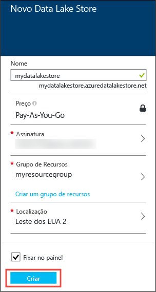
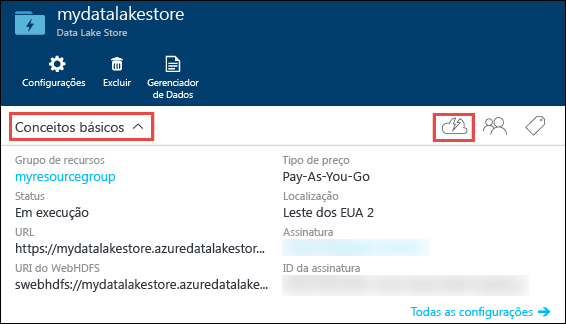
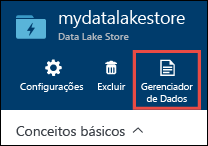
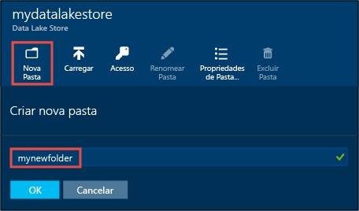
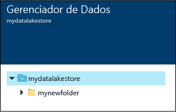
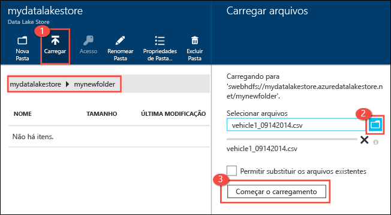
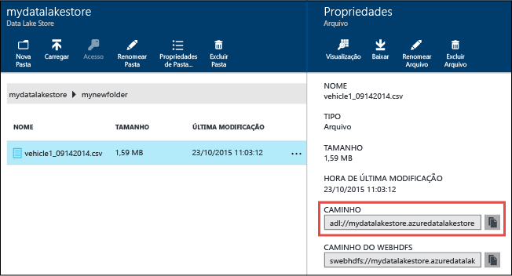
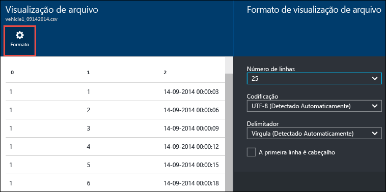
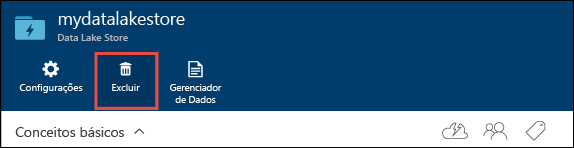

<properties 
   pageTitle="Introdução ao Repositório Data Lake | Azure" 
   description="Usar o portal para criar uma conta do Repositório Data Lake e executar operações básicas no Repositório Data Lake" 
   services="data-lake-store" 
   documentationCenter="" 
   authors="nitinme" 
   manager="jhubbard" 
   editor="cgronlun"/>
 
<tags
   ms.service="data-lake-store"
   ms.devlang="na"
   ms.topic="hero-article"
   ms.tgt_pltfrm="na"
   ms.workload="big-data" 
   ms.date="09/13/2016"
   ms.author="nitinme"/>

# Introdução ao Repositório do Azure Data Lake usando o Portal do Azure

> [AZURE.SELECTOR]
- [Portal](data-lake-store-get-started-portal.md)
- [PowerShell](data-lake-store-get-started-powershell.md)
- [SDK .NET](data-lake-store-get-started-net-sdk.md)
- [Java SDK](data-lake-store-get-started-java-sdk.md)
- [API REST](data-lake-store-get-started-rest-api.md)
- [CLI do Azure](data-lake-store-get-started-cli.md)
- [Node.js](data-lake-store-manage-use-nodejs.md)

Saiba como usar o Portal do Azure para criar uma conta do Repositório do Azure Data Lake e executar operações básicas, como criar pastas, carregar e baixar arquivos de dados, excluir sua conta, etc. Para saber mais sobre o Repositório Data Lake, consulte [Visão geral do Repositório Data Lake](data-lake-store-overview.md).

## Pré-requisitos

Antes de começar este tutorial, você deve ter o seguinte:

- **Uma assinatura do Azure**. Consulte [Obter avaliação gratuita do Azure](https://azure.microsoft.com/pricing/free-trial/).

## Você aprende rapidamente com vídeos?

Veja os vídeos a seguir para começar a usar o Repositório Data Lake.

* [Criar uma conta do Repositório Data Lake](https://mix.office.com/watch/1k1cycy4l4gen)
* [Gerenciar dados no Repositório Data Lake usando o Explorador de Dados](https://mix.office.com/watch/icletrxrh6pc)

## Criar uma conta do Repositório Azure Data Lake

1. Entre no novo [Portal do Azure](https://portal.azure.com).

2. Clique em **NOVO**, clique em **Dados + Armazenamento** e clique em **Repositório Azure Data Lake**. Leia as informações na folha **Repositório Azure Data Lake** e clique em **Criar** no canto inferior esquerdo da folha.

3. Na folha **Novo Repositório Data Lake**, forneça os valores conforme mostrado na captura de tela abaixo:

	

	- **Assinatura**. Selecione a assinatura na qual você deseja criar uma nova conta do Data Lake Store.
	- **Grupo de Recursos**. Selecione um grupo de recursos existente ou clique em **Criar um grupo de recursos** para criar um. Um grupo de recursos é um contêiner que mantém os recursos relacionados para um aplicativo. Para saber mais, consulte [Grupos de Recursos no Azure](resource-group-overview.md#resource-groups).
	- **Local**: selecione um local no qual você deseja criar a conta do Data Lake.

4. Selecione **Fixar no Quadro Inicial** se você quiser que a conta do Repositório Data Lake possa ser acessada no Quadro inicial.

5. Clique em **Criar**. Se você escolher fixar a conta no quadro inicial, você será levado de volta para o quadro inicial e poderá ver o progresso de seu provisionamento de conta do Repositório Data Lake. Após o provisionamento da conta do Repositório Data Lake, a folha da conta será exibida.

6. Expanda o menu suspenso **Essenciais** para ver as informações sobre sua conta do Repositório Data Lake, como o grupo de recursos do qual ela faz parte, o local etc. Clique no ícone **Início Rápido** para ver links para outros recursos relacionados ao Repositório Data Lake.

	

## Criar pastas na conta do Repositório Azure Data Lake

Você pode criar pastas em sua conta do Repositório Data Lake para gerenciar e armazenar dados.

1. Abra a conta do Repositório Data Lake que você acabou de criar. No painel esquerdo, clique em **Procurar**, clique em **Repositório Data Lake** e, na folha do Repositório Data Lake, clique no nome da conta sob a qual você deseja criar as pastas. Se você tiver fixado a conta no quadro inicial, clique no bloco da conta.

2. Na folha de sua conta do Repositório Data Lake, clique em **Gerenciador de Dados**.

	

3. Na folha de sua conta do Repositório Data Lake, clique em **Nova Pasta**, insira um nome para a nova pasta e clique em **OK**.
	
	
	
	A pasta recém-criada será listada na folha **Gerenciador de Dados**. Você pode criar pastas aninhadas em qualquer nível.

	

## Carregar dados na conta do Repositório Azure Data Lake

É possível carregar seus dados em uma conta do Repositório Data Lake diretamente no nível da raiz ou em uma pasta que você criou na conta. Na captura de tela abaixo, execute as etapas para carregar um arquivo em uma subpasta da folha **Gerenciador de Dados**. Nessa captura de tela, o arquivo é carregado em uma subpasta mostrada na trilha (marcada em uma caixa vermelha).

Se estiver procurando alguns dados de exemplo para carregar, é possível obter a pasta **Dados da Ambulância** no [Repositório Git do Azure Data Lake](https://github.com/MicrosoftBigData/usql/tree/master/Examples/Samples/Data/AmbulanceData).

## Propriedades e ações disponíveis para os dados armazenados

Clique no arquivo recém-adicionado para abrir a folha **Propriedades**. As propriedades associadas ao arquivo e as ações que você pode executar no arquivo estão disponíveis nesta folha. Você também pode copiar o caminho completo para o arquivo em sua conta do Repositório Azure Data Lake, realçada na caixa vermelha na captura de tela abaixo.

* Clique em **Visualizar** para uma visualização do arquivo, diretamente do navegador. Você também pode especificar o formato da visualização. Clique em **Visualizar**, clique em **Formato** na folha **Visualização de Arquivo** e, na folha **Formato de Visualização do Arquivo**, especifique as opções, como o número de linhas para exibição, codificação a ser usada, o delimitador etc.

  

* Clique em **Baixar** para baixar o arquivo em seu computador.

* Clique em **Renomear arquivo** para renomear o arquivo.

* Clique em **Excluir arquivo** para excluir o arquivo.

## Proteja seus dados

Você pode proteger os dados armazenados em sua conta do Repositório Azure Data Lake usando o Active Directory do Azure e o controle de acesso (ACLs). Para obter instruções sobre como fazer isso, consulte [Protegendo dados no Repositório Azure Data Lake](data-lake-store-secure-data.md).

## Excluir a conta do Repositório Azure Data Lake

Para excluir uma conta do Repositório Azure Data Lake da folha de seu Repositório Data Lake, clique em **Excluir**. Para confirmar a ação, você receberá uma solicitação para inserir o nome da conta que você deseja excluir. Insira o nome da conta e clique em **Excluir**.

## Próximas etapas

- [Proteger dados no Repositório Data Lake](data-lake-store-secure-data.md)
- [Usar a Análise Data Lake do Azure com o Repositório Data Lake](../data-lake-analytics/data-lake-analytics-get-started-portal.md)
- [Usar o Azure HDInsight com o Repositório Data Lake](data-lake-store-hdinsight-hadoop-use-portal.md)
- [Acessar os logs de diagnóstico do Azure Data Lake Store](data-lake-store-diagnostic-logs.md)

<!----HONumber=AcomDC_0914_2016-->