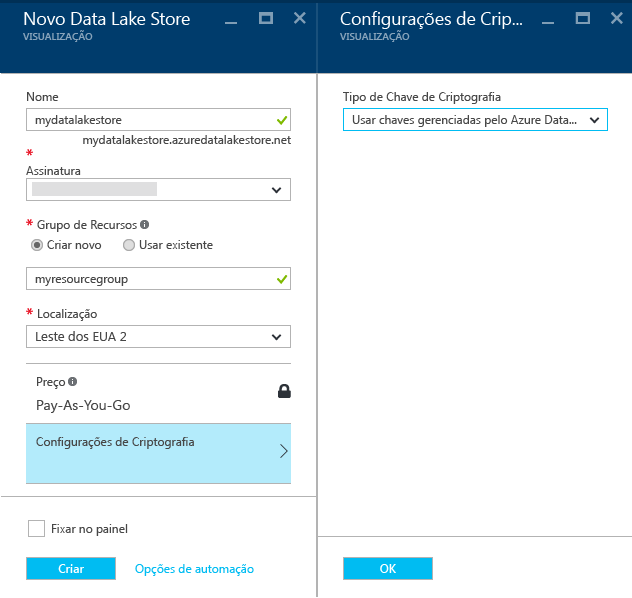

# Introdução ao Repositório do Azure Data Lake usando o Portal do Azure
> [!div class="op_single_selector"]
> * [Portal](data-lake-store-get-started-portal.md)
> * [PowerShell](data-lake-store-get-started-powershell.md)
> * [SDK .NET](data-lake-store-get-started-net-sdk.md)
> * [Java SDK](data-lake-store-get-started-java-sdk.md)
> * [API REST](data-lake-store-get-started-rest-api.md)
> * [CLI do Azure](data-lake-store-get-started-cli.md)
> * [CLI 2.0 do Azure](data-lake-store-get-started-cli-2.0.md)
> * [Node.js](data-lake-store-manage-use-nodejs.md)
> * [Python](data-lake-store-get-started-python.md)
>
> 

Saiba como usar o Portal do Azure para criar uma conta do Repositório do Azure Data Lake e executar operações básicas, como criar pastas, carregar e baixar arquivos de dados, excluir sua conta, etc. Para saber mais sobre o Data Lake Store, consulte [Visão geral do Azure Data Lake Store](data-lake-store-overview.md).

## Pré-requisitos
Antes de começar este tutorial, você deve ter o seguinte:

* **Uma assinatura do Azure**. Consulte [Obter a avaliação gratuita do Azure](https://azure.microsoft.com/pricing/free-trial/).

## Você aprende mais rapidamente com vídeos?
Veja os vídeos a seguir para começar a usar o Repositório Data Lake.

* [Criar uma conta do Repositório Data Lake](https://mix.office.com/watch/1k1cycy4l4gen)
* [Gerenciar dados no Repositório Data Lake usando o Explorador de Dados](https://mix.office.com/watch/icletrxrh6pc)

## Criar uma conta do Repositório Azure Data Lake
1. Entre no novo [Portal do Azure](https://portal.azure.com).
2. Clique em **NOVO**, clique em **Dados + Armazenamento** e clique em **Azure Data Lake Store**. Leia as informações na folha **Azure Data Lake Store** e clique em **Criar** no canto inferior esquerdo da folha.
3. Na folha **Novo Repositório Data Lake** , forneça os valores conforme mostrado na captura de tela abaixo:
   
    
   
   * **Nome**. Insira um nome exclusivo para a conta do Data Lake Store.
   * **Assinatura**. Selecione a assinatura na qual você deseja criar uma nova conta do Data Lake Store.
   * **Grupo de Recursos**. Selecione um grupo de recursos existente ou selecione a opção **Criar novo** para criar um. Um grupo de recursos é um contêiner que mantém os recursos relacionados para um aplicativo. Para saber mais, consulte [Grupos de Recursos no Azure](../azure-resource-manager/resource-group-overview.md#resource-groups).
   * **Local**: selecione um local no qual você deseja criar a conta do Data Lake.
   * **Configurações de Criptografia**. Você pode escolher se deseja criptografar sua conta do Data Lake Store. Se você optar por criptografar, também poderá especificar como gerenciar a chave de criptografia principal que deseja usar para criptografar os dados em sua conta.
     
     * (Opcional) Selecione **Não habilitar a criptografia** no menu suspenso para recusar a criptografia.
     * (Padrão) Selecione **Usar chaves gerenciadas pelo Azure Data Lake** se quiser que o Azure Data Lake Store gerencie suas chaves de criptografia.
       
         
     * (Opcional) Selecione **Escolher chaves do Cofre de Chaves do Azure** se quiser usar suas próprias chaves presentes em seu Cofre de Chaves do Azure. Com essa opção, você também pode criar uma conta do Cofre de chaves se ainda não tiver uma.
       
         
       
       Clique em **OK** na folha **Configurações de Criptografia**.
       
       > [!NOTE]
       > Se você usar as chaves de um Cofre de Chaves do Azure para configurar a criptografia para a conta do Data Lake Store, deverá atribuir permissões para a conta do Azure Data Lake Store acessar o Cofre de Chaves do Azure. Para obter instruções sobre como fazer isso, veja [Atribuir permissões ao Cofre de Chaves do Azure](#assign-permissions-to-the-azure-key-vault)
       > 
       > 
4. Clique em **Criar**. Se você escolher fixar a conta no painel, você será levado de volta para o painel e poderá ver o progresso de seu provisionamento de conta do Data Lake Store. Após o provisionamento da conta do Repositório Data Lake, a folha da conta será exibida.

## Atribuir permissões ao Cofre de Chaves do Azure
Se você tiver usado as chaves de um Cofre de Chaves do Azure para configurar a criptografia na conta do Data Lake Store, deverá configurar o acesso entre a conta do Data Lake Store e a conta do Cofre de Chaves do Azure. Execute as seguintes etapas para fazê-lo.

1. Se você tiver usado as chaves do Cofre de Chaves do Azure, a folha da conta do Data Lake Store exibirá um aviso na parte superior. Clique no aviso para abrir a folha **Configurar permissões do Cofre de Chaves**.
   
    
2. A folha mostra duas opções para configurar o acesso.
   
   * Na primeira opção, clique em **Conceder Permissão** para configurar o acesso. A primeira opção só será habilitada quando o usuário que criou a conta do Data Lake Store também for um administrador do Cofre de Chaves do Azure.
   * A outra opção é executar o cmdlet do PowerShell exibido na folha. Você precisa ser o proprietário do Cofre de Chaves do Azure ou ter a capacidade de conceder permissões no Cofre de Chaves do Azure. Depois de executar o cmdlet, volte para a folha e clique em **Habilitar** para configurar o acesso.

## Criar pastas na conta do Repositório Azure Data Lake
Você pode criar pastas em sua conta do Repositório Data Lake para gerenciar e armazenar dados.

1. Abra a conta do Repositório Data Lake que você acabou de criar. No painel esquerdo, clique em **Procurar**, clique em **Data Lake Store** e, na folha Data Lake Store, clique no nome da conta sob a qual você deseja criar as pastas. Se você tiver fixado a conta no quadro inicial, clique no bloco da conta.
2. Na folha de sua conta do Repositório Data Lake, clique em **Gerenciador de Dados**.
   
    
3. Na folha de sua conta do Data Lake Store, clique em **Nova Pasta**, insira um nome para a nova pasta e clique em **OK**.
   
    
   
    A pasta recém-criada será listada na folha **Gerenciador de Dados** . Você pode criar pastas aninhadas em qualquer nível.
   
    

## Carregar dados na conta do Repositório Azure Data Lake
É possível carregar seus dados em uma conta do Repositório Data Lake diretamente no nível da raiz ou em uma pasta que você criou na conta. Na captura de tela abaixo, execute as etapas para carregar um arquivo em uma subpasta da folha **Gerenciador de Dados** . Nessa captura de tela, o arquivo é carregado em uma subpasta mostrada na trilha (marcada em uma caixa vermelha).

Se estiver procurando alguns dados de exemplo para carregar, é possível obter a pasta **Dados da Ambulância** no [Repositório Git do Azure Data Lake](https://github.com/MicrosoftBigData/usql/tree/master/Examples/Samples/Data/AmbulanceData).

## Propriedades e ações disponíveis para os dados armazenados
Clique no arquivo recém-adicionado para abrir a folha **Propriedades** . As propriedades associadas ao arquivo e as ações que você pode executar no arquivo estão disponíveis nesta folha. Você também pode copiar o caminho completo para o arquivo em sua conta do Repositório Azure Data Lake, realçada na caixa vermelha na captura de tela abaixo.

* Clique em **Visualizar** para uma visualização do arquivo, diretamente do navegador. Você também pode especificar o formato da visualização. Clique em **Visualização**, clique em **Formato** na folha **Visualização de Arquivo** e, na folha **Formato de Visualização do Arquivo**, especifique as opções, como o número de linhas para exibição, codificação a ser usada, o delimitador, etc.
  
  
* Clique em **Baixar** para baixar o arquivo em seu computador.
* Clique em **Renomear arquivo** para renomear o arquivo.
* Clique em **Excluir arquivo** para excluir o arquivo.

## Proteja seus dados
Você pode proteger os dados armazenados em sua conta do Repositório Azure Data Lake usando o Active Directory do Azure e o controle de acesso (ACLs). Para obter instruções sobre como fazer isso, consulte [Protegendo dados no Repositório Azure Data Lake](data-lake-store-secure-data.md).

## Excluir a conta do Repositório Azure Data Lake
Para excluir uma conta do Repositório Azure Data Lake da folha de seu Repositório Data Lake, clique em **Excluir**. Para confirmar a ação, você receberá uma solicitação para inserir o nome da conta que você deseja excluir. Insira o nome da conta e clique em **Excluir**.

## Próximas etapas
* [Proteger dados no Repositório Data Lake](data-lake-store-secure-data.md)
* [Usar a Análise Data Lake do Azure com o Repositório Data Lake](../data-lake-analytics/data-lake-analytics-get-started-portal.md)
* [Usar o Azure HDInsight com o Repositório Data Lake](data-lake-store-hdinsight-hadoop-use-portal.md)
* [Acessar os logs de diagnóstico do Azure Data Lake Store](data-lake-store-diagnostic-logs.md)

