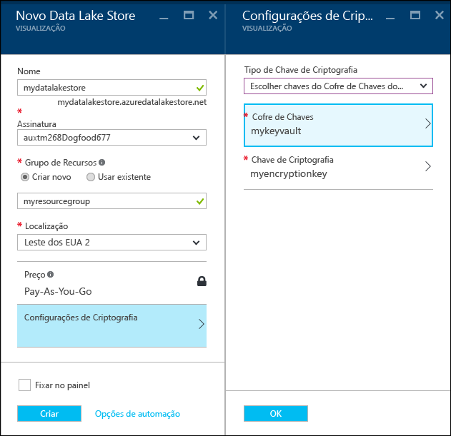
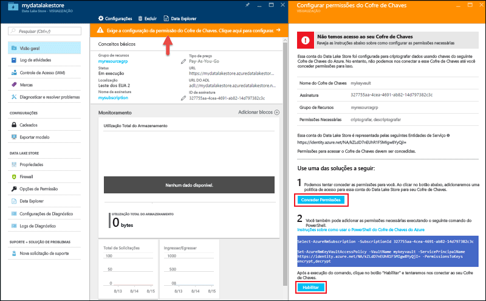

# Introdução ao Azure Data Lake Store usando o portal do Azure
> [!div class="op_single_selector"]
> * [Portal](data-lake-store-get-started-portal.md)
> * [PowerShell](data-lake-store-get-started-powershell.md)
> * [CLI 2.0 do Azure](data-lake-store-get-started-cli-2.0.md)
>
> 

Saiba como usar o portal do Azure para criar uma conta do Azure Data Lake Store e executar operações básicas, como criar pastas, carregar e baixar arquivos de dados, excluir sua conta etc. Para obter mais informações, consulte [Visão geral do Azure Data Lake Store](data-lake-store-overview.md).

## pré-requisitos
Antes de começar este tutorial, você deve ter os seguintes itens:

* **Uma assinatura do Azure**. Consulte [Obter a avaliação gratuita do Azure](https://azure.microsoft.com/pricing/free-trial/).

## Criar uma conta do Repositório Azure Data Lake

1. Inscreva-se no novo [portal do Azure](https://portal.azure.com).
2. Clique em **Criar um recurso**, clique em **Dados + Armazenamento** e clique em **Azure Data Lake Store**. Leia as informações na folha **Azure Data Lake Store** e clique em **Criar** no canto inferior esquerdo da folha.
3. Na folha **Novo Data Lake Store**, forneça os valores conforme mostrado na captura de tela a seguir:
   
    
   
   * **Nome**. Insira um nome exclusivo para a conta do Data Lake Store.
   * **Assinatura**. Selecione a assinatura na qual você deseja criar uma nova conta do Data Lake Store.
   * **Grupo de Recursos**. Selecione um grupo de recursos existente ou selecione a opção **Criar novo** para criar um. Um grupo de recursos é um contêiner que mantém os recursos relacionados para um aplicativo. Para saber mais, consulte [Grupos de Recursos no Azure](../azure-resource-manager/resource-group-overview.md#resource-groups).
   * **Local**: selecione um local no qual você deseja criar a conta do Data Lake.
   * **Configurações de Criptografia**. Há três opções:
     
     * **Não habilite a criptografia**.
     * **Use chaves gerenciadas pelo Azure Data Lake**.  se quiser que o Azure Data Lake Store gerencie suas chaves de criptografia.
     * **Utilize as chaves do seu próprio Key Vault**. Você pode selecionar um Azure Key Vault existente ou criar um novo Key Vault. Para usar as chaves em um Key Vault, você deve atribuir permissões para a conta do Azure Data Lake Store para acessar o Azure Key Vault. Para obter instruções, consulte [Atribuir permissões ao Azure Key Vault](#assign-permissions-to-azure-key-vault).
       
        
       
        Clique em **OK** na folha **Configurações de Criptografia**.

        Para obter mais informações, consulte [Criptografia dos dados no Azure Data Lake Store](./data-lake-store-encryption.md).

4. Clique em **Criar**. Se você escolher fixar a conta no painel, você será levado de volta para o painel e poderá ver o progresso de seu provisionamento de conta do Data Lake Store. Após o provisionamento da conta do Repositório Data Lake, a folha da conta será exibida.

### Atribuir permissões ao Azure Key Vault
Se você tiver usado as chaves de um Cofre de Chaves do Azure para configurar a criptografia na conta do Data Lake Store, deverá configurar o acesso entre a conta do Data Lake Store e a conta do Cofre de Chaves do Azure. Execute as seguintes etapas para fazê-lo.

1. Se você tiver usado as chaves do Cofre de Chaves do Azure, a folha da conta do Data Lake Store exibirá um aviso na parte superior. Clique no aviso para abrir **Criptografia**.
   
    
2. A folha mostra duas opções para configurar o acesso.

    
   
   * Na primeira opção, clique em **Conceder Permissões** para configurar o acesso. A primeira opção só será habilitada quando o usuário que criou a conta do Data Lake Store também for um administrador do Cofre de Chaves do Azure.
   * A outra opção é executar o cmdlet do PowerShell exibido na folha. Você precisa ser o proprietário do Cofre de Chaves do Azure ou ter a capacidade de conceder permissões no Cofre de Chaves do Azure. Depois de executar o cmdlet, volte para a folha e clique em **Habilitar** para configurar o acesso.

> [!NOTE]
> Você também pode criar uma conta do Data Lake Store usando modelos do Azure Resource Manager. Esses modelos são acessíveis nos [Modelos de Início Rápido do Azure](https://azure.microsoft.com/resources/templates/?term=data+lake+store):
    - Sem criptografia de dados: [Implantar conta do Azure Data Lake Store sem criptografia de dados](https://azure.microsoft.com/resources/templates/101-data-lake-store-no-encryption/).
    - Com criptografia de dados usando o Data Lake Store: [Implantar conta do Data Lake Store com criptografia (Data Lake)](https://azure.microsoft.com/resources/templates/101-data-lake-store-encryption-adls/).
    - Com criptografia de dados usando o Azure Key Vault: [Implantar conta do Data Lake Store com criptografia (Key Vault)](https://azure.microsoft.com/resources/templates/101-data-lake-store-encryption-key-vault/).
> 
> 

## Criar pastas na conta do Repositório Azure Data Lake
Você pode criar pastas em sua conta do Repositório Data Lake para gerenciar e armazenar dados.

1. Abra a conta do Data Lake Store que você criou. No painel esquerdo, clique em **Procurar**, clique em **Data Lake Store** e, na folha Data Lake Store, clique no nome da conta sob a qual você deseja criar as pastas. Se você tiver fixado a conta no quadro inicial, clique no bloco da conta.
2. Na folha de sua conta do Repositório Data Lake, clique em **Gerenciador de Dados**.
   
    
3. Na folha Data Explorer, clique em **Nova Pasta**, insira um nome para a nova pasta e clique em **OK**.
   
    
   
    A pasta recém-criada é listada na folha **Data Explorer**. Você pode criar pastas aninhadas em qualquer nível.
   
    

## Carregar dados na conta do Repositório Azure Data Lake
É possível carregar seus dados em uma conta do Repositório Data Lake diretamente no nível da raiz ou em uma pasta que você criou na conta. 

1. Na folha **Data Explorer**, clique em **Upload**. 
2. Na folha **Carregar arquivos**, navegue até os arquivos que você deseja carregar e, em seguida, clique em **Adicionar arquivos selecionados**. Você também pode selecionar mais de um arquivo para upload.

    

Se estiver procurando alguns dados de exemplo para carregar, é possível obter a pasta **Dados da Ambulância** no [Repositório Git do Azure Data Lake](https://github.com/MicrosoftBigData/usql/tree/master/Examples/Samples/Data/AmbulanceData).

## Ações disponíveis para os dados armazenados
Clique no ícone de reticências em um arquivo e, no menu pop-up, clique na ação que você deseja executar nos dados.

 

## Proteja seus dados
Você pode proteger os dados armazenados em sua conta do Repositório Azure Data Lake usando o Active Directory do Azure e o controle de acesso (ACLs). Para obter instruções sobre como fazer isso, consulte [Protegendo dados no Repositório Azure Data Lake](data-lake-store-secure-data.md).

## Excluir a conta do Repositório Azure Data Lake
Para excluir uma conta do Repositório Azure Data Lake da folha de seu Repositório Data Lake, clique em **Excluir**. Para confirmar a ação, você receberá uma solicitação para inserir o nome da conta que você deseja excluir. Insira o nome da conta e clique em **Excluir**.

## Próximas etapas
* [Usar o Azure Data Lake Store para requisitos de Big Data](data-lake-store-data-scenarios.md) 
* [Proteger dados no Data Lake Store](data-lake-store-secure-data.md)
* [Usar a Análise Data Lake do Azure com o Repositório Data Lake](../data-lake-analytics/data-lake-analytics-get-started-portal.md)
* [Usar o Azure HDInsight com o Repositório Data Lake](data-lake-store-hdinsight-hadoop-use-portal.md)

