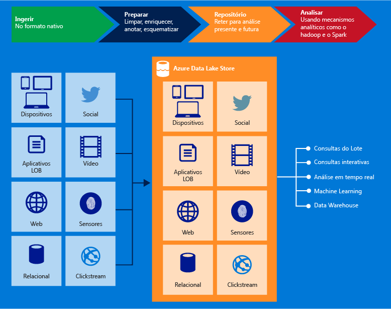

# O que é o Azure Data Lake armazenamento Gen1?

[!INCLUDE [data-lake-storage-gen1-rename-note.md](../../includes/data-lake-storage-gen1-rename-note.md)]

O Azure Data Lake Storage Gen1 é um repositório de hiperescala em toda a empresa para cargas de trabalho analíticas de big data. O Azure Data Lake permite que você capture dados de qualquer tamanho, tipo e velocidade de ingestão em um único lugar para análises operacionais e exploratórias.

O Data Lake Storage Gen1 pode ser acessado a partir do Hadoop (disponível com o cluster HDInsight) usando as APIs REST compatíveis com WebHDFS. Ele foi projetado para permitir a análise dos dados armazenados e é ajustado para desempenho para cenários de análise de dados. Gen1 de armazenamento do data Lake inclui todos os recursos de nível empresarial: segurança, capacidade de gerenciamento, escalabilidade, confiabilidade e disponibilidade.

## Principais recursos

Alguns dos principais recursos do Data Lake Storage Gen1 incluem o seguinte.

### Desenvolvido para Hadoop

Gen1 de armazenamento do data Lake é um sistema de arquivos Apache Hadoop que é compatível com o Hadoop Distributed arquivo HDFS (sistema) e funciona com o ecossistema do Hadoop. Seus aplicativos ou serviços existentes do HDInsight que usam a API WebHDFS podem ser facilmente integrados ao Data Lake Storage Gen1. O Data Lake Storage Gen1 também exibe uma interface REST compatível com WebHDFS para aplicativos.

Você pode facilmente analisar dados armazenados no Data Lake armazenamento Gen1 usando estruturas de análise Hadoop, como MapReduce ou Hive. Você pode provisionar clusters do HDInsight do Azure e configurá-los para acessar diretamente os dados armazenados no Data Lake armazenamento Gen1.

### Armazenamento ilimitado, arquivos em petabytes

Gen1 de armazenamento do data Lake fornece armazenamento ilimitado e pode armazenar uma variedade de dados para análise. Ele não impõe limites de tamanho de conta, tamanhos de arquivo ou a quantidade de dados que podem ser armazenados em um data lake. Arquivos individuais podem variar de quilobytes a petabytes de tamanho. Dados são armazenados permanentemente por meio de várias cópias. Não há nenhum limite na duração de tempo para o qual os dados podem ser armazenados no data lake.

### Desempenho ajustado para a análise de big data

Gen1 de armazenamento do data Lake foi criado para executar em grande escala sistemas de análises que demandam enorme produtividade para consultar e analisar grandes quantidades de dados. O Data Lake espalha partes de um arquivo por vários servidores de armazenamento individuais. Isso melhora a produtividade da leitura do arquivo em paralelo para a realização de análises de dados.

### Pronto para empresas: altamente disponível e seguro

O Data Lake Storage Gen1 fornece disponibilidade e confiabilidade padrão do setor. Seus ativos de dados são armazenados permanentemente por meio de cópias redundantes, a fim de se proteger contra quaisquer falhas inesperadas.

O Data Lake Storage Gen1 também fornece segurança de nível corporativo para os dados armazenados. Para obter mais informações, consulte [Protegendo dados no Armazenamento de dados do Lake Azure Gen1](#DataLakeStoreSecurity).

### Todos os dados

Gen1 de armazenamento do data Lake pode armazenar todos os dados em seu formato nativo, sem exigir transformações prévias. O Data Lake Storage Gen1 não exige que um esquema seja definido antes de os dados serem carregados, deixando a estrutura analítica individual interpretar os dados e definir um esquema no momento da análise. A capacidade de armazenar arquivos de formatos e tamanhos arbitrários possibilita para Data Lake armazenamento Gen1 lidar com dados estruturados, semi-estruturados e não estruturados.

Os contêineres Data Lake Storage Gen1 para dados são essencialmente pastas e arquivos. Operar nos dados armazenados usando SDKs, o portal do Azure e o Azure Powershell. Se você colocar seus dados para o repositório usando essas interfaces e os contêineres apropriados, você pode armazenar qualquer tipo de dados. O Data Lake Storage Gen1 não executa nenhum tratamento especial de dados com base no tipo de dados que armazena.

## Proteção de dados

Usos de armazenamento Gen1 do data Lake do Azure Active Directory (Azure AD) para autenticação e acesso (ACLs) para gerenciar o acesso listas de controle para seus dados.

| Recurso | DESCRIÇÃO |
| --- | --- |
| Authentication |Gen1 de armazenamento do data Lake integra-se ao Azure AD para o gerenciamento de identidades e acesso para todos os dados armazenados no Data Lake armazenamento Gen1. Devido à integração, Data Lake armazenamento Gen1 benefícios do AD do Azure todos os recursos, como a autenticação multifator, acesso condicional, controle de acesso baseado em função, monitoramento de uso do aplicativo, monitoramento de segurança e alertas e assim por diante. O Data Lake Storage Gen1 oferece suporte ao protocolo OAuth 2.0 para autenticação na interface REST. Ver [autenticação do Data Lake armazenamento Gen1](data-lakes-store-authentication-using-azure-active-directory.md).|
| Controle de acesso |O Data Lake Storage Gen1 fornece controle de acesso, suportando permissões no estilo POSIX expostas pelo protocolo WebHDFS. Você pode habilitar as ACLs na pasta raiz, nas subpastas e nos arquivos individuais. Para obter mais informações sobre como funcionam as ACLs no contexto do Data Lake armazenamento Gen1, consulte [controle de acesso no Data Lake armazenamento Gen1](data-lake-store-access-control.md). |
| Criptografia |Data Lake armazenamento Gen1 também fornece criptografia para dados armazenados na conta. Você especifica as configurações de criptografia ao criar uma conta do Data Lake Storage Gen1. É possível optar por ter os dados criptografados ou não escolher nenhuma criptografia. Para obter mais informações, consulte [Criptografia no Data Lake Storage Gen1](data-lake-store-encryption.md). Para obter instruções sobre como fornecer configuração relacionada à criptografia, consulte [Introdução ao Data Lake armazenamento Gen1 usando o portal do Azure](data-lake-store-get-started-portal.md). |

Para obter instruções sobre como proteger dados no Data Lake Storage Gen1, consulte [Protegendo dados no Armazenamento de dados do Azure Data Lake Gen1](data-lake-store-secure-data.md).

## Compatibilidade de aplicativos

O Azure Data Lake Storage Gen1 é compatível com a maioria dos componentes de software livre no ecossistema do Hadoop. Ele também se integra bem com outros serviços do Azure. Para saber mais sobre como você pode usar o Data Lake armazenamento Gen1 com componentes de código-fonte aberto e outros serviços do Azure, use os links a seguir:

- Confira [Aplicativos e serviços compatíveis com o Azure Data Lake Storage Gen1](data-lake-store-compatible-oss-other-applications.md) para obter uma lista de aplicativos de software livre interoperáveis com o Data Lake Storage Gen1.
- Ver [a integração com outros serviços do Azure](data-lake-store-integrate-with-other-services.md) para entender como usar Gen1 de armazenamento do Data Lake com outros serviços do Azure para habilitar uma maior variedade de cenários.
- Veja [Cenários para usar o Data Lake Storage Gen1](data-lake-store-data-scenarios.md) para aprender a usar o Data Lake Storage Gen1 em cenários como a ingestão de dados, o processamento de dados, o download de dados e a visualização de dados.

## Sistema de arquivos do data Lake armazenamento Gen1

Data Lake armazenamento Gen1 podem ser acessados por meio do sistema de arquivos AzureDataLakeFilesystem (adl: / /) em ambientes Hadoop (disponíveis com o cluster HDInsight). Aplicativos e serviços que usam adl: / / pode aproveitar ainda mais otimizações de desempenho que não estão disponíveis no momento no WebHDFS. Como resultado, Data Lake armazenamento Gen1 dá a você a flexibilidade de fazer uso de melhor desempenho com a opção recomendada de usar adl: / / ou manter o código existente ao continuar a usar a API WebHDFS diretamente. O Azure HDInsight aproveita totalmente o AzureDataLakeFilesystem para fornecer o melhor desempenho no Data Lake Storage Gen1.

Você pode acessar seus dados no Data Lake Storage Gen1 usando `adl://<data_lake_storage_gen1_name>.azuredatalakestore.net`. Para obter mais informações sobre como acessar os dados no Data Lake armazenamento Gen1, consulte [exibir as propriedades dos dados armazenados](data-lake-store-get-started-portal.md#properties).

## Próximas etapas

- [Introdução ao Data Lake armazenamento Gen1 usando o portal do Azure](data-lake-store-get-started-portal.md)
- [Introdução ao Data Lake armazenamento Gen1 usando o SDK do .NET](data-lake-store-get-started-net-sdk.md)
- [Usar o Azure HDInsight com o Data Lake Storage Gen1](data-lake-store-hdinsight-hadoop-use-portal.md)