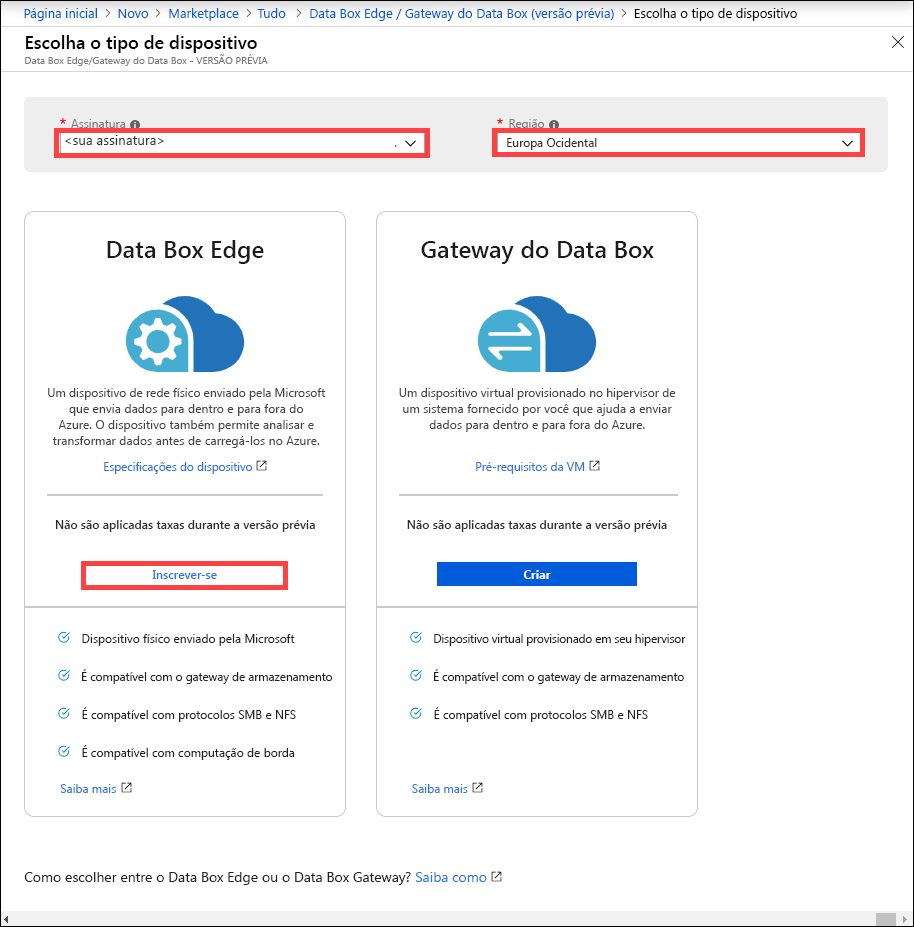
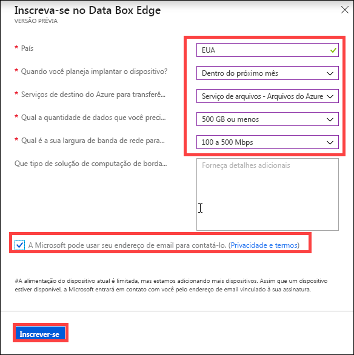

# O que é o Azure Data Box Edge (versão prévia)? 

O Azure Data Box Edge é uma solução de armazenamento que permite processar dados e enviá-los pela rede para o Azure. Este artigo fornece uma visão geral da solução, dos benefícios, das principais funcionalidades e dos cenários do Data Box Edge em que é possível implantar esse dispositivo. 

O Data Box Edge usa um dispositivo físico fornecido pela Microsoft para acelerar a transferência de dados segura. O dispositivo físico reside em seu local e você grava os dados nele usando os protocolos NFS e SMB. 

O Data Box Edge tem todas as funcionalidades do Data Box Gateway. Além disso, o Data Box é equipado com funcionalidades de computação borda habilitadas para IA que ajudam a analisar, processar ou filtrar dados à medida em que são movidos para o blob de blocos do Azure, blob de páginas ou para os Arquivos do Azure.  

> [!IMPORTANT]
> - O Data Box Edge está em versão prévia. [Inscreva-se](#sign-up) neste serviço!
> - Examine os [termos de uso para a versão prévia](https://azure.microsoft.com/support/legal/preview-supplemental-terms/) antes de implantar essa solução.

## Casos de uso

O Azure Data Box Edge é um dispositivo de computação de borda habilitado para IA com funcionalidades de transferência de dados de rede. Veja a seguir os vários cenários em que o Data Box Edge pode ser usado para a transferência de dados.

- **Pré-processar dados** – Analise dados de dispositivos IoT ou locais para chegar ao resultado rapidamente e fique perto do local em que os dados são gerados. O Data Box Edge transfere o conjunto de dados completo para a nuvem para realizar um processamento mais avançado ou análise mais aprofundada.  O pré-processamento pode ser usado para: 

    - Agregar dados.
    - Modificar dados, por exemplo, para remover PII (Informações de identificação pessoal).
    - Colocar em subconjunto e transferir os dados necessários para realizar análises mais aprofundadas na nuvem.
    - Analisar e reagir a Eventos de IoT. 

- **Azure Machine Learning de Inferência** – Com o Data Box Edge, é possível executar modelos de ML (Machine Learning) para obter resultados rápidos que podem ser tratados antes que os dados sejam enviados para a nuvem. O conjunto de dados completo é transferido para continuar a treinar novamente e melhorar os modelos de ML.

- **Transferir dados pela rede para o Azure** – Use o Data Box Edge para transferir dados de maneira rápida e fácil para o Azure para habilitar ainda mais computação e análise ou para fins de arquivamento. 

## Benefícios

O Data Box Edge tem os seguintes benefícios:

- **Transferência de dados fácil** – Torna a movimentação de dados para dentro e fora do Azure tão fácil quanto trabalhar em um compartilhamento de rede local.  
- **Alto desempenho** – Permite transferências de alto desempenho para o Azure e dele. 
- **Acesso rápido** – armazena em cache os arquivos mais recentes para acesso rápido de arquivos locais.  
- **Uso de largura de banda limitado** – Os dados podem ser gravados no Azure, mesmo quando a rede tem uma restrição para limitar o uso durante o horário comercial de pico.  
- **Transformar dados** – Habilita a análise, processamento ou filtragem de dados conforme eles são movidos para o Azure.

## Principais recursos

O Data Box Edge tem as seguintes funcionalidades:

|Recurso |DESCRIÇÃO  |
|---------|---------|
|Alto desempenho     | Largura de banda e transferência de dados totalmente automatizada e altamente otimizada.|
|Protocolos com suporte     | Suporte para os protocolos SMB e NFS padrão para ingestão de dados.   Para obter mais informações sobre as versões com suporte, acesse [Data Box Edge system requirements](https://aka.ms/dbe-docs) (Requisitos do sistema do Data Box Edge).|
|Computação       |Permite a análise, o processamento e a filtragem de dados.|
|Acesso de dados     | Acesso direto a dados dos Blobs de Armazenamento do Microsoft Azure e Arquivos do Azure usando APIs de nuvem para processamento adicional de dados na nuvem.|
|Acesso rápido     | Cache local no dispositivo para acesso rápido dos arquivos usados mais recentemente.|
|Upload offline     | O modo desconectado é compatível com cenários de upload offline.|
|Atualização dedados     | Capacidade de atualizar arquivos locais com a versão mais recente da nuvem.|
|Criptografia    | Suporte ao BitLocker para criptografar dados localmente e proteger a transferência de dados para a nuvem por meio do *https*.       |
|Resiliência     | Resiliência de rede interna.        |

## Recursos e especificações

O dispositivo físico Data Box Edge tem os seguintes recursos:

| Recursos/especificações                                          | DESCRIÇÃO              |
|---------------------------------------------------------|--------------------------|
| Dimensões   | Largura: 17,25 pol. Profundidade: 27,25 pol. Altura: 1,75 pol. (exclui identificadores PSU e ouvidos)  |            
| Espaço em rack|1U quando colocado no rack|
| Cabos| 2 cabos de alimentação 2 cabos RJ-45 de 1 Gbps 2 cabos de cobre + SFP de 10 Gbps|
| Componentes|2 PSUs (unidades de fonte de energia) internas|
| CPU|2 processadores Intel Xeon com 10 núcleos cada  |
| Memória| 64 GB de RAM|
| Discos| 8 SSDs NVMe, cada disco tem 1,6 TB   O sistema falhará se um SSD NVMe falhar. |
| Capacidade de armazenamento local| Capacidade total de 12,8 TB|
| Interfaces de rede| 2 interfaces de 1 GbE – 1 gerenciamento, não configurável pelo usuário, usado para configuração inicial. A outra interface é configurável pelo usuário e pode ser usada para transferência de dados e é DHCP por padrão.  2 interfaces de 25 GbE – Elas também podem ser operadas como interfaces de 10 GbE. Essas interfaces de dados podem ser configuradas pelo usuário como DHCP (padrão) ou estáticas.   2 interfaces de 25 GbE – Essas interfaces de dados podem ser configuradas pelo usuário como DHCP (padrão) ou estáticas.|

## Componentes

A solução Data Box Edge é composta pelo recurso do Data Box Edge, dispositivo físico Data Box Edge e uma interface do usuário da Web local.

* **Dispositivo físico Data Box Edge** – Um servidor montado em rack de 1U fornecido pela Microsoft que pode ser configurado para enviar dados ao Azure. 
    
* **Recurso do Data Box Edge** – um recurso no portal do Azure que permite a você gerenciar um dispositivo Data Box Edge em uma interface da Web que pode ser acessada em diferentes localizações geográficas. Use o recurso do Data Box Edge para criar e gerenciar recursos, exibir e gerenciar dispositivos e alertas e gerenciar compartilhamentos.  

    <!---->

    Para obter mais informações, acesse [Usar o serviço do Data Box Edge para administrar seu dispositivo Data Box Edge](https://aka.ms/dbe-docs).

* **Interface do usuário da Web local do Data Box** – Use a interface do usuário da Web local para executar diagnósticos, desligar e reiniciar o dispositivo Data Box Edge, exibir logs de cópia e contatar o Suporte da Microsoft para apresentar uma solicitação de serviço.

    <!---->

    Para obter informações sobre como usar a interface do usuário baseada na Web, acesse [Use the web-based UI to administer your Data Box](https://aka.ms/dbe-docs) (Usar a interface do usuário baseada na Web para administrar seu Data Box).

## Disponibilidade de região

O dispositivo físico Data Box Edge, o recurso do Azure e a conta de armazenamento de destino para a qual os dados são transferidos não precisam estar na mesma região.

- **Disponibilidade do recurso** – Para esta versão, o recurso Data Box Edge está disponível nas seguintes regiões:
    - **Estados Unidos** – Oeste dos EUA 2 e Leste dos EUA
    - **União Europeia** – Europa Ocidental
    - **Pacífico Asiático** – Sudeste da Ásia

- **Contas de Armazenamento de destino** – as contas de armazenamento que armazenam os dados estão disponíveis em todas as regiões do Azure. 

    As regiões em que as contas de armazenamento armazenam os dados do Data Box devem estar localizadas perto do local em que o dispositivo está localizado para render desempenho ideal. Uma conta de armazenamento localizada longe do dispositivo resulta em longas latências de desempenho mais lentos. 

## Inscrição

O Data Box Edge está em versão prévia e uma inscrição é necessária. Siga estas etapas para inscrever-se no Data Box Gateway:

1. Entre no portal do Azure em: [https://aka.ms/databox-edge](https://aka.ms/databox-edge).

2. Escolha a assinatura que deseja usar para a versão prévia do Data Box Edge. Selecione a região em que você deseja implantar o recurso do Data Box Edge. Na opção Data Box Edge, clique em **Inscrever-se**.

    

3.  Responda às perguntas sobre país de residência dos dados, período, serviço de destino do Azure para transferência de dados, largura de banda de rede e frequência da transferência de dados. Examine **Privacidade e termos** e marque a caixa de seleção **A Microsoft pode usar seu endereço de email para contatá-lo**.

    

4. Depois de se inscrever e estar habilitado para a versão prévia, você pode solicitar um Data Box Edge.

## Próximas etapas

- Examine os [Requisitos de sistema do Data Box Edge](https://aka.ms/dbe-docs).
- Entenda os [limites do Data Box Edge](https://aka.ms/dbe-docs).
- Implante o [Azure Data Box Edge](https://aka.ms/dbe-docs) no portal do Azure.

