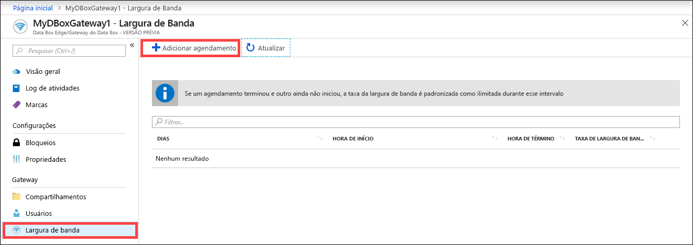
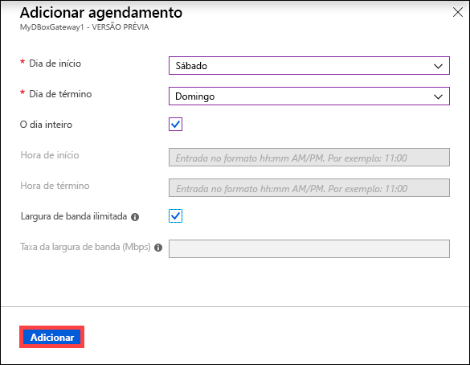
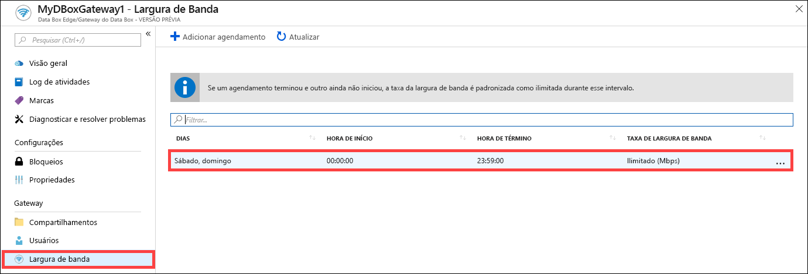
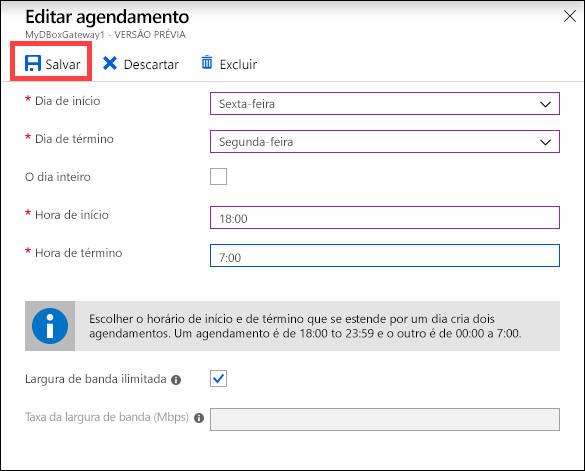
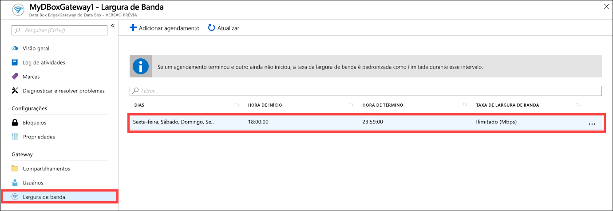
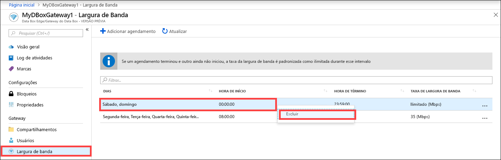

# Use o portal do Azure para gerenciar agendas de largura de banda em seu Azure Data Box Gateway  

Este artigo descreve como gerenciar usuários em seu Azure Data Box Gateway. As agendas de largura de banda permitem configurar o uso da largura de banda da rede em diferentes agendamentos ao longo das horas do dia. Essas agendas podem ser aplicadas às operações de download e upload de seu dispositivo para a nuvem. 

Você pode adicionar, modificar ou excluir as agendas de largura de banda de seu Data Box Gateway usando o portal do Azure.

Neste artigo, você aprenderá a:

> [!div class="checklist"]
> * Adicionar uma agenda
> * modificar uma agenda
> * excluir uma agenda 

## Adicionar uma agenda

Para adicionar um usuário, siga estas etapas no portal do Azure.

1. No portal do Azure de seu recurso do Data Box Gateway, acesse **Largura de banda**.
2. No painel direito, clique em **+ Adicionar agendamento**.

    

3. Em **Adicionar agendamento**: 

   1. Informe o **Dia de início**, o **Dia de término**, a **Hora de início** e a **Hora de término** da agenda. 
   2. Se essa agenda é executada o dia inteiro, você pode marcar a opção **O dia inteiro**. 
   3. **Taxa de largura de banda** é a largura de banda em Megabits por segundo (Mbps) usada pelo dispositivo em operações que envolvem a nuvem (uploads e downloads). Forneça um número entre 1 e 1.000 para esse campo. 
   4. Marque a opção de largura de banda **Ilimitada** se você não quiser restringir o download e o upload de dados. 
   5. Clique em **Adicionar**.

      

3. É criada uma agenda com os parâmetros especificados. Em seguida, essa agenda é exibida na lista de agendas de largura de banda no portal.

## Editar agenda

Execute as etapas a seguir para editar uma agenda de largura de banda. 

1. No portal do Azure, vá até seu recurso do Data Box Gateway e acesse Largura de banda. 
2. Na lista de agendas de largura de banda, selecione e clique em uma agenda que você deseja modificar.
    

3. Faça as alterações desejadas e salve-as.

    

4. Após a agenda ser modificada, a lista de agendas será atualizada para refletir a agenda modificada.

    

## excluir uma agenda

Execute as seguintes etapas para excluir uma agenda de largura de banda associada a seu dispositivo de Data Box Gateway.

1. No portal do Azure, vá até seu recurso do Data Box Gateway e acesse **Largura de banda**.  

2. Na lista de agendas de largura de banda, selecione uma agenda que você deseja excluir. Clique com o botão direito do mouse para exibir o menu de contexto e clique em **Excluir**. 

   

3.  Após a agenda ser excluída, a lista de agendas será atualizada.

## Próximas etapas

- Saiba como [Gerenciar a largura de banda](data-box-gateway-manage-bandwidth-schedules.md).
