# Use o portal do Azure para gerenciar compartilhamentos em seu Azure Data Box Gateway 

Este artigo descreve como gerenciar compartilhamentos em seu Azure Data Box Gateway. Você pode gerenciar o Azure Data Box Gateway usando o portal do Azure ou a interface do usuário da Web local. Use o portal do Azure para adicionar, excluir, atualizar compartilhamentos ou sincronizar a chave de armazenamento para conta de armazenamento associada com os compartilhamentos.

## Sobre compartilhamentos

Para transferir dados para o Azure, você precisa criar compartilhamentos em seu Azure Data Box Gateway. Os compartilhamentos que você adiciona ao dispositivo do Data Box Gateway compartilhamentos em nuvem. Os dados nesses compartilhamentos são carregados automaticamente para a nuvem. Todas as funções de nuvem, como Atualizar e Sincronizar as chaves de armazenamento se aplicam a esses compartilhamentos. Use os compartilhamentos de nuvem quando você desejar que os dados de dispositivo sejam enviados automaticamente para sua conta de armazenamento na nuvem.

Neste artigo, você aprenderá a:

> [!div class="checklist"]
> * Adicionar um compartilhamento
> * Excluir um compartilhamento
> * Atualizar compartilhamentos
> * Sincronizar chave de armazenamento

## Adicionar um compartilhamento

Execute as etapas a seguir no portal do Azure para criar um compartilhamento.

1. No portal do Azure, vá até seu recurso do Data Box Gateway e navegue até **Visão geral**. Clique em **+ Adicionar compartilhamento** na barra de comandos.
2. Em **Adicionar compartilhamento**, especifique as configurações de compartilhamento. Forneça um nome exclusivo para seu compartilhamento.

    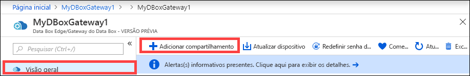

    Os nomes de compartilhamentos só podem conter números, letras minúsculas e hifens. O nome do compartilhamento deve ter entre 3 e 63 caracteres e começar com uma letra ou um número. Cada hífen deve ser precedido e seguido por um caractere que não seja um hífen.

3. Escolha um **Tipo** para o compartilhamento. O tipo pode ser **SMB** ou **NFS**, sendo SMB o padrão. SMB é o padrão para clientes do Windows e NFS é usado para clientes Linux. Dependendo da escolha entre compartilhamentos SMB ou NFS, as opções apresentadas serão ligeiramente diferentes.

4. Forneça um **Conta de armazenamento** na qual o compartilhamento resida. Um contêiner será criado na conta de armazenamento com o nome do compartilhamento se o contêiner já não existir. Se o contêiner já existir, ele será usado.

5. Escolha o **Serviço de armazenamento** entre blob de blocos, blobs de página ou arquivos. O tipo do serviço escolhido depende do formato escolhido para os dados que residirão no Azure. Por exemplo, nesta instância, queremos que os dados residam como blocos de blob no Azure e, portanto, vamos escolher o **Blob de Blocos**. Se estiver escolhendo **Blob de Páginas**, você precisará fazer com que seus dados sejam alinhados com 512 bytes. Por exemplo, um VHDX sempre é alinhado com 512 bytes.

6. Esta etapa depende do tipo de compartilhamento criado, SMB ou NFS.
    - **Se estiver criando compartilhamento SMB**: no campo **Todos os usuários locais com privilégios**, escolha **Criar novo** ou **Usar existente**. Se a criação for de um novo usuário local, forneça o **nome de usuário**, a **senha** e então confirme a senha. Isso atribui as permissões ao usuário local. Depois de atribuir as permissões aqui, você pode usar o Gerenciador de Arquivos para modificar essas permissões.

        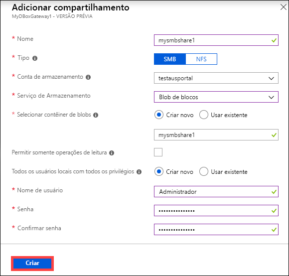

        Se você marcar a opção Permitir apenas operações de leitura para esses compartilhamento de dados, poderá especificar usuários somente leitura.
    - **Se a criação for de um compartilhamento NFS**: você precisará fornecer os **endereços IP dos clientes permitidos** que podem acessar o compartilhamento.

        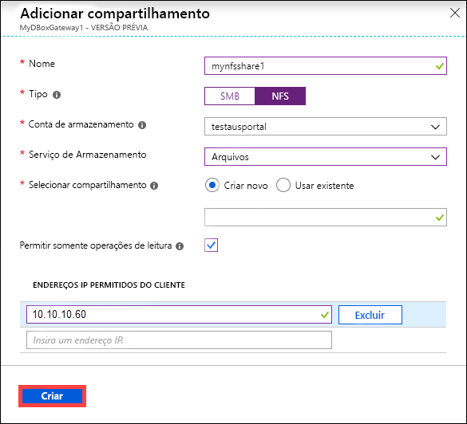

7. Clique em **Criar** para criar o compartilhamento. Você será notificado de que a criação do compartilhamento está em andamento. Depois que o compartilhamento for criado com as configurações especificadas, a folha **Compartilhamentos** será atualizada para refletir o novo compartilhamento.
 
## Excluir um compartilhamento

Para excluir um compartilhamento, siga estas etapas no portal do Azure.

1. Na lista de compartilhamentos, selecione e clique no compartilhamento que você deseja excluir.

    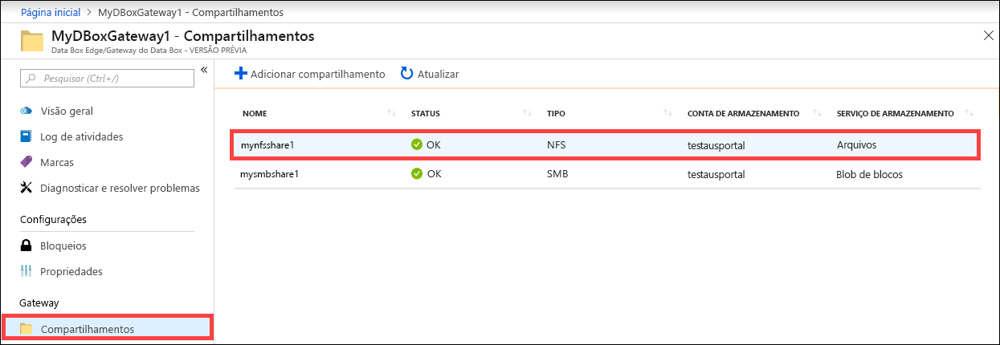

2. Clique em **Excluir**. 

    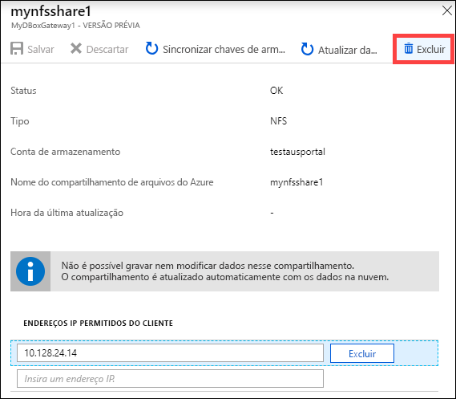

3. Quando solicitado a confirmar, clique em **Sim**.

    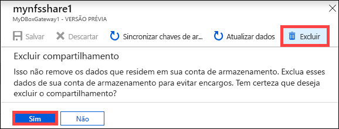

A lista de compartilhamentos é atualizada para refletir a exclusão.

## Atualizar compartilhamentos

O recurso de atualização permite que você atualize o conteúdo de um compartilhamento local. Quando você atualiza um compartilhamento, uma pesquisa é iniciada para localizar todos os objetos do Azure, incluindo os blobs e arquivos adicionados à nuvem desde a última atualização. Esses arquivos adicionais então são usados para atualizar o conteúdo do compartilhamento local no dispositivo. 

> [!NOTE]
> As permissões e ACLs (listas de controle de acesso) não são preservadas em uma operação de atualização. 

Para atualizar um compartilhamento, siga estas etapas no portal do Azure.

1.  No portal do Azure, acesse **Compartilhamentos**. Selecione e clique no compartilhamento que você deseja atualizar.

    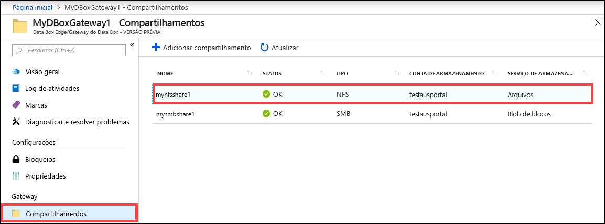

2.  Clique em **Atualizar**. 

    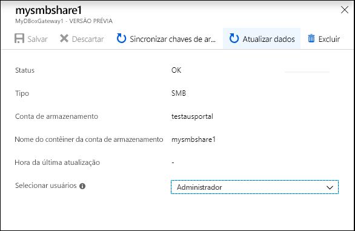
 
3.  Quando solicitado a confirmar, clique em **Sim**. Um trabalho começa a atualizar o conteúdo do compartilhamento local. 

    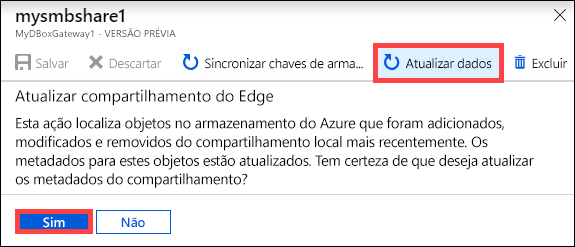
 
4.  Enquanto a atualização está em andamento, a opção de atualização fica esmaecida no menu de contexto. Clique na notificação de trabalho para exibir o status do trabalho de atualização.

5.  O tempo para atualização depende do número de arquivos no contêiner do Azure, bem como dos arquivos no dispositivo. Depois que a atualização tiver sido concluída com êxito, o carimbo de data/hora de compartilhamento será atualizado. Mesmo que a atualização tenha falhas parciais, a operação será considerada bem-sucedida e o carimbo de data/hora será atualizado. 

    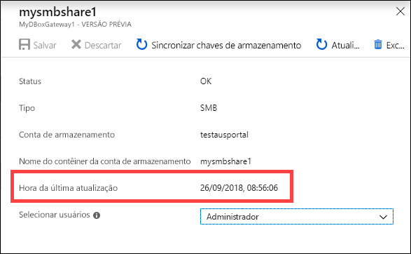
 
Se houver uma falha, um alerta será gerado. O alerta detalha a causa e a recomendação para corrigir o problema. O alerta também fornece links para um arquivo que tem o resumo completo das falhas, incluindo os arquivos que falharam em ser atualizados ou excluídos.

>[!IMPORTANT]
> Nesta liberação de versão prévia, não atualize mais de um único compartilhamento por vez.

## Sincronizar chaves de armazenamento

Se tiver sido feita a rotação das chaves da conta de armazenamento, você precisará sincronizar as chaves de acesso de armazenamento. A sincronização ajuda o dispositivo obter as chaves mais recente para sua conta de armazenamento.

Execute as seguintes etapas no portal do Azure para sincronizar sua chave de acesso de armazenamento.

1. Vá para **Visão Geral** em seu recurso. 
2. Na lista de compartilhamentos, escolha e clique em um compartilhamento associado com a conta de armazenamento que você precisa sincronizar. Clique em **Sincronizar chave de armazenamento**. 

     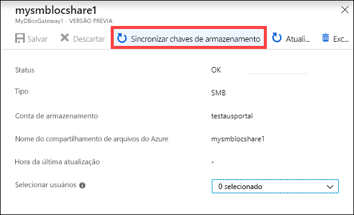

3. Clique em **Sim** quando solicitada a confirmação. Saia da caixa de diálogo depois que a sincronização tiver sido concluída.

     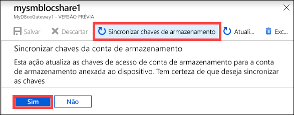

>[!NOTE]
> Você precisa fazer isso apenas uma vez para uma conta de armazenamento específica. Você não precisa repetir essa ação para todos os compartilhamentos associados com a mesma conta de armazenamento.

## Próximas etapas

- Saiba como [Gerenciar usuários usando o portal do Azure](data-box-gateway-manage-users.md).
