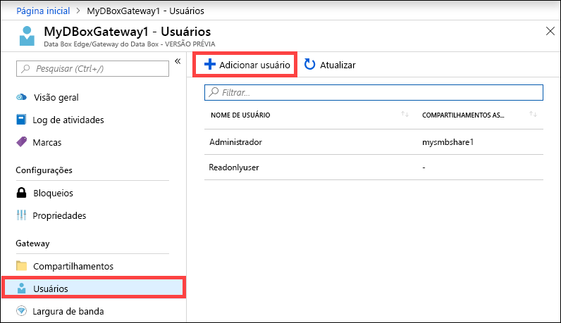
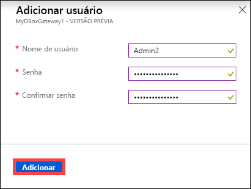
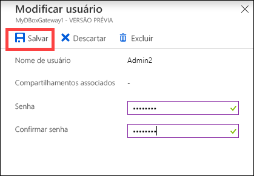
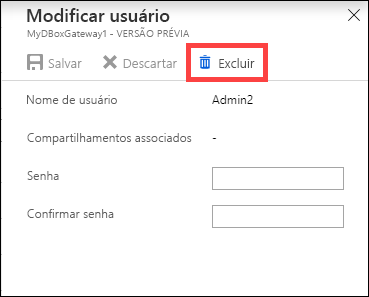
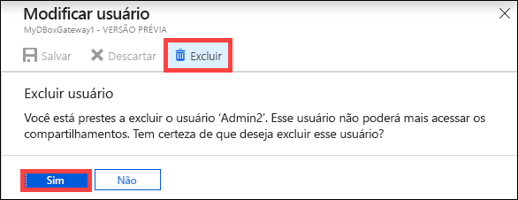
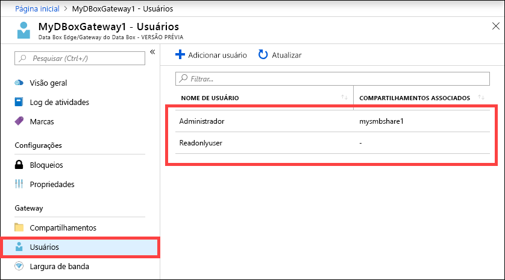

# Use o portal do Azure para gerenciar usuários em seu Azure Data Box Gateway 

Este artigo descreve como gerenciar usuários em seu Azure Data Box Gateway. Você pode gerenciar o Azure Data Box Gateway usando o portal do Azure ou a interface do usuário da Web local. Use o portal do Azure para adicionar, modificar ou excluir usuários.

Neste artigo, você aprenderá a:

> [!div class="checklist"]
> * Adicionar um usuário
> * Modificar usuário
> * Excluir um usuário 

## Sobre os usuários

Os usuários podem ter privilégio completo ou somente leitura. Como o nome indica, usuários somente leitura podem apenas exibir os dados do compartilhamento. Usuários com privilégio completo podem ler dados de compartilhamento, gravar nesses compartilhamentos e modificar ou excluir os dados de compartilhamento. 

 - **Usuário com privilégios completo** – um usuário local com acesso completo. 
 - **Usuário somente leitura** – um usuário local com acesso somente leitura. Esses usuários estão associados a compartilhamentos que permitem operações somente leitura.

As permissões do usuário são definidas quando o usuário é criado durante a criação do compartilhamento. Após as permissões associadas a um usuário serem definidas, elas podem ser modificadas usando o Explorador de Arquivos. 

## Adicionar um usuário

Para adicionar um usuário, siga estas etapas no portal do Azure.

1. No portal do Azure, vá até seu recurso do Data Box Gateway e navegue até **Visão geral**. Clique em **+ Adicionar usuário** na barra de comandos.

    

2. Especifique o nome de usuário e senha do usuário que você deseja adicionar. Confirme a senha e clique em **Adicionar**.

    

    > [!IMPORTANT] 
    > Estes usuários são reservados pelo sistema e não devem ser usados: Administrator, EdgeUser, EdgeSupport, HcsSetupUser, WDAGUtilityAccount, CLIUSR, DefaultAccount, Guest.  

3. Você será notificado quando a criação do usuário for iniciada e concluída. Após o usuário ser criado, clique em **Atualizar** na barra de comandos para exibir a lista de usuários atualizada.

## Modificar usuário

Você pode alterar a senha associada a um usuário após ele ser criado. Selecione e clique na lista de usuários. Forneça e confirme a nova senha. Salve as alterações.
 

## Excluir um usuário

Para excluir um usuário, siga estas etapas no portal do Azure.

1. Selecione e clique no usuário na lista de usuários e, em seguida, clique em **Excluir**.  

   

2. Quando receber a solicitação, confirme a exclusão. 

   

A lista de usuários é atualizada para refletir o usuário excluído.

## Próximas etapas

- Saiba como [Gerenciar a largura de banda](data-box-gateway-manage-bandwidth-schedules.md).
