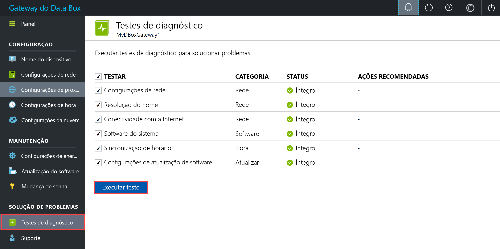
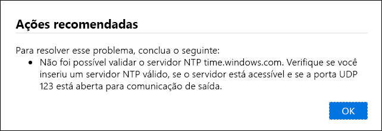
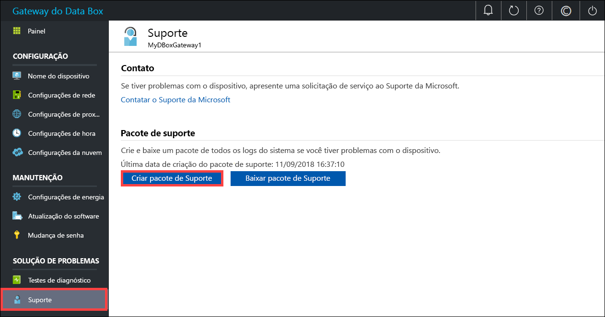
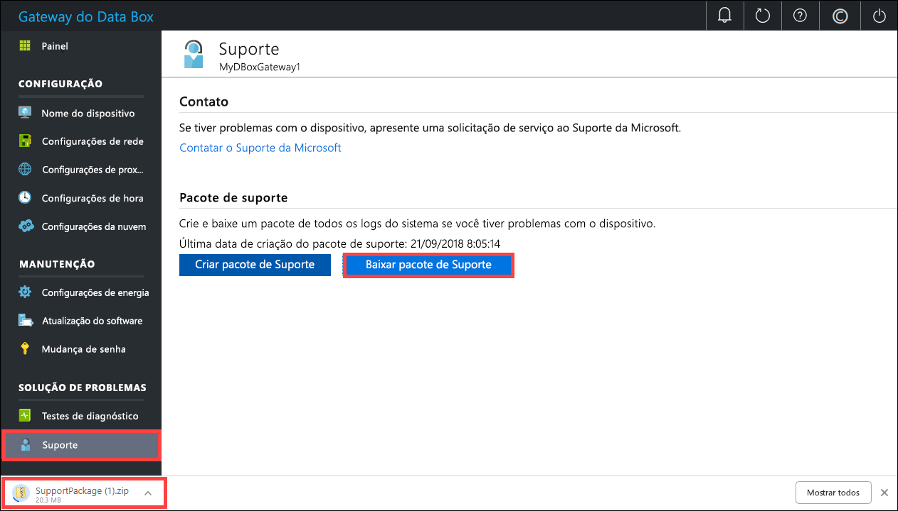
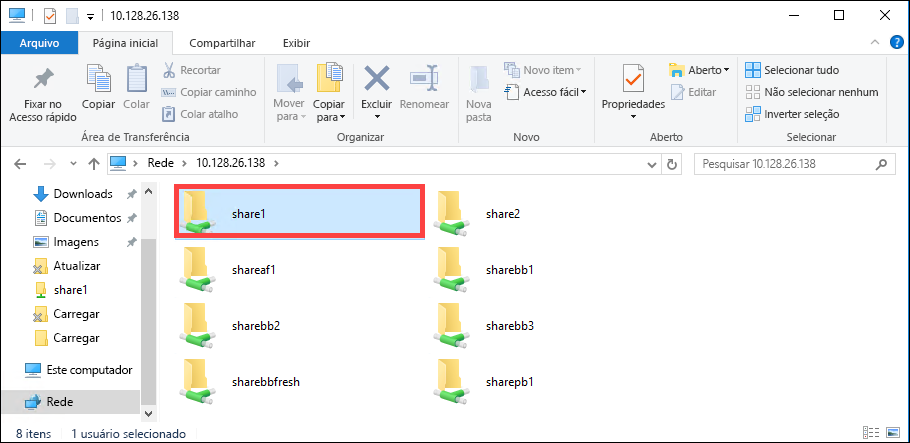

# <a name="troubleshoot-your-azure-data-box-gateway-issues"></a>Solucionar problemas do Azure Data Box Gateway 

Este artigo descreve como solucionar problemas no seu Azure Data Box Gateway. Neste artigo, você aprenderá a:

> [!div class="checklist"]
> * Executar diagnóstico
> * Coletar o pacote de Suporte
> * Usar logs para solucionar problemas


## <a name="run-diagnostics"></a>Executar diagnóstico

Para diagnosticar e solucionar quaisquer erros de dispositivo, você pode executar os testes de diagnóstico. Execute as seguintes etapas na interface do usuário da Web local do seu dispositivo para executar testes de diagnóstico.

1. Na interface do usuário da Web local, vá para **Solução de problemas > Testes de diagnóstico**. Selecione o teste que você deseja executar e clique em **Executar teste**. Isso executará os testes para diagnosticar quaisquer possíveis problemas com suas configurações de rede, dispositivo, proxy da Web, hora ou nuvem. Você é notificado de que o dispositivo está executando testes.

    
 
2. Depois de os testes terem sido concluídos, os resultados serão exibidos. Se um teste falhar, uma URL para a ação recomendada será apresentada. Você pode clicar no URL para exibir a ação recomendada. 
 
    


## <a name="collect-support-package"></a>Coletar o pacote de Suporte

Um pacote de log é composto por todos os logs relevantes que podem ajudar o Suporte da Microsoft a solucionar problemas no dispositivo. Você pode gerar um pacote de log por meio da interface do usuário da Web local.

Execute as seguintes etapas para coletar um pacote de suporte. 

1. Na interface do usuário da Web local, vá para **Solução de problemas > Suporte**. Clique em **Criar pacote de suporte**. O sistema começará a coletar o pacote de suporte. A coleta do pacote poderá levar vários minutos.

    
 
2. Depois que o pacote de suporte for criado, clique em **Baixar Pacote de Suporte**. Um pacote compactado é baixado no caminho que você escolheu. Descompacte o pacote.

    

## <a name="use-logs-to-troubleshoot"></a>Usar logs para solucionar problemas

Quaisquer erros ocorridos durante os processos de upload e de atualização são incluídos nos arquivos do respectivo erro.

1. Para exibir os arquivos de erro, vá para o compartilhamento e clique no compartilhamento para exibir o conteúdo. 

      

2. Clique na _pasta do Microsoft Data Box Gateway_. Esta pasta tem duas subpastas:

   - Faça upload da pasta que contém os arquivos de log para erros de upload.
   - Atualize a pasta para erros durante a atualização.

     Aqui está um arquivo de log de exemplo para a atualização.

     ```
     <root container="brownbag1" machine="VM15BS020663" timestamp="07/18/2018 00:11:10" />
     <file item="test.txt" local="False" remote="True" error="16001" />
     <summary runtime="00:00:00.0945320" errors="1" creates="2" deletes="0" insync="3" replaces="0" pending="9" />
     ``` 

3. Quando você vir um erro neste arquivo (realçado no exemplo), observe o código de erro, neste caso, é 16001. Pesquise a descrição desse código de erro em relação à referência de erro a seguir.

    |     Código do erro     |     Nome da exceção                                         |     Descrição do erro                                                                                                                                                                                                                     |
    |--------------------|------------------------------------------------------------|-------------------------------------------------------------------------------------------------------------------------------------------------------------------------------------------------------------------------------------------|
    |    100             |    ERROR_CONTAINER_OR_SHARE_NAME_LENGTH                    |    O nome do compartilhamento ou do contêiner deve ter entre 3 e 63 caracteres.                                                                                                                                                                     |
    |    101             |    ERROR_CONTAINER_OR_SHARE_NAME_ALPHA_NUMERIC_DASH        |    O nome do compartilhamento ou do contêiner deve consistir apenas em letras, números ou hifens.                                                                                                                                                       |
    |    102             |    ERROR_CONTAINER_OR_SHARE_NAME_IMPROPER_DASH             |    O nome do compartilhamento ou do contêiner deve consistir apenas em letras, números ou hifens.                                                                                                                                                       |
    |    103             |    ERROR_BLOB_OR_FILE_NAME_CHARACTER_CONTROL               |    O nome de blob ou do arquivo contém caracteres de controle sem suporte.                                                                                                                                                                       |
    |    104             |    ERROR_BLOB_OR_FILE_NAME_CHARACTER_ILLEGAL               |    O nome de blob ou do arquivo contém caracteres ilícitos.                                                                                                                                                                                   |
    |    105             |    ERROR_BLOB_OR_FILE_NAME_SEGMENT_COUNT                   |    O nome de arquivo ou blob contém muitos segmentos (cada segmento é separado por uma barra -/).                                                                                                                                              |
    |    106             |    ERROR_BLOB_OR_FILE_NAME_AGGREGATE_LENGTH                |    O nome de blob ou do arquivo é muito longo.                                                                                                                                                                                                     |
    |    107             |    ERROR_BLOB_OR_FILE_NAME_COMPONENT_LENGTH                |    Um dos segmentos no nome do blob ou do arquivo é muito longo.                                                                                                                                                                            |
    |    108             |    ERROR_BLOB_OR_FILE_SIZE_LIMIT                           |    O tamanho do arquivo excede o tamanho máximo do arquivo para upload.                                                                                                                                                                              |
    |    109             |    ERROR_BLOB_OR_FILE_SIZE_ALIGNMENT                       |    O blob ou arquivo está alinhado incorretamente.                                                                                                                                                                                               |
    |    110             |    ERROR_NAME_NOT_VALID_UNICODE                            |    O Unicode codificado no nome do arquivo ou do blob não é válido.                                                                                                                                                                                  |
    |    111             |    ERROR_RESERVED_NAME_NOT_ALLOWED                         |    O nome ou o prefixo do arquivo ou do blob é um nome reservado que não tem suporte (por exemplo, COM1).                                                                                                                             |
    |    2000            |    ERROR_ETAG_MISMATCH                                     |    Uma incompatibilidade de marca eletrônica indica que há um conflito entre um blob de blocos na nuvem e no dispositivo. Para resolver esse conflito, exclua um destes arquivos, seja a versão na nuvem ou a versão no dispositivo.    |
    |    2001            |    ERROR_UNEXPECTED_FINALIZE_FAILURE                       |    Ocorreu um problema inesperado ao processar um arquivo depois que o arquivo foi carregado.    Se você vir esse erro e o erro persistir por mais de 24 horas, contate o suporte.                                                      |
    |    2002            |    ERROR_ALREADY_OPEN                                      |    O arquivo já está aberto em outro processo e não pode ser carregado até que o identificador seja fechado.                                                                                                                                       |
    |    2003            |    ERROR_UNABLE_TO_OPEN                                    |    Não foi possível abrir o arquivo para upload. Se você vir esse erro, entre em contato com o Suporte da Microsoft.                                                                                                                                                |
    |    2004            |    ERROR_UNABLE_TO_CONNECT                                 |    Não foi possível conectar-se ao contêiner para fazer upload de dados nele.                                                                                                                                                                             |
    |    2005            |    ERROR_INVALID_CLOUD_CREDENTIALS                         |    Não foi possível se conectar ao contêiner porque as permissões de conta estão incorretas ou desatualizadas. Verifique seu acesso.                                                                                                               |
    |    2006            |    ERROR_CLOUD_ACCOUNT_DISABLED                            |    Não foi possível fazer upload de dados para a conta, uma vez que a conta ou o compartilhamento está desabilitado.                                                                                                                                                            |
    |    2007            |    ERROR_CLOUD_ACCOUNT_PERMISSIONS                         |    Não foi possível se conectar ao contêiner porque as permissões de conta estão incorretas ou desatualizadas. Verifique seu acesso.                                                                                                               |
    |    2008            |    ERROR_CLOUD_CONTAINER_SIZE_LIMIT_REACHED                |    Não foi possível adicionar novos dados, pois o contêiner está cheio. Verifique as especificações do Azure para os tamanhos de contêiner com suporte com base no tipo. Por exemplo, arquivos do Azure têm suporte apenas para um tamanho máximo do arquivo de 5 TB.                                     |
    |    2009            |    ERROR_CLOUD_CONTAINER_MISSING                |     Não foi possível carregar os dados porque o contêiner associado ao compartilhamento não existe.                                     |    
    |    2997            |    ERROR_ITEM_CANCELED                                     |    Erro inesperado. Esse é um erro transitório que será resolvido por si só.                                                                           |
    |    2998            |    ERROR_UNMAPPED_FAILURE                                  |    Erro inesperado. O erro poderá se resolver sozinho, porém, se ele persistir por mais de 24 horas, entre em contato com o Suporte da Microsoft.                                                                                                     |
    |    16000           |    RefreshException                                        |    Não foi possível desativar esse arquivo.                                                                                                                                                                                                        |
    |    16001           |    RefreshAlreadyExistsException                           |    Não foi possível desativar esse arquivo, pois ela já existe em seu sistema local.                                                                                                                                                         |
    |    16002           |    RefreshWorkNeededException                              |    Não foi possível atualizar este arquivo, pois ele não está totalmente carregado.                                                                                                                                                                          | 


## <a name="next-steps"></a>Próximas etapas

- Saiba mais sobre os [problemas conhecidos nesta versão](data-box-gateway-release-notes.md).
