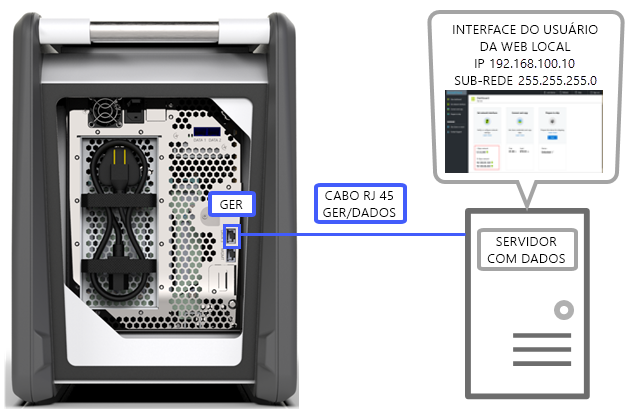
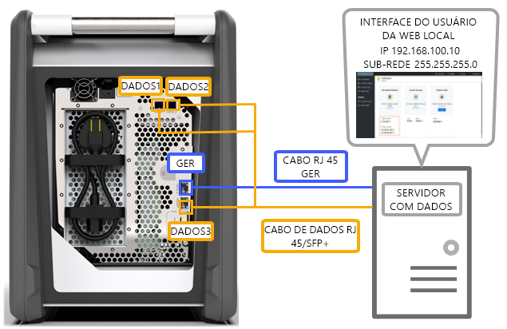
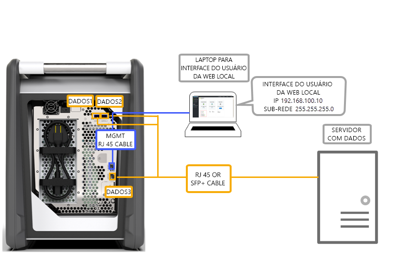
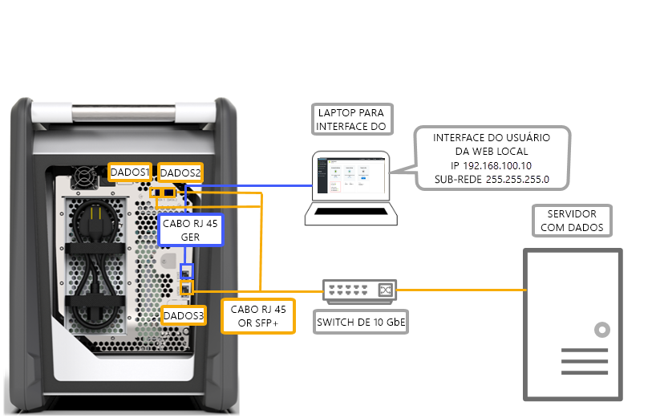
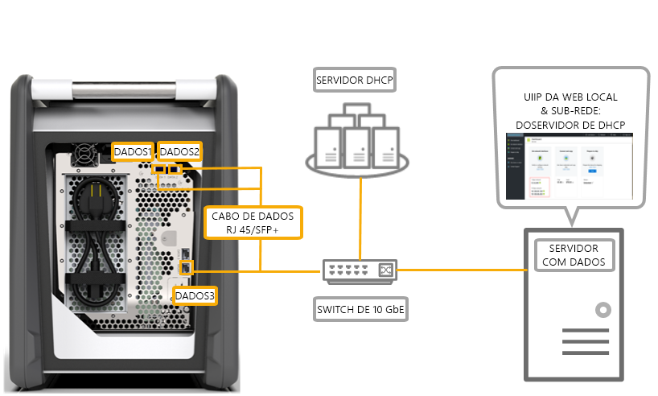

# Opções de cabeamento para o Azure Data Box

Este artigo descreve as várias maneiras de usar cabos no Azure Data Box para transferência de dados.

## Transferir via porta MGMT

Essa opção é a configuração mínima absoluta para o Data Box. Você pode configurar apenas a porta MGMT tanto para gerenciamento quanto para dados.

Antes de começar, verifique se você tem:

- Um cabo Ethernet RJ45 para a MGMT.
- Uma fonte de dados executando um [SO com suporte](data-box-system-requirements.md#supported-operating-systems-for-clients).

Execute as etapas a seguir para cabear o dispositivo.

1. Use um cabo RJ45 para conectar a porta MGMT ao servidor que tem os dados.

    

2. No servidor, defina:

    - **Endereço IP** como 192.168.100.5
    - **Sub-rede** como 255.255.255.0

3. Acesse a interface do usuário da Web local do dispositivo em 192.168.100.10. Entre e desbloqueie o Data Box usando a senha de desbloqueio do portal do Azure.

## Transferência através da porta DATA com IPs estáticos

Você pode configurar duas portas para seu Data Box: a porta MGMT para o tráfego de gerenciamento e uma das portas de dados para os dados. As portas de dados pode ser DATA 1, DATA 2 ou DATA 3.

É altamente recomendável que, se você configurar somente uma porta de dados, ela seja uma porta de 10 GbE, como DATA 1 ou 2. Uma porta de 1 GbE aumentaria drasticamente o tempo necessário para a transferência de dados.

Antes de começar, verifique se você tem:

- Um cabo Ethernet RJ45 para a MGMT.
- Um cabo de cobre Twinax SFP+ 10 GbE para cada porta de dados de 10 GbE que você deseja conectar.
- Uma ou mais fontes de dados executando um [sistema operacional com suporte](data-box-system-requirements.md#supported-operating-systems-for-clients).

### Opção 1: configuração inicial por meio do servidor

Execute as etapas a seguir para cabear o dispositivo.

1. Use um cabo Ethernet RJ45 do servidor diretamente para a porta MGMT para fins de configuração.
2. Use um RJ45 para DATA 3 ou cabos SFP+ para conectar DATA 1 ou DATA 2 ao servidor atuando como fonte de dados. Recomendamos que você use portas DATA 1 ou DATA 2 de 10 GbE para um bom desempenho.
3. No servidor, defina:

    - **Endereço IP** como 192.168.100.5
    - **Sub-rede** como 255.255.255.0

    

3. Acesse a interface do usuário da Web local do dispositivo em 192.168.100.10. Entre e desbloqueie o Data Box usando a senha de desbloqueio do portal do Azure.
4. Atribua IPs estáticos às portas de dados que você configurou.

### Opção 2: configuração inicial por meio de outro computador

Execute as etapas a seguir para cabear o dispositivo.

1. Use um cabo Ethernet RJ45 do servidor diretamente para a porta MGMT para fins de configuração.
2. Use um RJ45 para DATA 3 ou cabos SFP+ para conectar DATA 1 ou DATA 2 ao servidor. Recomendamos que você use portas DATA 1 ou DATA 2 de 10 GbE para um bom desempenho. As portas de dados são conectadas, por meio de um comutador de 10 GbE, ao servidor com os dados.
3. Configure o adaptador de Ethernet do notebook que você está usando para se conectar ao dispositivo com:

    - **Endereço IP** 192.168.100.5
    - **Sub-rede** 255.255.255.0.

    

3. Acesse a interface do usuário da Web local do dispositivo em 192.168.100.10. Entre e desbloqueie o Data Box usando a senha de desbloqueio do portal do Azure.
4. Identifique os endereços IP atribuídos pelo servidor DHCP.

## Transferir via porta DATA com IPs estáticos usando um comutador 

Use essa configuração para várias fontes de dados em redes de 1 GbE e de 10 GbE.

Antes de começar, verifique se você tem:

- Um cabo Ethernet RJ45 para a MGMT.
- Um cabo de cobre Twinax SFP+ 10 GbE para cada porta de dados de 10 GbE que você deseja conectar.
- Uma ou mais fontes de dados executando um [sistema operacional com suporte](data-box-system-requirements.md#supported-operating-systems-for-clients). Essas fontes de dados poderiam estar em redes diferentes, como redes 1 GbE ou 10 GbE.

Execute as etapas a seguir para cabear o dispositivo.

1. Use um cabo Ethernet RJ45 do servidor diretamente para a porta MGMT para fins de configuração.
2. Use um RJ45 para DATA 3 ou cabos SFP+ para conectar DATA 1 ou DATA 2 ao servidor. Recomendamos que você use portas DATA 1 ou DATA 2 de 10 GbE para um bom desempenho.
3. Configure o adaptador de Ethernet do notebook que você está usando para se conectar ao dispositivo com:

    - **Endereço IP** 192.168.100.5
    - **Sub-rede** 255.255.255.0.

    

3. Acesse a interface do usuário da Web local do dispositivo em 192.168.100.10. Entre e desbloqueie o Data Box usando a senha de desbloqueio do portal do Azure.
4. Atribua IPs estáticos às portas de dados que você configurou.

## Transferir via porta DATA em um ambiente DHCP

Use essa configuração se seu dispositivo está em um ambiente DHCP.

Antes de começar, verifique se você tem:

- Um cabo RJ45, se você quiser conectar DATA 1.
- Um cabo de cobre Twinax SFP+ 10 GbE para cada porta de dados de 10 GbE que você deseja conectar.
- Uma ou mais fontes de dados executando um [sistema operacional com suporte](data-box-system-requirements.md#supported-operating-systems-for-clients). Essas fontes de dados poderiam estar em redes diferentes, como redes 1 GbE ou 10 GbE.

Execute as etapas a seguir para cabear o dispositivo.

1. Use um cabo RJ45 ou SFP+ por meio de um comutador (em que o servidor DHCP possa ser acessado) para o servidor.

    
2. Use o servidor DHCP ou servidor DNS para identificar o endereço IP.
3. Em um servidor na mesma rede, acesse a interface do usuário Web local do dispositivo usando o endereço IP atribuído pelo servidor DHCP. Entre e desbloqueie o Data Box usando a senha de desbloqueio do portal do Azure.

## Próximas etapas

- Depois de você ter conectado o dispositivo, vá para [Copiar dados para o Azure Data Box](data-box-deploy-copy-data.md).
