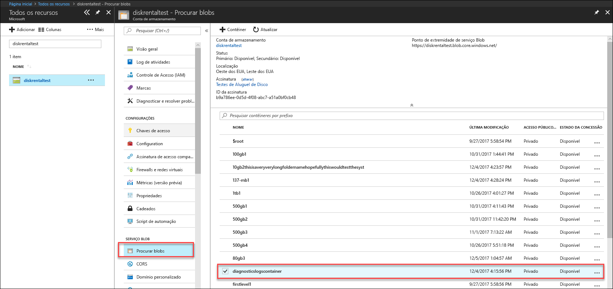
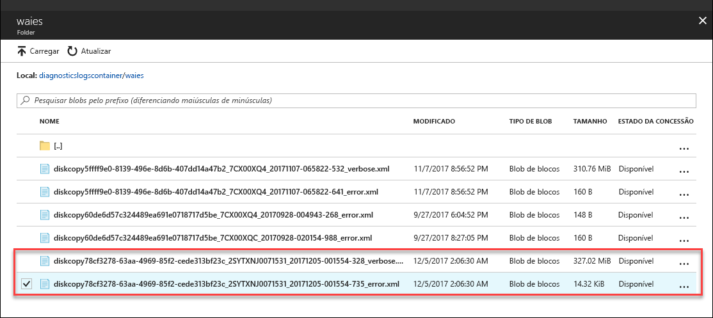

# Solucionar problemas no Azure Data Box Disk

Este artigo se aplica ao Microsoft Azure Data Box Disk e descreve os fluxos de trabalho usados para solucionar quaisquer problemas que você encontrar ao implantar essa solução. 

Este artigo inclui as seguintes seções:

- Fazer download de logs de diagnóstico
- Consultar logs de atividade
- Erros da ferramenta de desbloqueio do Data Box Disk
- Erros da ferramenta de cópia de divisão do Data Box Disk

## Fazer download de logs de diagnóstico

Se houver erros durante o processo de cópia de dados, o portal exibirá um caminho até a pasta onde estão os logs de diagnóstico. 

Os logs de diagnóstico podem ser:
- Logs de erros
- Logs detalhados  

Para navegar até o caminho do log de cópia, vá até a conta de armazenamento associada ao seu pedido do Data Box. 

1.  Vá até **Geral > Detalhes do pedido** e anote a conta de armazenamento associada ao seu pedido.
 

2.  Vá até **Todos os recursos** e procure a conta de armazenamento identificada na etapa anterior. Selecione e clique na conta de armazenamento.

    

3.  Vá até **Serviço Blob > Procurar blobs** e procure o blob correspondente à conta de armazenamento. Acesse **diagnosticslogcontainer > waies**. 

    

    Você deve ver os logs de erros e os logs detalhados da cópia dos dados. Selecione e clique em cada arquivo e, em seguida, baixe uma cópia local.

## Consultar logs de atividade

É possível usar os logs de atividade para encontrar um erro ao solucionar problemas ou monitorar como um usuário em sua organização modificou um recurso. Com os logs de atividade, você pode determinar:

- Quais operações foram executadas nos recursos em sua assinatura.
- Quem iniciou a operação. 
- Quando a operação ocorreu.
- O status da operação.
- Os valores de outras propriedades que podem ajudar você a pesquisar a operação.

O log de atividades contém todas as operações de gravação (como PUT, POST, DELETE) realizadas em seus recursos, mas não as operações de leitura (como GET). 

Os logs de atividade são retidos por 90 dias. Você pode consultar qualquer intervalo de datas, desde que a data inicial não seja anterior a 90 dias no passado. Você também pode filtrar por uma das consultas internas no Insights. Por exemplo, clique em erro e, depois, selecione e clique em falhas específicas para entender a causa raiz.

## Erros da ferramenta de desbloqueio do Data Box Disk

| Mensagem de erro/Comportamento da ferramenta      | Recomendações                                                                                               |
|-------------------------------------------------------------------------------------------------------------------------------------|------------------------------------------------------------------------------------------------------|
| Nenhum  A ferramenta de desbloqueio do Data Box Disk trava.                                                                            | BitLocker não instalado. Verifique se o computador host que está executando a ferramenta de desbloqueio do Data Box Disk tem o BitLocker instalado.                                                                            |
| O .NET Framework atual não tem suporte. As versões com suporte são 4.5 e superiores.  A ferramenta é encerrada com uma mensagem.  | O .NET 4.5 não está instalado. Instale o .NET 4.5 ou superior no computador host que executa a ferramenta de desbloqueio do Data Box Disk.                                                                            |
| Não foi possível desbloquear ou verificar os volumes. Contatar Suporte da Microsoft    A ferramenta não consegue desbloquear ou verificar qualquer unidade bloqueada. | A ferramenta não conseguiu desbloquear as unidades bloqueadas com a chave de acesso fornecida. Contate o Suporte da Microsoft para as próximas etapas.                                                |
| Os volumes a seguir foram desbloqueados e verificados.  Letras de unidade de volume: E: Não foi possível desbloquear os volumes com as seguintes chaves de acesso: werwerqomnf, qwerwerqwdfda   A ferramenta desbloqueia algumas unidades e lista as letras de unidade bem-sucedidas e com falha.| Êxito parcial. Não foi possível desbloquear algumas unidades com a chave de acesso fornecida. Contate o Suporte da Microsoft para as próximas etapas. |
| Não foi possível localizar os volumes bloqueados. Verifique se o disco recebido da Microsoft está conectado corretamente e está em estado bloqueado.          | A ferramenta não consegue encontrar unidades bloqueadas. Ou as unidades já estão desbloqueadas ou não foram detectadas. Verifique se as unidades estão conectadas e bloqueadas.                                                           |
| Erro fatal: Parâmetro inválido Nome do parâmetro: nvalid_arg USO: DataBoxDiskUnlock /PassKeys:<passkey_list_separated_by_semicolon>  Exemplo: DataBoxDiskUnlock /PassKeys:passkey1;passkey2;passkey3 Exemplo: DataBoxDiskUnlock /SystemCheck Exemplo: DataBoxDiskUnlock /Help  /PassKeys:       obtenha essa chave de acesso do pedido do Azure DataBox Disk. A chave de acesso desbloqueia seus discos. /Help:           esta opção fornece ajuda sobre o uso de cmdlet e exemplos. /SystemCheck:    essa opção verifica se o sistema atende aos requisitos para executar a ferramenta.  Pressione qualquer tecla para sair. | Parâmetro inválido inserido. Os únicos parâmetros permitidos são /SystemCheck, /PassKey e /Help.                                                                            |

## Erros da ferramenta de cópia de divisão do Data Box Disk

|Mensagem de erro/avisos  |Recomendações |
|---------|---------|
|[Informações] Recuperação de senha do BitLocker para o volume: m  [Erro] Exceção detectada ao recuperar a chave do BitLocker para o volume m:  A sequência não contém elementos.|Esse erro será gerado se o Data Box Disk de destino estiver offline.   Use a ferramenta `diskmgmt.msc` em discos online.|
|[Erro] Exceção gerada: A operação de WMI falhou:  Method=UnlockWithNumericalPassword, ReturnValue=2150694965,  Win32Message = o formato da senha de recuperação fornecida é inválido.  As senhas de recuperação do BitLocker têm 48 dígitos.  Verifique se a senha de recuperação está no formato correto e, em seguida, tente novamente.|Use a ferramenta de desbloqueio do Data Box Disk para desbloquear os discos e repita o comando. Para obter mais informações, acesse <li> [Desbloquear Data Box Disk para clientes Windows](data-box-disk-deploy-set-up.md#unlock-disks-on-windows-client). </li><li> [Desbloquear Data Box Disk para clientes Linux](data-box-disk-deploy-set-up.md#unlock-disks-on-linux-client). </li>|
|[Erro] Exceção gerada: Existe um arquivo de DriveManifest.xml na unidade de destino.   Isso indica que a unidade de destino pode ter sido preparada com um arquivo de diário diferente.  Para adicionar mais dados à mesma unidade, use o arquivo de diário anterior. Para excluir dados existentes e reutilizar a unidade de destino para um novo trabalho de importação, exclua DriveManifest.xml na unidade. Execute o comando novamente com um novo arquivo de diário.| Esse erro é recebido quando você tenta usar o mesmo conjunto de unidades para várias sessões de importação.   Use um conjunto de unidades apenas para uma sessão de divisão e cópia.|
|[Erro] Exceção gerada: CopySessionId importdata-sept-test-1 se refere a uma sessão de cópia anterior e não pode ser reutilizado para uma nova sessão de cópia.|Esse erro é relatado ao tentar usar o mesmo nome de um trabalho anterior concluído com êxito para um novo trabalho.  Atribua um nome exclusivo para seu trabalho.|
|[Informações] O nome do arquivo ou diretório de destino ultrapassa o limite de comprimento NTFS. |Esta mensagem é relatada quando o arquivo de destino foi renomeado devido a um caminho de arquivo longo.  Modifique a opção de descarte no arquivo `config.json` para controlar esse comportamento.|
|[Erro] Exceção gerada: Sequência de escape JSON inválida. |Esta mensagem é relatada quando o config.json tem formato que não é válido.   Validar sua `config.json` usando [JSONlint](https://jsonlint.com/) antes de salvar o arquivo.|

## Problemas de implantação para Linux

Esta seção apresenta detalhes sobre alguns dos principais problemas enfrentados durante a implantação do Data Box Disk ao usar um cliente Linux para cópia de dados.

### Problema: Unidade sendo montada como somente leitura
 
**Causa** 

Isso pode ser devido a um sistema de arquivos não limpo. 

Remontar uma unidade como leitura e gravação não funciona com Data Box Disks. Não há suporte para esse cenário em unidades descriptografadas pelo dislocker. Você pode ter remontado o dispositivo com sucesso usando o seguinte comando: 

    `# mount -o remount, rw /mnt/DataBoxDisk/mountVol1`

Embora a remontagem tenha sido bem-sucedida, os dados não persistirão.

**Resolução**

Se você vir o erro acima, poderá tentar uma das seguintes resoluções:

- Instale [`ntfsfix`](https://linux.die.net/man/8/ntfsfix) (disponível no pacote `ntfsprogs`) e execute-o em relação à partição relevante.

- Se você tiver acesso a um sistema Windows

    - Carregue a unidade no sistema Windows.
    - Abra uma prompt de comando com privilégios de administrativos. Execute `chkdsk` no volume.
    - Remova o volume com segurança e tente novamente.
 
### Problema: Erro de dados não persistirem após a cópia
 
**Causa** 

Se você vir que sua unidade não tem dados depois de ter sido desmontada (embora os dados tenham sido copiados para ela), talvez você tenha remontado uma unidade como leitura-gravação depois de a unidade ter sido montada como somente leitura.

**Resolução**
 
Se esse for o caso, confira a resolução para [unidades sendo montadas como somente leitura](#issue-drive-getting-mounted-as-read-only).

Se esse não for o caso, copie os logs da pasta que tem a ferramenta de desbloqueio do Data Box Disk e [entre em contato com o Suporte da Microsoft](data-box-disk-contact-microsoft-support.md).

## Problemas de implantação para Windows

Esta seção apresenta detalhes sobre alguns dos principais problemas enfrentados durante a implantação do Data Box Disk ao usar um cliente Windows para cópia de dados

### Problema: Não foi possível desbloquear a unidade do BitLocker
 
**Causa** 

Você usou a senha na caixa de diálogo do BitLocker e tentou desbloquear o disco usando a caixa de diálogo desbloquear unidades do BitLocker. Isso não funcionaria. 

**Resolução**

Para desbloquear Data Box Disks, você precisa usar a ferramenta de Desbloqueio do Data Box Disk e fornecer a senha do portal do Azure. Para obter mais informações, vá para [Tutorial: Desempacotar, conectar e desbloquear o Azure Data Box Disk](data-box-disk-deploy-set-up.md#connect-to-disks-and-get-the-passkey).
 
### Problema: Não foi possível desbloquear nem verificar alguns volumes. Contatar Suporte da Microsoft
 
**Causa** 

Talvez você veja o seguinte erro no log de erros e não consiga desbloquear nem verificar alguns volumes.

`Exception System.IO.FileNotFoundException: Could not load file or assembly 'Microsoft.Management.Infrastructure, Version=1.0.0.0, Culture=neutral, PublicKeyToken=31bf3856ad364e35' or one of its dependencies. The system cannot find the file specified.`
 
Isso indica que você provavelmente não tem a versão apropriada do Windows PowerShell no seu cliente do Windows.

**Resolução**

Você pode instalar o [Windows PowerShell v5.0](https://www.microsoft.com/download/details.aspx?id=54616) e repetir a operação.
 
Se você ainda não puder desbloquear os volumes, copie os logs da pasta que tem a ferramenta de Desbloqueio do Data Box Disk e [entre em contato com o Suporte da Microsoft](data-box-disk-contact-microsoft-support.md).

## Próximas etapas

- Saiba como [Gerenciar o Data Box Disk por meio do Portal do Azure](data-box-portal-ui-admin.md).
