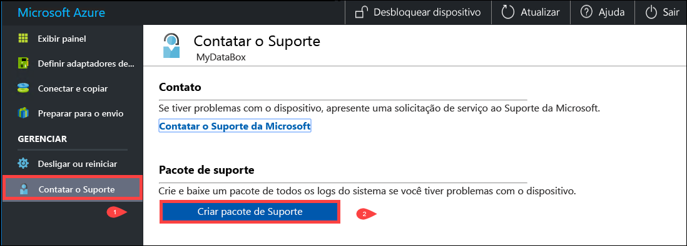
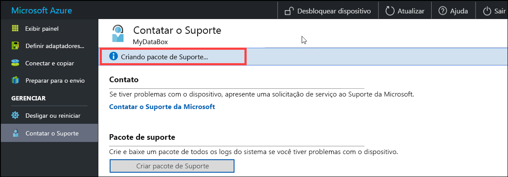
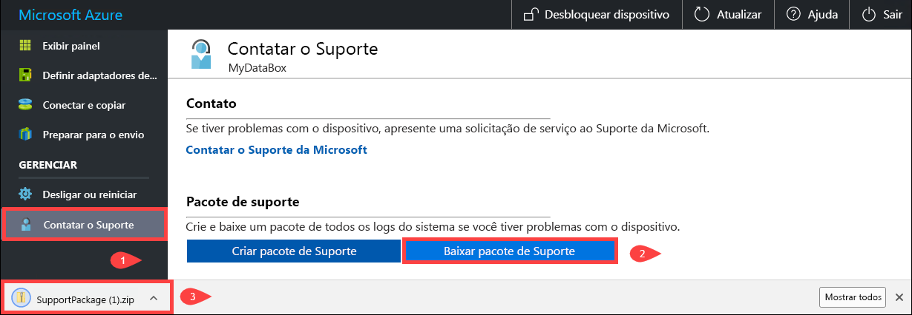
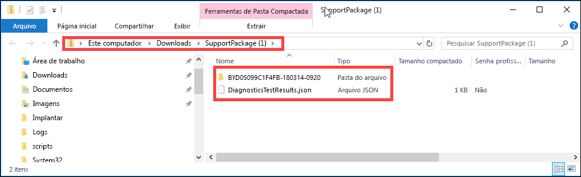
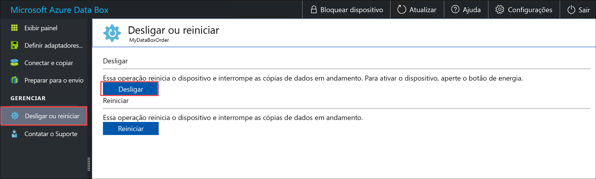
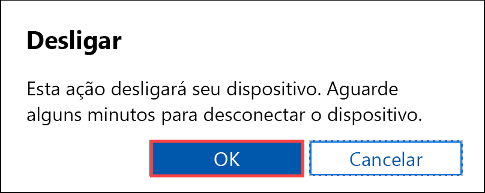
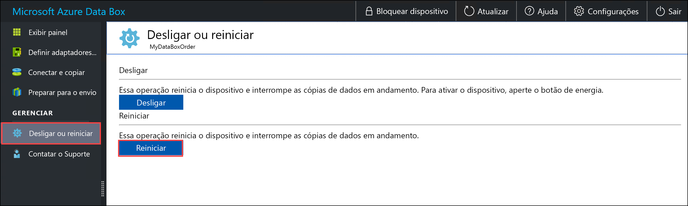
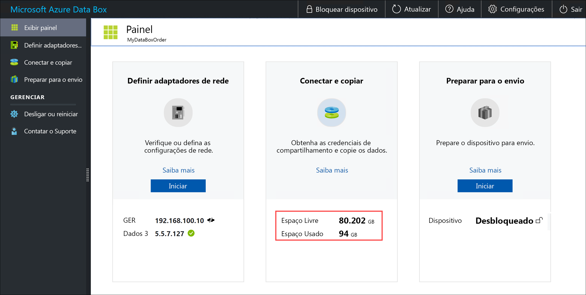
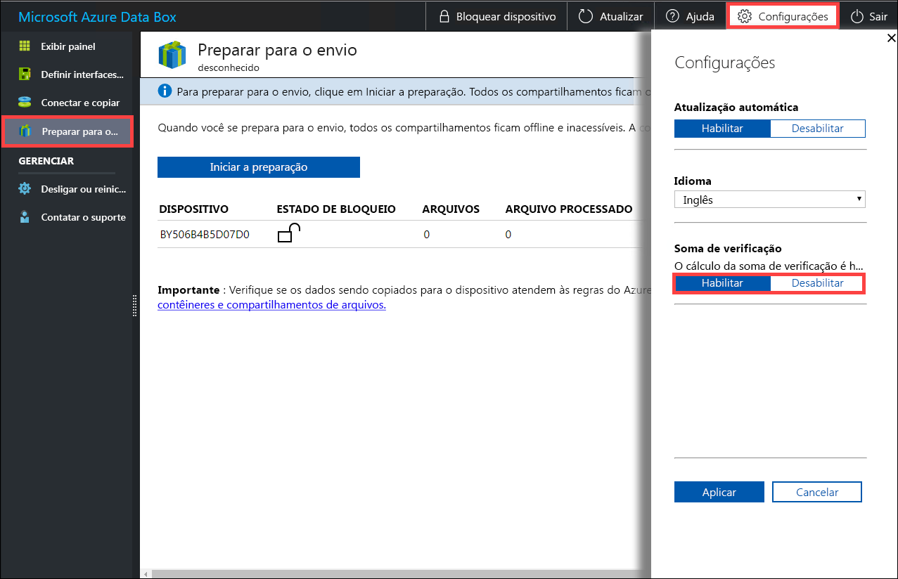

# Usar a interface do usuário da Web local para administrar o Data Box

Este artigo descreve algumas das tarefas de configuração e de gerenciamento que podem ser executadas no Data Box. Você pode gerenciar o Data Box por meio da IU do portal do Azure e da IU da Web local para o dispositivo. Este artigo concentra-se nas tarefas que você pode executar usando a interface do usuário da Web local.

A interface do usuário da Web local do Data Box é usada para a configuração inicial do dispositivo. Você também pode usar a interface do usuário da Web local para desligar ou reiniciar o Data Box, executar testes de diagnóstico, atualizar software, exibir logs de cópia e gerar um pacote de logs para o Suporte da Microsoft.

Este artigo inclui os seguintes tutoriais:

- Gerar um pacote de suporte
- Desligar ou reiniciar seu dispositivo
- Apagar com segurança os dados de seu dispositivo
- Monitorar a capacidade disponível no dispositivo
- Ignorar a validação de soma de verificação 

## Gerar pacote de suporte

Se você enfrentar problemas no dispositivo, crie um pacote de suporte com os logs do sistema. O Suporte da Microsoft usará esse pacote para solucionar o problema. Para gerar um pacote de suporte, execute as seguintes etapas:

1. Na interface do usuário da Web local, acesse **Contatar Suporte** e clique em **Criar pacote de suporte**.

    

2. Um pacote de suporte será coletado. Essa operação leva alguns minutos.

    

3. Após a conclusão da criação do pacote de suporte, clique em **Baixar Pacote de Suporte**. 

    

4. Procure e escolha o local de download. Abra a pasta para exibir o conteúdo.

    

## Desligar ou reiniciar seu dispositivo

Você pode desligar ou reiniciar o Data Box usando a interface do usuário da Web local. Nós recomendamos que antes de reiniciar, você coloque os compartilhamentos offline no host e, em seguida, no dispositivo. Isso minimiza a possibilidade de dados corrompidos. Verifique se a cópia de dados não está em andamento quando você desligar o dispositivo.

Para desligar o Data Box, execute as seguintes etapas.

1. Na interface do usuário da Web local, acesse **Desligar ou reiniciar**.
2. Clique em **Desligar**.

    

3. Quando a confirmação for solicitada, clique em **OK** para continuar.

    

Depois que o dispositivo for desligado, use o botão de energia no painel frontal para ligar o dispositivo.

Para reiniciar o Data Box, execute as seguintes etapas.

1. Na interface do usuário da Web local, acesse **Desligar ou reiniciar**.
2. Clique em **Reiniciar**.

    

3. Quando a confirmação for solicitada, clique em **OK** para continuar.

   O dispositivo será desligado e, em seguida, reiniciado.

## Exibir a capacidade disponível no dispositivo

Use o painel do dispositivo para exibir a capacidade disponível e é usada do dispositivo. 

1. Na interface do usuário da Web local, acesse **Exibir o painel**.
2. Em **Conectar e copiar**, o espaço livre e usado no dispositivo é mostrado.

    

## Ignorar a validação de soma de verificação

A soma de verificação é gerada para os seus dados por padrão, quando você se prepara para o envio. Em alguns casos raros, dependendo do tipo de dados (tamanhos de arquivo pequeno), o desempenho pode ser muito lento. Nesses casos, você pode ignorar a soma de verificação. 

É altamente recomendado que você não desabilite a soma de verificação, a menos que o desempenho seja gravemente afetado.

1. No canto superior direito da interface do usuário da Web local do dispositivo, acesse Configurações.

    

2. **Desabilitar** a validação de soma de verificação
3. Clique em **Aplicar**.

## Próximas etapas

- Saiba como [Gerenciar o Data Box pelo portal do Azure](data-box-portal-admin.md).

