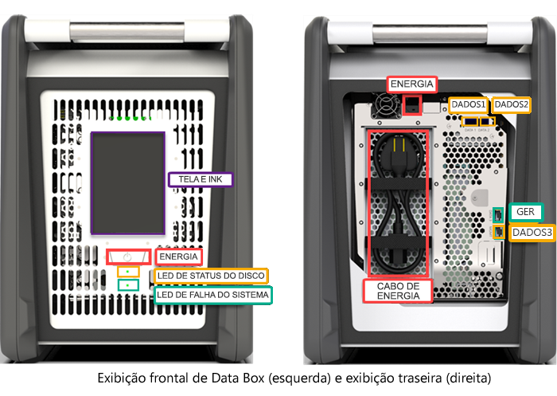
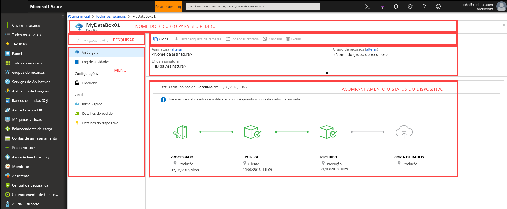
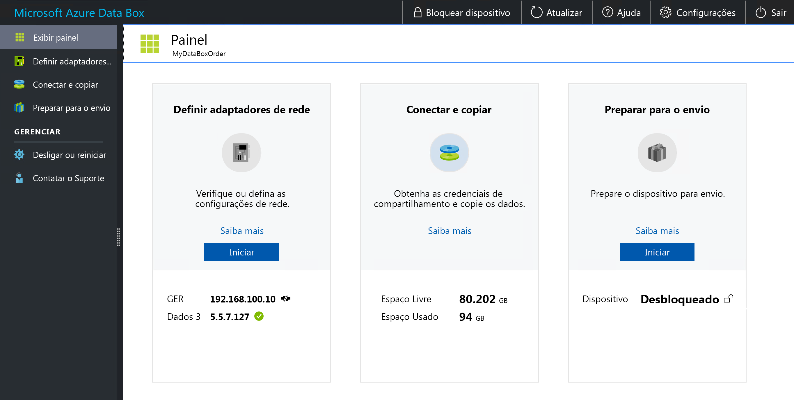

# O que é o Azure Data Box?

A solução de nuvem do Microsoft Azure Data Box permite que você envie terabytes de dados para o Azure de forma rápida, barata e confiável. A transferência de dados segura é acelerada pelo envio de um dispositivo de armazenamento Data Box proprietário. Cada dispositivo de armazenamento tem uma capacidade máxima de armazenamento utilizável de 80 TB e é transportado para o seu datacenter por meio de uma transportadora regional. O dispositivo tem uma caixa reforçada para proteger os dados durante o transporte.

Você pode solicitar o dispositivo Data Box pelo portal do Azure. Depois que o dispositivo é recebido, você pode configurá-lo rapidamente usando a interface do usuário da Web local. Copie os dados de seus servidores para o dispositivo e envie o dispositivo novamente para o Azure. No datacenter do Azure, seus dados são carregados automaticamente do dispositivo para o Azure. Todo o processo é acompanhado de ponta a ponta pelo serviço Data Box no portal do Azure.

## Casos de uso

O Data Box é ideal para transferir os tamanhos de dados maiores do que 40 TB em cenários com conectividade de rede limitada a inexistente. A movimentação de dados pode ser única, periódica ou uma transferência de dados em massa inicial seguida por transferências periódicas. Veja a seguir os vários cenários em que o Data Box pode ser usado para a transferência de dados.

 - **Migração única** - quando uma grande quantidade de dados local é transferida para o Azure. 
     - Movimentação de uma biblioteca de mídia de fitas offline para o Azure para a criação de uma biblioteca de mídia online.
     - Migração do farm de VMs, do SQL Server e de aplicativos para o Azure
     - Movimentação de dados históricos para o Azure para análise aprofundada e geração de relatórios usando o HDInsight

 - **Transferência em massa inicial** – quando uma transferência em massa inicial é feita usando o Data Box (semente) seguida por transferências incrementais pela rede. 
     - Por exemplo, os parceiros de soluções de backup, como o Commvault e o Data Box, são usados para mover o backup histórico grande inicial para o Azure. Após a conclusão, os dados incrementais são transferidos pela rede para o armazenamento do Azure.

- **Carregamentos periódicos** - quando grandes quantidades de dados são geradas periodicamente e precisam ser movidas para o Azure. Por exemplo, na exploração de energia, em que o conteúdo de vídeo é gerado em plataformas de petróleo e em produções de energia eólica.      

## Benefícios

O Data Box foi projetado para mover grandes quantidades de dados para o Azure com pouco ou nenhum impacto à rede. A solução oferece as seguintes vantagens:

- **Velocidade** – a interfaces de rede do Data Box usa 1 Gbps ou 10 Gbps para mover até 80 TB de dados para o Azure.

- **Seguro** – o Data Box tem proteções de segurança internas para o dispositivo, os dados e o serviço.
    - O dispositivo tem uma caixa reforçada protegida por parafusos resistentes a adulteração e adesivos com evidência de adulteração. 
    - Os dados do dispositivo são sempre protegidos por uma criptografia AES de 256 bits.
    - O dispositivo só pode ser desbloqueado com uma senha fornecida no portal do Azure.
    - O serviço é protegido pelos recursos de segurança do Azure.
    - Após o upload dos dados no Azure, os discos do dispositivo são apagados, de acordo com os padrões NIST 800-88r1.
    
    Para obter mais informações, acesse [Segurança e proteção de dados do Azure Data Box](data-box-security.md).

## Recursos e especificações

O dispositivo Data Box tem os seguintes recursos nesta versão.

| Especificações                                          | DESCRIÇÃO              |
|---------------------------------------------------------|--------------------------|
| Peso                                                  | <50 lb                |
| Dimensões                                              | Dispositivo – Largura: 309,0 mm Altura: 430,4 mm Profundidade: 502,0 mm |            
| Espaço em rack                                              | 7 U quando colocado no rack em seu lado (não pode ser montado em rack)|
| Cabos necessários                                         | 1 x cabo de alimentação (incluído)   2 cabos de conector RJ-45   2 x cabos de cobre SFP+ Twinax|
| Capacidade de armazenamento                                        | 100 TB   Capacidade utilizável de 80 TB após a proteção RAID 5|
| Interfaces de rede                                      | 2 x interface de 1 GbE – MGMT, DADOS 3.   MGMT – para o gerenciamento, o não configurável pelo usuário, usado para a configuração inicial   DATA3 – para os dados, configurável pelo usuário e dinâmico por padrão   MGMT e DATA 3 também podem funcionar como 10 GbE   2 x interface de 10 GbE – DATA 1, DATA 2   Ambos são para os dados, pode ser configurado como dinâmicos (padrão) ou estático |
| Mídia de transferência de dados                                     | Conector RJ-45, Ethernet de 10 GbE de cobre SFP+  |
| Segurança                                                | Caixa do dispositivo reforçada com parafusos personalizados invioláveis   Adesivos invioláveis colocados na parte inferior do dispositivo|
| Taxa de transferência de dados                                      | Até 80 TB em um dia em um adaptador de rede de 10 GbE        |
| Gerenciamento                                              | Interface do usuário Web local – instalação e configuração inicial única   Portal do Azure – gerenciamento de dispositivo cotidiano        |

## Componentes do Data Box

O Data Box inclui os seguintes componentes:

* **Dispositivo Data Box** – um dispositivo físico que oferece armazenamento primário, gerencia a comunicação com o armazenamento em nuvem e ajuda a garantir a segurança e a confidencialidade de todos os dados armazenados no dispositivo. O dispositivo Data Box tem uma capacidade de armazenamento utilizável de 80 TB. 

    

    
* **Serviço Data Box** – uma extensão do portal do Azure que permite gerenciar um dispositivo Data Box por meio uma interface da Web que você pode acessar em diferentes locais geográficos. Use o serviço Data Box para realizar a administração diária do dispositivo Data Box. As tarefas do serviço incluem como criar e gerenciar pedidos, exibir e gerenciar alertas e gerenciar compartilhamentos.  

    

    Para obter mais informações, acesse [Usar o serviço do Data Box para administrar seu dispositivo Data Box](data-box-portal-ui-admin.md).

* **Interface do usuário da Web local** – uma interface do usuário baseada na Web usada para configurar o dispositivo, de modo que ele se conecte à rede local e, em seguida, registrá-lo no serviço Data Box. Use também a interface do usuário da Web local para desligar e reiniciar o dispositivo Data Box, exibir logs de cópia e contatar o Suporte da Microsoft para arquivar uma solicitação de serviço.

    

    Para obter informações sobre como usar a interface do usuário baseada na Web, acesse [Use the web-based UI to administer your Data Box](data-box-portal-ui-admin.md) (Usar a interface do usuário baseada na Web para administrar seu Data Box).

## O fluxo de trabalho

Um fluxo de trabalho típico inclui as seguintes etapas:

1. **Ordem** - Crie um pedido no Portal do Azure, forneça informações de envio e a conta de armazenamento de destino do Azure para seus dados. Se o dispositivo estiver disponível, o Azure preparará e enviará o dispositivo com uma ID de acompanhamento de remessa.

2. **Recebimento** – após a entrega do dispositivo, conecte o dispositivo à rede e à rede elétrica usando os cabos especificados. Ative e conecte-se ao dispositivo. Configure a rede do dispositivo e monte os compartilhamentos no computador host do qual deseja copiar os dados.

3. **Cópia dos dados** – copie os dados para os compartilhamentos do Data Box.

4. **Devolução** – prepare, desligue e envie o dispositivo novamente para o datacenter do Azure.

5. **Upload** – os dados são copiados automaticamente do dispositivo para o Azure. Os discos do dispositivo são apagados com segurança, de acordo com as diretrizes do NIST (National Institute of Standards and Technology).

Ao longo desse processo, você receberá uma notificação por email sobre todas as alterações de status. Para saber mais sobre o fluxo detalhado, acesse [Implantar Data Box no portal do Azure](data-box-deploy-ordered.md).

## Disponibilidade de região

O Data Box pode transferir dados de acordo com a região na qual o serviço foi implantado, o país ao qual o dispositivo é enviado e a conta de armazenamento do Azure de destino usada para a transferência dos dados. 

- **Disponibilidade do serviço** – para esta versão, o serviço Data Box está disponível nas seguintes regiões:
    - Todas as regiões nos Estados Unidos – Centro-oeste dos EUA, Oeste dos EUA 2, Oeste dos EUA, Centro-Sul dos EUA, Centro dos EUA, Centro-Norte dos EUA, Leste dos EUA e Leste dos EUA 2.
    - União Europeia – Europa Ocidental e Europa Setentrional.
    - Reino Unido – Sul do Reino Unido e Oeste do Reino Unido.
    - França – França Central e Sul da França.

- **Contas de Armazenamento de Destino** – as contas de armazenamento que armazenam os dados estão disponíveis em todas as regiões do Azure nas quais o serviço está disponível.  

## Próximas etapas

- Reveja os [requisitos de sistema do Data Box](data-box-system-requirements.md).
- Entenda os [limites do Data Box](data-box-limits.md).
- Implante rapidamente o [Azure Data Box](data-box-quickstart-portal.md) no portal do Azure.

