# <a name="use-the-azure-portal-to-administer-your-data-box"></a>Usar o portal do Azure para administrar o Data Box

Este artigo descreve alguns dos fluxos de trabalho e das tarefas de gerenciamento complexas que podem ser executados no Data Box. Você pode gerenciar o Data Box pelo portal do Azure ou pela interface do usuário da Web local. 

Este artigo se concentra nas tarefas que você pode executar usando o portal do Azure. Use o portal do Azure para gerenciar pedidos, gerenciar o Data Box e acompanhar o status do pedido, conforme ele progride para a conclusão.


## <a name="cancel-an-order"></a>Cancelar um pedido

Sempre pode haver a necessidade de cancelar um pedido depois de feito, por vários motivos. Você somente pode cancelar o pedido antes que ele seja processado. Depois que o pedido for processado e o Data Box for preparado, não será mais possível cancelar o pedido. 

Execute as seguintes etapas para cancelar um pedido.

1.  Vá para **Visão Geral > Cancelar**. 

    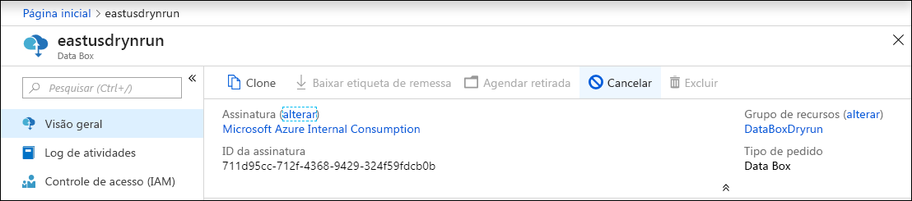

2.  Preencha um motivo para cancelar o pedido.  

    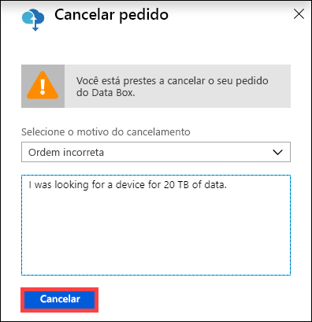

3.  Depois que o pedido for cancelado, o portal atualizará o status do pedido e o exibirá como **Cancelado**. 

## <a name="clone-an-order"></a>Clonar um pedido

A clonagem é útil em determinadas situações. Por exemplo, um usuário usou o Data Box para transferir alguns dados. Conforme mais dados são gerados, surge a necessidade de outro Data Box para transferir dados para o Azure. Nesse caso, o mesmo pedido pode simplesmente ser clonado.

Execute as etapas a seguir para clonar um pedido.

1.  Vá para **Visão geral > Clonar**. 

    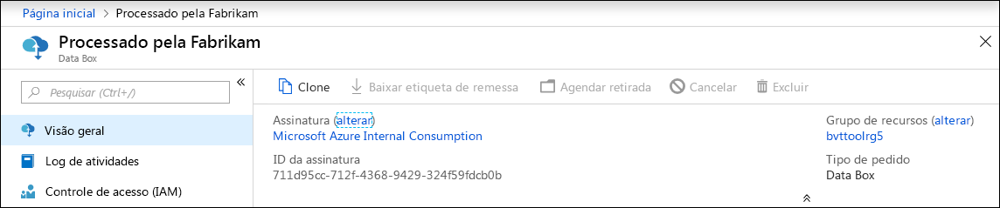

2.  Todos os detalhes do pedido permanecem inalterados. O nome do pedido é o nome original do pedido acrescido de *-Clone*. Marque a caixa de seleção para confirmar que você leu as informações de privacidade. Clique em **Criar**.

O clone é criado em alguns minutos e a portal é atualizado para mostrar o novo pedido.


## <a name="delete-order"></a>Excluir pedido

Você talvez queira excluir um pedido quando ele é concluído. O pedido contém suas informações pessoais, como nome, endereço e informações de contato. Essas informações pessoais são excluídas quando o pedido é excluído.

Só é possível excluir pedidos que tenham sido concluídos ou cancelados. Execute as etapas a seguir para excluir um pedido.

1. Acesse **Todos os recursos**. Pesquise seu pedido.

2. Clique no pedido que você deseja excluir e vá para **Visão Geral**. Na barra de comandos, clique em **Excluir**.

    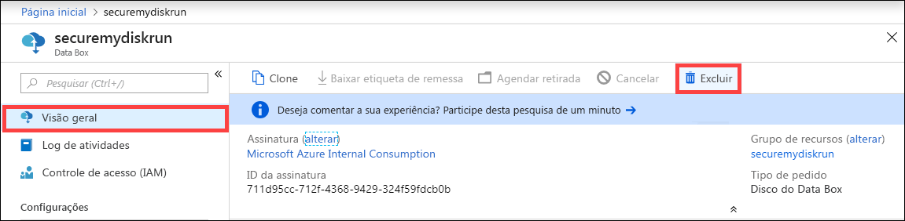

3. Insira o nome do pedido quando solicitado a confirmar a exclusão de um pedido. Clique em **Excluir**.

## <a name="download-shipping-label"></a>Faça o download da etiqueta de remessa

Talvez você precise baixar a etiqueta de remessa se a exibição de tinta virtual do Data Box não estiver funcionando e não exibir a etiqueta de remessa de devolução. 

Execute as etapas a seguir para baixar uma etiqueta de remessa.

1.  Vá para **Visão geral > Baixar etiqueta de remessa**. Essa opção fica disponível somente depois que o dispositivo é enviado. 

    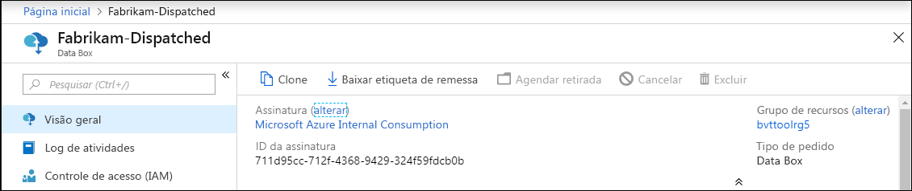

2.  Essa opção baixa a etiqueta de remessa de devolução a seguir. Salve a etiqueta e imprimi-a. Dobre e insira a etiqueta na abertura do dispositivo. Verifique se a etiqueta está visível. Remova todos os adesivos do dispositivo referentes ao envio anterior.

    

## <a name="edit-shipping-address"></a>Editar endereço para entrega

Talvez seja necessário editar o endereço de envio depois que o pedido é feito. Essa opção só está disponível até o envio do disco. Depois que o disco é enviado, essa opção não fica mais disponível.

Execute as etapas a seguir para editar o pedido.

1. Vá para **Detalhes do pedido > Editar endereço para entrega**.

    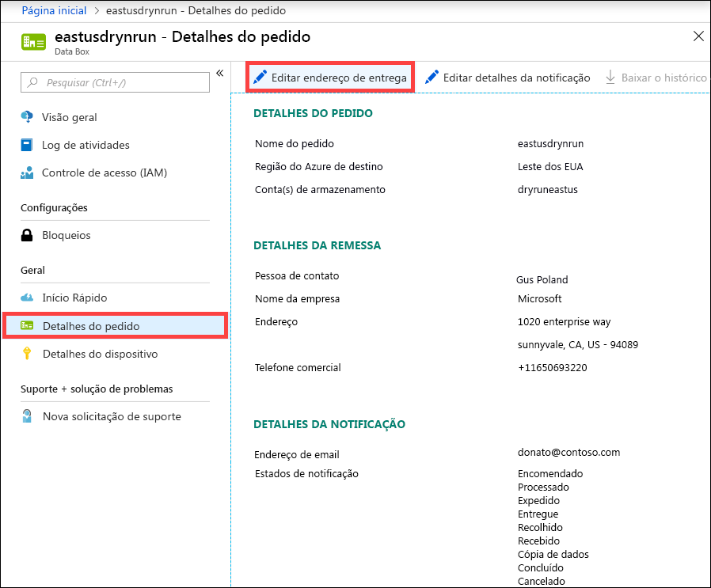

2. Edite e valide o endereço para entrega e, em seguida, salve as alterações.

    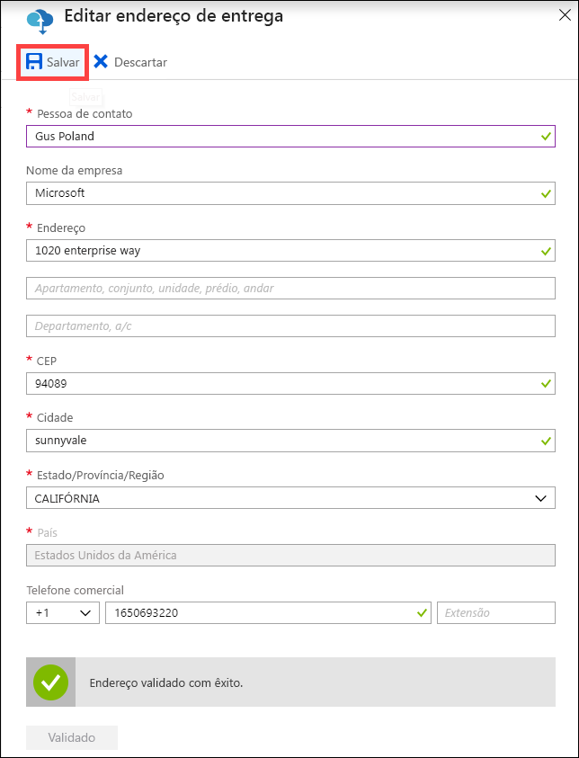

## <a name="edit-notification-details"></a>Editar detalhes da notificação

Talvez seja necessário alterar os usuários que devem receber os emails de status do pedido. Por exemplo, um usuário precisa ser informado quando o dispositivo é entregue ou recolhido. Outro usuário talvez precise ser informado quando a cópia de dados é concluída para que possa verificar se os dados estão na conta de armazenamento do Azure antes de excluí-los da origem. Nesses casos, você pode editar os detalhes da notificação.

Execute as etapas a seguir para editar os detalhes de notificação.

1. Vá para **Detalhes do pedido > Editar detalhes da notificação**.

    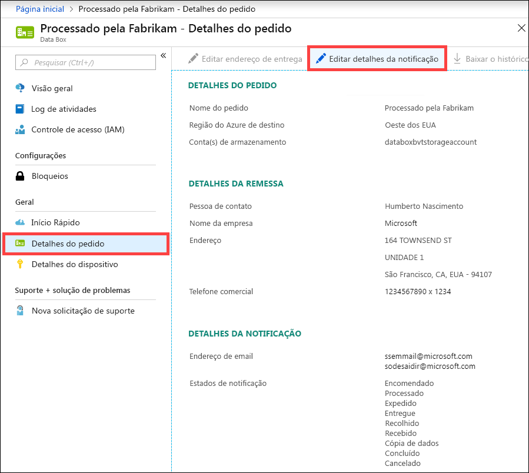

2. Agora você pode editar os detalhes de notificação e salvar as alterações.
 
    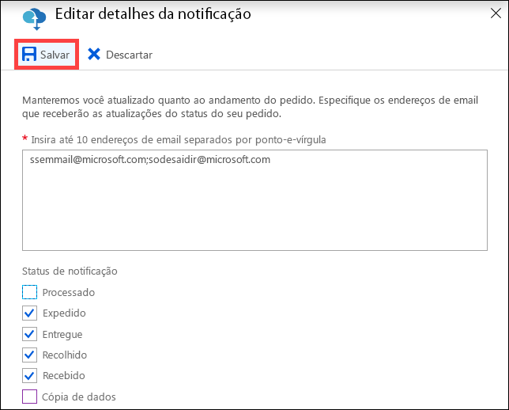


## <a name="download-order-history"></a>Baixar histórico de pedidos

Depois que o pedido do Data Box estiver completo, os dados nos discos do dispositivo serão apagados. Quando a limpeza de dispositivo for concluída, você poderá baixar o histórico de pedidos no portal do Azure.

Execute as etapas a seguir para baixar o histórico de pedidos.

1. No seu pedido do Data Box, vá para **Visão Geral**. Verifique se o pedido está completo. Se o pedido estiver completo e a limpeza for concluída, vá para **Detalhes da ordem**. A opção **Baixar histórico de pedidos** está disponível.

    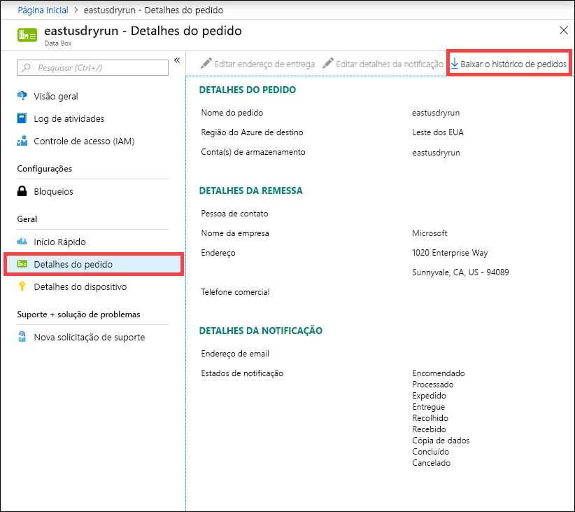

2. Clique em **Baixar histórico de pedidos**. No histórico baixado, você verá um registro de logs de rastreamento da operadora. Se você rolar para baixo até a parte inferior desse log, poderá ver os links para:
    
   - **Copiar logs**: tem a lista de arquivos com erros durante a cópia dos dados do Data Box para a conta de armazenamento do Azure.
   - **Logs de auditoria**: contêm informações sobre ativação e acesso compartilhado no Data Box quando ele está fora do datacenter do Azure.
   - **Arquivos BOM**: tem a lista de arquivos (também conhecida como manifesto de arquivo) que você pode baixar durante a **Preparação para o envio** e tem nomes de arquivo, tamanhos de arquivo e somas de verificação do arquivo.

       ```
       -------------------------------
       Microsoft Data Box Order Report
       -------------------------------
       Name                                               : DataBoxTestOrder                              
       StartTime(UTC)                                     : 10/31/2018 8:49:23 AM +00:00                       
       DeviceType                                         : DataBox                                           
       -------------------
       Data Box Activities
       -------------------
       Time(UTC)                 | Activity                       | Status          | Description  
       
       10/31/2018 8:49:26 AM     | OrderCreated                   | Completed       |                                                   
       11/2/2018 7:32:53 AM      | DevicePrepared                 | Completed       |                                                   
       11/3/2018 1:36:43 PM      | ShippingToCustomer             | InProgress      | Shipment picked up. Local Time : 11/3/2018 1:36:43        PM at AMSTERDAM-NLD                                                                                
       11/4/2018 8:23:30 PM      | ShippingToCustomer             | InProgress      | Processed at AMSTERDAM-NLD. Local Time : 11/4/2018        8:23:30 PM at AMSTERDAM-NLD                                                                        
       11/4/2018 11:43:34 PM     | ShippingToCustomer             | InProgress      | Departed Facility in AMSTERDAM-NLD. Local Time :          11/4/2018 11:43:34 PM at AMSTERDAM-NLD                                                               
       11/5/2018 1:38:20 AM      | ShippingToCustomer             | InProgress      | Arrived at Sort Facility LEIPZIG-DEU. Local Time :        11/5/2018 1:38:20 AM at LEIPZIG-DEU                                                                
       11/5/2018 2:31:07 AM      | ShippingToCustomer             | InProgress      | Processed at LEIPZIG-DEU. Local Time : 11/5/2018          2:31:07 AM at LEIPZIG-DEU                                                                            
       11/5/2018 4:05:58 AM      | ShippingToCustomer             | InProgress      | Departed Facility in LEIPZIG-DEU. Local Time :            11/5/2018 4:05:58 AM at LEIPZIG-DEU                                                                    
       11/5/2018 4:35:43 AM      | ShippingToCustomer             | InProgress      | Transferred through LUTON-GBR. Local Time :              11/5/2018 4:35:43 AM at LUTON-GBR                                                                         
       11/5/2018 4:52:15 AM      | ShippingToCustomer             | InProgress      | Departed Facility in LUTON-GBR. Local Time :              11/5/2018 4:52:15 AM at LUTON-GBR                                                                        
       11/5/2018 5:47:58 AM      | ShippingToCustomer             | InProgress      | Arrived at Sort Facility LONDON-HEATHROW-GBR.            Local Time : 10/5/2018 5:47:58 AM at LONDON-HEATHROW-GBR                                                
       11/5/2018 6:27:37 AM      | ShippingToCustomer             | InProgress      | Processed at LONDON-HEATHROW-GBR. Local Time :            11/5/2018 6:27:37 AM at LONDON-HEATHROW-GBR                                                            
       11/5/2018 6:39:40 AM      | ShippingToCustomer             | InProgress      | Departed Facility in LONDON-HEATHROW-GBR. Local          Time : 11/5/2018 6:39:40 AM at LONDON-HEATHROW-GBR                                                    
       11/5/2018 8:13:49 AM      | ShippingToCustomer             | InProgress      | Arrived at Delivery Facility in LAMBETH-GBR. Local        Time : 11/5/2018 8:13:49 AM at LAMBETH-GBR                                                         
       11/5/2018 9:13:24 AM      | ShippingToCustomer             | InProgress      | With delivery courier. Local Time : 11/5/2018            9:13:24 AM at LAMBETH-GBR                                                                               
       11/5/2018 12:03:04 PM     | ShippingToCustomer             | Completed       | Delivered - Signed for by. Local Time : 11/5/2018        12:03:04 PM at LAMBETH-GBR                                                                          
       1/25/2019 3:19:25 PM      | ShippingToDataCenter           | InProgress      | Shipment picked up. Local Time : 1/25/2019 3:19:25        PM at LAMBETH-GBR                                                                                       
       1/25/2019 8:03:55 PM      | ShippingToDataCenter           | InProgress      | Processed at LAMBETH-GBR. Local Time : 1/25/2019          8:03:55 PM at LAMBETH-GBR                                                                            
       1/25/2019 8:04:58 PM      | ShippingToDataCenter           | InProgress      | Departed Facility in LAMBETH-GBR. Local Time :            1/25/2019 8:04:58 PM at LAMBETH-GBR                                                                    
       1/25/2019 9:06:09 PM      | ShippingToDataCenter           | InProgress      | Arrived at Sort Facility LONDON-HEATHROW-GBR.            Local Time : 1/25/2019 9:06:09 PM at LONDON-HEATHROW-GBR                                                
       1/25/2019 9:48:54 PM      | ShippingToDataCenter           | InProgress      | Processed at LONDON-HEATHROW-GBR. Local Time :            1/25/2019 9:48:54 PM at LONDON-HEATHROW-GBR                                                            
       1/25/2019 10:30:20 PM     | ShippingToDataCenter           | InProgress      | Departed Facility in LONDON-HEATHROW-GBR. Local          Time : 1/25/2019 10:30:20 PM at LONDON-HEATHROW-GBR                                                   
       1/26/2019 2:17:10 PM      | ShippingToDataCenter           | InProgress      | Arrived at Sort Facility BRUSSELS-BEL. Local Time        : 1/26/2019 2:17:10 PM at BRUSSELS-BEL                                                              
       1/26/2019 2:31:57 PM      | ShippingToDataCenter           | InProgress      | Processed at BRUSSELS-BEL. Local Time : 1/26/2019        2:31:57 PM at BRUSSELS-BEL                                                                          
       1/26/2019 3:37:53 PM      | ShippingToDataCenter           | InProgress      | Processed at BRUSSELS-BEL. Local Time : 1/26/2019        3:37:53 PM at BRUSSELS-BEL                                                                          
       1/27/2019 11:01:45 AM     | ShippingToDataCenter           | InProgress      | Departed Facility in BRUSSELS-BEL. Local Time :          1/27/2019 11:01:45 AM at BRUSSELS-BEL                                                                 
       1/28/2019 7:11:35 AM      | ShippingToDataCenter           | InProgress      | Arrived at Delivery Facility in AMSTERDAM-NLD.            Local Time : 1/28/2019 7:11:35 AM at AMSTERDAM-NLD                                                     
       1/28/2019 9:07:57 AM      | ShippingToDataCenter           | InProgress      | With delivery courier. Local Time : 1/28/2019            9:07:57 AM at AMSTERDAM-NLD                                                                             
       1/28/2019 1:35:56 PM      | ShippingToDataCenter           | InProgress      | Scheduled for delivery. Local Time : 1/28/2019            1:35:56 PM at AMSTERDAM-NLD                                                                            
       1/28/2019 2:57:48 PM      | ShippingToDataCenter           | Completed       | Delivered - Signed for by. Local Time : 1/28/2019        2:57:48 PM at AMSTERDAM-NLD                                                                         
       1/29/2019 2:18:43 PM      | PhysicalVerification           | Completed       |                                              
       1/29/2019 3:49:50 PM      | DeviceBoot                     | Completed       | Appliance booted up successfully                  
       1/29/2019 3:49:51 PM      | AnomalyDetection               | Completed       | No anomaly detected.                               
       1/29/2019 4:55:00 PM      | DataCopy                       | Started         |                                                 
       2/2/2019 7:07:34 PM       | DataCopy                       | Completed       | Copy Completed.                                   
       2/4/2019 7:47:32 PM       | SecureErase                    | Started         |                                                  
       2/4/2019 8:01:10 PM      | SecureErase                    | Completed       | Azure Data Box:DEVICESERIALNO has been sanitized          according to NIST 800-88 Rev 1.                                                                       

       ------------------
       Data Box Log Links
       ------------------

       Account Name         : Gus                                                       
       Copy Logs Path       : databoxcopylog/DataBoxTestOrder_CHC533180024_CopyLog_73a81b2d613547a28ecb7b1612fe93ca.xml
       Audit Logs Path      : azuredatabox-chainofcustodylogs\7fc6cac9-9cd6-4dd8-ae22-1ce479666282\chc533180024
       BOM Files Path       : azuredatabox-chainofcustodylogs\7fc6cac9-9cd6-4dd8-ae22-1ce479666282\chc533180024      
       ```
     Você pode, em seguida, ir para sua conta de armazenamento e exibir os logs de cópia.

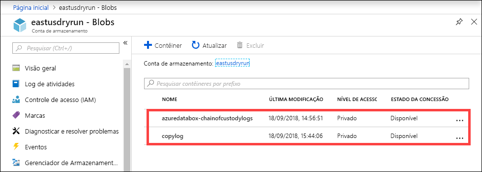

Você também pode exibir a cadeia de logs de custódia que incluem os logs de auditoria e os arquivos BOM.

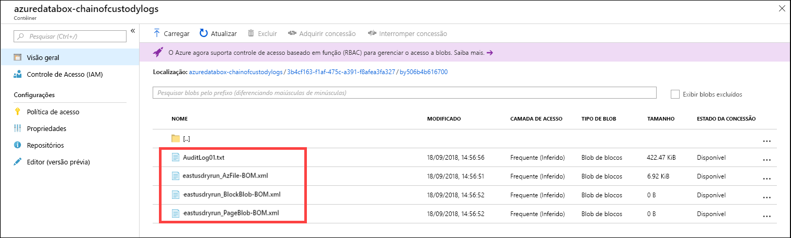

## <a name="view-order-status"></a>Exibir status do pedido

Quando o status do dispositivo for alterado no portal, você será notificado por email.

|Status do pedido |DESCRIÇÃO |
|---------|---------|
|Encomendado     | Pedido feito com êxito. <br>Se o dispositivo estiver disponível, a Microsoft identificará um dispositivo para envio e o preparará. <br> Se o dispositivo não estiver disponível imediatamente, o pedido apenas será processado quando o dispositivo estiver disponível. O pedido pode levar de vários dias a alguns meses para ser processado. Se o pedido não puder ser processado em até 90 dias, ele será cancelado e você será notificado.         |
|Processado     | O processamento de pedidos foi concluído. De acordo com seu pedido, o dispositivo está preparado para o envio no data center.         |
|Expedido     | O pedido foi enviado. Use a ID de acompanhamento exibida no pedido no portal para acompanhar a remessa.        |
|Entregue     | A remessa foi entregue no endereço especificado no pedido.        |
|Recolhido     |A remessa de devolução foi recolhida e verificada pela transportadora.         |
|Recebido     | O dispositivo foi recebido e verificado no datacenter do Azure. <br> Depois que a remessa for inspecionada, o upload do dispositivo será iniciado.      |
|Cópia de dados     | Cópia de dados em andamento. Acompanhe o progresso de cópia do pedido no portal do Azure. <br> Aguarde até que a cópia de dados seja concluída. |
|Concluído       |Pedido concluído com êxito.<br> Verifique se os dados estão no Azure antes de excluir os dados locais dos servidores.         |
|Concluído com erros| A cópia de dados foi concluída, mas apresentou erros. <br> Examine os logs de cópia usando o caminho fornecido no portal do Azure.   |
|Cancelado            |Pedido cancelado. <br> Você cancelou o pedido ou ocorreu um erro e o serviço cancelou o pedido. Se o pedido não puder ser processado em até 90 dias, ele também será cancelado e você será notificado.     |
|Limpar | Os dados nos discos do dispositivo foram apagados. A limpeza do dispositivo é considerada concluída quando o histórico de pedidos fica disponível no portal do Azure.|


## <a name="next-steps"></a>Próximas etapas

- Saiba como [Solucionar problemas do Data Box](data-box-faq.md).
