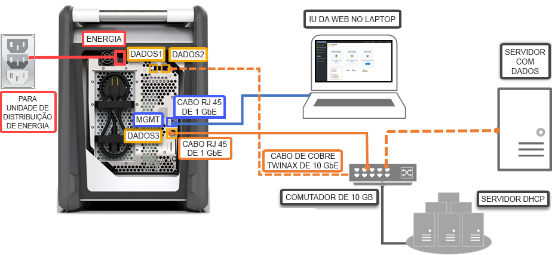

# Início Rápido: Implantar o Azure Data Box usando o portal do Azure

Este início rápido descreve como implantar o Azure Data Box usando o portal do Azure. As etapas incluem como cabear, configurar e copiar dados para o Data Box, de modo que eles sejam carregados no Azure. O início rápido é executado no portal do Azure e na interface do usuário da Web local do dispositivo.

Para obter a implantação detalhada passo a passo e instruções de acompanhamento, acesse [Tutorial: Solicitar o Azure Data Box](data-box-deploy-ordered.md)

## Pré-requisitos

Antes de começar:

- Verifique se a assinatura usada para o serviço Data Box é de um dos seguintes tipos:
    - Microsoft EA (Contrato Enterprise). Leia mais sobre [assinaturas de EA](https://azure.microsoft.com/pricing/enterprise-agreement/).
    - CSP (Provedor de Soluções na Nuvem). Saiba mais sobre o [programa do Azure CSP](https://docs.microsoft.com/azure/cloud-solution-provider/overview/azure-csp-overview).
    - Consumo – pago conforme o uso. Para obter mais informações sobre as [assinaturas pagas conforme o uso](https://azure.microsoft.com/offers/ms-azr-0003p/) do Azure.

- Verifique se você tem acesso de proprietário ou colaborador na assinatura para criar um pedido do Data Box.
- Examine as [diretrizes de segurança do Data Box](data-box-safety.md).
- Você tem um computador host que tem os dados que você deseja copiar para o Data Box. O computador host deve
    - Executar um [Sistema operacional com suporte](data-box-system-requirements.md).
    - Estar conectado à rede de alta velocidade. É altamente recomendável que você tenha, pelo menos, uma conexão de 10 GbE. Se uma conexão de GbE 10 não estiver disponível, um link de dados de 1 GbE poderá ser usado, mas as velocidades de cópia serão afetadas. 
- Você deve ter acesso a uma superfície plana na qual possa colocar o Data Box. Caso deseje colocar o dispositivo em uma prateleira de rack padrão, você precisará de um slot 7U no rack de seu datacenter. Você pode colocar o dispositivo no rack na posição horizontal ou vertical.
- Você comprou os cabos a seguir para conectar o Data Box ao computador host.
    - Dois cabos de cobre SFP+ Twinax de 10 GbE (usar com adaptadores de rede DATA 1 ou DATA 2)
    - Um cabo de rede RJ-45 CAT 6 (usar com adaptador de rede MGMT)
    - Um cabo de rede RJ-45 CAT 6A OU RJ-45 CAT 6 (usar com adaptador de rede DATA 3 configurado como 10 Gbps ou 1 Gbps, respectivamente)

## Entrar no Azure

Entre no Portal do Azure em [http://portal.azure.com](http://portal.azure.com).

## Classificar

Esta etapa leva aproximadamente 5 minutos.

1. Crie um recurso do Azure Data Box no portal do Azure.
2. Selecione uma assinatura existente habilitada para esse serviço e escolha o tipo de transferência como **Importação**. Forneça o **País de origem** onde os dados residem e a **região de destino do Azure** para a transferência de dados.
3. Selecione **Data Box**. A capacidade utilizável máxima é de 80 TB, e você pode criar vários pedidos para tamanhos maiores de dados.
4. Insira os detalhes do pedido e as informações de envio. Se o serviço estiver disponível em sua região, forneça endereços de email de notificação, examine o resumo e, em seguida, crie o pedido.

Depois que o pedido for criado, o dispositivo estará preparado para remessa.

## Cabo 

Essa etapa leva aproximadamente 10 minutos.

Quando você receber o Data Box, execute as etapas a seguir para cabear, conectar e ativar o dispositivo. Essa etapa leva aproximadamente 10 minutos.

1. Se houver alguma evidência de que o dispositivo foi adulterado ou danificado, não continue. Contate o Suporte da Microsoft para receber um dispositivo substituto.
2. Antes de cabear o dispositivo, verifique se você tem os seguintes cabos:
    
    - Cabo de alimentação com aterramento (incluso) com potência igual ou superior a 10 A e um conector IEC60320 C-13 em uma extremidade para a conexão ao dispositivo.
    - Um cabo de rede RJ-45 CAT 6 (usar com adaptador de rede MGMT)
    - Dois cabos de cobre SFP+ Twinax de 10 GbE (usar com adaptadores de rede DATA 1 ou DATA 2 de 10 Gbps)
    - Um cabo de rede RJ-45 CAT 6A OU RJ-45 CAT 6 (usar com adaptador de rede DATA 3 configurado como 10 Gbps ou 1 Gbps, respectivamente)

3. Remova e coloque o dispositivo em uma superfície plana. 
    
4. Cabeie o dispositivo, conforme mostrado abaixo.  

      

    1. Conecte o cabo de alimentação ao dispositivo.
    2. Use o cabo de rede RJ-45 CAT 6 para conectar o computador host à porta de gerenciamento (MGMT) no dispositivo. 
    3. Use o cabo de cobre SFP+ Twinax para conectar, pelo menos, um adaptador de rede de 10 Gbps (preferível a 1 Gbps), DATA 1 ou DATA 2, aos dados. 
    4. Ative o dispositivo. O botão de energia está localizado no painel frontal do dispositivo.

## Connect

Essa etapa demora cerca de 5 a 7 minutos para ser concluída.

1. Para obter a senha do dispositivo, acesse **Geral > Detalhes do dispositivo** no [portal do Azure](http://portal.azure.com).
2. Atribua um endereço IP estático igual a 192.168.100.5 e a sub-rede 255.255.255.0 ao adaptador Ethernet no computador que você está usando para se conectar ao Data Box. Acesse a interface do usuário da Web local do dispositivo em `https://192.168.100.10`. A conexão poderá levar até 5 minutos após a ativação do dispositivo. 
3. Entre usando a senha do portal do Azure. Você verá um erro indicando um problema com o certificado de segurança do site. Siga as instruções específicas do navegador para continuar para a página da Web.
4. Por padrão, as configurações de rede para o adaptador de dados de 10 Gbps (ou 1 Gbps) são definidas como DHCP. Se necessário, configure essa interface como estática e forneça um endereço IP. 

## Copiar dados

O tempo necessário para concluir essa operação depende do tamanho dos dados e da velocidade da rede.
 
1. Se estiver usando um host do Windows, use uma ferramenta de cópia de arquivos compatível com SMB, como o Robocopy. Para o host NFS, use o comando `cp` ou `rsync` para copiar os dados. Conecte a ferramenta ao dispositivo e comece a copiar os dados para os compartilhamentos. Para obter mais informações sobre como usar o Robocopy para copiar dados, acesse [Robocopy](https://technet.microsoft.com/library/ee851678.aspx).
2. Conecte-se aos compartilhamentos usando o caminho: `\\<IP address of your device>\ShareName`. Para obter as credenciais de acesso ao compartilhamento, acesse a página **Conectar e copiar** na interface do usuário da Web local do Data Box.
3. Garanta que os nomes do compartilhamento e das pastas, bem como os dados, sigam as diretrizes descritas nos [Limites do Armazenamento do Azure e do serviço Data Box](data-box-limits.md).

## Enviar para o Azure 

Essa operação leva cerca de 10 a 15 minutos para ser concluída.

1. Acesse a página **Preparação para o envio** na interface do usuário da Web local e inicie a preparação da remessa. 
2. Desligue o dispositivo por meio da interface do usuário da Web local. Remova os cabos do dispositivo. 
3. A etiqueta de remessa de devolução deve estar visível na tela de E-ink. Se a tela de E-ink não exibir a etiqueta, baixe a etiqueta de remessa no portal do Azure e insira-a na caixa clara anexada ao dispositivo.
4. Bloqueie a caixa e envie-a à Microsoft. 

## Verificar os dados

O tempo para concluir essa operação depende do tamanho dos dados.

1. Quando o dispositivo Data Box estiver conectado à rede de datacenter do Azure, o upload de dados do Azure será iniciado automaticamente. 
2. O serviço do Azure Data Box notifica que a cópia de dados foi concluída por meio do portal do Azure. 

    1. Verifique se há logs de erros para quaisquer falhas e tome as medidas apropriadas.
    2. Verifique se seus dados estão nas contas de armazenamento antes de excluí-los da fonte.

## Limpar recursos

Esta etapa leva de 2 a 3 minutos para ser concluída.

- Você pode cancelar o pedido do Data Box no portal do Azure antes de o pedido ser processado. Depois que o pedido tiver sido processado, ele não pode ser cancelado. O pedido progride até atingir o estágio concluído. Para cancelar o pedido, vá para **Visão geral** e clique em **Cancelar** na barra de comandos.

- Você pode excluir o pedido depois que o status é mostrado como **Completo** ou **Cancelado** no portal do Azure. Para excluir o pedido, vá para **Visão geral** e clique em **Excluir** na barra de comandos.

## Próximas etapas

Neste início rápido, você implantou um Azure Data Box para ajudar a importar seus dados no Azure. Para saber mais sobre o gerenciamento do Azure Data Box, avance para o seguinte tutorial: 

> [!div class="nextstepaction"]
> [Usar o portal do Azure para administrar o Data Box](data-box-portal-admin.md)

