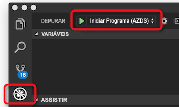

# <a name="how-azure-dev-spaces-works-and-is-configured"></a>Como os espaços de desenvolvimento do Azure funciona e é configurado

Desenvolvendo um aplicativo do Kubernetes pode ser desafiador. Você precisa de arquivos de configuração do Docker e Kubernetes. Você precisa descobrir como testar seu aplicativo localmente e interagir com outros serviços dependentes. Você talvez precise lidar com o desenvolvimento e teste em vários serviços ao mesmo tempo e com uma equipe de desenvolvedores.

Espaços de desenvolvimento do Azure o ajudam a desenvolver, implantar e depurar aplicativos do Kubernetes diretamente no Azure Kubernetes AKS (serviço). Espaços de desenvolvimento do Azure também permite que uma equipe compartilhar um espaço de desenvolvimento. Compartilhar um espaço de desenvolvimento com uma equipe permite que os membros da equipe individuais desenvolva isoladamente sem a necessidade de replicar ou maquetes de dependências ou outros aplicativos no cluster.

Espaços de desenvolvimento do Azure cria e usa um arquivo de configuração para implantar, executar e depurar seus aplicativos do Kubernetes no AKS. Esse arquivo de configuração reside com o código do seu aplicativo e pode ser adicionado ao seu sistema de controle de versão.

Este artigo descreve os processos que espaços de desenvolvimento do Azure power e como esses processos são configurados no arquivo de configuração de espaços de desenvolvimento do Azure. Para obter os espaços de desenvolvimento do Azure em execução rapidamente e vê-lo na prática, conclua uma das guias de início rápido:

* [Java com o Visual Studio Code e CLI](quickstart-java.md)
* [.NET core com o Visual Studio Code e CLI](quickstart-netcore.md)
* [.NET core com o Visual Studio 2017](quickstart-netcore-visualstudio.md)
* [Node. js com o Visual Studio Code e CLI](quickstart-nodejs.md)

## <a name="how-azure-dev-spaces-works"></a>Como funciona a espaços de desenvolvimento do Azure

Espaços de desenvolvimento do Azure tem dois componentes distintos que interagem com: o controlador e as ferramentas do lado do cliente.


O controlador executa as seguintes ações:

* Gerencia a criação do espaço de desenvolvimento e seleção.
* Instala o gráfico do Helm do seu aplicativo e cria objetos Kubernetes.
* Compila a imagem de contêiner do seu aplicativo.
* Implanta seu aplicativo no AKS.
* Faz a compilações incrementais e é reiniciado quando seu código-fonte é alterada.
* Gerencia os logs e rastreamentos HTTP.
* Encaminha stdout e stderr para as ferramentas do lado do cliente.
* Permite que os membros da equipe criar espaços de desenvolvimento filho derivados de um espaço de desenvolvimento do pai.
* Configura o roteamento para aplicativos dentro de um espaço, bem como entre espaços de pai e filho.

O controlador reside fora do AKS. Ele direciona o comportamento e a comunicação entre as ferramentas do lado do cliente e o cluster do AKS. O controlador é habilitado usando a CLI do Azure quando você prepara seu cluster para usar os espaços de desenvolvimento do Azure. Depois de ter habilitado, você pode interagir com ele usando as ferramentas do lado do cliente.

As ferramentas do lado do cliente permite que o usuário:
* Gerar um Dockerfile, gráfico do Helm e o arquivo de configuração de espaços de desenvolvimento do Azure para o aplicativo.
* Pai e filho crie espaços de desenvolvimento.
* Informe o controlador para compilar e iniciar seu aplicativo.

Enquanto seu aplicativo é executado, o cliente de ferramentas também:
* Recebe e exibe o stdout e stderr a partir de seu aplicativo em execução no AKS.
* Usa [encaminhamento de porta](https://kubernetes.io/docs/tasks/access-application-cluster/port-forward-access-application-cluster/) para permitir o acesso via web a seu aplicativo usando http:\//localhost.
* Anexa um depurador ao seu aplicativo em execução no AKS.
* As sincronizações código-fonte em seu espaço de desenvolvimento quando uma mudança for detectada para builds incrementais, permitindo iteração rápida.

Você pode usar o cliente de ferramentas da linha de comando como parte do `azds` comando. Você também pode usar o cliente de ferramentas com:

* Visual Studio Code usando o [extensão de espaços de desenvolvimento do Azure](https://marketplace.visualstudio.com/items?itemName=azuredevspaces.azds).
* Visual Studio 2017 com [ferramentas do Visual Studio para Kubernetes](https://aka.ms/get-vsk8stools).

Aqui está o fluxo básico para configurar e usar espaços de desenvolvimento do Azure:
1. Preparar o cluster do AKS para espaços de desenvolvimento do Azure
1. Preparar o seu código para executar em espaços de desenvolvimento do Azure
1. Executar seu código em um espaço de desenvolvimento
1. Depurar seu código em um espaço de desenvolvimento
1. Compartilhar um espaço de desenvolvimento

Abordaremos mais detalhes sobre como os espaços de desenvolvimento do Azure funciona em cada uma das seções abaixo.

## <a name="prepare-your-aks-cluster"></a>Preparar o cluster do AKS

Envolve a preparação de cluster do AKS:
* Verificando o AKS cluster estiver em uma região [com suporte pelo Azure Dev espaços](https://docs.microsoft.com/azure/dev-spaces/#a-rapid,-iterative-kubernetes-development-experience-for-teams).
* Verificando o estiver executando Kubernetes 1.10.3 ou posterior.
* Habilitar espaços de desenvolvimento do Azure em seu cluster usando `az aks use-dev-spaces`

Para obter mais informações sobre como criar e configurar um cluster do AKS para espaços de desenvolvimento do Azure, consulte um dos guias de Introdução:
* [Começar em espaços de desenvolvimento do Azure com Java](get-started-java.md)
* [Começar em espaços de desenvolvimento do Azure com .NET Core e Visual Studio](get-started-netcore-visualstudio.md)
* [Começar em espaços de desenvolvimento do Azure com o .NET Core](get-started-netcore.md)
* [Começar em espaços de desenvolvimento do Azure com Node. js](get-started-nodejs.md)

Quando espaços de desenvolvimento do Azure estiver habilitado no cluster do AKS, ele instala o controlador para seu cluster. O controlador é um recurso separado do Azure fora do seu cluster e faz o seguinte para recursos no cluster:

* Cria ou designa um namespace de Kubernetes para usar como um espaço de desenvolvimento.
* Remove qualquer namespace de Kubernetes chamado *azds*, se ele existe e cria um novo.
* Implanta uma configuração de webhook do Kubernetes.
* Implanta um servidor de admissão de webhook.
    

Ele também usa a mesma entidade de serviço que usa o cluster do AKS para fazer chamadas de serviço para outros componentes de espaços de desenvolvimento do Azure.


Para usar espaços de desenvolvimento do Azure, deve haver pelo menos um espaço de desenvolvimento. Espaços de desenvolvimento do Azure usa namespaces de Kubernetes dentro do cluster do AKS para espaços de desenvolvimento. Quando um controlador está sendo instalado, ele solicita que você crie um novo namespace de Kubernetes ou escolha um namespace existente para usar como o primeiro espaço de desenvolvimento. Quando um namespace é designado como um espaço de desenvolvimento, o controlador adiciona o *azds.io/space=true* rótulo para esse namespace para identificá-lo como um espaço de desenvolvimento. Criar ou designar o espaço de desenvolvimento inicial é selecionado por padrão, depois de preparar o cluster. Quando um espaço é selecionado, ele é usado por espaços de desenvolvimento do Azure para a criação de novas cargas de trabalho.

Por padrão, o controlador cria um espaço de desenvolvimento denominado *padrão* atualizando existente *padrão* namespace do Kubernetes. Você pode usar as ferramentas do lado do cliente para criar novos espaços de desenvolvimento e remover espaços de desenvolvimento existentes. Devido a uma limitação no Kubernetes, o *padrão* espaço de desenvolvimento não pode ser removido. O controlador também remove todos os namespaces do Kubernetes existentes denominados *azds* para evitar conflitos com o `azds` comando usado pelas ferramentas de cliente.

O servidor de admissão de webhook do Kubernetes é usado para inserir os pods com três contêineres durante a implantação para instrumentação: um contêiner de proxy devspaces, um contêiner devspaces-proxy-init e um contêiner de build devspaces. **Todos os três desses contêineres executado com acesso à raiz no cluster do AKS.** Eles também usam a mesma entidade de serviço que usa o cluster do AKS para fazer chamadas de serviço para outros componentes de espaços de desenvolvimento do Azure.


O contêiner devspaces proxy é um contêiner de sidecar que lida com todo o tráfego TCP para dentro e fora do contêiner de aplicativo e ajuda a executar o roteamento. O contêiner devspaces proxy redireciona mensagens HTTP se determinados espaços estiverem sendo usados. Por exemplo, ele pode ajudar a rotear mensagens HTTP entre aplicativos nos espaços de pai e filho. Todo o tráfego HTTP não passa por meio do proxy de devspaces sem modificações. O contêiner de proxy devspaces também registra todas as mensagens HTTP de entrada e saídas e as envia para o lado do cliente de ferramentas como rastreamentos. Esses rastreamentos, em seguida, podem ser exibidos pelo desenvolvedor para inspecionar o comportamento do aplicativo.

O contêiner devspaces-proxy-init é um [init contêiner](https://kubernetes.io/docs/concepts/workloads/pods/init-containers/) que adiciona regras de roteamentos adicionais com base na hierarquia de espaço para contêiner do seu aplicativo. Ele adiciona as regras de roteamento, atualizando o contêiner de aplicativo */etc/resolv.conf* iptables e arquivo de configuração antes de começar. As atualizações a serem */etc/resolv.conf* permitir para a resolução DNS dos serviços nos espaços do pai. As atualizações de configuração de iptables garantir que todo o tráfego TCP em e para fora do contêiner do aplicativo são roteadas entanto devspaces proxy. Todas as atualizações dos devspaces-proxy-init acontecem além das regras que adiciona Kubernetes.

O contêiner de build devspaces é um contêiner de init e tem o código de origem do projeto e o soquete Docker montado. O código de origem do projeto e o acesso para o Docker permite que o contêiner de aplicativo a ser criado diretamente por pod.

> [!NOTE]
> Espaços de desenvolvimento do Azure usa o mesmo nó para criar o contêiner do seu aplicativo e executá-lo. Como resultado, espaços de desenvolvimento do Azure não precisa de um registro de contêiner externo para compilar e executar seu aplicativo.

O servidor de admissão de webhook de Kubernetes escuta para qualquer novo pod que é criado no cluster AKS. Se esse pod é implantado em qualquer namespace com o *azds.io/space=true* rótulo, ele injeta desse pod com os contêineres adicionais. O contêiner de build devspaces é injetado somente se o contêiner do aplicativo é executado usando as ferramentas do lado do cliente.

Depois de preparar o cluster AKS, você pode usar as ferramentas do lado do cliente para se preparar e executar o código no seu espaço de desenvolvimento.

## <a name="prepare-your-code"></a>Preparar o seu código

Para executar o aplicativo em um espaço de desenvolvimento, ele precisa existir em contêineres, e você precisa definir como ele deve ser implantado no Kubernetes. Para colocar seu aplicativo em contêineres, você precisa de um Dockerfile. Para definir como seu aplicativo é implantado no Kubernetes, você precisa de uma [gráfico do Helm](https://docs.helm.sh/). Para ajudar na criação de um gráfico o Dockerfile e o Helm para seu aplicativo, as ferramentas do lado do cliente fornecem o `prep` comando:

```cmd
azds prep --public
```

O `prep` comando examinará os arquivos em seu projeto e tente criar o gráfico de Dockerfile e o Helm para executar seu aplicativo no Kubernetes. Atualmente, o `prep` comando irá gerar um gráfico de Dockerfile e o Helm com os seguintes idiomas:

* Java
* Node.js
* .NET Core

Você *devem* execute o `prep` comando de um diretório que contém o código-fonte. Executando o `prep` comando do diretório correto permite que as ferramentas do lado do cliente identificar a linguagem e criar um Dockerfile apropriado para colocar seu aplicativo em contêineres. Você também pode executar o `prep` comando de um diretório que contém um *POM. XML* arquivo para projetos Java.

Se você executar o `prep` comando do diretório que contém o código-fonte, as ferramentas do lado do cliente não irá gerar um Dockerfile. Ele também exibirá um erro dizendo que: *Não foi possível gerar o Dockerfile devido ao idioma sem suporte*. Esse erro também ocorrerá se as ferramentas do lado do cliente não reconhecem o tipo de projeto.

Quando você executa o `prep` de comando, você tem a opção de especificar o `--public` sinalizador. Esse sinalizador instrui o controlador para criar um ponto de extremidade acessíveis pela internet para esse serviço. Se você não especificar esse sinalizador, o serviço só é acessível de dentro do cluster ou usar o túnel de localhost criado pelas ferramentas de cliente. Você pode habilitar ou desabilitar esse comportamento depois de executar o `prep` comando atualizando o gráfico do Helm gerado.

O `prep` comando não substituirá qualquer gráficos existentes Dockerfiles ou Helm tem em seu projeto. Se um gráfico de Dockerfile ou Helm existente usa a mesma convenção de nomenclatura que os arquivos gerados pela `prep` comando, o `prep` comando ignorará a geração desses arquivos. Caso contrário, o `prep` comando irá gerar seu próprio Dockerfile ou do gráfico Helm junto com os arquivos existentes.

O `prep` comando também gerará uma `azds.yaml` arquivo na raiz do seu projeto. Espaços de desenvolvimento do Azure usa esse arquivo para criar, instalar, configurar e executar seu aplicativo. Esse arquivo de configuração lista o local de seu gráfico Dockerfile e o Helm e também fornece uma configuração adicional sobre esses artefatos.

Aqui está um exemplo de arquivo azds.yaml criado usando [aplicativo de exemplo do .NET Core](https://github.com/Azure/dev-spaces/tree/master/samples/dotnetcore/getting-started/webfrontend):

```yaml
kind: helm-release
apiVersion: 1.1
build:
  context: .
  dockerfile: Dockerfile
install:
  chart: charts/webfrontend
  values:
  - values.dev.yaml?
  - secrets.dev.yaml?
  set:
    replicaCount: 1
    image:
      repository: webfrontend
      tag: $(tag)
      pullPolicy: Never
    ingress:
      annotations:
        kubernetes.io/ingress.class: traefik-azds
      hosts:
        # This expands to [space.s.][rootSpace.]webfrontend.<random suffix>.<region>.azds.io
        # Customize the public URL by changing the 'webfrontend' text between the $(rootSpacePrefix) and $(hostSuffix) tokens
        # For more information see https://aka.ms/devspaces/routing
        - $(spacePrefix)$(rootSpacePrefix)webfrontend$(hostSuffix)
configurations:
  develop:
    build:
      dockerfile: Dockerfile.develop
      useGitIgnore: true
      args:
        BUILD_CONFIGURATION: ${BUILD_CONFIGURATION:-Debug}
    container:
      sync:
      - "**/Pages/**"
      - "**/Views/**"
      - "**/wwwroot/**"
      - "!**/*.{sln,csproj}"
      command: [dotnet, run, --no-restore, --no-build, --no-launch-profile, -c, "${BUILD_CONFIGURATION:-Debug}"]
      iterate:
        processesToKill: [dotnet, vsdbg]
        buildCommands:
        - [dotnet, build, --no-restore, -c, "${BUILD_CONFIGURATION:-Debug}"]
```

O `azds.yaml` arquivo gerado pelo `prep` comando deve funcionar bem para um cenário de desenvolvimento do projeto único, simples. Se seu projeto específico aumentou a complexidade, você talvez precise atualizar esse arquivo depois de executar o `prep` comando. Por exemplo, seu projeto pode exigir alguns ajustes à sua compilação ou iniciar o processo com base em seu desenvolvimento ou a depuração precisa. Você também pode ter vários aplicativos em seu projeto, que exigem vários processos de compilação ou um conteúdo de compilação diferente.

## <a name="run-your-code"></a>Executar seu código

Para executar seu código em um espaço de desenvolvimento, execute as `up` no mesmo diretório que seu `azds.yaml` arquivo:

```cmd
azds up
```

O `up` comando carrega os arquivos de código-fonte do aplicativo e outros artefatos necessários para compilar e executar seu projeto para o espaço de desenvolvimento. A partir daí, o controlador em seu espaço de desenvolvimento:

1. Cria os objetos de Kubernetes para implantar seu aplicativo.
1. Cria o contêiner para seu aplicativo.
1. Implanta seu aplicativo para o espaço de desenvolvimento.
1. Cria um nome DNS publicamente acessível para seu ponto de extremidade do aplicativo, se configurado.
1. Usa *encaminhamento de porta* para fornecer acesso ao seu ponto de extremidade de aplicativo usando http://locahost.
1. Encaminha stdout e stderr para as ferramentas do lado do cliente.


### <a name="starting-a-service"></a>Iniciar um serviço

Quando você inicia um serviço em um espaço de desenvolvimento, as ferramentas do lado do cliente e o controlador trabalham em coordenação para sincronizar seus arquivos de origem, criar seus objetos de Kubernetes e o contêiner e executar seu aplicativo.

Em um nível mais granular, aqui está o que acontece quando você executar `azds up`:

1. Arquivos são sincronizados do computador do usuário para um armazenamento de arquivos do Azure que é exclusivo para o cluster do AKS do usuário. O código-fonte, gráfico do Helm e arquivos de configuração são carregados. Para obter mais detalhes sobre o processo de sincronização estão disponíveis na próxima seção.
1. O controlador cria uma solicitação para iniciar uma nova sessão. Esta solicitação contém várias propriedades, incluindo uma ID exclusiva, nome do espaço, o caminho para o código-fonte e um sinalizador de depuração.
1. O controlador substitui o *$(tag)* espaço reservado no gráfico Helm com a ID de sessão exclusiva e instalações de gráfico do Helm para seu serviço. Adicionar uma referência para a ID de sessão exclusivo para o gráfico do Helm permite que o contêiner implantado no cluster do AKS para esta sessão específica a ser vinculado de volta para a solicitação de sessão e informações associadas.
1. Durante a instalação do gráfico Helm, o servidor de admissão de webhook de Kubernetes adiciona contêineres adicionais para o pod do seu aplicativo para acesso ao código-fonte do seu projeto e instrumentação. O proxy devspaces e contêineres devspaces-proxy-init são adicionados para fornecer o rastreamento de HTTP e o roteamento de espaço. O contêiner de build devspaces foi adicionado para fornecer o pod com acesso à instância de Docker e o código de origem do projeto para a criação de contêiner do seu aplicativo.
1. Quando o pod do aplicativo é iniciado, o contêiner de build devspaces e o contêiner de devspaces-proxy-init são usados para criar o contêiner de aplicativo. O contêiner de aplicativo e os contêineres de proxy devspaces, em seguida, são iniciados.
1. Depois que o contêiner de aplicativo for iniciado, a funcionalidade do lado do cliente usa o Kubernetes *encaminhamento de porta* funcionalidade para fornecer acesso HTTP ao seu aplicativo por http://localhost. Esse encaminhamento de porta se conecta a seu computador de desenvolvimento para o serviço em seu espaço de desenvolvimento.
1. Quando todos os contêineres no pod tem iniciado, o serviço está em execução. Neste ponto, a funcionalidade do lado do cliente começa a transmitir os rastreamentos, stdout e stderr do HTTP. Essas informações são exibidas pela funcionalidade do lado do cliente para o desenvolvedor.

### <a name="updating-a-running-service"></a>Atualizando um serviço em execução

Durante a execução de um serviço, espaços de desenvolvimento do Azure tem a capacidade de atualizar esse serviço se qualquer um dos arquivos de projeto de origem mudar. Espaços de desenvolvimento também lida com a atualização do serviço de maneira diferente dependendo do tipo de arquivo que é alterado. Há três maneiras de que espaços de desenvolvimento pode atualizar um serviço em execução:

* Atualizar diretamente de um arquivo
* Recompilar e reiniciando o processo do aplicativo dentro do contêiner do aplicativo em execução
* Recompilar e reimplantar o contêiner do aplicativo


Alguns arquivos de projeto que estão ativos estáticos, como html, css e arquivos cshtml, podem ser atualizados diretamente no contêiner do aplicativo sem reiniciar qualquer coisa. Se um ativo estático for alterado, o novo arquivo é sincronizado com o espaço de desenvolvimento e, em seguida, usado pelo contêiner em execução.

Alterações em arquivos, como código-fonte ou arquivos de configuração de aplicativo podem ser aplicadas reiniciando o processo do aplicativo dentro do contêiner em execução. Depois que esses arquivos são sincronizados, o processo do aplicativo é reiniciado dentro do contêiner em execução usando o *devhostagent* processo. Ao criar inicialmente o contêiner do aplicativo, o controlador substitui o comando de inicialização para o aplicativo por um processo diferente chamado *devhostagent*. O processo do aplicativo real, em seguida, é executado como um processo filho sob *devhostagent*, e sua saída seja direcionada usando *devhostagent*saída. O *devhostagent* processo também é parte do desenvolvimento espaços e pode executar comandos no contêiner em execução em nome dos espaços de desenvolvimento. Ao executar uma reinicialização *devhostagent*:

* Interrompe o processo atual ou os processos associados ao aplicativo
* Recompila o aplicativo
* Reinicia o processo ou processos associados ao aplicativo

A maneira *devhostagent* executa anterior etapas é configurado no `azds.yaml` arquivo de configuração. Essa configuração é detalhada em uma seção posterior.

Atualizações para os arquivos de projeto, como Dockerfiles, arquivos csproj ou qualquer parte do gráfico Helm exigem o contêiner do aplicativo para ser recompilado e reimplantado. Quando um desses arquivos for sincronizado no espaço de desenvolvimento, o controlador é executado o [atualização de helm](https://helm.sh/docs/helm/#helm-upgrade) comando e o contêiner do aplicativo é recompilado e reimplantado.

### <a name="file-synchronization"></a>Sincronização de arquivos

Na primeira vez que um aplicativo é iniciado em um espaço de desenvolvimento, todos os arquivos do aplicativo origem são carregados. Enquanto o aplicativo está em execução e sobre as reinicializações posteriores, apenas os arquivos alterados são carregados. Dois arquivos são usados para coordenar esse processo: um arquivo do lado do cliente e um arquivo do lado do controlador.

O arquivo do lado do cliente é armazenado em um diretório temporário e é nomeado com base em um hash do diretório do projeto que você estiver executando em espaços de desenvolvimento. Por exemplo, no Windows você teria um arquivo como *Users\USERNAME\AppData\Local\Temp\1234567890abcdef1234567890abcdef1234567890abcdef1234567890abcdef.synclog* para seu projeto. No Linux, o arquivo do lado do cliente é armazenado na */tmp* directory. Você pode encontrar o diretório no macOS, executando o `echo $TMPDIR` comando.

Esse arquivo está no formato JSON e contém:

* Uma entrada para cada arquivo de projeto que está sincronizado com o espaço de desenvolvimento
* Uma ID de sincronização
* O carimbo de hora da última operação de sincronização

Cada entrada do arquivo de projeto contém um caminho para o arquivo e seu carimbo de hora.

O arquivo do lado do controlador é armazenado no cluster do AKS. Ele contém a ID de sincronização e o carimbo de hora da última sincronização.

Uma sincronização ocorre quando os carimbos de hora de sincronização não correspondem entre o lado do cliente e os arquivos do lado do controlador. Durante uma sincronização, as ferramentas do lado do cliente itera sobre as entradas do arquivo no arquivo do lado do cliente. Se o carimbo de hora do arquivo for após o carimbo de hora de sincronização, esse arquivo seja sincronizado com o espaço de desenvolvimento. Depois que a sincronização seja concluída, os carimbos de hora de sincronização são atualizados em arquivos de cliente e lado do controlador.

Todos os arquivos de projeto são sincronizados se o arquivo do lado do cliente não estiver presente. Esse comportamento permite que você force uma sincronização completa, excluindo o arquivo do lado do cliente.

### <a name="how-routing-works"></a>Como funciona o roteamento

Um espaço de desenvolvimento se baseia no AKS e usa as mesmas [conceitos de rede](../aks/concepts-network.md). Espaços de desenvolvimento do Azure também tem um centralizado *ingressmanager* de serviço e implanta seu próprio controlador de entrada para o cluster do AKS. O *ingressmanager* monitores AKS clusters com espaços de desenvolvimento e aumenta o controlador de entrada de espaços de desenvolvimento do Azure no cluster com objetos de entrada para o roteamento para pods de aplicativo de serviço. O contêiner devspaces proxy em cada pod adiciona um `azds-route-as` cabeçalho HTTP para o tráfego HTTP para um espaço de desenvolvimento com base na URL. Por exemplo, uma solicitação para a URL *http://azureuser.s.default.serviceA.fedcba09...azds.io* obteria um cabeçalho HTTP com `azds-route-as: azureuser`. O contêiner devspaces proxy não adicionará um `azds-route-as` cabeçalho se um estiver presente.

Quando uma solicitação HTTP é feita a um serviço de fora do cluster, a solicitação irá para o controlador de entrada. O controlador de entrada encaminha a solicitação diretamente para o pod apropriado com base em suas regras e os objetos de entrada. O contêiner de proxy devspaces no pod recebe a solicitação, adiciona o `azds-route-as` cabeçalho com base na URL e, em seguida, encaminha a solicitação para o contêiner de aplicativo.

Quando uma solicitação HTTP é feita a um serviço de outro serviço dentro do cluster, a solicitação primeiro vai através do contêiner de devspaces proxy do serviço de chamada. O contêiner de proxy devspaces examina a solicitação HTTP e verificações de `azds-route-as` cabeçalho. Com base no cabeçalho, o contêiner devspaces proxy irá pesquisar o endereço IP do serviço associado com o valor do cabeçalho. Se um endereço IP for encontrado, o contêiner devspaces proxy redireciona a solicitação para esse endereço IP. Se um endereço IP não for encontrado, o contêiner de proxy devspaces encaminha a solicitação para o contêiner de aplicativo pai.

Por exemplo, os aplicativos *serviceA* e *serviceB* são implantados em um espaço de desenvolvimento pai chamado *padrão*. *serviceA* depende *serviceB* e faz chamadas HTTP a ele. Usuário do Azure cria um espaço de desenvolvimento filho com base nas *padrão* espaço chamado *azureuser*. Usuário do Azure também implanta sua própria versão da *serviceA* para seu espaço de filho. Quando uma solicitação é feita para *http://azureuser.s.default.serviceA.fedcba09...azds.io*:


1. O controlador de entrada procura o IP para o pod associado com a URL, que é *serviceA.azureuser*.
1. O controlador de entrada localiza o IP para o pod no espaço de desenvolvimento do usuário do Azure e encaminha a solicitação para o *serviceA.azureuser* pod.
1. O contêiner devspaces proxy nas *serviceA.azureuser* pod recebe a solicitação e adiciona `azds-route-as: azureuser` como um cabeçalho HTTP.
1. O contêiner de proxy devspaces na *serviceA.azureuser* pod encaminha a solicitação para o *serviceA* contêiner do aplicativo na *serviceA.azureuser* pod.
1. O *serviceA* aplicativo de *serviceA.azureuser* pod faz uma chamada para *serviceB*. O *serviceA* aplicativo também contém código para preservar o existente `azds-route-as` cabeçalho, que nesse caso é `azds-route-as: azureuser`.
1. O contêiner de proxy devspaces na *serviceA.azureuser* pod recebe a solicitação e procura o IP da *serviceB* com base no valor da `azds-route-as` cabeçalho.
1. O contêiner devspaces proxy nas *serviceA.azureuser* pod não encontra um IP para o *serviceB.azureuser*.
1. O contêiner de proxy devspaces na *serviceA.azureuser* pod procura o IP *serviceB* no espaço do pai, que é *serviceB.default*.
1. O contêiner de proxy devspaces na *serviceA.azureuser* pod localiza o IP de *serviceB.default* e a encaminha a solicitação para o *serviceB.default* pod.
1. O contêiner de proxy devspaces na *serviceB.default* pod recebe a solicitação e encaminha a solicitação para o *serviceB* contêiner do aplicativo na *serviceB.default*pod.
1. O *serviceB* aplicativo o *serviceB.default* pod retorna uma resposta para o *serviceA.azureuser* pod.
1. O contêiner de proxy devspaces na *serviceA.azureuser* pod recebe a resposta e a encaminha a resposta para o *serviceA* contêiner do aplicativo na *serviceA.azureuser* pod.
1. O *serviceA* aplicativo recebe a resposta e retorna sua própria resposta.
1. O contêiner de proxy devspaces na *serviceA.azureuser* pod recebe a resposta do *serviceA* contêiner de aplicativo e a encaminha a resposta para o chamador original fora do cluster.

Todos os outros tráfegos TCP que não seja HTTP passa por meio do controlador de entrada e os contêineres de proxy devspaces sem modificações.

### <a name="how-running-your-code-is-configured"></a>Como executar seu código está configurado

Os espaços de desenvolvimento do Azure usam o `azds.yaml` arquivo para instalar e configurar seu serviço. O controlador usa o `install` propriedade no `azds.yaml` arquivo para instalar o gráfico do Helm e criar os objetos Kubernetes:

```yaml
...
install:
  chart: charts/webfrontend
  values:
  - values.dev.yaml?
  - secrets.dev.yaml?
  set:
    replicaCount: 1
    image:
      repository: webfrontend
      tag: $(tag)
      pullPolicy: Never
    ingress:
      annotations:
        kubernetes.io/ingress.class: traefik-azds
      hosts:
      # This expands to [space.s.][rootSpace.]webfrontend.<random suffix>.<region>.azds.io
      # Customize the public URL by changing the 'webfrontend' text between the $(rootSpacePrefix) and $(hostSuffix) tokens
      # For more information see https://aka.ms/devspaces/routing
      - $(spacePrefix)$(rootSpacePrefix)webfrontend$(hostSuffix)
...
```

Por padrão, o `prep` comando irá gerar o gráfico do Helm. Ele também define o *install.chart* propriedade para o diretório do gráfico Helm. Se você quisesse usar um gráfico do Helm em um local diferente, você pode atualizar essa propriedade para usar esse local.

Ao instalar os gráficos do Helm, espaços de desenvolvimento do Azure fornece uma maneira para substituir os valores do gráfico do Helm. Os valores padrão para o gráfico do Helm estão em `charts/APP_NAME/values.yaml`.

Usando o *install.values* propriedade, você pode listar um ou mais arquivos que definem os valores que você deseja que sejam substituídos no gráfico Helm. Por exemplo, se você quisesse uma configuração de nome de host ou o banco de dados especificamente ao executar seu aplicativo em um espaço de desenvolvimento, você pode usar essa funcionalidade de substituição. Você também pode adicionar um *?* no final de qualquer um dos nomes de arquivo para defini-lo como opcional.

O *install.set* propriedade permite que você configure um ou mais valores que você deseja que sejam substituídos no gráfico Helm. Quaisquer valores definidos nas *install.set* substituirão os valores configurados nos arquivos listados na *install.values*. As propriedades em *install.set* dependem dos valores do gráfico do Helm e podem ser diferentes dependendo do gráfico do Helm gerado.

No exemplo acima, o *install.set.replicaCount* propriedade informa o controlador de quantas instâncias do seu aplicativo seja executado em seu espaço de desenvolvimento. Dependendo do cenário, você pode aumentar esse valor, mas ele terá um impacto sobre como anexar um depurador para o pod do seu aplicativo. Para obter mais informações, consulte o [artigo de solução de problemas](troubleshooting.md).

O gráfico do Helm gerado, a imagem de contêiner é definida como *{{. Values.Image.Repository}} :{{. Values.Image.tag}}*. O `azds.yaml` arquivo define *install.set.image.tag* a propriedade como *$(tag)* por padrão, que é usado como o valor para *{{. Values.Image.tag}}*. Definindo o *install.set.image.tag* propriedade dessa forma, ele permite que a imagem de contêiner para seu aplicativo a ser marcado de forma distinta, durante a execução de espaços de desenvolvimento do Azure. Nesse caso específico, a imagem é marcada como  *<value from image.repository>: $(tag)*. Você deve usar o *$(tag)* variável como o valor de *install.set.image.tag* para espaços de desenvolvimento que reconhecer e localizar o contêiner no cluster AKS.

No exemplo acima, `azds.yaml` define *install.set.ingress.hosts*. O *install.set.ingress.hosts* propriedade define um formato de nome de host para pontos de extremidade públicos. Essa propriedade também utiliza *$(spacePrefix)*, *$(rootSpacePrefix)*, e *$(hostSuffix)*, que são fornecidos pelo controlador de valores. 

O *$(spacePrefix)* é o nome do espaço de desenvolvimento filho, que assume a forma de *SPACENAME.s*. O *$(rootSpacePrefix)* é o nome do espaço de pai. Por exemplo, se *azureuser* é um espaço de filho de *padrão*, o valor para *$(rootSpacePrefix)* é *padrão* e o valor de *$(spacePrefix)* é *azureuser.s*. Se o espaço não for um espaço, o filho *$(spacePrefix)* está em branco. Por exemplo, se o *padrão* espaço não tem espaço nenhum pai, o valor para *$(rootSpacePrefix)* está *padrão* e o valor de *$(spacePrefix)* está em branco. O *$(hostSuffix)* é um sufixo DNS que aponta para o controlador de entrada de espaços de desenvolvimento do Azure que é executado no cluster do AKS. Esse sufixo DNS corresponde a uma entrada DNS curinga, por exemplo  *\*. RANDOM_VALUE.eus.azds.IO*, que foi criado quando o controlador de espaços de desenvolvimento do Azure foi adicionado ao cluster do AKS.

No acima `azds.yaml` arquivo, você poderia atualizar também *install.set.ingress.hosts* para alterar o nome do host do seu aplicativo. Por exemplo, se você quisesse simplificar o nome do host do seu aplicativo a partir *$(spacePrefix)$(rootSpacePrefix)webfrontend$(hostSuffix)* para *$(spacePrefix)$(rootSpacePrefix)web$(hostSuffix)*.

Para criar o contêiner para seu aplicativo, o controlador usa a seções de abaixo o `azds.yaml` arquivo de configuração:

```yaml
build:
  context: .
  dockerfile: Dockerfile
...
configurations:
  develop:
    build:
      dockerfile: Dockerfile.develop
      useGitIgnore: true
      args:
        BUILD_CONFIGURATION: ${BUILD_CONFIGURATION:-Debug}
...
```

O controlador usa um Dockerfile para compilar e executar seu aplicativo.

O *build.context* o diretório onde os Dockerfiles existem listas de propriedades. O *build.dockerfile* propriedade define o nome do Dockerfile para compilar a versão de produção do aplicativo. O *configurations.develop.build.dockerfile* propriedade configura o nome do Dockerfile para a versão de desenvolvimento do aplicativo.

Ter diferentes Dockerfiles para desenvolvimento e produção permite que você habilitar determinadas coisas durante o desenvolvimento e desabilitar esses itens para implantações de produção. Por exemplo, você pode habilitar o log mais detalhado durante o desenvolvimento e desabilitar em um ambiente de produção ou depuração. Você também pode atualizar essas propriedades se seu Dockerfiles são nomeados de forma diferente ou em um local diferente.

Para ajudar você a iterar rapidamente durante o desenvolvimento, espaços de desenvolvimento do Azure sincronizará as alterações do seu projeto local e atualizar seu aplicativo de forma incremental. O abaixo da seção no `azds.yaml` arquivo de configuração é usado para configurar a sincronização e atualizar:

```yaml
...
configurations:
  develop:
    ...
    container:
      sync:
      - "**/Pages/**"
      - "**/Views/**"
      - "**/wwwroot/**"
      - "!**/*.{sln,csproj}"
      command: [dotnet, run, --no-restore, --no-build, --no-launch-profile, -c, "${BUILD_CONFIGURATION:-Debug}"]
      iterate:
        processesToKill: [dotnet, vsdbg]
        buildCommands:
        - [dotnet, build, --no-restore, -c, "${BUILD_CONFIGURATION:-Debug}"]
...
```

Os arquivos e diretórios que sincronizarão as alterações são listados na *configurations.develop.container.sync* propriedade. Esses diretórios são sincronizados inicialmente quando você executa o `up` comando, bem como quando são detectadas alterações. Se houver adicionais ou diferentes diretórios que desejar sincronizados ao seu espaço de desenvolvimento, você pode alterar essa propriedade.

O *configurations.develop.container.iterate.buildCommands* propriedade especifica como compilar o aplicativo em um cenário de desenvolvimento. O *configurations.develop.container.command* propriedade fornece o comando para executar o aplicativo em um cenário de desenvolvimento. Você talvez queira atualizar cada uma dessas propriedades, se houver sinalizadores de compilação ou tempo de execução adicionais ou parâmetros que você deseja usar durante o desenvolvimento.

O *configurations.develop.container.iterate.processesToKill* lista os processos para kill para interromper o aplicativo. Você talvez queira atualizar esta propriedade, se você quiser alterar o comportamento de reinicialização do seu aplicativo durante o desenvolvimento. Por exemplo, se você atualizou o *configurations.develop.container.iterate.buildCommands* ou *configurations.develop.container.command* propriedades para alterar como o aplicativo é compilado ou iniciado, você talvez precise alterar quais processos são interrompidos.

Ao preparar o seu código usando o `azds prep` de comando, você tem a opção de adicionar o `--public` sinalizador. Adicionando o `--public` sinalizador cria uma URL acessível publicamente para seu aplicativo. Se você omitir esse sinalizador, o aplicativo é acessível somente dentro do cluster ou usando o túnel de localhost. Depois de executar o `azds prep` de comando, você pode alterar essa configuração modificando o *ingress.enabled* propriedade no `charts/APPNAME/values.yaml`:

```yaml
ingress:
  enabled: true
```

## <a name="debug-your-code"></a>Depurar seu código

Para aplicativos Java, .NET e Node. js, você pode depurar seu aplicativo em execução diretamente no seu espaço de desenvolvimento usando o Visual Studio Code ou Visual Studio 2017. O Visual Studio Code e Visual Studio 2017 fornecem ferramentas para conectar-se ao seu espaço de desenvolvimento, inicie seu aplicativo e anexar um depurador. Após a execução `azds prep`, você pode abrir seu projeto no Visual Studio Code ou Visual Studio 2017. Visual Studio Code ou Visual Studio 2017 irá gerar seus próprios arquivos de configuração para conectar-se de que é separada da execução `azds prep`. De dentro do Visual Studio Code ou Visual Studio 2017, você pode definir pontos de interrupção e iniciar o aplicativo em seu espaço de desenvolvimento.



Quando você inicia seu aplicativo usando o Visual Studio Code ou Visual Studio 2017 para depuração, tratam de iniciar e conectar-se ao seu espaço de desenvolvimento da mesma forma como em execução `azds up`. As ferramentas do lado do cliente no Visual Studio Code e Visual Studio 2017 também fornecem um parâmetro adicional com informações específicas para a depuração. O parâmetro contém o nome da imagem do depurador, o local do depurador dentro na imagem do depurador e o local de destino dentro do contêiner do aplicativo para montar a pasta do depurador. 

A imagem de depurador é determinada automaticamente pelas ferramentas de cliente. Ele usa um método semelhante àquele usado durante o Dockerfile e o gráfico do Helm gerar durante a execução `azds prep`. Depois que o depurador é montado na imagem do aplicativo, ele é executado usando `azds exec`.

## <a name="sharing-a-dev-space"></a>Compartilhar um espaço de desenvolvimento

Ao trabalhar com uma equipe, você pode [compartilhar um espaço de desenvolvimento em toda a equipe](how-to/share-dev-spaces.md) e criar espaços de desenvolvimento derivada. Um espaço de desenvolvimento pode ser usado por qualquer pessoa com acesso de Colaborador ao grupo de recursos do espaço de desenvolvimento.

Você também pode criar um novo espaço de desenvolvimento é derivado de outro espaço de desenvolvimento. Quando você cria um espaço, o desenvolvimento derivada de *azds.io/pai-espaço = nome do espaço de pai* rótulo é adicionado ao namespace do espaço de desenvolvimento derivada. Além disso, o espaço de desenvolvimento do pai de todos os aplicativos são compartilhados com o espaço de desenvolvimento derivada. Se você implantar uma versão atualizada de um aplicativo para o espaço de desenvolvimento derivada, só existirão no espaço de desenvolvimento derivada e o espaço de desenvolvimento pai permanecerá inalterado. Você pode ter um máximo de três níveis de desenvolvimento derivada espaços ou *avô* espaços.

O espaço de desenvolvimento derivada também inteligentemente irá rotear solicitações entre seus próprios aplicativos e os aplicativos compartilhados a partir de seu pai. O roteamento funciona a tentativa de solicitação de rota para um aplicativo no espaço de desenvolvimento derivada e voltando para o aplicativo compartilhado do espaço de desenvolvimento do pai. O roteamento fará o fallback para o aplicativo compartilhado no espaço de avô se o aplicativo não está no espaço do pai.

Por exemplo: 
* O espaço de desenvolvimento *padrão* tem aplicativos *serviceA* e *serviceB* .
* O espaço de desenvolvimento *azureuser* é derivado de *padrão*.
* Uma versão atualizada do *serviceA* é implantado *azureuser*.

Ao usar *azureuser*, todas as solicitações para *serviceA* serão roteadas para a versão atualizada na *azureuser*. Uma solicitação para *serviceB* tentarão primeiro ser roteadas para o *azureuser* verzi *serviceB*. Pois ele não existir, ela será roteada para o *padrão* verzi *serviceB*. Se o *azureuser* versão do *serviceA* for removido, todas as solicitações para *serviceA* fará o fallback para usar o *padrão* versão do *serviceA*.

## <a name="next-steps"></a>Próximas etapas

Para começar a usar os espaços de desenvolvimento do Azure, consulte os inícios rápidos a seguir:

* [Java com o Visual Studio Code e CLI](quickstart-java.md)
* [.NET core com o Visual Studio Code e CLI](quickstart-netcore.md)
* [.NET core com o Visual Studio 2017](quickstart-netcore-visualstudio.md)
* [Node. js com o Visual Studio Code e CLI](quickstart-nodejs.md)

Para começar com o desenvolvimento em equipe, consulte os artigos de instruções a seguir:

* [Desenvolvimento em equipe - Java com o Visual Studio Code e CLI](team-development-java.md)
* [Desenvolvimento em equipe - .NET Core com o Visual Studio Code e CLI](team-development-netcore.md)
* [Desenvolvimento em equipe - .NET Core com o Visual Studio 2017](team-development-netcore-visualstudio.md)
* [Desenvolvimento em equipe - Node. js com o Visual Studio Code e CLI](team-development-nodejs.md)
