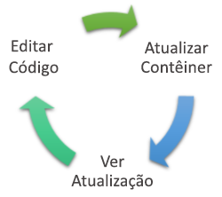
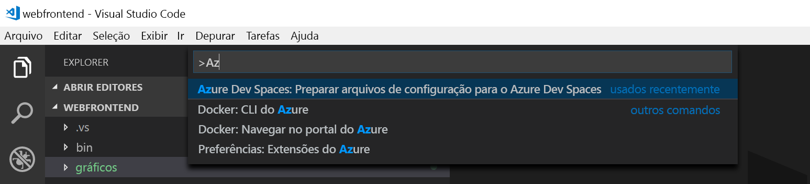
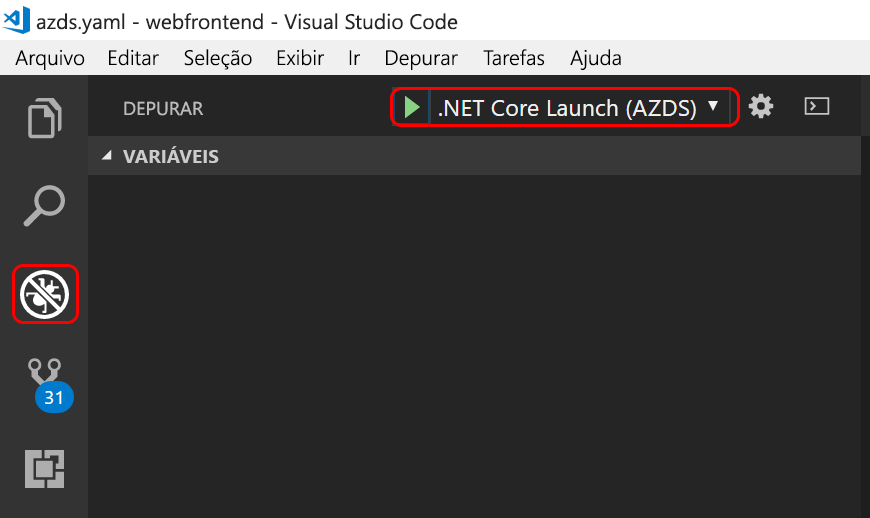

# <a name="quickstart-create-a-kubernetes-dev-space-with-azure-dev-spaces-net-core-and-vs-code"></a>Início Rápido: Criar um espaço de desenvolvimento do Kubernetes com o Azure Dev Spaces (.NET Core e VS Code)

Neste guia, você aprenderá a:

- Configure o Azure Dev Spaces com um cluster Kubernetes gerenciado no Azure.
- Desenvolver código em containers iterativamente usando o VS Code e a linha de comando.
- Depurar o código no seu espaço de desenvolvimento a partir do VS Code

> [!Note]
> **Caso tenha problemas** a qualquer momento, consulte a seção [Solução de problemas](troubleshooting.md) ou poste um comentário nesta página. Você também pode experimentar um [tutorial](get-started-netcore.md) mais detalhado.

## <a name="prerequisites"></a>Pré-requisitos

- Uma assinatura do Azure. Se você não tiver uma, poderá [criar uma conta gratuita](https://azure.microsoft.com/free).
- [Visual Studio Code](https://code.visualstudio.com/download).
- [CLI do Azure](/cli/azure/install-azure-cli?view=azure-cli-latest) versão 2.0.43 ou superior.
- Um cluster do Kubernetes executando o Kubernetes 1.9.6 ou posterior, nas regiões EastUS, CentralUS, WestUS2, WestEurope, CanadaCentral ou CanadaEast, com o **Roteamento de Aplicativo HTTP** habilitado.

    ```cmd
    az group create --name MyResourceGroup --location <region>
    az aks create -g MyResourceGroup -n MyAKS --location <region> --kubernetes-version 1.11.2 --enable-addons http_application_routing --generate-ssh-keys
    ```

## <a name="set-up-azure-dev-spaces"></a>Configurar o Azure Dev Spaces

A CLI do Azure e a extensão do Azure Dev Spaces podem ser instalados e executados em computadores Windows, Mac ou Linux. Para o Linux, há suporte para as seguintes distribuições: Ubuntu (18.04, 16.04 e 14.04), Debian 8 e 9, RHEL 7, Fedora 26 +, CentOS 7, openSUSE 42.2 e SLES 12.

Siga estas etapas para configurar o Azure Dev Spaces:

1. Configure o Dev Spaces no seu cluster do AKS: `az aks use-dev-spaces -g MyResourceGroup -n MyAKS`
1. Baixe a [extensão do Azure Dev Spaces](https://marketplace.visualstudio.com/items?itemName=azuredevspaces.azds) para o VS Code. Clique em Instalar uma vez na página do Marketplace da extensão e novamente no VS Code.

## <a name="build-and-run-code-in-kubernetes"></a>Compilar e executar um código no Kubernetes

1. Baixe o exemplo de código no GitHub: [https://github.com/Azure/dev-spaces](https://github.com/Azure/dev-spaces) 
1. Altere o diretório para a pasta webfrontend: `cd dev-spaces/samples/dotnetcore/getting-started/webfrontend`
1. Gere os ativos de gráfico de Docker e Helm: `azds prep --public`
1. Compile e execute o seu código no AKS. Na janela do terminal da **pasta webfrontend**, execute este comando: `azds up`
1. Examine a saída do console para obter informações sobre a URL pública criada com o comando `up`. Ela estará neste formato: 

   `(pending registration) Service 'webfrontend' port 'http' will be available at <url>\r\nService 'webfrontend' port 80 (TCP) is available at http://localhost:<port>` 

   Abra essa URL em uma janela do navegador e você deverá ver o aplicativo Web ser carregado. 
   
   > [!Note]
   > Na primeira execução, pode demorar vários minutos para o DNS público estar pronto. Se a URL pública não for resolvida, você poderá usar a URL http://localhost:<portnumber> alternativa, exibida na saída do console. Se você usar a URL de host local, poderá parecer que o contêiner está sendo executado localmente, mas, na verdade, ele está sendo executado no AKS. Para sua conveniência e para facilitar a interação com o serviço em sua máquina local, o Azure Dev Spaces cria um túnel SSH temporário para o contêiner em execução no Azure. Você poderá voltar e experimentar a URL pública quando o registro DNS estiver pronto.

### <a name="update-a-content-file"></a>Atualizar um arquivo de conteúdo

1. Localize o arquivo, como `./Views/Home/Index.cshtml` e edite o HTML. Por exemplo, altere a linha 70 que lê `<h2>Application uses</h2>` para algo como: `<h2>Hello k8s in Azure!</h2>`
1. Salve o arquivo. Em seguida, na janela do Terminal, você verá uma mensagem informando que um arquivo no contêiner em execução foi atualizado.
1. Volte para o navegador e atualize a página. Você verá a página da Web exibir o HTML atualizado.

O que aconteceu? Edições em arquivos de conteúdo, como HTML e CSS, não exigem a recompilação em um aplicativo Web do .NET Core e, portanto um comando `azds up` ativo sincroniza automaticamente os arquivos de conteúdo modificados no contêiner em execução no Azure. Assim, você pode ver suas edições de conteúdo imediatamente.

### <a name="update-a-code-file"></a>Atualizar um arquivo de código
A atualização dos arquivos de código requer um pouco mais de trabalho, pois um aplicativo .NET Core precisa recompilar e produzir os binários do aplicativo atualizado.

1. Na janela do terminal, pressione `Ctrl+C` (para parar `azds up`).
1. Abra o arquivo de código chamado `Controllers/HomeController.cs` e edite a mensagem exibida na página Sobre: `ViewData["Message"] = "Your application description page.";`
1. Salve o arquivo.
1. Execute `azds up` na janela do terminal. 

Esse comando recompila a imagem de contêiner e reimplanta o gráfico de Helm. Para ver as alterações de código entrarem em vigor no aplicativo em execução, vá ao menu Sobre no aplicativo Web.

Mas existe um *método ainda mais rápido* para desenvolver código, que você irá explorar na próxima seção. 

## <a name="debug-a-container-in-kubernetes"></a>Depurar um contêiner no Kubernetes

Nesta seção, você usará o VS Code para depurar diretamente depurar o seu contêiner em execução no Azure. Você também aprenderá a obter um loop de edição, execução e teste mais rápido.



### <a name="initialize-debug-assets-with-the-vs-code-extension"></a>Inicialize os recursos de depuração com a extensão do VS Code
Primeiro, é necessário configurar o projeto de código para que o VS Code comunique-se com o espaço de desenvolvimento no Azure. A extensão do VS Code para o Azure Dev Spaces fornece um comando auxiliar para configurar a configuração de depuração. 

Abra a **Paleta de Comandos** (usando o menu **Exibir | Paleta de Comandos**) e use o preenchimento automático para digitar e selecionar este comando: `Azure Dev Spaces: Prepare configuration files for Azure Dev Spaces`. 

Isso adiciona a configuração de depuração para o Azure Dev Spaces na pasta `.vscode`. Esse comando não é deve ser confundido com o `azds prep`, que configura o projeto para a implantação.



### <a name="select-the-azds-debug-configuration"></a>Selecionar a configuração de depuração AZDS
1. Para abrir o modo de exibição Depuração, clique no ícone Depuração na **Barra de Atividades** do lado do VS Code.
1. Selecione **Inicialização do .NET Core (AZDS)** como a configuração de depuração ativa.



> [!Note]
> Se você não vir comandos do Azure Dev Spaces na Paleta de Comandos, verifique se instalou a extensão do VS Code para o Azure Dev Spaces. Verifique se o espaço de trabalho que você abriu no VS Code é a pasta que contém azds.yaml.


### <a name="debug-the-container-in-kubernetes"></a>Depurar o contêiner no Kubernetes
Pressione **F5** para depurar seu código no Kubernetes.

Assim como acontece com o comando `up`, o código está sincronizado com o espaço de desenvolvimento e um contêiner é criado e implantado no Kubernetes. Desta vez, é claro, o depurador está anexado ao contêiner remoto.

> [!Tip]
> A barra de status do VS Code exibirá uma URL clicável.

Defina um ponto de interrupção em um arquivo de código do lado do servidor, por exemplo, dentro da função `Index()` no arquivo de origem `Controllers/HomeController.cs`. A atualização da página do navegador gera o ponto de interrupção.

Você tem acesso completo às informações de depuração exatamente como teria se o código fosse executado localmente, por exemplo, a pilha de chamadas, as variáveis locais, as informações de exceção etc.

### <a name="edit-code-and-refresh"></a>Editar código e atualizar
Com o depurador ativo, edite o código. Por exemplo, modifique a mensagem da página Sobre em `Controllers/HomeController.cs`. 

```csharp
public IActionResult About()
{
    ViewData["Message"] = "My custom message in the About page.";
    return View();
}
```

Salve o arquivo e, no **painel Ações de depuração**, clique no botão **Atualizar**. 


Em vez de recompilar e reimplantar uma nova imagem de contêiner sempre que houver edições de código, o que geralmente levará um tempo considerável, o Azure Dev Spaces recompilará incrementalmente o código dentro do contêiner existente para fornecer um loop de edição/depuração mais rápido.

Atualize o aplicativo Web no navegador e vá para a página Sobre. Sua mensagem personalizada deverá aparecer na interface de usuário.

**Agora você tem um método para iterar em código rapidamente e depurar diretamente no Kubernetes!**

## <a name="next-steps"></a>Próximas etapas

Saiba como o Azure Dev Spaces ajuda você a desenvolver aplicativos mais complexos em vários contêineres e como você pode simplificar o desenvolvimento colaborativo trabalhando com versões diferentes ou ramificações do seu código em diferentes espaços. 

> [!div class="nextstepaction"]
> [Trabalhando com vários contêineres e desenvolvimento em equipe](team-development-netcore.md)
