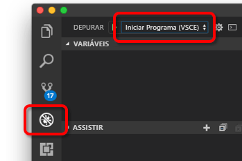

# <a name="quickstart-develop-with-nodejs-on-kubernetes-using-azure-dev-spaces"></a>Início Rápido: Desenvolver com Node.js no Kubernetes usando o Azure Dev Spaces

Neste guia, você aprenderá a:

- Configure o Azure Dev Spaces com um cluster Kubernetes gerenciado no Azure.
- Desenvolva código em contêineres iterativamente usando o Visual Studio Code e a linha de comando.
- Depure o código no seu espaço de desenvolvimento do Visual Studio Code.

## <a name="prerequisites"></a>Pré-requisitos

- Uma assinatura do Azure. Caso não tenha uma assinatura do Azure, é possível criar uma [conta gratuita](https://azure.microsoft.com/free).
- [O Visual Studio Code instalado](https://code.visualstudio.com/download).
- A extensão [Azure Dev Spaces](https://marketplace.visualstudio.com/items?itemName=azuredevspaces.azds) para o Visual Studio Code instalada.
- A [CLI do Azure](/cli/azure/install-azure-cli?view=azure-cli-latest) instalada.

## <a name="create-an-azure-kubernetes-service-cluster"></a>Criar um cluster do Serviço de Kubernetes do Azure

Você precisa criar um cluster do AKS em uma [região com suporte](https://docs.microsoft.com/azure/dev-spaces/#a-rapid,-iterative-kubernetes-development-experience-for-teams). Os comandos a seguir criam um grupo de recursos chamado *MyResourceGroup* e um cluster do AKS chamado *MyAKS*.

```cmd
az group create --name MyResourceGroup --location eastus
az aks create -g MyResourceGroup -n MyAKS --location eastus --node-count 1 --generate-ssh-keys
```

## <a name="enable-azure-dev-spaces-on-your-aks-cluster"></a>Habilitar o Azure Dev Spaces no cluster do AKS

Use o comando `use-dev-spaces` para habilitar o Dev Spaces no cluster do AKS e siga os prompts. O comando abaixo habilita o Dev Spaces no cluster *MyAKS*, no grupo *MyResourceGroup* e cria um espaço de desenvolvimento *padrão*.

```cmd
$ az aks use-dev-spaces -g MyResourceGroup -n MyAKS

'An Azure Dev Spaces Controller' will be created that targets resource 'MyAKS' in resource group 'MyResourceGroup'. Continue? (y/N): y

Creating and selecting Azure Dev Spaces Controller 'MyAKS' in resource group 'MyResourceGroup' that targets resource 'MyAKS' in resource group 'MyResourceGroup'...2m 24s

Select a dev space or Kubernetes namespace to use as a dev space.
 [1] default
Type a number or a new name: 1

Kubernetes namespace 'default' will be configured as a dev space. This will enable Azure Dev Spaces instrumentation for new workloads in the namespace. Continue? (Y/n): Y

Configuring and selecting dev space 'default'...3s

Managed Kubernetes cluster 'MyAKS' in resource group 'MyResourceGroup' is ready for development in dev space 'default'. Type `azds prep` to prepare a source directory for use with Azure Dev Spaces and `azds up` to run.
```

## <a name="get-sample-application-code"></a>Obter o código do aplicativo de exemplo

Neste artigo, você usa o [Aplicativo de exemplo do Azure Dev Spaces](https://github.com/Azure/dev-spaces) para demonstrar o uso do Azure Dev Spaces.

Clone o aplicativo no GitHub e navegue até o diretório *dev-spaces/samples/nodejs/getting-started/webfrontend*:

```cmd
git clone https://github.com/Azure/dev-spaces
cd dev-spaces/samples/nodejs/getting-started/webfrontend
```

## <a name="prepare-the-application"></a>Preparar o aplicativo

Gerar os ativos de gráfico do Helm e do Docker para executar o aplicativo no Kubernetes usando o comando `azds prep`:

```cmd
azds prep --public
```

Você deve executar o comando `prep` no diretório *dev-spaces/samples/nodejs/getting-started/webfrontend* para gerar corretamente os ativos de gráfico do Helm e do Docker.

## <a name="build-and-run-code-in-kubernetes"></a>Compilar e executar um código no Kubernetes

Compile e execute seu código no AKS usando o comando `azds up`:

```cmd
$ azds up
Using dev space 'default' with target 'MyAKS'
Synchronizing files...2s
Installing Helm chart...2s
Waiting for container image build...2m 25s
Building container image...
Step 1/8 : FROM node
Step 2/8 : ENV PORT 80
Step 3/8 : EXPOSE 80
Step 4/8 : WORKDIR /app
Step 5/8 : COPY package.json .
Step 6/8 : RUN npm install
Step 7/8 : COPY . .
Step 8/8 : CMD ["npm", "start"]
Built container image in 6m 17s
Waiting for container...13s
Service 'webfrontend' port 'http' is available at http://webfrontend.1234567890abcdef1234.eus.azds.io/
Service 'webfrontend' port 80 (http) is available at http://localhost:54256
...
```

Veja o serviço em execução abrindo a URL pública que é exibida na saída do comando `azds up`. Neste exemplo, a URL pública é *http://webfrontend.1234567890abcdef1234.eus.azds.io/*.

Se você parar o comando `azds up` usando *Ctrl + c*, o serviço continuará a executar no AKS e a URL pública permanecerá disponível.

## <a name="update-code"></a>Atualizar código

Para implantar uma versão atualizada do serviço, você pode atualizar qualquer arquivo em seu projeto e executar novamente o comando `azds up`. Por exemplo: 

1. Se `azds up` ainda estiver em execução, pressione *Ctrl + c*.
1. Atualize a [linha 10 em `server.js`](https://github.com/Azure/dev-spaces/blob/master/samples/nodejs/getting-started/webfrontend/server.js#L10) para:
    
    ```javascript
        res.send('Hello from webfrontend in Azure');
    ```

1. Salve suas alterações.
1. Execute novamente o comando `azds up`:

    ```cmd
    $ azds up
    Using dev space 'default' with target 'MyAKS'
    Synchronizing files...1s
    Installing Helm chart...3s
    Waiting for container image build...
    ...    
    ```

1. Navegue até o serviço em execução e observe as alterações que você fez.
1. Pressione *Ctrl + c* para interromper o comando `azds up`.

## <a name="initialize-code-for-debugging-in-kubernetes-with-visual-studio-code"></a>Inicializar o código para depuração no Kubernetes com o Visual Studio Code

Abra o Visual Studio Code, clique em *Arquivo*, *Abrir...* e, em seguida, navegue até o diretório *dev-spaces/samples/nodejs/getting-started/webfrontend* e clique em *Abrir*.

Agora você está com o projeto *webfrontend* aberto no Visual Studio Code, que é o mesmo serviço que foi executado usando o comando `azds up`. Para depurar esse serviço no AKS usando o Visual Studio Code, em vez de usar o `azds up` diretamente, você precisa preparar este projeto para usar o Visual Studio Code para se comunicar com seu espaço de desenvolvimento.

Para abrir a paleta de comandos no Visual Studio Code, clique em *Exibir* e, em seguida, *Paleta de Comandos*. Comece digitando `Azure Dev Spaces` e clique em `Azure Dev Spaces: Prepare configuration files for Azure Dev Spaces`.


Esse comando prepara seu projeto para ser executado no Azure Dev Spaces diretamente do Visual Studio Code. Ele também gera um diretório *.vscode* com a configuração de depuração na raiz do seu projeto.

## <a name="build-and-run-code-in-kubernetes-from-visual-studio-code"></a>Compilar e executar o código no Kubernetes por meio do Visual Studio Code

Clique no ícone *Depurar* à esquerda e clique em *Iniciar Servidor (AZDS)* na parte superior.



Este comando compila e executa o serviço no Azure Dev Spaces no modo de depuração. A janela *Terminal*, na parte inferior, mostra a saída do build e as URLs do seu serviço em execução no Azure Dev Spaces. O *Console de Depuração* mostra a saída de log.

> [!Note]
> Se você não vir comandos do Azure Dev Spaces na *Paleta de Comandos*, verifique se instalou a [extensão do Visual Studio Code para o Azure Dev Spaces](https://marketplace.visualstudio.com/items?itemName=azuredevspaces.azds). Também verifique se você abriu o diretório *dev-spaces/samples/nodejs/getting-started/webfrontend* no Visual Studio Code.

Clique em *Depurar* e, em seguida, *Parar Depuração* para parar o depurador.

## <a name="setting-and-using-breakpoints-for-debugging"></a>Definir e usar pontos de interrupção para depuração

Inicie o serviço usando *Iniciar Servidor (AZDS)*.

Navegue de volta para a exibição *Explorer* clicando em *Exibir* e, em seguida, *Explorer*. Abra `server.js` e clique em algum lugar da linha 10 para colocar o cursor lá. Para definir um ponto de interrupção, pressione *F9* ou clique em *Depurar* e, em seguida, *Ativar/Desativar Pontos de Interrupção*.

Abra o serviço em um navegador e observe que nenhuma mensagem foi exibida. Retorne ao Visual Studio Code e observe a linha 10 realçada. O ponto de interrupção definido colocou o serviço em pausa na linha 10. Para retomar o serviço, pressione *F5* ou clique em *Depurar* e, em seguida, *Continuar*. Volte para o navegador e observe que agora a mensagem foi exibida.

Durante a execução de seu serviço no Kubernetes com o depurador anexado, você tem acesso completo às informações de depuração como a pilha de chamadas, as variáveis locais e as informações de exceção.

Remova o ponto de interrupção, colocando o cursor na linha 10 em `server.js` e pressionando *F9*.

Clique em *Depurar* e, em seguida, *Parar Depuração* para parar o depurador.

## <a name="update-code-from-visual-studio-code"></a>Atualizar o código no Visual Studio Code

Altere o modo de depuração para *Anexar a um Servidor (AZDS)* e inicie o serviço:


Este comando compila e executa o serviço no Azure Dev Spaces. E também inicia um processo [nodemon](https://nodemon.io) no contêiner do seu serviço e anexa o VS Code a ele. O processo *nodemon* permite reinícios automáticos quando são feitas alterações no código-fonte, possibilitando o desenvolvimento de loop interno mais rápido, semelhante ao desenvolvimento em seu computador local.

Depois que o serviço é iniciado, navegue até ele usando o navegador e interaja com ele.

Enquanto o serviço estiver em execução, retorne ao VS Code e atualize linha 10 em `server.js`. Por exemplo: 
```javascript
    res.send('Hello from webfrontend in Azure while debugging!');
```

Salve o arquivo e retorne ao serviço em um navegador. Interaja com o serviço e observe que a mensagem de atualização é exibida.

Durante a execução do *nodemon*, o processo do Node é reiniciado automaticamente assim que as alterações de código são detectadas. Esse processo de reinicialização automática é semelhante à experiência de edição e reinício do serviço em seu computador local, fornecendo uma experiência de desenvolvimento de loop interno.

## <a name="clean-up-your-azure-resources"></a>Limpar os recursos do Azure

```cmd
az group delete --name MyResourceGroup --yes --no-wait
```

## <a name="next-steps"></a>Próximas etapas

Saiba como o Azure Dev Spaces ajuda você a desenvolver aplicativos mais complexos em vários contêineres e como você pode simplificar o desenvolvimento colaborativo trabalhando com versões diferentes ou branches do seu código em diferentes espaços.

> [!div class="nextstepaction"]
> [Trabalhando com vários contêineres e desenvolvimento em equipe](multi-service-nodejs.md)
