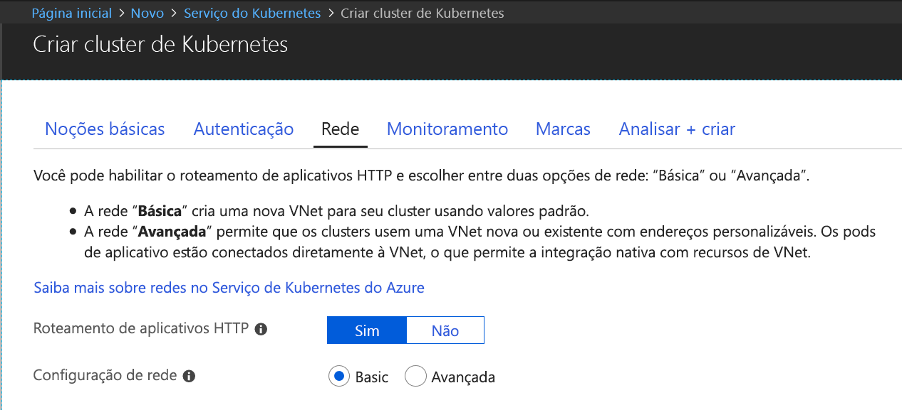
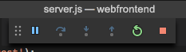

# <a name="quickstart-create-a-kubernetes-dev-space-with-azure-dev-spaces-nodejs"></a>Início Rápido: Criar um espaço de desenvolvimento Kubernetes com o Azure Dev Spaces (Node.js)

Neste guia, você aprenderá a:

- Configure o Azure Dev Spaces com um cluster Kubernetes gerenciado no Azure.
- Desenvolver código em containers iterativamente usando o VS Code e a linha de comando.
- Depure o código em execução no cluster.

> [!Note]
> **Caso tenha problemas** a qualquer momento, consulte a seção [Solução de problemas](troubleshooting.md) ou poste um comentário nesta página. Você também pode experimentar um [tutorial](get-started-nodejs.md) mais detalhado.

## <a name="prerequisites"></a>Pré-requisitos

- Uma assinatura do Azure. Caso não tenha uma assinatura do Azure, é possível criar uma [conta gratuita](https://azure.microsoft.com/free).
- Um [cluster do Kubernetes](https://ms.portal.azure.com/#create/microsoft.aks) executando o Kubernetes 1.9.6 ou posterior, nas regiões EastUS, CentralUS, WestUS2, WestEurope, CanadaCentral ou CanadaEast, com o **Roteamento de Aplicativo Http** habilitado.

  

- Visual Studio Code, que pode ser baixado [aqui](https://code.visualstudio.com/download).

## <a name="set-up-azure-dev-spaces"></a>Configurar o Azure Dev Spaces

A CLI do Azure e a extensão do Azure Dev Spaces podem ser instalados e executados em computadores Windows, Mac ou Linux. Para o Linux, há suporte para as seguintes distribuições: Ubuntu (18.04, 16.04 e 14.04), Debian 8 e 9, RHEL 7, Fedora 26 +, CentOS 7, openSUSE 42.2 e SLES 12.

Siga estas etapas para configurar o Azure Dev Spaces:

1. Instale a [CLI do Azure](/cli/azure/install-azure-cli?view=azure-cli-latest) (versão 2.0.43 ou superior).
1. Configure o Dev Spaces no seu cluster do AKS: `az aks use-dev-spaces -g MyResourceGroup -n MyAKS`
1. Baixe a [extensão do Azure Dev Spaces](https://marketplace.visualstudio.com/items?itemName=azuredevspaces.azds) para o VS Code. Clique em Instalar uma vez na página do Marketplace da extensão e novamente no VS Code.

## <a name="build-and-run-code-in-kubernetes"></a>Compilar e executar um código no Kubernetes

1. Baixe o exemplo de código no GitHub: [https://github.com/Azure/dev-spaces](https://github.com/Azure/dev-spaces) 
1. Altere o diretório para a pasta webfrontend: `cd dev-spaces/samples/nodejs/getting-started/webfrontend`
1. Gere os ativos de gráfico de Docker e Helm: `azds prep --public`
1. Compile e execute o seu código no AKS. Na janela do terminal da **pasta webfrontend**, execute este comando: `azds up`
1. Examine a saída do console para obter informações sobre a URL pública criada com o comando `up`. Ela estará neste formato: 

   ```output
   (pending registration) Service 'webfrontend' port 'http' will be available at <url>
   Service 'webfrontend' port 80 (TCP) is available at http://localhost:<port>
   ```

   Abra essa URL em uma janela do navegador e você deverá ver o aplicativo Web ser carregado. Conforme o contêiner é executado, a saída de `stdout` e `stderr` é transmitida para a janela do terminal.
   
   > [!Note]
   > Na primeira execução, pode demorar vários minutos para o DNS público estar pronto. Se a URL pública não for resolvida, você poderá usar a URL http://localhost:<portnumber> alternativa, exibida na saída do console. Se você usar a URL de host local, poderá parecer que o contêiner está sendo executado localmente, mas, na verdade, ele está sendo executado no AKS. Para sua conveniência e para facilitar a interação com o serviço em sua máquina local, o Azure Dev Spaces cria um túnel SSH temporário para o contêiner em execução no Azure. Você poderá voltar e experimentar a URL pública quando o registro DNS estiver pronto.

### <a name="update-a-content-file"></a>Atualizar um arquivo de conteúdo
O Azure Dev Spaces não serve apenas para executar o código em Kubernetes; ele também serve para permitir que você veja as alterações de código entrarem em vigor de forma rápida e iterativa em um ambiente Kubernetes na nuvem.

1. Localize o arquivo `./public/index.html` e edite o HTML. Por exemplo, altere a cor da tela de fundo da página para um tom de azul:

    ```html
    <body style="background-color: #95B9C7; margin-left:10px; margin-right:10px;">
    ```

1. Salve o arquivo. Em seguida, na janela do Terminal, você verá uma mensagem informando que um arquivo no contêiner em execução foi atualizado.
1. Volte para o navegador e atualize a página. Você verá a cor atualizada.

O que aconteceu? Edições em arquivos de conteúdo, como HTML e CSS, não exigem a reinicialização do processo do Node.js em portanto, um comando `azds up` ativo sincronizam automaticamente os arquivos de conteúdo modificados diretamente no contêiner em execução no Azure, permitindo uma maneira rápida de ver suas edições de conteúdo.

### <a name="test-from-a-mobile-device"></a>Testar de um dispositivo móvel
Abra o aplicativo Web em um dispositivo móvel usando a URL pública para webfrontend. Você deseja copiar e enviar a URL do desktop para seu dispositivo para evitar a inserção do endereço longo. Quando o aplicativo Web é carregado em um dispositivo móvel, você verá que a interface do usuário não é exibida corretamente em um dispositivo pequeno.

Para corrigir isso, adicione uma metamarca `viewport`:
1. Abra o arquivo `./public/index.html`
1. Adicione uma metamarca `viewport` ao elemento `head` existente:

    ```html
    <head>
        <!-- Add this line -->
        <meta name="viewport" content="width=device-width, initial-scale=1">
    </head>
    ```

1. Salve o arquivo.
1. Atualize o navegador do dispositivo. Agora você deve ver o aplicativo Web renderizado corretamente. 

Este é um exemplo de como alguns problemas não são encontramos até que você teste os dispositivos onde o aplicativo deverá ser usado. Com o Azure Dev Spaces, você pode iterar em seu código rapidamente e validar as alterações nos dispositivos de destino.

### <a name="update-a-code-file"></a>Atualizar um arquivo de código
A atualização dos arquivos de código do lado do servidor exige um pouco mais de trabalho, já que um aplicativo Node.js precisa ser reiniciado.

1. Na janela do terminal, pressione `Ctrl+C` (para parar `azds up`).
1. Abra o arquivo de código chamado `server.js` e edite a mensagem de saudação do serviço: 

    ```javascript
    res.send('Hello from webfrontend running in Azure!');
    ```

3. Salve o arquivo.
1. Execute `azds up` na janela do terminal. 

Isso recria a imagem de contêiner e reimplanta o gráfico Helm. Recarregue a página do navegador para ver as alterações de código em vigor.

Mas existe um *método ainda mais rápido* para desenvolver código, que você irá explorar na próxima seção. 

## <a name="debug-a-container-in-kubernetes"></a>Depurar um contêiner no Kubernetes

Nesta seção, você usará o VS Code para depurar diretamente depurar nosso contêiner em execução no Azure. Você também aprenderá a obter um loop de edição, execução e teste mais rápido.


### <a name="initialize-debug-assets-with-the-vs-code-extension"></a>Inicialize os recursos de depuração com a extensão do VS Code
Primeiro, é necessário configurar o projeto de código para que o VS Code comunique-se com o espaço de desenvolvimento no Azure. A extensão do VS Code para o Azure Dev Spaces fornece um comando auxiliar para configurar a configuração de depuração. 

Abra a **Paleta de Comandos** (usando o menu **Exibir | Paleta de Comandos**) e use o preenchimento automático para digitar e selecionar este comando: `Azure Dev Spaces: Prepare configuration files for Azure Dev Spaces`.

Isso adiciona a configuração de depuração para o Azure Dev Spaces na pasta `.vscode`. Esse comando não é deve ser confundido com o `azds prep`, que configura o projeto para a implantação.


### <a name="select-the-azds-debug-configuration"></a>Selecionar a configuração de depuração AZDS
1. Para abrir o modo de exibição Depuração, clique no ícone Depuração na **Barra de Atividades** no lado do VS Code.
1. Selecione **Iniciar Programa (AZDS)** como a configuração de depuração ativa.


> [!Note]
> Se você não vir comandos do Azure Dev Spaces na Paleta de Comandos, verifique se instalou a extensão do VS Code para o Azure Dev Spaces.

### <a name="debug-the-container-in-kubernetes"></a>Depurar o contêiner no Kubernetes
Pressione **F5** para depurar seu código no Kubernetes!

Semelhante ao comando `up`, o código é sincronizado com o espaço de desenvolvimento quando você inicia a depuração, e um contêiner é criado e implantado no Kubernetes. Desta vez, o depurador está anexado ao contêiner remoto.

> [!Tip]
> A barra de status do VS Code exibirá uma URL clicável.

Defina um ponto de interrupção em um arquivo de código do lado do servidor, por exemplo, dentro de `app.get('/api'...` em `server.js`. Atualize a página do navegador ou pressione o botão 'Diga Novamente' para poder alcançar o ponto de interrupção e poder percorrer o código.

Você tem acesso completo às informações de depuração exatamente como teria se o código fosse executado localmente, por exemplo, a pilha de chamadas, as variáveis locais, as informações de exceção etc.

### <a name="edit-code-and-refresh-the-debug-session"></a>Editar código e atualizar a sessão de depuração
Com o depurador ativo, edite o código. Por exemplo, modifique a mensagem de saudação novamente:

```javascript
app.get('/api', function (req, res) {
    res.send('**** Hello from webfrontend running in Azure! ****');
});
```

Salve o arquivo e, no **painel Ações de depuração**, clique no botão **Atualizar**. 



Em vez de recompilar e reimplantar uma nova imagem de contêiner sempre que houver edições de código, o que geralmente levará um tempo considerável, o Azure Dev Spaces reiniciará o processo do Node.js entre as sessões de depuração para fornecer um loop de edição/depuração mais rápido.

Atualize o aplicativo Web no navegador ou pressione o botão *Diga Novamente*. Sua mensagem personalizada deverá aparecer na interface de usuário.

### <a name="use-nodemon-to-develop-even-faster"></a>Use NodeMon para desenvolver ainda mais rapidamente

O projeto `webfrontend` de exemplo foi configurado para usar [nodemon](https://nodemon.io/), uma ferramenta popular para acelerar o desenvolvimento de Node.js que é totalmente compatível com o Azure Dev Spaces.

Experimente as etapas a seguir:
1. Pare o depurador do VS Code.
1. Clique no ícone Depuração na **Barra de Atividades** no lado do VS Code. 
1. Selecione **Anexar (AZDS)** como a configuração de depuração ativa.
1. Pressione F5.

Nessa configuração, o contêiner está configurado para iniciar o *nodemon*. Quando forem feitas edições de código do servidor, *nodemon* reinicia automaticamente o processo do Node, assim como faz quando desenvolve localmente. 
1. Edite a mensagem de saudação novamente em `server.js` e salve o arquivo.
1. Atualize o navegador ou clique no botão *Diga novamente* para ver as alterações entrarem em vigor!

**Agora você tem um método para iterar em código rapidamente e depurar diretamente no Kubernetes!**

## <a name="next-steps"></a>Próximas etapas

> [!div class="nextstepaction"]
> [Trabalhando com vários contêineres e desenvolvimento em equipe](team-development-nodejs.md)
