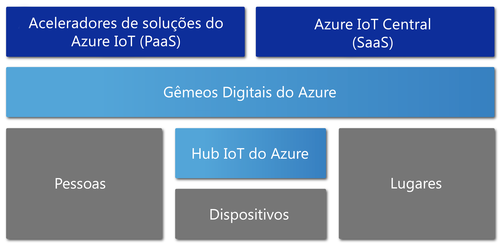

# Visão geral dos Gêmeos Digitais do Azure

Os Gêmeos Digitais do Azure são um serviço de IoT do Azure que cria modelos abrangentes do ambiente físico. Entre seus diversos recursos está a capacidade de criar grafos de inteligência espacial para modelar relações e interações entre pessoas, espaços e dispositivos.

Os Gêmeos Digitais do Azure permitem consultar dados de um espaço físico em vez de vários sensores diferentes. Esse serviço ajuda você a criar experiências reutilizáveis, altamente escalonáveis e com reconhecimento espacial que vinculam os dados de streaming entre o mundo digital e o mundo físico. Quer você esteja prevendo necessidades de manutenção de uma fábrica, analisando requisitos de energia em tempo real de uma rede elétrica ou otimizando o uso do espaço disponível de um escritório, seus aplicativos são aprimorados por esses recursos contextuais exclusivamente relevantes.

Os Gêmeos Digitais do Azure aplicam-se a todos os tipos de ambientes, por exemplo, armazéns, escritórios, escolas, hospitais, bancos, estádios, fábricas, estacionamentos, parques, redes elétricas inteligentes e cidades. Pense em cenários como o acompanhamento diário da temperatura em vários estados, o monitoramento de caminhos de drones com muito tráfego, a identificação de veículos autônomos, a análise dos níveis de ocupação de um edifício ou a localização da caixa registradora com maior movimento em sua loja. Seja qual for seu cenário comercial no mundo real, uma instância digital correspondente pode ser provisionada com os Gêmeos Digitais do Azure.

O vídeo abaixo se aprofunda mais sobre os Gêmeos Digitais:

> [!VIDEO https://www.youtube.com/embed/TvN_NxpgyzQ]

## Principais recursos

Os principais recursos dos Gêmeos Digitais do Azure incluem:

### Grafo de inteligência espacial

O [*grafo de inteligência espacial*](./concepts-objectmodel-spatialgraph.md), ou *grafo espacial*, é uma representação virtual do ambiente físico que permite modelar as relações entre pessoas, lugares e dispositivos.

Pense em um aplicativo de serviços essenciais inteligente que pode envolver vários medidores de uso de energia conectados em uma vizinhança. Para monitorar e prever a cobrança e o uso de energia com precisão, a concessionária de serviços essenciais inteligente deve modelar cada dispositivo e sensor com o contexto sobre o local e o cliente que será cobrado. O grafo de inteligência espacial permite modelar esses tipos de relações complexas.

### Modelos de objeto dos Gêmeos Digitais

[Modelos de objeto dos Gêmeos Digitais](./concepts-objectmodel-spatialgraph.md) são esquemas de dados e protocolos de dispositivo predefinidos que se alinham às necessidades específicas do domínio de sua solução para acelerar e simplificar o desenvolvimento.

Por exemplo, um aplicativo de ocupação de espaço pode usar tipos predefinidos de espaço, como campus, prédio, andar, sala, etc.

### Locatários múltiplos e aninhados

Você pode criar soluções que podem ser dimensionadas com segurança e reutilizadas para vários locatários. Você também pode criar vários sublocatários que podem ser acessados e usados de maneira segura e isolada.

Por exemplo, um aplicativo de utilização de espaço pode ser configurado para isolar dados de um locatário dos dados de outros locatários em um único prédio, ou para combinar dados de um único locatário em vários prédios.

### Recursos de computação avançada

Os recursos de computação avançados chamados [funções definidas pelo usuário](./concepts-user-defined-functions.md) permitem que você defina e execute funções personalizadas em relação a [dados de dispositivo](./concepts-device-ingress.md) de entrada para enviar sinais a pontos de extremidade predefinidos. Esse recurso melhora a personalização e a automação de tarefas de dispositivos.

Por exemplo, um aplicativo de agricultura inteligente poderia incluir uma função definida pelo usuário para avaliar as leituras do sensor de umidade do solo, bem como a previsão do tempo e, em seguida, enviar sinais sobre a necessidade de irrigação.

### Controle de acesso interno

Recursos de gerenciamento de acesso e identidade, como o [controle de acesso baseado em função](./security-role-based-access-control.md) e o [Azure Active Directory](./security-authenticating-apis.md), permitem que você controle o acesso de pessoas e dispositivos de forma segura.

Por exemplo, um aplicativo de gerenciamento de instalações pode ser configurado para permitir que os ocupantes de uma sala definam a temperatura dentro de um intervalo especificado e que os gerentes das instalações possam definir qualquer valor de temperatura.

### Ecossistema

Você pode conectar uma instância dos Gêmeos Digitais do Azure a muitos serviços avançados do Azure, incluindo: serviços do Azure Stream Analytics, inteligência artificial e Armazenamento, bem como os Azure Mapas, a Realidade Misturada da Microsoft, o Dynamics 365 ou o Office 365.

Por exemplo, um aplicativo de prédio inteligente pode usar os Gêmeos Digitais do Azure para representar equipes e dispositivos localizados em vários andares. Como os dispositivos transmitem dados dinâmicos para a instância de Gêmeos Digitais provisionada, o Azure Stream Analytics pode processar esses dados para fornecer insights acionáveis importantes. Em seguida, os dados podem ser armazenados no Armazenamento do Azure e convertidos em um formato de arquivo compartilhável que pode ser distribuído em toda a organização usando o Office 365.

## Soluções que se beneficiam dos Gêmeos Digitais do Azure

Os Gêmeos Digitais do Azure são úteis para representar o mundo físico e seus vários relacionamentos, pois eles simplificam a modelagem, o processamento de dados, a manipulação de eventos e o controle de dispositivos IoT. Considere apenas alguns dos cenários abaixo, em vários setores, que se beneficiam de seu uso:

* Mostrar a uma empresa de gestão de propriedades os níveis de ocupação de um espaço ao longo do tempo para obter insights sobre as melhores maneiras de configurar o prédio comercial.
* Disparar tíquetes de ordem de serviço para um aplicativo móvel que orienta o envio de seguranças, o agendamento de serviços da equipe de manutenção e outros serviços em um espaço de varejo ou locais de eventos esportivos.
* Mostrar a um ocupante do prédio quais salas estão ocupadas em um prédio em tempo real. Em seguida, ajudar o ocupante a reservar espaços de trabalho que atendam às suas necessidades.
* Controlar onde os ativos estão localizados em um determinado espaço.
* Otimizar a carga de um veículo elétrico modelando as preferências do usuário e as restrições da rede elétrica.

## Gêmeos Digitais do Azure no contexto de outros serviços de IoT

Os Gêmeos Digitais do Azure usam o Hub IoT do Azure para conectar os dispositivos de IoT e os sensores que mantêm tudo atualizado com o mundo físico. O diagrama abaixo mostra como os Gêmeos Digitais do Azure se relacionam com outros serviços de IoT do Azure:

Para obter uma descrição mais detalhada sobre o resto do ecossistema de IoT, consulte [Tecnologias e soluções de IoT do Azure](https://docs.microsoft.com/azure/iot-fundamentals/iot-services-and-technologies).

## Próximas etapas

Vá para uma breve demonstração dos recursos dos Gêmeos Digitais do Azure:

> [!div class="nextstepaction"]
> [Início Rápido: Encontrar salas disponíveis usando os Gêmeos Digitais do Azure](./quickstart-view-occupancy-dotnet.md)

Aprofunde seus conhecimentos em um aplicativo de gerenciamento de instalações usando os Gêmeos Digitais do Azure:

> [!div class="nextstepaction"]
> [Tutorial: Implantar os Gêmeos Digitais do Azure e configurar um grafo espacial](./tutorial-facilities-setup.md)

Saiba mais sobre os principais conceitos dos Gêmeos Digitais do Azure:

> [!div class="nextstepaction"]
> [Noções básicas sobre modelo de objeto e grafo de inteligência espacial dos Gêmeos Digitais](./concepts-objectmodel-spatialgraph.md)
