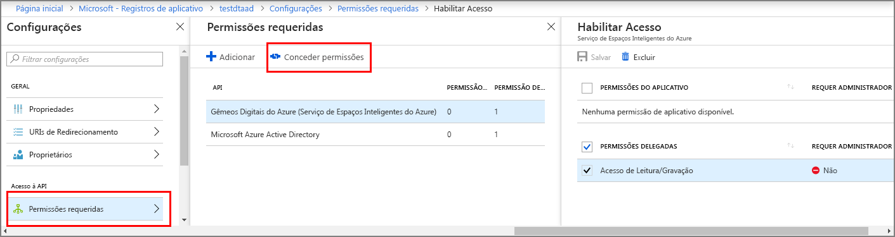

# <a name="how-to-configure-postman-for-azure-digital-twins"></a>Como configurar o Postman para os Gêmeos Digitais do Azure

Este artigo descreve como configurar o cliente Postman REST para interagir e testar APIs de Gerenciamento dos Gêmeos Digitais do Azure. Especificamente, ele descreve:

* Como configurar um aplicativo do Azure Active Directory para usar o fluxo de concessão implícita do OAuth 2.0.
* Como usar o cliente Postman REST para fazer solicitações HTTP de influência de token para suas APIs de gerenciamento.
* Como usar o Postman para fazer solicitações POST com várias partes para suas APIs de gerenciamento.

## <a name="postman-summary"></a>Resumo do Postman

Começar em nos Gêmeos Digitais do Azure usando uma ferramenta de cliente REST como [Postman](https://www.getpostman.com/) para preparar seu ambiente de teste local. O cliente Postman ajuda a criar rapidamente as solicitações HTTP complexas. Faça o download da versão da área de trabalho do cliente Postman acessando [www.getpostman.com/apps](https://www.getpostman.com/apps).

[Postman](https://www.getpostman.com/) é uma ferramenta de teste REST que localiza as funcionalidades de solicitação HTTP principal na área de trabalho útil e GUI baseado em plugin. 

Por meio do cliente Postman, os desenvolvedores de soluções podem especificar o tipo de solicitação HTTP (*POST*, *GET*, *UPDATE*, *PATCH* e *DELETE*), ponto de extremidade de API para a chamada e o uso de SSL. O Postman também dá suporte para adicionar cabeçalhos de solicitação HTTP, parâmetros, dados de formulário e corpos.

## <a name="configure-azure-active-directory-to-use-the-oauth-20-implicit-grant-flow"></a>Configurar o Azure Active Directory para usar o fluxo de concessão implícita do OAuth 2.0

Configurar seu aplicativo Azure Active Directory para usar o fluxo de concessão implícita OAuth 2.0.

1. Siga as etapas neste [início rápido](https://docs.microsoft.com/azure/active-directory/develop/quickstart-v1-integrate-apps-with-azure-ad) para criar um aplicativo do Azure Active Directory do tipo Nativo. Ou você pode reutilizar um registro de aplicativo Nativo.

1. Sob **permissões necessárias**, selecione **Add** e insira **Gêmeos Digitais do Azure** sob **adicionar acesso à API**. Se sua pesquisa não localizar a API, pesquise por **Espaços Inteligentes do Azure** em vez disso. Em seguida, selecione **conceder permissões > permissões delegadas** e **feito**.

    

1. Clique em **Manifesto** para abrir o manifesto do aplicativo para seu aplicativo. Definir *oauth2AllowImplicitFlow* para `true`.

      ![Fluxo implícito do Azure Active Directory][1]

1. Configurar uma **URL de Resposta** para `https://www.getpostman.com/oauth2/callback`.

      ![URL de Resposta do Azure Active Directory][2]

1. Copie e mantenha a **ID do Aplicativo** do seu aplicativo do Azure Active Directory. Ele é usado nas etapas a seguir.

## <a name="obtain-an-oauth-20-token"></a>Obter um token do OAuth 2.0

Em seguida, configure e instale o Postman para obter um token do Azure Active Directory. Em seguida, faça uma solicitação HTTP autenticada para os Gêmeos Digitais do Azure usando o token adquirido:

1. Vá para [www.getpostman.com](https://www.getpostman.com/) para baixar o aplicativo.
1. Verifique se sua **URL de Autorização** está correta. Deve pegar o formato:

    ```plaintext
    https://login.microsoftonline.com/YOUR_AZURE_TENANT.onmicrosoft.com/oauth2/authorize?resource=0b07f429-9f4b-4714-9392-cc5e8e80c8b0
    ```

    | NOME  | Substitua por | Exemplo |
    |---------|---------|---------|
    | YOUR_AZURE_TENANT | O nome do seu locatário ou organização | `microsoft` |

1. Selecione a guia **Autorização**, selecione **OAuth 2.0** e, em seguida, selecione **Obter novo token de acesso**.

    | Campo  | Value |
    |---------|---------|
    | Tipo de concessão | `Implicit` |
    | URL de retorno de chamada | `https://www.getpostman.com/oauth2/callback` |
    | URL de autenticação | Use a **URL de Autorização** da etapa 2 |
    | ID do cliente | Use a **ID do Aplicativo** para o aplicativo do Azure Active Directory criado ou redefinido da seção anterior |
    | Escopo | Deixar em branco |
    | Estado | Deixar em branco |
    | Autenticação de cliente | `Send as Basic Auth header` |

1. Agora, o cliente deve se parecer com:

   ![Exemplo de cliente Postman][3]

1. Selecione **Solicitação de Token**.

    >[!TIP]
    >Se você receber a mensagem de erro "OAuth 2 não pôde ser concluído", tente o seguinte:
    > * Feche o Postman e reabra-o e tente novamente.
  
1. Role para baixo e selecione **uso Token**.

<div id="multi"></div>

## <a name="make-a-multipart-post-request"></a>Fazer uma solicitação POST com várias partes

Depois de concluir as etapas anteriores, configure o Postman para fazer uma solicitação POST com várias partes HTTP autenticada:

1. Na guia **Cabeçalho**, adicione uma chave do cabeçalho da solicitação HTTP **Content-Type** com valor `multipart/mixed`.

   ![Tipo de conteúdo com várias partes/misto][4]

1. Serialize dados não textuais em arquivos. Os dados JSON seriam salvos como um arquivo JSON.
1. Na guia **Corpo**, adicione cada arquivo atribuindo um nome de **chave**, selecionando `file` ou `text`.
1. Em seguida, selecione cada arquivo por meio do botão **Escolher arquivo**.

   ![Exemplo de cliente Postman][5]

   >[!NOTE]
   > * O cliente Postman não requer que as partes com várias partes tenham um **Content-Type** ou **Content-Disposition** atribuído manualmente.
   > * Você não precisará especificar esses cabeçalhos para cada parte.
   > * É necessário selecionar `multipart/mixed` ou outro **Content-Type** adequado para a solicitação inteira.

1. Por fim, clique em **Enviar** para enviar sua solicitação POST HTTP com várias partes.

## <a name="next-steps"></a>Próximas etapas

- Para saber mais sobre as APIs de gerenciamento dos Gêmeos Digitais do Azure e como usá-las, leia [Como usar as APIs de Gerenciamento dos Gêmeos Digitais do Azure](how-to-navigate-apis.md).

- Usar solicitações com várias partes para [adicionar blobs às entidades dos Gêmeos Digitais do Azure](./how-to-add-blobs.md).

- Para saber mais sobre autenticar as APIs de Gerenciamento, leia [Autenticar com APIs](./security-authenticating-apis.md).

<!-- Images -->
[1]: media/how-to-configure-postman/implicit-flow.png
[2]: media/how-to-configure-postman/reply-url.png
[3]: media/how-to-configure-postman/postman-oauth-token.png
[4]: media/how-to-configure-postman/content-type.png
[5]: media/how-to-configure-postman/form-body.png