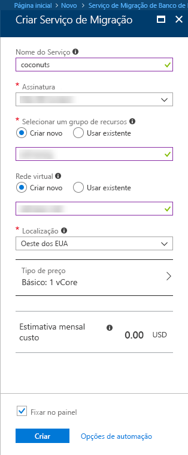
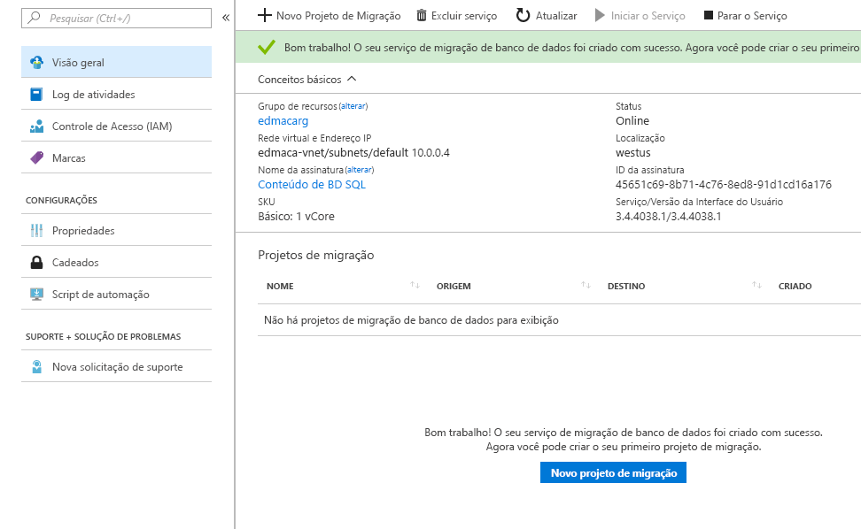

# Criar uma instância do Serviço de Migração de Banco de Dados do Azure usando o Portal do Azure
Nesse início rápido, use o Portal do Azure para criar uma instância do Serviço de Migração de Banco de Dados do Azure.  Depois de criar o serviço, será possível usá-lo para migrar dados do SQL Server no local para um banco de dados do SQL do Azure.

Se você não tiver uma assinatura do Azure, crie uma conta [gratuita](https://azure.microsoft.com/free/) antes de começar.

## Faça logon no Portal do Azure
Primeiro, abra seu navegador da Web e navegue até o [portal do Microsoft Azure](https://portal.azure.com/). Insira suas credenciais para entrar no portal. A exibição padrão é o painel de serviço.

## Criar o Serviço de Migração de Banco de Dados do Azure
1. Clique em **+** para criar um novo serviço.  Serviço de migração de banco de dados em versão prévia.  

1. No marketplace, pesquise por "migração", selecione "Serviço de migração de banco de dados (versão prévia)" e clique em **criar**.

    

    - Escolha um **Nome de serviço** que seja fácil de lembrar e exclusivo para identificar sua instância de Serviço de Migração de Banco de Dados do Azure.
    - Selecione sua **Assinatura** do Azure na qual você deseja criar o Serviço de migração de banco de dados.
    - Crie uma nova **Rede** com um nome exclusivo.
    - Escolha o **Local** mais próximo ao seu servidor de origem ou de destino.
    - Selecione Básico: 1 vCore como **Tipo de preço**.

1. Clique em **Criar**.

Após alguns instantes, seu Serviço de Migração de Banco de Dados do Azure será criado e estará pronto para uso.  Você verá o Serviço de migração do banco de dados conforme mostrado na imagem.

## Limpar recursos
Você pode limpar todos os recursos criados no início rápido excluindo o [Grupo de recursos do Azure](../azure-resource-manager/resource-group-overview.md).  Para excluir o grupo de recursos, navegue até o Serviço de migração de banco de dados que você criou, clique no nome do **Grupo de recursos** e selecione **Excluir grupo de recursos**.  Essa ação exclui todos os ativos no grupo de recursos, bem como o grupo em si.

## Próximas etapas
> [!div class="nextstepaction"]
> [Migrar SQL Server local para BD SQL do Azure](tutorial-sql-server-to-azure-sql.md)