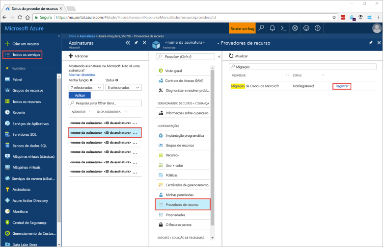
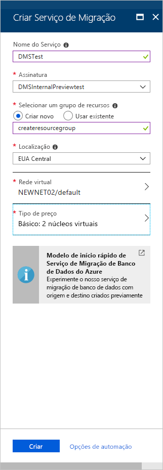

# Início Rápido: Criar uma instância do Serviço de Migração de Banco de Dados do Azure usando o Portal do Azure
Nesse Início Rápido, use o Portal do Azure para criar uma instância do Serviço de Migração de Banco de Dados do Azure.  Depois de criar o serviço, pode usá-lo para migrar dados do SQL Server no local para um banco de dados SQL do Azure.

Se você não tiver uma assinatura do Azure, crie uma conta [gratuita](https://azure.microsoft.com/free/) antes de começar.

## Faça logon no Portal do Azure
Abra seu navegador da Web, navegue até o [portal do Microsoft Azure](https://portal.azure.com/) e insira suas credenciais para entrar no portal.

A exibição padrão é o painel de serviço.

## Registre o provedor de recursos
Registre o provedor de recursos Microsoft.DataMigration antes de criar sua primeira instância do Serviço de Migração de Banco de Dados.

1. No portal do Azure, selecione **Todos os serviços**e, em seguida, selecione **Assinaturas**.

2. Selecione a assinatura na qual você deseja criar a instância do Serviço de Migração do Banco de Dados do Azure e, em seguida, selecione **Provedores de recursos**.

3. Pesquise por migração e, em seguida, à direita do **Microsoft.DataMigration**, selecione **Registrar**.

    

## Crie uma instância do serviço
1. Selecione +**Criar um recurso** para criar uma instância do Serviço de Migração de Banco de Dados do Azure.

2. Pesquise "migração" no marketplace, selecione **Serviço de Migração de Banco de Dados do Azure** e, em seguida, na tela **Serviço de Migração de Banco de Dados do Azure**, selecione **Criar**.

3. Na tela **Criar Serviço de Migração**: 

    - Escolha um **Nome de Serviço** que seja fácil de lembrar e exclusivo para identificar sua instância do Serviço de Migração de Banco de Dados do Azure.
    - Selecione a **Assinatura** do Azure na qual quer criar a instância.
    - Selecione um **Grupo de Recursos** existente ou crie um novo.
    - Escolha o **Local** mais próximo ao seu servidor de origem ou de destino.
    - Selecione uma **Rede virtual** (VNET) existente ou crie uma nova.

        A VNET fornece ao Serviço de Migração de Banco de Dados do Azure acesso ao banco de dados de origem e ao ambiente de destino.

        Para saber mais sobre como criar uma VNET no portal do Azure, consulte o artigo [Criar uma rede virtual usando o portal do Azure](https://aka.ms/vnet).

    - Selecione Básico: 1 vCore como **Tipo de preço**.

        

4. Selecione **Criar**.

    Após alguns instantes, sua instância do Serviço de Migração de Banco de Dados do Azure é criado e estará pronto para uso. O Serviço de Migração do Banco de Dados exibe conforme mostrado na imagem seguinte:

    

## Limpar recursos
Você pode limpar todos os recursos criados nesse início rápido excluindo o [Grupo de recursos do Azure](../azure-resource-manager/resource-group-overview.md). Para excluir o grupo de recursos, navegue até a instância do Serviço de Migração de Banco de Dados do Azure que você criou. Selecione o nome do **Grupo de recursos** e selecione **Excluir grupo de recursos**. Essa ação exclui todos os ativos no grupo de recursos, bem como o grupo em si.

## Próximas etapas
> [!div class="nextstepaction"]
> [Migrar SQL Server local para o Banco de Dados SQL do Azure](tutorial-sql-server-to-azure-sql.md)