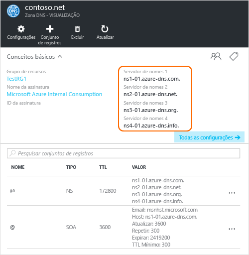

# <a name="delegate-a-domain-to-azure-dns"></a>Delegar um domínio ao Azure DNS

O Azure DNS permite hospedar uma zona DNS e gerenciar os registros DNS para um domínio no Azure. Para que consultas DNS para um domínio acessem o Azure DNS, o domínio deve ser delegado ao Azure DNS por meio do domínio pai. Tenha em mente que o Azure DNS não é o registrador de domínio. Este artigo explica como delegar seu domínio para o DNS do Azure.

Para domínios comprados de um registrador, seu registrador oferece a opção de configurar esses registros NS. Você não precisa ter um domínio para criar uma zona DNS com esse nome de domínio no DNS do Azure. No entanto, você precisa ter o domínio para poder configurar a delegação para o Azure DNS com o registrador.

Por exemplo, suponha que você compre o domínio 'contoso.net' e crie uma zona chamada 'contoso.net' no DNs do Azure. Como o proprietário do domínio, seu registrador oferece a opção de configurar os endereços de servidor de nomes (ou seja, os registros NS) para seu domínio. O registrador armazena esses registros NS no domínio pai, neste caso, '.net'. Os clientes em todo o mundo podem ser direcionados ao seu domínio na zona DNS do Azure ao tentar resolver os registros DNS em 'contoso.net'.

## <a name="create-a-dns-zone"></a>Criar uma zona DNS

1. Entrar no Portal do Azure
1. No menu Hub, clique em **Novo > Rede >**, em seguida, clique em **Zona DNS** para abrir a folha Criar zona DNS.

    

1. Na folha **Criar zona DNS**, insira os seguintes valores e clique em **Criar**:

   | **Configuração** | **Valor** | **Detalhes** |
   |---|---|---|
   |**Nome**|contoso.net|O nome da zona DNS|
   |**Assinatura**|[Sua assinatura]|Selecione uma assinatura na qual o gateway de aplicativo será criado.|
   |**Grupo de recursos**|**Criar um novo:** contosoRG|Crie um grupos de recursos. O nome do grupo de recursos deve ser exclusivo na assinatura selecionada. Para saber mais sobre grupos de recursos, leia o artigo [Visão geral do Gerenciador de Recursos](../azure-resource-manager/resource-group-overview.md?toc=%2fazure%2fdns%2ftoc.json#resource-groups).|
   |**Localidade**|Oeste dos EUA||

> [!NOTE]
> O grupo de recursos se refere ao local do grupo de recursos e não tem impacto sobre o local da zona DNS. O local da zona DNS sempre é "global" e não é exibido.

## <a name="retrieve-name-servers"></a>Recuperar servidores de nome

Antes que você possa delegar a zona DNS ao Azure DNS, precisará saber os nomes do servidor de nomes para sua zona. O Azure DNS aloca os servidores de nomes de um pool sempre que uma zona é criada.

1. Com a zona DNS criada, no painel **Favoritos** do portal do Azure, clique em **Todos os recursos**. Clique na zona DNS **contoso.net** na folha **Todos os recursos**. Se a assinatura que você selecionou já contém vários recursos, você pode inserir **contoso.net** na caixa Filtrar por nome... para acessar facilmente o gateway de aplicativo. 

1. Recupere os servidores de nomes da folha da zona DNS. Neste exemplo, os servidores de nomes 'ns1-01.azure-dns.com', 'ns2-01.azure-dns .net', 'ns3-01.azure-dns.org' e 'ns4-01.azure-dns.info' foram atribuídos à zona 'contoso.net':

 

O Azure DNS cria automaticamente os registros NS autoritativos na zona que contém os servidores de nomes atribuídos.  Para ver os nomes de servidor de nomes por meio do Azure PowerShell ou da CLI do Azure, bastará obter esses registros.

Os exemplos a seguir também fornecem as etapas para recuperar os servidores de nomes para uma zona no DNS do Azure com o PowerShell e a CLI do Azure.

### <a name="powershell"></a>PowerShell

```powershell
# The record name "@" is used to refer to records at the top of the zone.
$zone = Get-AzureRmDnsZone -Name contoso.net -ResourceGroupName contosoRG
Get-AzureRmDnsRecordSet -Name "@" -RecordType NS -Zone $zone
```

O exemplo a seguir é a resposta.

```
Name              : @
ZoneName          : contoso.net
ResourceGroupName : contosorg
Ttl               : 172800
Etag              : 03bff8f1-9c60-4a9b-ad9d-ac97366ee4d5
RecordType        : NS
Records           : {ns1-07.azure-dns.com., ns2-07.azure-dns.net., ns3-07.azure-dns.org.,
                    ns4-07.azure-dns.info.}
Metadata          :
```

### <a name="azure-cli"></a>CLI do Azure

```azurecli
az network dns record-set list --resource-group contosoRG --zone-name contoso.net --type NS --name @
```

O exemplo a seguir é a resposta.

```json
{
  "etag": "03bff8f1-9c60-4a9b-ad9d-ac97366ee4d5",
  "id": "/subscriptions/00000000-0000-0000-0000-000000000000/resourceGroups/contosoRG/providers/Microsoft.Network/dnszones/contoso.net/NS/@",
  "metadata": null,
  "name": "@",
  "nsRecords": [
    {
      "nsdname": "ns1-07.azure-dns.com."
    },
    {
      "nsdname": "ns2-07.azure-dns.net."
    },
    {
      "nsdname": "ns3-07.azure-dns.org."
    },
    {
      "nsdname": "ns4-07.azure-dns.info."
    }
  ],
  "resourceGroup": "contosoRG",
  "ttl": 172800,
  "type": "Microsoft.Network/dnszones/NS"
}
```

## <a name="delegate-the-domain"></a>Delegar o domínio

Agora que a zona DNS é criada e você tem os servidores de nomes, o domínio pai precisa ser atualizado com os servidores de nome do DNS do Azure. Cada registrador tem suas próprias ferramentas de gerenciamento de DNS para alterar os registros de servidor de nomes para um domínio. Na página de gerenciamento do DNS do registrador, edite os registros NS e substitua-os por aqueles criados pelo Azure DNS.

Ao delegar um domínio ao Azure DNS, você deverá usar os nomes do servidor de nomes fornecidos pelo Azure DNS. É recomendável usar todos os quatro nomes de servidor de nomes, independentemente do nome do seu domínio. A delegação de domínio não requer que o nome do servidor use o mesmo domínio de nível superior do que seu domínio.

Você não deve usar 'registros cola' para apontar para endereços IP do servidor de nomes do Azure DNS, pois esses endereços IP podem mudar no futuro. Atualmente, o Azure DNS não dá suporte às delegações usando nomes do servidores de nomes em sua própria zona, às vezes chamados de 'servidores de nome intuitivos'.

## <a name="verify-name-resolution-is-working"></a>Verifique se a resolução de nomes está funcionando

Após concluir a delegação, você poderá verificar se a resolução de nomes está funcionando, usando uma ferramenta como 'nslookup' para consultar o registro SOA da zona (que também é criado automaticamente quando a zona é criada).

Você não precisa especificar os servidores de nomes do Azure DNS. Se a delegação foi configurada adequadamente, o processo normal de resolução DNS localiza os servidores de nomes automaticamente.

```
nslookup -type=SOA contoso.com
```

A seguir está um exemplo de resposta do comando anterior:

```
Server: ns1-04.azure-dns.com
Address: 208.76.47.4

contoso.com
primary name server = ns1-04.azure-dns.com
responsible mail addr = msnhst.microsoft.com
serial = 1
refresh = 900 (15 mins)
retry = 300 (5 mins)
expire = 604800 (7 days)
default TTL = 300 (5 mins)
```

## <a name="delegate-sub-domains-in-azure-dns"></a>Delegar subdomínios no DNS do Azure

Se você quiser configurar uma zona filho separada, poderá delegar um subdomínio no Azure DNS. Por exemplo, tendo configurado e delegado 'contoso.net' no DNS do Azure, suponha que você queira configurar uma zona filho separada, 'partners.contoso.net'.

1. Crie a zona filho 'partners.contoso.net' no DNS do Azure.
2. Pesquise os registros NS de autoridade na zona filho para obter os servidores de nomes que hospedam a zona filho no Azure DNS.
3. Delegue a zona filho ao configurar registros NS na zona pai que apontem para a zona filho.

### <a name="create-a-dns-zone"></a>Criar uma zona DNS

1. Entrar no Portal do Azure
1. No menu Hub, clique em **Novo > Rede >**, em seguida, clique em **Zona DNS** para abrir a folha Criar zona DNS.

    

1. Na folha **Criar zona DNS**, insira os seguintes valores e clique em **Criar**:

   | **Configuração** | **Valor** | **Detalhes** |
   |---|---|---|
   |**Nome**|partners.contoso.net|O nome da zona DNS|
   |**Assinatura**|[Sua assinatura]|Selecione uma assinatura na qual o gateway de aplicativo será criado.|
   |**Grupo de recursos**|**Usar existente:** contosoRG|Crie um grupos de recursos. O nome do grupo de recursos deve ser exclusivo na assinatura selecionada. Para saber mais sobre grupos de recursos, leia o artigo [Visão geral do Gerenciador de Recursos](../azure-resource-manager/resource-group-overview.md?toc=%2fazure%2fdns%2ftoc.json#resource-groups).|
   |**Localidade**|Oeste dos EUA||

> [!NOTE]
> O grupo de recursos se refere ao local do grupo de recursos e não tem impacto sobre o local da zona DNS. O local da zona DNS sempre é "global" e não é exibido.

### <a name="retrieve-name-servers"></a>Recuperar servidores de nome

1. Com a zona DNS criada, no painel **Favoritos** do portal do Azure, clique em **Todos os recursos**. Clique na zona DNS **partners.contoso.net** na folha **Todos os recursos**. Se a assinatura que você selecionou já contém vários recursos, você pode inserir **partners.contoso.net** na caixa Filtrar por nome... para acessar a Zona DNS facilmente.

1. Recupere os servidores de nomes da folha da zona DNS. Neste exemplo, os servidores de nomes 'ns1-01.azure-dns.com', 'ns2-01.azure-dns .net', 'ns3-01.azure-dns.org' e 'ns4-01.azure-dns.info' foram atribuídos à zona 'contoso.net':

 

O Azure DNS cria automaticamente os registros NS autoritativos na zona que contém os servidores de nomes atribuídos.  Para ver os nomes de servidor de nomes por meio do Azure PowerShell ou da CLI do Azure, bastará obter esses registros.

### <a name="create-name-server-record-in-parent-zone"></a>Criar registro de servidor de nomes na zona pai

1. Navegue até a zona DNS **contoso.net** no portal do Azure.
1. Clique em **+ Conjunto de registros**
1. Na folha **Adicionar conjunto de registros**, digite os valores abaixo e clique em **OK**:

   | **Configuração** | **Valor** | **Detalhes** |
   |---|---|---|
   |**Nome**|partners|O nome da zona DNS filho|
   |**Tipo**|NS|Use NS para os registros do servidor de nomes.|
   |**TTL**|1|Vida útil.|
   |**Unidade de TTL**|Horas|define a vida útil em horas|
   |**NAME SERVER**|{servidores de nome para a zona partners.contoso.net}|Insira todos os 4 dos servidores de nomes da zona partners.contoso.net. |

   


### <a name="delegating-sub-domains-in-azure-dns-with-other-tools"></a>Delegar subdomínios no DNS do Azure com outras ferramentas

Os exemplos a seguir fornecem as etapas para delegar subdomínios no DNS do Azure com o PowerShell e a CLI:

#### <a name="powershell"></a>PowerShell

O exemplo do PowerShell a seguir demonstra como isso funciona. As mesmas etapas podem ser executadas usando o portal do Azure ou por meio da CLI do Azure de plataforma cruzada.

```powershell
# Create the parent and child zones. These can be in same resource group or different resource groups as Azure DNS is a global service.
$parent = New-AzureRmDnsZone -Name contoso.net -ResourceGroupName contosoRG
$child = New-AzureRmDnsZone -Name partners.contoso.net -ResourceGroupName contosoRG

# Retrieve the authoritative NS records from the child zone as shown in the next example. This contains the name servers assigned to the child zone.
$child_ns_recordset = Get-AzureRmDnsRecordSet -Zone $child -Name "@" -RecordType NS

# Create the corresponding NS record set in the parent zone to complete the delegation. The record set name in the parent zone matches the child zone name, in this case "partners".
$parent_ns_recordset = New-AzureRmDnsRecordSet -Zone $parent -Name "partners" -RecordType NS -Ttl 3600
$parent_ns_recordset.Records = $child_ns_recordset.Records
Set-AzureRmDnsRecordSet -RecordSet $parent_ns_recordset
```

Use `nslookup` para verificar se tudo está configurado corretamente examinando o registro SOA da zona filho.

```
nslookup -type=SOA partners.contoso.com
```

```
Server: ns1-08.azure-dns.com
Address: 208.76.47.8

partners.contoso.com
    primary name server = ns1-08.azure-dns.com
    responsible mail addr = msnhst.microsoft.com
    serial = 1
    refresh = 900 (15 mins)
    retry = 300 (5 mins)
    expire = 604800 (7 days)
    default TTL = 300 (5 mins)
```

#### <a name="azure-cli"></a>CLI do Azure

```azurecli
#!/bin/bash

# Create the parent and child zones. These can be in same resource group or different resource groups as Azure DNS is a global service.
az network dns zone create -g contosoRG -n contoso.net
az network dns zone create -g contosoRG -n partners.contoso.net
```

Recuperar os servidores de nomes para a zona `partners.contoso.net` da saída.

```
{
  "etag": "00000003-0000-0000-418f-250de2b2d201",
  "id": "/subscriptions/00000000-0000-0000-0000-000000000000/resourceGroups/contosorg/providers/Microsoft.Network/dnszones/partners.contoso.net",
  "location": "global",
  "maxNumberOfRecordSets": 5000,
  "name": "partners.contoso.net",
  "nameServers": [
    "ns1-09.azure-dns.com.",
    "ns2-09.azure-dns.net.",
    "ns3-09.azure-dns.org.",
    "ns4-09.azure-dns.info."
  ],
  "numberOfRecordSets": 2,
  "resourceGroup": "contosorg",
  "tags": {},
  "type": "Microsoft.Network/dnszones"
}
```

Crie o conjunto de registros e os registros NS para cada servidor de nomes.

```azurecli
#!/bin/bash

# Create the record set
az network dns record-set ns create --resource-group contosorg --zone-name contoso.net --name partners

# Create a ns record for each name server.
az network dns record-set ns add-record --resource-group contosorg --zone-name contoso.net --record-set-name partners --nsdname ns1-09.azure-dns.com.
az network dns record-set ns add-record --resource-group contosorg --zone-name contoso.net --record-set-name partners --nsdname ns2-09.azure-dns.net.
az network dns record-set ns add-record --resource-group contosorg --zone-name contoso.net --record-set-name partners --nsdname ns3-09.azure-dns.org.
az network dns record-set ns add-record --resource-group contosorg --zone-name contoso.net --record-set-name partners --nsdname ns4-09.azure-dns.info.
```

## <a name="delete-all-resources"></a>Excluir todos os recursos

Para excluir todos os recursos criados neste artigo, conclua as seguintes etapas:

1. No painel **Favoritos** do portal do Azure, clique em **Todos os recursos**. Clique no grupo de recursos **contosorg** na folha Todos os recursos. Se a assinatura que você selecionou já contém vários recursos, você pode inserir **contosorg** na caixa **Filtrar por nome...** para acessar o grupo de recursos facilmente.
1. Na folha **contosorg**, clique no botão **Excluir**.
1. O portal requer que você digite o nome do grupo de recursos para confirmar se deseja excluí-lo. Digite *contosorg* como o nome do grupo de recursos e então clique em **Excluir**. A exclusão de um grupo de recursos exclui todos os recursos contidos nele e, portanto, confirme sempre o conteúdo de um grupo de recursos antes de excluí-lo. O portal exclui todos os recursos contidos no grupo de recursos e o exclui em seguida. Esse processo leva vários minutos.

## <a name="next-steps"></a>Próximas etapas

[Gerenciar zonas DNS](dns-operations-dnszones.md)

[Gerenciar registros DNS](dns-operations-recordsets.md)
