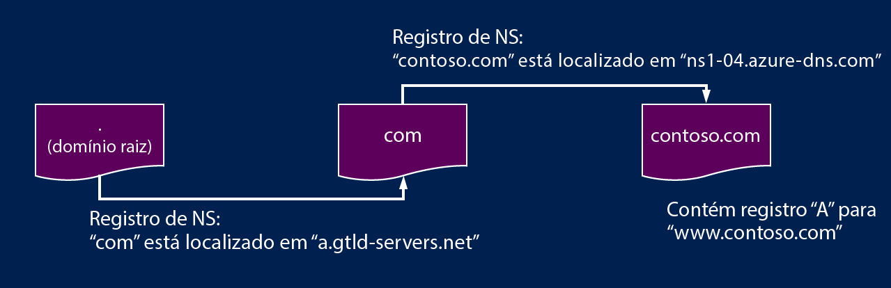

# Delegação de zonas DNS com o DNS do Azure

O Azure DNS permite hospedar uma zona DNS e gerenciar os registros DNS para um domínio no Azure. Para que consultas DNS para um domínio acessem o Azure DNS, o domínio deve ser delegado ao Azure DNS por meio do domínio pai. Tenha em mente que o Azure DNS não é o registrador de domínio. Esta página explica como funciona a delegação de domínio e como delegar domínios ao Azure DNS.

## Como funciona a delegação de DNS

### Zonas e domínios

O Sistema de Nomes de Domínio é uma hierarquia de domínios. A hierarquia começa no domínio 'raiz', cujo nome é simplesmente '**.**'.  Abaixo dele vêm domínios de nível superior, como 'com', 'net', 'org', 'uk' ou 'jp'.  Abaixo desses domínios de alto nível estão domínios de segundo nível, como 'org.uk' ou 'co.jp'.  E assim por diante. Os domínios na hierarquia de DNS são hospedados usando zonas DNS separadas. Essas zonas são distribuídas globalmente, hospedadas por servidores de nomes DNS pelo mundo.

**Zona DNS** - Um domínio é um nome exclusivo no Sistema de Nomes de Domínio, por exemplo, 'contoso.com'. Uma zona DNS é usada para hospedar os registros DNS para um domínio específico. Por exemplo, o domínio 'contoso.com' pode conter vários registros DNS, como 'mail.contoso.com' (para um servidor de email) e 'www.contoso.com' (para um site da Web).

**Registrador de domínio** - Um registrador de domínio é uma empresa que pode fornecer nomes de domínio da Internet. A empresa verifica se o domínio de Internet que você deseja usar está disponível e permite que você o compre. Uma vez registrado o nome de domínio, você passa a ser seu o proprietário legal. Se você já tiver um domínio da Internet, usará o registrador de domínio atual para delegar ao Azure DNS.

Para obter mais informações sobre registradores de domínios reconhecidos, confira [Registradores reconhecidos pelo ICANN](https://www.icann.org/registrar-reports/accredited-list.html).

### Resolução e delegação

Existem dois tipos de servidores DNS:

* Um servidor DNS *autoritativo* hospeda zonas DNS. Ele responde a consultas DNS apenas para registros nessas zonas.
* Um servidor DNS *recursivo* não hospeda zonas DNS. Ele responde a todas as consultas DNS chamando os servidores DNS autoritativos para coletar os dados de que precisa.

O Azure DNS fornece um serviço DNS autoritativo.  Ele não fornece um serviço DNS recursivo. No Azure, os Serviços de Nuvem e as VMs são automaticamente configurados para usar o serviço DNS recursivo fornecido separadamente como parte da infraestrutura do Azure. Para saber mais sobre como alterar essas configurações de DNS, confira [Resolução de nomes no Azure](../virtual-network/virtual-networks-name-resolution-for-vms-and-role-instances.md#name-resolution-that-uses-your-own-dns-server).

Os clientes DNS em computadores ou em dispositivos móveis normalmente chamam um servidor DNS recursivo para executar consultas DNS das quais os aplicativos cliente precisam.

Quando um servidor DNS recursivo recebe uma consulta de um registro DNS como 'www.contoso.com', ele precisa localizar o servidor de nomes que hospeda a zona do domínio 'contoso.com'. Para encontrar o servidor de nomes, ele começa em servidores-raiz de nomes e daí localiza os servidores de nomes que hospeda a zona 'com'. Em seguida, ele consulta os servidores de nomes 'com' para localizar os servidores de nomes que hospedam a zona 'contoso.com'.  Finalmente, é possível consultar os servidores de nomes para 'www.contoso.com'.

Esse procedimento é chamado de resolução de nome DNS. Na verdade, a resolução de DNS inclui etapas adicionais, como as CNAMEs a seguir, mas isso não é importante para compreender como funciona a delegação de DNS.

Como uma zona pai 'aponta' os servidores de nomes para uma zona filho? Ele faz isso usando um tipo especial de registro DNS chamado de registro NS (NS significa 'name server', servidor de nomes). Por exemplo, a zona raiz contém registros NS para 'com', mostrando os servidores de nomes da zona 'com'. A zona 'com', por sua vez, contém registros NS para 'contoso.com', que mostra os servidores de nomes da zona 'contoso.com'. Configurar os registros NS para uma zona filho em uma zona pai é chamado de delegar o domínio.

A imagem a seguir mostra um exemplo de consulta DNS. O contoso.net e o partners.contoso.net são zonas DNS do Azure.

1. O cliente solicita `www.partners.contoso.net` do servidor DNS local.
2. O servidor DNS local não tem o registro então ele faz uma solicitação para o servidor de nome de raiz.
3. O servidor de nomes de raiz não tem o registro, mas sabe o endereço do servidor de nomes `.net`, ele fornece esse endereço para o servidor DNS
4. O servidor DNS local envia a solicitação ao servidor de nomes `.net`.
5. O servidor de nomes `.net` não tem o registro, mas sabe o endereço do servidor de nomes `contoso.net`. Nesse caso, ele responde com o endereço do servidor de nomes para a zona DNS hospedada no DNS do Azure.
6. O servidor DNS local envia a solicitação ao servidor de nomes para a zona `contoso.net` hospedada no DNS do Azure.
7. A zona `contoso.net` não tem o registro, mas conhece o servidor de nomes para `partners.contoso.net` e responde com o endereço. Nesse caso, é uma zona DNS hospedada no DNS do Azure.
8. O servidor DNS local envia a solicitação ao servidor de nomes da zona `partners.contoso.net`.
9. A zona `partners.contoso.net` tem o registro A e responde com o endereço IP.
10. O servidor DNS local fornece o endereço IP ao cliente
11. O cliente se conecta ao site `www.partners.contoso.net`.

Cada delegação realmente tem duas cópias dos registros NS: uma na zona pai apontando para a zona filho e outra na própria zona filho. A zona 'contoso.net' contém os registros NS para contoso.net (juntamente com os registros NS em 'net'). Esses registros são chamados de registros NS autoritativos e ficam no ápice da zona filho.

## Próximas etapas

Saiba como [delegar seu domínio ao DNS do Azure](dns-delegate-domain-azure-dns.md)

