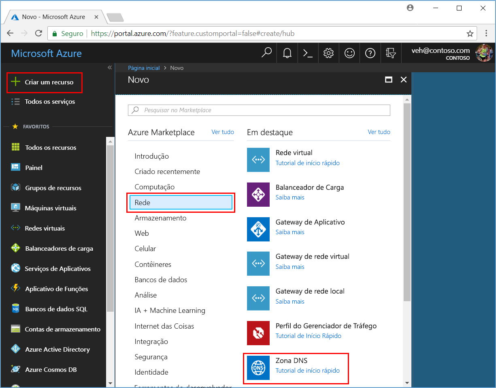
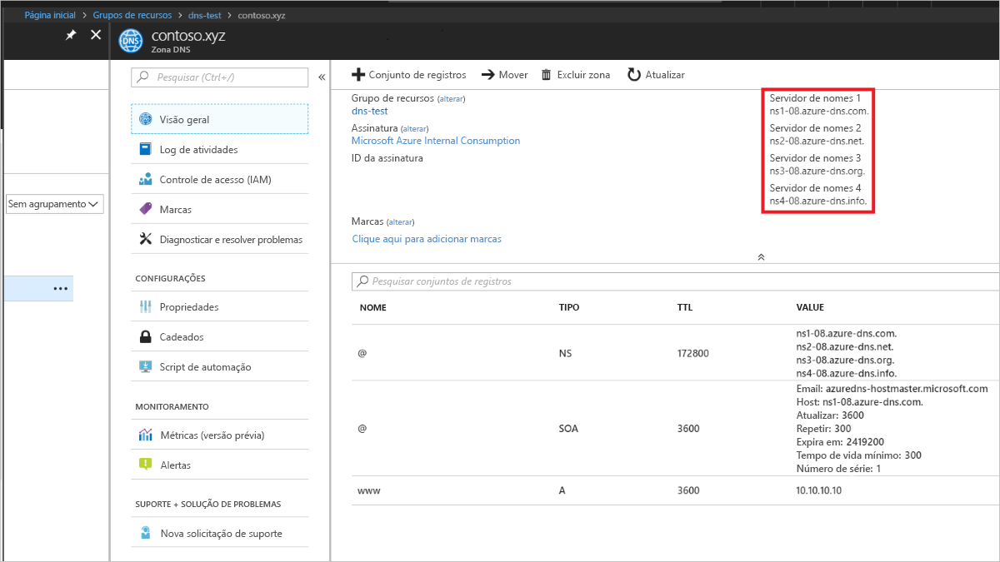

# Introdução ao DNS do Azure usando o Portal do Azure

> [!div class="op_single_selector"]
> * [Portal do Azure](dns-getstarted-portal.md)
> * [PowerShell](dns-getstarted-powershell.md)
> * [CLI 1.0 do Azure](dns-getstarted-cli-nodejs.md)
> * [CLI 2.0 do Azure](dns-getstarted-cli.md)

Este artigo explica as etapas para criar sua primeira zona e registro DNS usando o Portal do Azure. Você também pode executar essas etapas usando o Azure PowerShell ou a CLI do Azure de plataforma cruzada.

Uma zona DNS é usada para hospedar os registros DNS para um domínio específico. Para iniciar a hospedagem do seu domínio no DNS do Azure, você precisará criar uma zona DNS para esse nome de domínio. Cada registro DNS para seu domínio é criado dentro dessa zona DNS. Por fim, para publicar sua zona DNS na Internet, você precisa configurar os servidores de nome para o domínio. Cada uma dessas etapas é descrita nas etapas a seguir.

## Criar uma zona DNS

1. Entrar no Portal do Azure
2. No menu Hub, clique em **Novo > Rede >**, em seguida, clique em **Zona DNS** para abrir a folha Criar zona DNS.

    

4. Na folha **Criar zona DNS**, insira os seguintes valores e clique em **Criar**:

   | **Configuração** | **Valor** | **Detalhes** |
   |---|---|---|
   |**Nome**|contoso.com|O nome da zona DNS|
   |**Assinatura**|[Sua assinatura]|Selecione uma assinatura na qual o gateway de aplicativo será criado.|
   |**Grupo de recursos**|**Criar um novo:** contosoDNSRG|Crie um grupos de recursos. O nome do grupo de recursos deve ser exclusivo na assinatura selecionada. Para saber mais sobre grupos de recursos, leia o artigo [Visão geral do Gerenciador de Recursos](../azure-resource-manager/resource-group-overview.md?toc=%2fazure%2fdns%2ftoc.json#resource-groups).|
   |**Localidade**|Oeste dos EUA||

> [!NOTE]
> O grupo de recursos se refere ao local do grupo de recursos e não tem impacto sobre o local da zona DNS. O local da zona DNS sempre é "global" e não é exibido.

## Criar um registro DNS

O exemplo a seguir explica o processo de criação de um novo registro 'A'. Para outros tipos de registro e para modificar os registros existentes, confira [Gerenciar registros DNS e conjuntos de registros usando o Portal do Azure](dns-operations-recordsets-portal.md). 

1. Com a zona DNS criada, no painel **Favoritos** do portal do Azure, clique em **Todos os recursos**. Clique na zona DNS **contoso.com** na folha Todos os recursos. Se a assinatura que você selecionou já contém vários recursos, você pode inserir **contoso.com** na caixa **Filtrar por nome...** para acessar a Zona DNS facilmente.

1. Na parte superior da folha **zona DNS**, selecione **+Conjunto de registros** para abrir a folha **Adicionar conjunto de registros**.

1. Na folha **Adicionar conjunto de registros**, digite os valores abaixo e clique em **OK**. Neste exemplo, você está criando um registro A.

   |**Configuração** | **Valor** | **Detalhes** |
   |---|---|---|
   |**Nome**|www|Nome do registro|
   |**Tipo**|O | Tipo de registro DNS para criar, os valores aceitáveis são A, AAAA, CNAME, MX, NS, SRV, TXT e PTR.  Para obter mais informações sobre tipos de registro, visite [Visão geral sobre registros e zonas DNS](dns-zones-records.md)|
   |**TTL**|1|Vida útil da solicitação de DNS.|
   |**Unidade de TTL**|Horas|Medição de tempo para o valor de TTL.|
   |**Endereço IP**|{ipAddressValue| Esse valor é o endereço IP que o registro DNS resolve.|

## Exibir registros

Na parte inferior da folha Zona DNS, é possível ver os registros da zona DNS. Você deve ver os registros DNS e SOA padrão, que são criados em cada zona, além de quaisquer registros novos que você criou.

## Atualizar servidores de nome

Quando você estiver satisfeito com a configuração de sua zona e registros DNS, configure seu nome de domínio para usar os servidores de nome DNS do Azure. Isso permite que outros usuários na Internet encontrem os registros DNS.

Os servidores de nomes da zona são fornecidos no portal do Azure:

Esses servidores de nome devem ser configurados com o registrador de nome de domínio (onde você adquiriu o nome de domínio). Seu registrador oferece a opção de configurar os servidores de nome do domínio. Para saber mais, confira [Delegar um domínio ao DNS do Azure](dns-domain-delegation.md).

## Excluir todos os recursos

Para excluir todos os recursos criados neste artigo, conclua as seguintes etapas:

1. No painel **Favoritos** do portal do Azure, clique em **Todos os recursos**. Clique no grupo de recursos **MyResourceGroup** na folha Todos os recursos. Se a assinatura que você selecionou já contém vários recursos, você pode inserir **MyResourceGroup** na caixa **Filtrar por nome...** para acessar o grupo de recursos facilmente.
1. Na folha **MyResourceGroup**, clique no botão **Excluir**.
1. O portal requer que você digite o nome do grupo de recursos para confirmar se deseja excluí-lo. Clique em **Excluir**, digite *MyResourceGroup* para o nome do grupo de recursos, em seguida, clique em **Excluir**. A exclusão de um grupo de recursos exclui todos os recursos contidos nele e, portanto, confirme sempre o conteúdo de um grupo de recursos antes de excluí-lo. O portal exclui todos os recursos contidos no grupo de recursos e o exclui em seguida. Esse processo leva vários minutos.

## Próximas etapas

Para saber mais sobre o DNS do Azure, veja [Visão geral do DNS do Azure](dns-overview.md).

Para saber mais sobre como gerenciar registros DNS no DNS do Azure, confira [Gerenciar registros DNS e conjuntos de registros usando o Portal do Azure](dns-operations-recordsets-portal.md).

