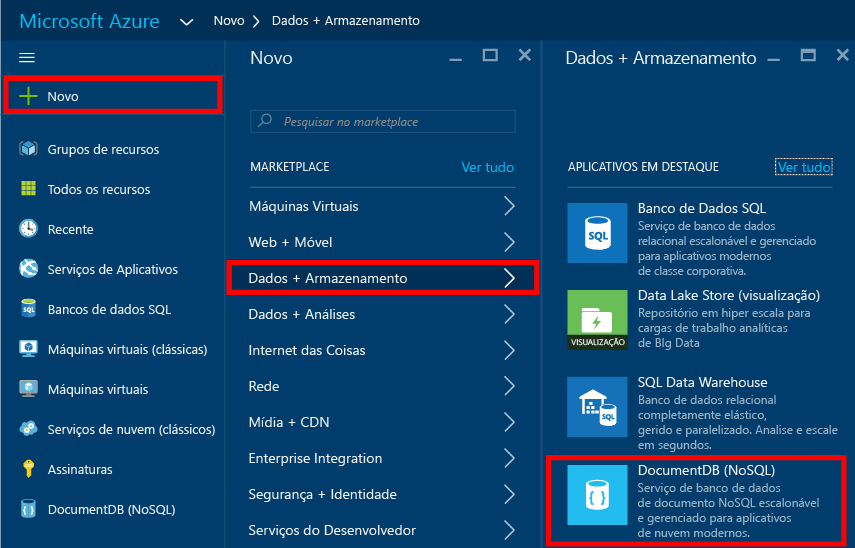
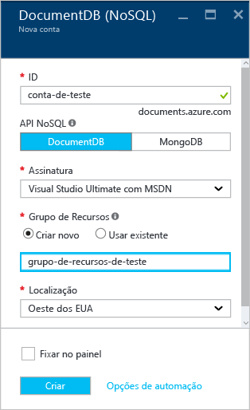
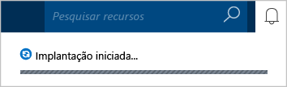
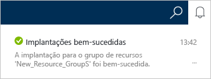
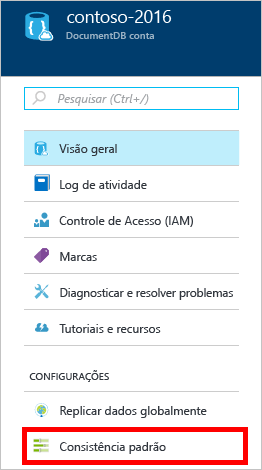
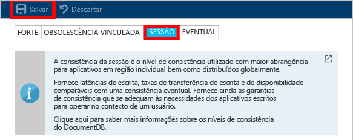

# Como criar uma conta do DocumentDB NoSQL usando o portal do Azure
> [!div class="op_single_selector"]
> * [Portal do Azure](documentdb-create-account.md)
> * [CLI 1.0 do Azure](documentdb-automation-resource-manager-cli-nodejs.md)
> * [CLI 2.0 do Azure](documentdb-automation-resource-manager-cli.md)
> * [Powershell do Azure](documentdb-manage-account-with-powershell.md)

Para criar um banco de dados com o Microsoft Azure DocumentDB, você deverá:

* Ter uma conta do Azure. Se ainda não tiver uma, você poderá obter uma [conta gratuita do Azure](https://azure.microsoft.com/free) .
* Criar uma conta do DocumentDB.  

Você pode criar uma conta do DocumentDB usando o portal do Azure, os modelos do Azure Resource Manager ou a CLI (interface de linha de comando) do Azure. Este artigo mostra como criar uma conta do DocumentDB usando o portal do Azure. Para criar uma conta usando o Azure Resource Manager ou a CLI do Azure, confira [Automatizar a criação da conta do DocumentDB](documentdb-automation-resource-manager-cli.md).

Você é novo no DocumentDB? Assista a [este](https://azure.microsoft.com/documentation/videos/create-documentdb-on-azure/) vídeo de Scott Hanselman com duração de quatro minutos para saber como concluir as tarefas mais comuns no portal online.

1. Entre no [Portal do Azure](https://portal.azure.com/).
2. Na barra de navegação à esquerda, clique em **Novo**, **Bancos de Dados** e, em seguida, clique em **NoSQL (DocumentDB)**.

     
3. Na folha **Nova conta** , especifique a configuração desejada para a conta do DocumentDB.

    

   * No campo **ID** , digite um nome para identificar a conta do DocumentDB.  Quando a **ID** for validada, uma marca de seleção verde será exibida na caixa de **ID**. Esse valor de **ID** torna-se o nome de host no URI. A **ID** pode conter somente letras minúsculas, números e o caractere '-', e deve ter entre 3 e 50 caracteres. Observe que *documents.azure.com* é anexado ao nome do ponto de extremidade que você escolher, e seu resultado se torna o ponto de extremidade da sua conta do DocumentDB.
   * Na caixa **API NoSQL** , selecione o modelo de programação a ser usado:

     * **DocumentDB**: a API do DocumentDB está disponível por meio dos [SDKs](documentdb-sdk-dotnet.md) do .NET, Java, Node.js, Python e JavaScript, além do HTTP [REST](https://msdn.microsoft.com/library/azure/dn781481.aspx), e oferece acesso programático a toda a funcionalidade do DocumentDB.
     * **MongoDB**: o DocumentDB também dá [suporte em nível de protocolo](documentdb-protocol-mongodb.md) para APIs **MongoDB**. Quando você escolhe a opção API do MongoDB, pode usar os SDKs e [ferramentas](documentdb-mongodb-mongochef.md) existentes do MongoDB para falar com o DocumentDB. Você pode [mover](documentdb-import-data.md) os aplicativos do MongoDB existentes para usar o DocumentDB, [sem precisar alterar o código](documentdb-connect-mongodb-account.md), e se beneficiar de um banco de dados como serviço gerenciado, com dimensionamento ilimitado, replicação global e outros recursos.
   * Em **Assinatura**, selecione a assinatura do Azure que deseja usar para a conta do DocumentDB. Se a conta tiver apenas uma assinatura, ela será selecionada por padrão.
   * Em **Grupo de Recursos**, selecione ou crie um grupo de recursos para sua conta do DocumentDB.  Um novo grupo de recursos é criado por padrão. Para saber mais, confira [Usando o portal do Azure para gerenciar os recursos do Azure](../azure-portal/resource-group-portal.md).
   * Use **Local** para especificar a localização geográfica na qual hospedar a conta do DocumentDB.
4. Depois que as opções da nova conta do DocumentDB forem configuradas, clique em **Criar**. Para verificar o status da implantação, verifique o hub de Notificações.  

     

   
5. Depois que a conta do DocumentDB for criada, ela estará pronta para ser usada com as configurações padrão. A consistência padrão da conta do DocumentDB é definida como **Sessão**.  Você pode ajustar a consistência padrão clicando em **Consistência Padrão** no menu de recursos. Para saber mais sobre os níveis de consistência oferecidos pelo DocumentDB, confira [Níveis de consistência no DocumentDB](documentdb-consistency-levels.md).

     

     

[How to: Create a DocumentDB account]: #Howto
[Next steps]: #NextSteps

## Próximas etapas
Agora que você tem uma conta do DocumentDB, a próxima etapa é criar uma coleção e um banco de dados do DocumentDB.

Você pode criar uma nova coleção e um novo banco de dados usando:

* O portal do Azure, como descrito em [Criar uma coleção do DocumentDB usando o portal do Azure](documentdb-create-collection.md).
* Os tutoriais completos, que incluem dados de exemplo: [.NET](documentdb-get-started.md), [.NET MVC](documentdb-dotnet-application.md), [Java](documentdb-java-application.md), [Node.js](documentdb-nodejs-application.md) ou [Python](documentdb-python-application.md).
* O código de exemplo do [.NET](documentdb-dotnet-samples.md#database-examples), do [Node.js](documentdb-nodejs-samples.md#database-examples) ou do [Python](documentdb-python-samples.md#database-examples) disponível no GitHub.
* Os SDKs [.NET](documentdb-sdk-dotnet.md), [.NET Core](documentdb-sdk-dotnet-core.md), [Node.js](documentdb-sdk-node.md), [Java](documentdb-sdk-java.md), [Python](documentdb-sdk-python.md) e [REST](https://msdn.microsoft.com/library/azure/mt489072.aspx).

Depois de criar o banco de dados e a coleção, você precisará [adicionar documentos](documentdb-view-json-document-explorer.md) às coleções.

Com documentos em uma coleção, você pode usar o [SQL do DocumentDB](documentdb-sql-query.md) para [executar consultas](documentdb-sql-query.md#ExecutingSqlQueries) em seus documentos. Você pode executar consultas usando o [Gerenciador de Consultas](documentdb-query-collections-query-explorer.md) no portal, a [API REST](https://msdn.microsoft.com/library/azure/dn781481.aspx) ou um dos [SDKs](documentdb-sdk-dotnet.md).

### Saiba mais
Para saber mais sobre o DocumentDB, explore estes recursos:

* [Roteiro de aprendizagem para o DocumentDB](https://azure.microsoft.com/documentation/learning-paths/documentdb/)
* [Conceitos e modelo de recursos hierárquico do DocumentDB](documentdb-resources.md)

